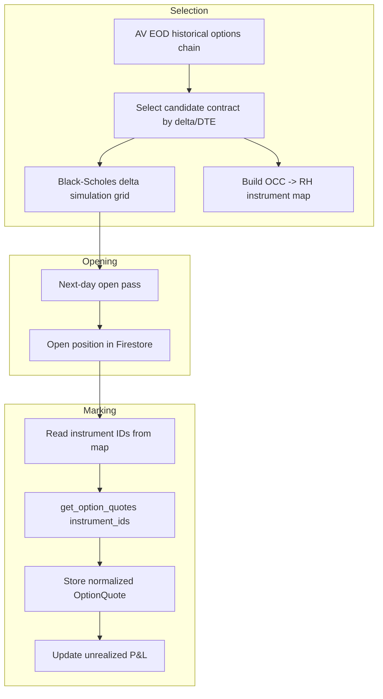

**Topic:** Options Strategy Engine — Hybrid Quote Provider (AV EOD + Robinhood MCP)  
**Issue:** #115  
**Topic Parent:** #114  
**Domain:** OPTIONS  
**Type:** PRD  
**Status:** Draft  
**Created:** 2026-08-14  
**Last Updated:** 2026-08-14

# Options Strategy Engine — Hybrid Quote Provider

## Problem Statement

The Options Position Strategy Engine needs real-time option quotes to mark open positions and end-of-day option chains to select new contracts. The original design relied on Alpha Vantage's `REALTIME_OPTIONS` endpoint for both tasks, but that endpoint requires a subscription roughly four times the cost of the existing AV plan. The current `$50/mo` AV plan already includes end-of-day options data with full Greeks, so paying the higher tier solely for real-time marks is not justified.

We need a data strategy that:
- Uses the existing AV EOD options data for contract selection and overnight analysis.
- Uses free Robinhood MCP real-time option quotes for marking already-open positions.
- Keeps the AV realtime quote stub available for a future upgrade without changing the rest of the engine.

## Solution

Build a **hybrid quote provider** behind a single normalized `OptionQuote` interface. The engine consumes quotes without knowing whether they came from AV EOD or RH MCP.

Two concrete providers implement the interface:
- **AV EOD provider** — answers contract-selection queries using the existing AV `HISTORICAL_OPTIONS` / contract catalog endpoints. It returns the prior-session chain with Greeks.
- **RH MCP real-time provider** — answers mark queries for already-selected contracts using Robinhood's `get_option_chains`, `get_option_instruments`, and `get_option_quotes` tools.

To avoid a three-step MCP pipeline at mark time, the system pre-computes a global **OCC contract ID → RH instrument UUID map** during the AV EOD fetch window. At mark time it performs one MCP quote call and one Firestore read.

The provider also supports an **overnight delta simulation** step: after selecting a candidate contract from EOD data, the engine runs a Black-Scholes estimate of delta, mark, and theta across a configurable grid of underlying moves (default ±2.5% in 0.5% increments). This lets the next-day open pass decide whether the candidate still meets the strategy's target delta before the contract is actually sold.

## User Stories

1. As the strategy engine, I want to select a short put contract each day using AV EOD data, so that I can avoid paying for AV realtime options.
2. As the strategy engine, I want to mark an already-open option position with a live Robinhood quote, so that unrealized P&L reflects current market prices.
3. As the strategy engine, I want to look up a Robinhood instrument UUID from a cached OCC→instrument map, so that mark-time quote calls do not need to traverse chain→instrument→quote.
4. As the strategy engine, I want to backfill an OCC→instrument map entry by calling `get_option_instruments` when no cached mapping exists, so that new contracts can still be marked.
5. As the strategy engine, I want the canonical mark to be Robinhood's `adjusted_mark_price`, with `bid_price`, `ask_price`, and raw `mark_price` stored alongside, so that P&L uses the same value RH uses for account value.
6. As the strategy engine, I want the instrument map entry for a contract retained for 3 months after expiration, so that historical analysis can correlate fills and quotes while the collection stays bounded.
7. As the strategy engine, I want to compute overnight delta/mark/theta for a configurable grid of underlying moves (default ±2.5% in 0.5% steps), so that the open pass can see whether the candidate still fits the target delta at the next market open.
8. As the strategy owner, I want the existing AV realtime quote stub preserved, so that a future paid upgrade can be enabled by swapping a single provider without rewriting the engine.
9. As the strategy owner, I want the system to retry transient Robinhood MCP failures during mark updates, so that temporary provider issues do not produce stale or missing marks.

## Implementation Decisions

### Normalized quote interface

The strategy engine and the upstream quote providers communicate through a single `OptionQuote` interface. The engine only understands `OptionQuote`; each provider fetches data from its upstream and normalizes it into this shape. This keeps the engine decoupled from Alpha Vantage and Robinhood MCP details, and lets new providers be added without changing the engine.

```ts
import { TradeSide } from '@common';
import { OptionType, OptionQuoteSource } from '../shared/options-common';

export interface OptionQuote {
  contractID: string;          // OCC option ID, e.g. SPY250817P00770000
  symbol: string;              // Underlying symbol, e.g. SPY
  expiration: string;          // ISO date, e.g. 2025-08-17
  strike: number;
  type: OptionType;            // CALL | PUT
  side: TradeSide;             // LONG | SHORT — engine position side, not the option type
  mark: number;                // Canonical mark used for P&L
  bid?: number;
  ask?: number;
  last?: number;
  volume?: number;
  openInterest?: number;
  impliedVolatility?: number;
  delta?: number;
  gamma?: number;
  theta?: number;
  vega?: number;
  rho?: number;                // Optional; included when upstream provides it
  source: OptionQuoteSource;   // AV_EOD | RH_MCP | AV_REALTIME
  asOf: string;                // ISO timestamp the quote represents
}
```

- The engine calls `getQuote(contractID, symbol, side)` and receives the same shape regardless of source.
- `OptionQuote` is a new, engine-specific interface. It is not the same as the existing AV daily snapshot interfaces (`HistoricalOptionsContractV2Observation`, `ContractLatestSnapshot`), but field semantics align so each provider maps with minimal code:
  - **AV EOD provider** maps `HistoricalOptionsContractV2Observation` / `ContractLatestSnapshot` string fields to numbers and sets `source: OptionQuoteSource.AV_EOD`.
  - **RH MCP provider** maps the live `quote` object and official `close` from `get_option_quotes`. All RH prices are decimal strings and must be converted to numbers. `mark` maps from `quote.adjusted_mark_price`; `bid`/`ask` map from `quote.bid_price` / `quote.ask_price`; `rho` maps from `quote.rho` when present. The official prior-session close is `close.price`; if it is missing, the provider surfaces a data-quality error for that instrument instead of falling back. `quote.previous_close_price` and `close.interpolated` are stored on the raw quote record for diagnostics but do not replace the official close. Greeks and `impliedVolatility` may be `null` in the RH response (common for deep or far-dated contracts); the provider only populates `OptionQuote` fields when the upstream value is present.
  - **AV realtime provider** (future) maps the `REALTIME_OPTIONS` response into the same shape with `source: OptionQuoteSource.AV_REALTIME`.

### Provider implementations
- **AV EOD provider** wraps `partnerHistoricalOptions` / contract catalog endpoints. It returns the prior-session chain and is the primary source for contract selection.
- **RH MCP real-time provider** wraps `get_option_quotes` using pre-resolved instrument IDs. It is the primary source for live marks on open positions.
- **AV realtime provider** (`sa-quote-client.ts`) remains as a future path. It is not used by default.

### OCC → RH instrument map

Global Firestore collection: `options-rh-instrument-map/{occId}`.

```ts
import { OptionType } from '../shared/options-common';

export interface OccRhInstrumentMapEntry {
  occId: string;            // Document ID; also the key returned by parseOccContractId
  instrumentId: string;     // RH option instrument UUID
  chainId: string;          // RH option chain UUID
  chainSymbol: string;      // Underlying symbol, e.g. SPY
  expiration: string;       // ISO date, e.g. 2025-08-17
  strike: number;
  type: OptionType;         // CALL | PUT
  firstTradedDate?: string; // Derived: first calendar date this contract appears in our observed data, not a native RH field
  createdAt: string;        // ISO timestamp when this map entry was written
  expiresAt: string;        // ISO timestamp used for TTL / deletion scheduling
}
```

- Built during the AV EOD fetch window by parsing the OCC ID and calling `get_option_instruments` with `chain_symbol`, `expiration_dates`, `type`, and `strike_price`.
- If `chain_id` is unavailable, the map builder first resolves it via `get_option_chains`.
- Read at mark time; if missing, the provider backfills it with one MCP call.
- Deleted 3 months after the contract expires; historical quote data is kept in the position's `raw-quotes` subcollection.
- `firstTradedDate` is derived and persisted by our system; Robinhood does not expose it directly. The related idea of a daily "newly traded / expiring contracts" list surfaced for the option-chart / spread-chart tools is outside the scope of this PRD and will be revisited separately.

### Real-time mark semantics
- Canonical mark: `quote.adjusted_mark_price` from `get_option_quotes`.
- Stored alongside: `bid_price`, `ask_price`, `mark_price`, `updated_at`.
- Quote response pairs each live quote with the official prior-session `close.price`. `close.price` is the last mark/price at the prior market close, distinct from the current live `mark_price`. If `close.price` is missing from the RH MCP response, the provider surfaces a data-quality error for that instrument instead of falling back to another field.
- If `close.interpolated` is `true`, the provider stores the price and an `interpolatedClose` flag on the raw quote record but does **not** treat it as the official prior close for P&L. The live mark is still accepted.
- `quote.previous_close_price` is stored on the raw quote record for diagnostics and sanity checks but is never used as the official prior close.
- `OptionQuote.asOf` maps from `quote.updated_at` for RH MCP marks.
- Batch mark calls by passing multiple `instrument_ids` to `get_option_quotes`. The tool omits official `close` data tool-wide when a batch contains more than 20 IDs (`closes_error` is set); the mark pass therefore limits batches to 20 instrument IDs to keep the official close available.

### Overnight delta simulation

After the AV EOD selection pass picks a candidate contract, it runs a Black-Scholes estimate of how that contract's delta, mark, and theta would look at various underlying prices the next morning. The results live on the strategy instance's **daily analysis document**, keyed by trade date, not on the contract itself. This lets the open pass read the projected deltas without recomputing, and it keeps the grid tied to the day's decision rather than to a contract that may no longer be the best fit.

```ts
export interface OvernightDeltaGridPoint {
  underlyingMovePct: number; // e.g. -0.025 for -2.5%
  underlyingPrice: number;
  delta: number;
  mark: number;
  theta: number;
}

export interface OvernightDeltaSimulation {
  baseUnderlyingPrice: number;     // Prior-session underlying close
  baseContractID: string;          // OCC ID selected from EOD data
  rangePct: number;                // Configured grid radius (default: 0.025 = ±2.5%)
  stepPct: number;                 // Configured grid step (default: 0.005 = 0.5%)
  grid: OvernightDeltaGridPoint[];
  computedAt: string;              // ISO timestamp
}
```

- Inputs: selected contract from AV EOD, underlying close, AV-supplied implied volatility and Greeks.
- Grid defaults: underlying price from **-2.5% to +2.5%** of the prior close in **0.5%** increments. Both `rangePct` and `stepPct` are configurable per strategy instance.
- Outputs per grid point: simulated `delta`, `mark`, `theta`.
- Stored on `options-strategy-instances/{instanceId}/daily-analysis/{date}` as `overnightDeltaSimulation`.
- The open pass reads the grid and selects the point closest to the current underlying price to see the projected delta/mark. It does not re-run Black-Scholes at market open.
- The `max-overnight-move` filter is **disabled by default** in the initial data-gathering phase. The open pass records the actual overnight move and the nearest simulated grid point but does **not** reject candidates based on gap size. This lets us collect baseline data before deciding where the cutoff should be.
- Rejected-candidate logging is still defined as an implementation path: when the filter is enabled later, rejects will be persisted to `options-strategy-instances/{instanceId}/rejected-candidates/{occId}` with the rejection reason, timestamp, candidate snapshot, and simulated grid.

### Retry behavior
- If the RH MCP provider fails authentication, returns no quote, or returns a transient error, the nightly mark pass retries a small number of times with exponential backoff.
- Hard failures are surfaced to the operator; there is no silent AV EOD fallback for live marks.

### Tool shapes discovered
- `get_option_chains` returns one chain per symbol with `id` (chain UUID) and `expiration_dates[]`.
- `get_option_instruments` accepts `chain_id`, `chain_symbol`, `ids`, `expiration_dates`, `strike_price`, `type`, `state`, `tradability`, `cursor`; returns `data.instruments[]` with `id`, `chain_id`, `chain_symbol`, `expiration_date`, `strike_price`, `type`, `state`, `tradability`, `trade_value_multiplier`, `min_ticks`; pagination via `data.next`.
- `get_option_quotes` requires `instrument_ids: string[]`; returns `data.results[]` where each entry has a live `quote` and the official prior-session `close`.

#### Observed `get_option_quotes` response shape

Each element of `data.results` contains two objects:

```ts
interface RhOptionQuoteResult {
  quote: {
    instrument_id: string;
    ask_price: string;        // decimal string
    ask_size: number;
    bid_price: string;
    bid_size: number;
    break_even_price: string;
    adjusted_mark_price: string;
    mark_price: string;
    high_fill_rate_buy_price: string;
    low_fill_rate_buy_price: string;
    high_fill_rate_sell_price: string;
    low_fill_rate_sell_price: string;
    previous_close_price: string;
    previous_close_date: string; // YYYY-MM-DD
    implied_volatility: string | null;
    delta: string | null;
    gamma: string | null;
    rho: string | null;
    theta: string | null;
    vega: string | null;
    open_interest: number;
    volume: number;
    chance_of_profit_long: string | null;
    chance_of_profit_short: string | null;
    updated_at: string;       // ISO timestamp
  };
  close: {
    instrument_id: string;
    symbol: string;
    date: string;             // YYYY-MM-DD of the official close
    price: string;          // decimal string, the official prior-session close
    interpolated: boolean;  // true when the price is not from the requested day
    source: string;           // e.g. "ddb-market-snapshot"
  };
}
```

Important behavior:
- All prices are returned as decimal strings and must be converted to numbers before populating `OptionQuote`.
- Greeks and implied volatility can be `null` for deep or far-dated contracts (e.g. long-dated LEAPS showed `null` in the sample). The mark provider must tolerate nulls and only include them in `OptionQuote` when present.
- Batching: requests with more than 20 `instrument_ids` still return live quotes, but the official `close` object is omitted tool-wide (`closes_error` is set). The mark pass therefore batches mark reads in groups of 20 or fewer to keep the official close available.
- Close vs quote: the official prior-session close is `close.price`; `quote.previous_close_price` is the quote object's own prior close. For the strategy engine `close.price` is required; if it is missing for any instrument in the batch, that instrument is surfaced as a data-quality error rather than silently falling back.

#### Observed response samples (SPY)

`get_option_chains` returns a `data.chains[]` array. One chain looks like:

```json
{
  "id": "c277b118-58d9-4060-8dc5-a3b5898955cb",
  "symbol": "SPY",
  "can_open_position": true,
  "expiration_dates": ["2026-08-14", "2026-08-15", "..."],
  "trade_value_multiplier": "100.0000",
  "underlying_instruments": [
    { "instrument": "...", "symbol": "SPY" }
  ],
  "min_ticks": { "above_tick": "0.01", "below_tick": "0.01", "cutoff_price": "0.00" },
  "settle_on_open": false,
  "sellout_time_to_expiration": 86400
}
```

`get_option_instruments` returns `data.instruments[]`. One instrument looks like:

```json
{
  "id": "1080cda9-9cef-41ab-a71e-b8c82e14cfe0",
  "chain_id": "c277b118-58d9-4060-8dc5-a3b5898955cb",
  "chain_symbol": "SPY",
  "underlying_type": "equity",
  "expiration_date": "2028-12-15",
  "sellout_datetime": "2028-12-15T20:45:00+00:00",
  "strike_price": "50.0000",
  "type": "call",
  "state": "active",
  "tradability": "tradable",
  "trade_value_multiplier": "100.0000",
  "min_ticks": { "above_tick": "0.01", "below_tick": "0.01", "cutoff_price": "0.00" }
}
```

`get_option_quotes` returns `data.results[]`; one result pairs the live `quote` with the official `close` (shown above in the interface definition):

```json
{
  "quote": {
    "instrument_id": "12f74e12-25d0-4e4b-9af9-da4500da4f99",
    "ask_price": "0.020000",
    "ask_size": 192,
    "bid_price": "0.010000",
    "bid_size": 96,
    "adjusted_mark_price": "0.020000",
    "mark_price": "0.015000",
    "previous_close_price": "0.020000",
    "previous_close_date": "2026-08-13",
    "implied_volatility": "0.920817",
    "delta": "-0.000103",
    "gamma": "0.000004",
    "rho": "-0.000836",
    "theta": "-0.000423",
    "vega": "0.002892",
    "open_interest": 8166,
    "volume": 0,
    "updated_at": "2026-08-14T20:12:41.826484499Z"
  },
  "close": {
    "instrument_id": "12f74e12-25d0-4e4b-9af9-da4500da4f99",
    "symbol": "SPY",
    "date": "2026-08-13",
    "price": "0.02",
    "interpolated": false,
    "source": "ddb-market-snapshot"
  }
}
```

## System Context

The engine runs in Firebase Cloud Functions. The selection pass runs after market close and pulls the AV EOD chain from the SA partner endpoints. The open pass runs shortly after the next market open, consumes the pre-computed overnight delta grid and the OCC→RH instrument map, and decides whether to open a position. Before entering, the open pass checks for an existing open position for the same symbol and strategy instance; if one exists, it skips the candidate to avoid duplicate entries at different times of day. The mark pass runs periodically during market hours and uses RH MCP quotes to update unrealized P&L on open positions.



## Testing Decisions

- Test the normalized `OptionQuote` interface with stub providers; verify the engine never branches on source.
- Test the OCC parser against known OCC IDs (e.g., `SPY250817P00770000`) to ensure expiration/strike/type extraction matches RH lookup fields.
- Test the instrument-map builder against mocked `get_option_instruments` responses with pagination.
- Test the RH quote provider's batching behavior and retry logic for transient MCP failures.
- Test the Black-Scholes simulator against a reference implementation or known option-price calculator for a small set of inputs.

## Future Work

These items are intentionally deferred from the initial implementation but are expected to be built later; they are tracked here for visibility:

- Real broker order submission to Robinhood.
- Exit-criteria automation (percent max profit, return targets, hold time).
- Covered-call leg creation after assignment.
- AV EOD vs RH EOD quote comparison analysis.
- Intraday option/underlying tick capture for analyzing optimal time-of-day entry. Target roughly one year of data with automatic deletion of data older than one year; include a lightweight review UI. (Phase 2 — deferred from initial implementation.)

## Further Notes

- The `sa-quote-client.ts` AV realtime stub is intentionally preserved for a future paid AV upgrade. When enabled, it becomes a third provider implementing the same normalized `OptionQuote` interface.
- The Robinhood MCP provider must reuse a single MCP session across calls within a function invocation. A session manager scoped to the provider instance will open the connection lazily and close it when the function returns; this is required for the first phase, not a future optimization.
- No Black-Scholes implementation currently exists in the repo. We will implement a backend closed-form pricer in `functions/src/options-strategy-engine/option-pricing.ts`. A future SA partner endpoint can replace it once available.
- AV EOD options data is considered sufficient for next-day contract selection for the initial cash-secured put wheel strategy.
