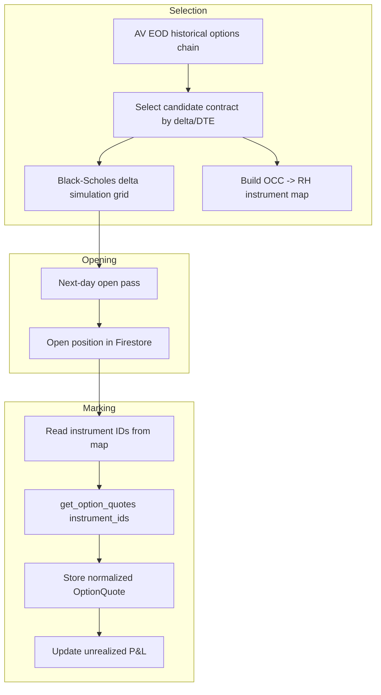

**Topic:** Options Strategy Engine — Hybrid Quote Provider (AV EOD + Robinhood MCP)  
**Issue:** #114  
**Domain:** OPTIONS  
**Type:** PRD  
**Status:** Draft  
**Created:** 2026-08-14  
**Last Updated:** 2026-08-14

# Options Strategy Engine — Hybrid Quote Provider

## Problem Statement

The Options Position Strategy Engine needs real-time option quotes to mark open positions and end-of-day option chains to select new contracts. The original design relied on Alpha Vantage's `REALTIME_OPTIONS` endpoint for both tasks, but that endpoint requires a subscription roughly four times the cost of the existing AV plan. The current `$50/mo` AV plan already includes end-of-day options data with full Greeks, so paying the higher tier solely for real-time marks is not justified.

We need a data strategy that:
- Uses the existing AV EOD options data for contract selection and overnight analysis.
- Uses free Robinhood MCP real-time option quotes for marking already-open positions.
- Keeps the AV realtime quote stub available for a future upgrade without changing the rest of the engine.

## Solution

Build a **hybrid quote provider** behind a single normalized `OptionQuote` interface. The engine consumes quotes without knowing whether they came from AV EOD or RH MCP.

Two concrete providers satisfy the seam:
- **AV EOD provider** — answers contract-selection queries using the existing AV `HISTORICAL_OPTIONS` / contract catalog endpoints. It returns the prior-session chain with Greeks.
- **RH MCP real-time provider** — answers mark queries for already-selected contracts using Robinhood's `get_option_chains`, `get_option_instruments`, and `get_option_quotes` tools.

To avoid a three-step MCP pipeline at mark time, the system pre-computes a global **OCC contract ID → RH instrument UUID map** during the AV EOD fetch window. At mark time it performs one MCP quote call and one Firestore read.

The provider also supports an **overnight delta simulation** step: after selecting a candidate contract from EOD data, the engine runs a Black-Scholes estimate of delta, mark, and theta across a grid of underlying moves (±10% in 0.5% increments). This lets the next-day open pass decide whether the candidate still meets the strategy's target delta before the contract is actually sold.

## User Stories

1. As the strategy engine, I want to select a short put contract each day using AV EOD data, so that I can avoid paying for AV realtime options.
2. As the strategy engine, I want to mark an already-open option position with a live Robinhood quote, so that unrealized P&L reflects current market prices.
3. As the strategy engine, I want to look up a Robinhood instrument UUID from a cached OCC→instrument map, so that mark-time quote calls do not need to traverse chain→instrument→quote.
4. As the strategy engine, I want to backfill an OCC→instrument map entry by calling `get_option_instruments` when no cached mapping exists, so that new contracts can still be marked.
5. As the strategy engine, I want the canonical mark to be Robinhood's `adjusted_mark_price`, with `bid_price`, `ask_price`, and raw `mark_price` stored alongside, so that P&L uses the same value RH uses for account value.
6. As the strategy engine, I want the instrument map entry for a contract retained for 3 months after expiration, so that historical analysis can correlate fills and quotes while the collection stays bounded.
7. As the strategy engine, I want to compute overnight delta/mark/theta for a grid of underlying moves (±10%, 0.5% steps), so that the open pass can see whether the candidate still fits the target delta at the next market open.
8. As the strategy owner, I want the existing AV realtime quote stub preserved, so that a future paid upgrade can be enabled by swapping a single provider without rewriting the engine.
9. As the strategy owner, I want the system to retry transient Robinhood MCP failures during mark updates, so that temporary provider issues do not produce stale or missing marks.
10. As the strategy owner, I want to capture intraday option/underlying ticks for the target symbol for roughly one month, so that I can analyze the best time of day to sell contracts.
11. As the strategy owner, I want a simple UI to review captured intraday ticks and compare open time against delta decay and premium capture, so that I can decide whether to add time-based entry rules.

## Implementation Decisions

### Normalized quote seam
- Introduce an `OptionQuote` interface shared by the engine and all providers.
- Required fields: `contractID` (OCC), `expiration`, `strike`, `type`, `side`, `mark`, `bid`, `ask`, `last`, `volume`, `openInterest`, `impliedVolatility`, `delta`, `gamma`, `theta`, `vega`, `source`, `asOf`.
- The engine calls `getQuote(contractID, symbol)` and receives the same shape regardless of source.

### Provider implementations
- **AV EOD provider** wraps `partnerHistoricalOptions` / contract catalog endpoints. It returns the prior-session chain and is the primary source for contract selection.
- **RH MCP real-time provider** wraps `get_option_quotes` using pre-resolved instrument IDs. It is the primary source for live marks on open positions.
- **AV realtime provider** (`sa-quote-client.ts`) remains as a future path. It is not used by default.

### OCC → RH instrument map
- Global collection keyed by OCC contract ID, e.g. `options-rh-instrument-map/{occId}`.
- Value contains `instrumentId`, `chainId`, `chainSymbol`, `expiration`, `strike`, `type`, `createdAt`, `expiresAt`.
- Built during the AV EOD fetch window by parsing the OCC ID and calling `get_option_instruments` with `chain_symbol`, `expiration_dates`, `type`, and `strike_price`.
- If `chain_id` is unavailable, the map builder first resolves it via `get_option_chains`.
- Read at mark time; if missing, the provider backfills it with one MCP call.
- Deleted 3 months after the contract expires; historical quote data is kept in the position's `raw-quotes` subcollection.

### Real-time mark semantics
- Canonical mark: `quote.adjusted_mark_price` from `get_option_quotes`.
- Stored alongside: `bid_price`, `ask_price`, `mark_price`, `updated_at`.
- Quote response pairs each live quote with the official prior-session `close.price`; use `close.price` as the prior close when available, otherwise use `quote.previous_close_price`.
- Batch mark calls by passing multiple `instrument_ids` to `get_option_quotes` to reduce MCP round trips.

### Overnight delta simulation
- Inputs: selected contract from AV EOD, underlying close, AV-supplied implied volatility and Greeks.
- Grid: underlying price from -10% to +10% of the prior close in 0.5% increments.
- Outputs per grid point: simulated `delta`, `mark`, `theta`.
- Stored on the candidate record surfaced to the open pass.

### Intraday data capture (one-month spike)
- Capture option/underlying ticks for the target symbol at a regular cadence (frequency TBD in blueprint).
- Persist to Firestore under a dedicated collection for the spike.
- Provide a lightweight review UI that plots time-of-day against mark and delta decay.
- After the spike period, data may be archived or removed based on findings.

### Retry behavior
- If the RH MCP provider fails authentication, returns no quote, or returns a transient error, the nightly mark pass retries a small number of times with exponential backoff.
- Hard failures are surfaced to the operator; there is no silent AV EOD fallback for live marks.

### Tool shapes discovered
- `get_option_chains` returns one chain per symbol with `id` (chain UUID) and `expiration_dates[]`.
- `get_option_instruments` accepts `chain_id`, `chain_symbol`, `ids`, `expiration_dates`, `strike_price`, `type`, `state`, `tradability`, `cursor`; returns `data.instruments[]` with `id`, `chain_id`, `chain_symbol`, `expiration_date`, `strike_price`, `type`, `state`, `tradability`, `trade_value_multiplier`, `min_ticks`; pagination via `data.next`.
- `get_option_quotes` requires `instrument_ids: string[]`; returns `data.results[]` where each entry has a live `quote` and the official prior-session `close`.

## System Context

## Testing Decisions

- Test the normalized `OptionQuote` seam with stub providers; verify the engine never branches on source.
- Test the OCC parser against known OCC IDs (e.g., `SPY250817P00770000`) to ensure expiration/strike/type extraction matches RH lookup fields.
- Test the instrument-map builder against mocked `get_option_instruments` responses with pagination.
- Test the RH quote provider's batching behavior and retry logic for transient MCP failures.
- Test the Black-Scholes simulator against a reference implementation or known option-price calculator for a small set of inputs.
- Unit-test the intraday capture scheduler and the UI review screen with mocked tick data.

## Out of Scope

- Real broker order submission to Robinhood.
- Exit-criteria automation (percent max profit, return targets, hold time).
- Covered-call leg creation after assignment.
- AV EOD vs RH EOD quote comparison analysis.
- Long-term retention of intraday tick data beyond the one-month spike.

## Further Notes

- The `sa-quote-client.ts` AV realtime stub is intentionally preserved for a future paid AV upgrade. When enabled, it becomes a third provider behind the same seam.
- Robinhood MCP calls currently open/close a session per invocation. The PRD leaves session reuse as a future optimization; the initial implementation should focus on correctness and avoid coupling the provider to a long-lived session manager.
