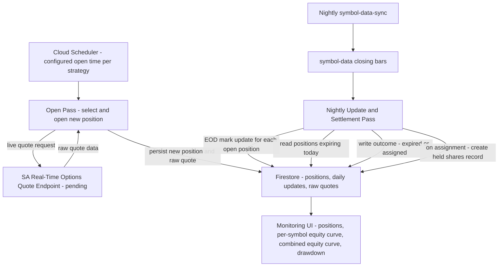

**Topic:** Options Position Strategy Engine
**Issue:** #108
**Domain:** OPTIONS
**Type:** PRD
**Status:** Approved
**Created:** 2026-08-13
**Last Updated:** 2026-08-13 (revised: configurable symbol/delta/DTE, closing-price-based daily updates, per-symbol equity curve, diagram fix)

# PRD: Options Position Strategy Engine

## Problem Statement

As a strategy researcher, I want to run automated options strategies that open, manage, and settle **positions over multiple days** (not single-shot price signals) — starting with a cash-secured put (CSP) ladder — so I can find out whether a given strategy's numbers are actually worthwhile before ever risking real capital on it.

The existing RH Agent strategy system (`Topic: Trading Strategy Library`, #106) is built for stateless, point-in-time signal detection (`StrategyAdapter.execute(input, config) → StrategyOutput`) feeding human ACR review. It has no concept of a strategy that owns a position's lifecycle across many days — opening, daily mark updates, and settlement (expiration or assignment). That is a structurally different problem, and forcing it into the existing contract would be a bad architectural fit (see `CONTEXT.md`: **Signal Strategy** vs **Position-Lifecycle Strategy**).

## Solution

Build a generic, config-driven **Position-Lifecycle Strategy Engine**, separate from the RH Agent signal-detection worker, that:

- Opens positions on a configurable cadence (daily or weekly) per strategy, for **any configured symbol**.
- Selects option contracts via a **configurable target delta and DTE band** (not hardcoded values) / spread-type criteria from a live options quote source.
- Persists every generated artifact and the raw quote data for every contract actually touched.
- Updates open positions daily using **end-of-day closing data**, not the intraday noon quote.
- Settles positions at expiration (expired worthless, assigned, or cash-settled, depending on strategy/instrument), preserving full P&L lineage across the assignment event.
- Surfaces a monitoring UI showing individual positions plus a **combined equity curve and drawdown**, both **per-symbol and across all strategies/symbols**, so the underlying research question — "does this strategy work well for a while, then blow up?" — is directly answerable from the data.

The engine is symbol- and parameter-agnostic. The first configured strategy instance built on it is a **cash-secured put ladder**: `symbol=QQQM`, `targetDelta=-0.20`, `dteMin=20`, `dteMax=30`, `frequency=daily @ 12:00 PT`, paper-tracking only (no real broker orders). Any of these values can differ for a future strategy instance without engine changes.

## User Stories

1. As a researcher, I want to configure a strategy instance with a symbol, target delta, DTE band, and open frequency (daily/weekly), so that I can run this same engine against different symbols or parameters without code changes.
   - **Verify:** Two strategy instances with different `symbol`, `targetDelta`, `dteMin`/`dteMax`, and `frequency` values both run correctly through the same engine code, each opening positions per its own config.

2. As a researcher, I want the engine to automatically open a new position for each configured strategy instance on its configured cadence, at 12:00 PT during market hours (for the daily QQQM CSP instance), so that I don't have to manually trigger each day's trade.
   - **Verify:** A scheduled job runs at the configured cadence; a new position record appears in Firestore for each due strategy instance, with the selected contract's strike, expiration, delta, DTE, sale price, and underlying price at time of sale.

3. As a researcher, I want the engine to select the contract closest to the configured target delta within the configured DTE window, so that contract-selection is consistently applied per strategy instance without manual judgment.
   - **Verify:** Given a live quote response for the configured symbol, the selected contract matches the configured type (e.g. put), its expiration falls within [dteMin, dteMax] of the sale date, and it has the delta closest to the configured target among contracts in that DTE window.

4. As a researcher, I want each new position to record the capital required to hold it (strike × 100), so that I can later determine the real-world capital requirements of running this strategy at scale — even though capital is not gated in this phase.
   - **Verify:** Every position record has a `capitalRequired` field equal to `strikePrice × 100 × quantity`, and no position is ever rejected or skipped due to capital constraints.

5. As a researcher, I want every currently open position's mark-to-market value refreshed daily using end-of-day closing data (not the intraday noon quote used to open new positions), so that I can see how each position's paper P&L evolves over its life on a consistent, comparable basis.
   - **Verify:** For each trading day a position is open, a daily update record exists with that day's EOD-closing-based mark for the held contract and the day's underlying closing price; the noon quote is never used to populate a daily update record.

6. As a researcher, I want the engine to determine expiration outcomes using the underlying's official closing price (from the existing nightly `symbol-data` bar sync), so that settlement decisions are based on accurate EOD data rather than a live intraday quote.
   - **Verify:** The settlement check for a given expiration date runs only after that day's closing bar is available in `symbol-data/{symbol}/daily`, and the ITM/OTM determination uses that bar's close.

7. As a researcher, I want a position that expires ITM to be recorded as assigned, with the resulting share position's cost basis set to the strike price (not the closing price), so that the P&L math is accurate.
   - **Verify:** An assigned position's settlement record has `outcome = ASSIGNED`, `strikePrice` as the cost basis, `underlyingCloseAtExpiration` as the trigger price, and `premiumCollected` carried forward unchanged from the original sale.

8. As a researcher, I want assigned shares to be tracked going forward using daily closing prices (not the strike), so that ongoing unrealized P&L on the resulting equity position is accurate.
   - **Verify:** A held-shares record derived from an assignment has a daily mark equal to that day's underlying closing price, and its unrealized P&L is computed as `(currentClose - strikePrice) × 100 × quantity`.

9. As a researcher, I want a position that expires OTM to be recorded as expired worthless with the full premium retained, so that I can distinguish wins from assignments in the data.
   - **Verify:** An expired-worthless position's settlement record has `outcome = EXPIRED_WORTHLESS` and no resulting share position is created.

10. As a researcher, I want the raw SA quote response persisted for every contract the engine actually selects or checks, so that I have an audit trail without paying the storage cost of full daily chain snapshots.
    - **Verify:** For every position open and every daily update, a corresponding raw-quote document exists keyed to that action; no raw document exists for contracts never selected or held.

11. As a researcher, I want a monitoring dashboard showing all open positions, all closed/assigned positions, and both a **per-symbol** and an **all-strategy combined** equity curve with max drawdown, so I can judge an individual symbol's behavior as well as the overall research result.
    - **Verify:** The dashboard renders a table of open positions with current mark/P&L, a table of closed positions with outcome and realized P&L, a per-symbol cumulative P&L chart with max drawdown, and a combined all-symbols/all-strategies cumulative P&L chart with its own max drawdown.

12. As a researcher, I want the engine's config schema to be generic (symbol, frequency, spread type, per-leg delta/DTE targets, and a placeholder for future exit criteria), so that later strategies (wheel, variance premium, iron condor, debit verticals, calendars, custom spreads) and other symbols can be added without re-architecting the engine.
    - **Verify:** A second strategy definition (even a stub/test one) with a different symbol, spread type, and frequency can be registered and run through the same engine code paths without modification to engine internals.

13. As a researcher, I want no real broker orders sent for this phase, so that I can validate the strategy's numbers risk-free before committing real capital.
    - **Verify:** No code path in this engine calls the Robinhood MCP order-submission integration; all "sale price" and "fill" data originates from SA quote data only.

## Technical Context

- **SA real-time options quote endpoint is not yet implemented** (confirmed pending with the SA team as of 2026-08-13). This PRD's design and Blueprint/implementation work can proceed, but the strategy cannot go live (start actually opening daily positions) until SA notifies that the endpoint is ready. This is a hard external blocker on go-live, not on planning/building.
- SA's existing `partnerContractCatalogV2` (EOD-only, daily builder cadence) is **not used to open new positions** (insufficient for a live noon-time pick), but its EOD cadence is exactly what daily mark updates need — daily updates and the settlement check can share one nightly, closing-price-based pass, separate from the noon opening pass which still needs the live intraday endpoint.
- Underlying closing prices for settlement come from the existing nightly `symbol-data/{symbol}/daily` sync (coverage for a given configured symbol, e.g. QQQM, to be verified during Blueprint).
- **Early assignment risk (before expiration) is an explicit, accepted limitation**, not modeled. Since these are paper positions with no real counterparty, early assignment cannot actually occur to us anyway; this only matters if/when the strategy goes live with a real brokerage account.
- Capital constraints are intentionally **not enforced** in this phase — the strategy assumes unlimited capital so the actual capital requirement can be observed as an output of the experiment, not an input constraint.
- Cadence is configurable per strategy (daily now; weekly is anticipated for eventual live trading) — not hardcoded to daily.
- This engine is architecturally separate from the RH Agent signal-detection worker and its ACR review flow — see `CONTEXT.md` for the **Signal Strategy** vs **Position-Lifecycle Strategy** distinction.

## System Context Diagram

## Out of Scope (this phase)

- Sending real orders to Robinhood or any broker — strictly paper tracking.
- Capital-based gating or position sizing beyond 1 contract per opened position.
- Exit criteria before expiration (percent of max profit, percent return, hold-time exits) — config schema will have a placeholder field, but no logic executes it yet.
- Covered-call logic on assigned shares (the future Wheel strategy) — assigned shares are simply held and marked daily, nothing else.
- Modeling early assignment before expiration.
- Full daily option-chain snapshot persistence (only touched contracts are persisted).
- Any strategy other than the CSP ladder (wheel, variance premium, iron condor, debit verticals, calendars, custom spreads) — these follow as later Phases once the engine and first strategy are validated.

## Further Notes

- Domain terms **Signal Strategy** and **Position-Lifecycle Strategy** were added to `CONTEXT.md` to formalize the split between this Topic and `#106 Trading Strategy Library`.
- The monitoring dashboard's equity-curve/drawdown concept intentionally reuses the shape of the existing **TradeStation-Style Report** concept (`CONTEXT.md`) used for backtests, applied here to a live/paper-tracked run instead.
- Go-live (the daily job actually running against real SA data) is gated on SA's real-time quote endpoint shipping. Blueprint and implementation work should proceed now so the engine is ready the moment that dependency clears.
