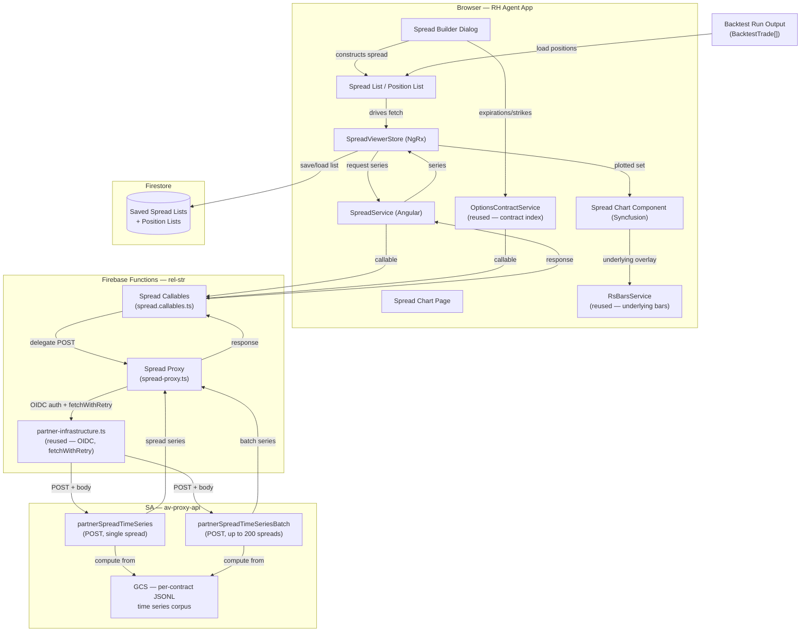

**Topic:** Spread Time Series Viewer  
**Issue:** #77  
**Domain:** SPREAD-PRICING  
**Type:** PRD  
**Status:** Draft  
**Created:** 2026-08-03  
**Last Updated:** 2026-08-03  

# PRD: Spread Time Series Viewer

## Problem Statement

Traders using the RH Agent app have no way to visualize how multi-leg options spreads behave over time. Existing charting tools show theoretical expiration P/L diagrams, not the actual historical price evolution of a spread. The Options Contract Viewer inspects single contracts — it cannot compare multiple spreads, show spread price (as opposed to single-contract mark), or express spread constructions like verticals, straddles, strangles, and iron condors.

The partner API (`partnerSpreadTimeSeries` / `partnerSpreadTimeSeriesBatch`) now computes and returns historical spread price time series on demand. But there is no UI to request, compare, or analyze this data. Traders cannot research spread price behavior across types, expirations, and configurations, nor can they visualize the output of backtest runs that produce spread positions.

## Solution

Build a **Spread Time Series Viewer** — a dashboard page that lets traders construct spreads, plot multiple spread price series simultaneously, toggle between absolute and normalized views, overlay the underlying price, and visualize backtest position output. The viewer supports two viewing modes: **plain viewing mode** for manually-constructed spreads, and **backtest plotting mode** for positions output by strategy tests.

The viewer is a separate pipeline from the Options Contract Viewer (per ADR-003), with its own types, proxy, callables, service, store, chart component, and page. Shared infrastructure (OIDC token generation, fetch-with-retry, contract index service, underlying bars service) is reused as read-only dependencies.

## User Stories

### Spread Builder

1. As a trader, I want to select a spread type (vertical, straddle, strangle, iron condor) from a dropdown, so that the builder form adapts to show only the fields relevant to that spread type.

2. As a trader, I want the builder form to prepopulate leg fields based on my spread type selection, so that I don't have to manually specify optionType and direction for each leg when the spread type already implies them.

3. As a trader, I want to pick a symbol (QQQ or TQQQ) and see available expirations and strikes populated from the contract index, so that I can only select legs that actually exist.

4. As a trader, I want cascading dropdowns where selecting an expiration filters the available strikes, so that I can't construct a spread with legs that don't exist for that expiration.

5. As a trader, I want to select "custom" spread type and manually specify all leg fields (expiration, strike, optionType, direction) for 2-4 legs, so that I can construct spreads that don't fit the four predefined types.

6. As a trader, I want the builder to validate my spread before submission (different strikes for vertical, same direction for straddle/strangle, etc.), so that I get immediate feedback on invalid constructions instead of a server error.

7. As a trader, I want to optionally specify a date range (startDate/endDate) for the spread, so that I can filter the returned series to a relevant window.

8. As a trader, I want to add a constructed spread to the spread list, so that I can build up a set of spreads to compare on the chart.

### Spread List

9. As a trader, I want to see a list of all spreads I've constructed in the current session, so that I can review what I've built before plotting.

10. As a trader, I want to remove a spread from the list, so that I can correct mistakes or refine my comparison set.

11. As a trader, I want to clear the entire spread list, so that I can start fresh.

12. As a trader, I want the spread list to determine whether the single or batch endpoint is used (one spread = single, multiple = batch), so that fetching is automatic and I don't have to think about the API.

13. As a trader, I want to save the current spread list to Firestore as a named list, so that I can recall it after a page refresh without re-entering every spread.

14. As a trader, I want to see a "last 10" stack of saved spread lists, so that I can quickly restore a recent working set during development or research.

15. As a trader, I want to load a saved spread list from Firestore, so that I can resume a previous research session.

### Chart — Core

16. As a trader, I want to plot all spreads in the spread list on a single chart, so that I can compare their price behavior.

17. As a trader, I want to toggle between absolute price view and normalized (% change from first observation) view, so that I can compare spreads on different price scales directly.

18. As a trader, I want the normalized view to anchor each series at 0% on its first observation, so that I can see relative price movement regardless of absolute price level.

19. As a trader, I want an underlying price overlay on the absolute view (secondary Y-axis), so that I can see spread behavior relative to the underlying.

20. As a trader, I want a crosshairs tooltip that shows the date and all series values at that point, so that I can inspect daily data across all plotted spreads.

21. As a trader, I want the chart to use a Category axis with date-formatted labels (skipping weekends/holidays), so that there are no visual gaps for non-trading days.

22. As a trader, I want the chart to indicate gap dates (dates where one or more legs have unresolvable data), so that I'm aware of data quality issues.

### Chart — Backtest Plotting Mode

23. As a trader, I want to load a backtest run's position list into the viewer, so that I can visualize the spread positions that occurred during a strategy test.

24. As a trader, I want each backtest position plotted from its entry date forward, so that I see post-entry behavior only.

25. As a trader, I want the position list to hold all positions from a backtest run (potentially thousands), so that no data is lost.

26. As a trader, I want the plotted set capped at a reasonable number (initial: 50 series) with a UI indication of how many are available vs. plotted, so that the chart doesn't crash or become unreadable with thousands of series.

27. As a trader, I want to see provenance metadata (run ID, strategy ID) on each backtest position, so that I can trace a position back to its source run.

### Chart — Performance and Volume

28. As a trader, I want series data fetched on demand only for what's being plotted, so that loading a 1000-position backtest doesn't fetch 1000 series upfront.

29. As a trader, I want the batch endpoint used for multi-spread fetching (up to 200 per request), so that fetching is efficient.

### Error Handling

30. As a trader, I want to see a clear error message when a spread leg's contract doesn't exist in the data, so that I can correct the spread definition.

31. As a trader, I want to see a clear error message when the API returns a validation error, so that I can fix the invalid spread.

32. As a trader, I want to see a loading indicator while series are being fetched, so that I know the app is working.

33. As a trader, I want partial success in batch mode (some spreads succeed, some fail) to show which spreads failed and why, so that I can fix the failing ones without losing the successful ones.

## Implementation Decisions

### Architecture

- **Separate pipeline** per ADR-003: spread-specific types, proxy, callables, service, store, chart component, and page. No modification to the Options Contract Viewer.
- **Shared infrastructure reused as read-only dependencies:** `partner-infrastructure.ts` (OIDC, fetchWithRetry), `OptionsContractService.getContractIndex$` (expiration/strike dropdowns), `RsBarsService` (underlying bars).

### Backend

- **Extend `fetchWithRetry`** in `partner-infrastructure.ts` with optional `body` and `method` params to support POST requests. Backward compatible — existing GET callers unaffected.
- **Add `PartnerEndpointPath` entries:** `SPREAD_TIME_SERIES`, `SPREAD_TIME_SERIES_BATCH`.
- **Add `CallableName` entries** for the spread callables.
- **Create shared spread types** (`shared/spread-contracts.ts`): request/response interfaces matching the SA API contract (SpreadRequest, SpreadBatchRequest, SpreadResponse, SpreadBatchResponse, SpreadLeg, SpreadObservation, etc.).
- **Create spread proxy** (`functions/src/spread-proxy.ts`): POST handler delegating to SA's `partnerSpreadTimeSeries` / `partnerSpreadTimeSeriesBatch` endpoints with OIDC auth.
- **Create spread callables** (`functions/src/spread.callables.ts`): callable wrappers for single + batch, with CORS config via `RH_AGENT_ALLOWED_ORIGINS`.
- **Register callables** in the functions index.

### Frontend

- **SpreadService** (Angular): thin wrapper around spread callables, maps request/response types. Pattern follows `OptionsContractService`.
- **SpreadViewerStore** (NgRx): state includes spread list, fetched series, chart config (absolute/normalized mode, underlying overlay toggle), loading/error state, plotted set (filtered subset of list). Architecture supports `list → filter → plotted set → chart` data flow for future filter-to-algo bridge.
- **Spread builder dialog**: constrained forms for 4 spread types (vertical, straddle, strangle, iron_condor) + custom mode. Uses `OptionsContractService.getContractIndex$` for cascading expiration/strike dropdowns. Validates legs against spread type rules before submission.
- **Spread chart component**: cloned from `OptionsContractChartComponent` as starting point, adapted for N price series. One pane with toggle between absolute and normalized views. Underlying overlay on secondary Y-axis (absolute view only). Syncfusion EJ2 charts. Category axis with date-formatted labels (via `onAxisLabelRender`) to skip non-trading days. Crosshairs tooltip.
- **Spread chart page**: hosts builder dialog + spread list + chart. Two viewing modes: plain (spreads) and backtest plotting (positions).
- **List persistence**: Firestore collection for saved spread lists and backtest position lists. "Last 10" stack for quick recall. List-level persistence (not individual spread/position level).

### Domain Model

- **Spread**: the instrument (type, symbol, legs, optional date range). Viewed over full life. No entry date. Produced by manual builder.
- **Position**: a trading decision (spread + entry date + optional exit date + target/stop). Viewed from entry forward.
- **Backtest Position**: a position from a backtest run. Maps to existing `BacktestTrade` type. Has provenance (runId, permutationId, strategyId).
- **Spread List**: builder output (spreads). **Position List**: backtest output (positions). Two separate lists.
- **Two viewing modes**: plain (spreads, full life) and backtest plotting (positions, entry forward).

### Data Flow

- **Plain mode**: builder → spread list → batch/single endpoint → series → chart (all spreads plotted)
- **Backtest mode**: backtest run → position list → batch endpoint (only for plotted subset) → series → chart (capped plotted set, entry-anchored)

### Volume Handling

- Position list holds all positions from a backtest run (no cap).
- Plotted set capped at 50 series (configurable) with UI indication of available vs. plotted count.
- Series fetched on demand only for plotted subset, using batch endpoint (200 max per request).
- Future: filtering UI to select which subset to plot (by spread type, date range, P&L, etc.).

## Testing Decisions

### Philosophy

Test external behavior, not implementation details. Prefer the highest seam that can verify the behavior; drop to lower seams only where the high seam can't reach. Each behavior is tested at the one level that best reaches it.

### Test Files

| Test | Seam | What it covers |
|---|---|---|
| `spread-chart-page.spec.ts` | Page component | End-to-end: builder → list → chart → toggle → tooltip |
| `spread-builder.spec.ts` | Component | Form validation per spread type, custom mode, leg construction, cascading dropdowns |
| `spread-viewer-store.spec.ts` | Store | All state transitions, plotted set filtering, loading/error states |
| `spread.service.spec.ts` | Service | Request/response mapping, batch serialization, error handling |
| `spread-chart.spec.ts` | Component | Series rendering, normalized calculation, underlying overlay, axis behavior |
| `spread-proxy.test.ts` | Backend | POST delegation to SA, auth, error mapping |
| `spread-contracts.spec.ts` | Types | Request/response type validation, spread leg validation rules |

### Prior Art

- Frontend spec files: 36 existing `.spec.ts` files in `src/` (core components) as pattern reference.
- `OptionsContractService` as service pattern reference.
- `options-contract-proxy.ts` and its callable as backend pattern reference.
- `OptionsContractChartComponent` as chart component pattern reference.

## Out of Scope

### Phase 2+

- **Greeks pane**: spread delta/theta/vega/gamma visualization. Deferred until chart is stable and we understand what Greek visualization is most useful through real usage.
- **Per-leg marks pane**: showing individual leg mark series for a single spread. Deferred — only available in single-spread mode (batch omits leg series).
- **Generation feature (Tier 1)**: entry-date iteration on a fixed spread definition. Interesting but not the primary research goal.
- **Generation feature (Tier 2)**: template-based selection (target DTE, target delta, strike width) with contract index lookup per entry date. The "holy grail" for strategy research. Reuses existing `selectOptionSpread` logic from the backtest system.
- **Filter-to-algo bridge (full)**: shared filter specification between viewer and backtest strategy config. v1 uses structurally aligned vocabulary (delta, DTE, strike width, debit/credit) to enable future bridge. Full shared spec is the goal.
- **Filtering UI**: UI for selecting which subset of positions to plot (by spread type, date range, P&L, etc.). v1 caps plotted set at 50 with simple selection; full filtering is phase 2.
- **Large-volume optimization**: virtualized lists, series sampling/aggregation for 1000+ series. v1 caps at 50 plotted; large backtests work but are capped.

### Parked

- **Individual spread/position persistence**: only list-level persistence in v1. Whether individual spreads/positions are persisted (vs. session-only) is an open question.
- **localStorage vs. Firestore for session state**: parked for separate discussion. v1 uses Firestore for list-level persistence.

## Technical Context

- **API constraints**: SA's spread endpoints support only QQQ and TQQQ symbols. Four spread types: vertical, straddle, strangle, iron_condor. Batch endpoint caps at 200 spreads per request. Server-to-server only (browser cannot call SA directly — must go through rel-str's Firebase Functions proxy).
- **Data freshness**: spread prices are computed on-demand from pre-materialized per-contract time series in GCS. No caching (Phase 4 on SA side). Response time depends on the number of legs and date range; batch requests can take up to 120 seconds.
- **Charting library**: Syncfusion EJ2 Angular Charts. Same library as the Options Contract Viewer. Category axis with date-formatted labels for skipping non-trading days.
- **State management**: NgRx. New feature store for the spread viewer, following the existing feature-based store structure.
- **Backend**: Firebase Cloud Functions (us-central1). New spread proxy and callables following the existing partner endpoint pattern. OIDC auth via `partner-infrastructure.ts`.
- **Persistence**: Firestore for saved spread lists and backtest position lists. Collection schema to be designed during blueprint.

## System Context Diagram

## Further Notes

- **ADR-003** governs the separate-pipeline architectural decision. This PRD implements ADR-003's v1 scope.
- **CONTEXT.md** has been updated with the Spread / Position / Backtest Position / Spread List / Position List domain vocabulary.
- **SA API docs** are in the `av-proxy-api` repo at `docs/partner/options-data/spread-time-series-{discovery,prd,implementation-plan}.md`. A formal inter-app doc library is an open question (noted during planning, not resolved).
- **Bug report filed** against rb-skills (issue #1): stage issue title prefixes should be ALL CAPS, not title case. Affects `proj-idea.md`, `proj-plan.md`, `proj-blueprint.md`, `proj-triage.md`, `proj-backfill.md`, and `README.md`.
- **Inter-app doc library**: the current approach of pointing the LLM at SA repo paths ad-hoc works but is fragile. A formal inter-app doc library or symlinked reference is worth discussing separately.
