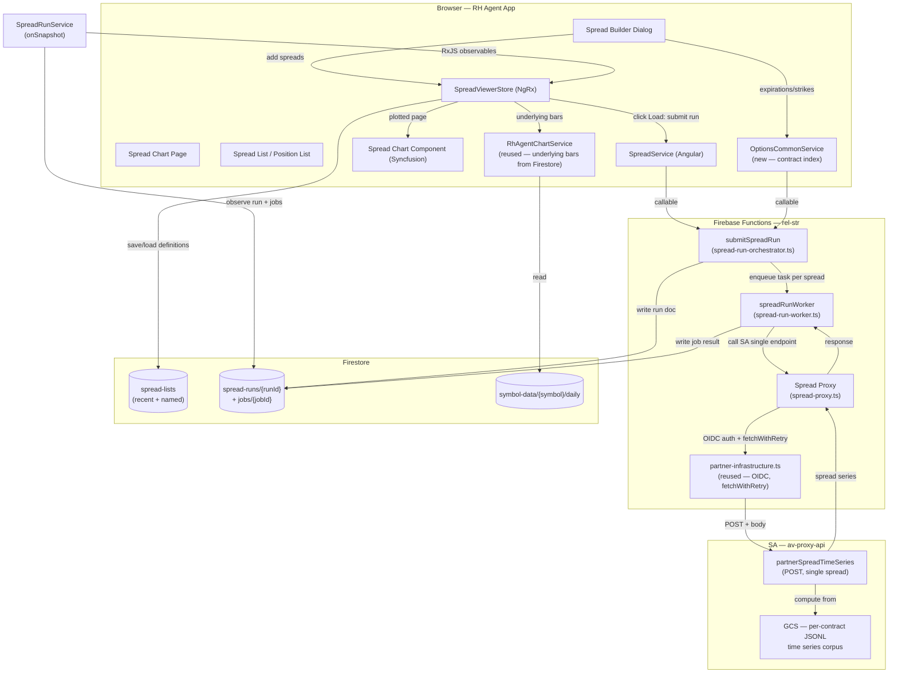

**Topic:** Spread Time Series Viewer  
**Issue:** #77  
**Domain:** SPREAD-PRICING  
**Type:** PRD  
**Status:** Approved  
**Created:** 2026-08-03  
**Last Updated:** 2026-08-03  

# PRD: Spread Time Series Viewer

## Problem Statement

Traders using the RH Agent app have no way to visualize how multi-leg options spreads behave over time. Existing charting tools show theoretical expiration P/L diagrams, not the actual historical price evolution of a spread. The Options Contract Viewer inspects single contracts — it cannot compare multiple spreads, show spread price (as opposed to single-contract mark), or express spread constructions like verticals, straddles, strangles, and iron condors.

The partner API (`partnerSpreadTimeSeries` / `partnerSpreadTimeSeriesBatch`) now computes and returns historical spread price time series on demand. But there is no UI to request, compare, or analyze this data. Traders cannot research spread price behavior across types, expirations, and configurations, nor can they visualize the output of backtest runs that produce spread positions.

## Solution

Build a **Spread Time Series Viewer** — a dashboard page that lets traders construct spreads, plot multiple spread price series simultaneously, toggle between absolute and normalized views, overlay the underlying price, and visualize backtest position output. The viewer supports two viewing modes: **plain viewing mode** for manually-constructed spreads, and **backtest plotting mode** for positions output by strategy tests.

The viewer is a separate pipeline from the Options Contract Viewer (per ADR-003), with its own types, proxy, callables, service, store, chart component, and page. Shared infrastructure (OIDC token generation, fetch-with-retry, contract index service, underlying bars service) is reused as read-only dependencies.

## User Stories

### Spread Builder

1. As a trader, I want to select a spread type (vertical, straddle, strangle, iron condor) from a dropdown, so that the builder form adapts to show only the fields relevant to that spread type.

2. As a trader, I want the builder form to prepopulate leg fields based on my spread type selection, so that I don't have to manually specify optionType and direction for each leg when the spread type already implies them.

3. As a trader, I want to pick a symbol (QQQ or TQQQ) and see available expirations and strikes populated from the contract index, so that I can only select legs that actually exist.

4. As a trader, I want cascading dropdowns where selecting an expiration filters the available strikes, so that I can't construct a spread with legs that don't exist for that expiration.

5. As a trader, I want to select "custom" spread type and manually specify all leg fields (expiration, strike, optionType, direction) for 2-4 legs, so that I can construct spreads that don't fit the four predefined types.

6. As a trader, I want the builder to validate my spread before submission (different strikes for vertical, same direction for straddle/strangle, etc.), so that I get immediate feedback on invalid constructions instead of a server error.

7. As a trader, I want to optionally specify a date range (startDate/endDate) for the spread, so that I can filter the returned series to a relevant window.

8. As a trader, I want to add a constructed spread to the spread list, so that I can build up a set of spreads to compare on the chart.

### Spread List

9. As a trader, I want to see a list of all spreads I've constructed in the current session, so that I can review what I've built before plotting.

10. As a trader, I want to remove a spread from the list, so that I can correct mistakes or refine my comparison set.

11. As a trader, I want to clear the entire spread list, so that I can start fresh.

12. As a trader, I want the spread list to determine whether the single or batch endpoint is used (one spread = single, multiple = batch), so that fetching is automatic and I don't have to think about the API.

13. As a trader, I want to save the current spread list to Firestore as a named list, so that I can recall it after a page refresh without re-entering every spread.

14. As a trader, I want to see a "last 10" stack of saved spread lists, so that I can quickly restore a recent working set during development or research.

15. As a trader, I want to load a saved spread list from Firestore, so that I can resume a previous research session.

### Chart — Core

16. As a trader, I want to plot all spreads in the spread list on a single chart, so that I can compare their price behavior.

17. As a trader, I want to toggle between absolute price view and normalized (% change from first observation) view, so that I can compare spreads on different price scales directly.

18. As a trader, I want the normalized view to anchor each series at 0% on its first observation, so that I can see relative price movement regardless of absolute price level.

19. As a trader, I want an underlying price overlay on the absolute view (secondary Y-axis), so that I can see spread behavior relative to the underlying.

20. As a trader, I want a crosshairs tooltip that shows the date and all series values at that point, so that I can inspect daily data across all plotted spreads.

21. As a trader, I want the chart to use a Category axis with date-formatted labels (skipping weekends/holidays), so that there are no visual gaps for non-trading days.

22. As a trader, I want the chart to indicate gap dates (dates where one or more legs have unresolvable data), so that I'm aware of data quality issues.

### Chart — Backtest Plotting Mode

23. As a trader, I want to load a backtest run's position list into the viewer, so that I can visualize the spread positions that occurred during a strategy test.

24. As a trader, I want each backtest position plotted from its entry date forward, so that I see post-entry behavior only.

25. As a trader, I want the position list to hold all positions from a backtest run (potentially thousands), so that no data is lost.

26. As a trader, I want the plotted set capped at a reasonable number (initial: 50 series) with a UI indication of how many are available vs. plotted, so that the chart doesn't crash or become unreadable with thousands of series.

27. As a trader, I want to see provenance metadata (run ID, strategy ID) on each backtest position, so that I can trace a position back to its source run.

### Chart — Performance and Volume

28. As a trader, I want series data fetched on demand only for what's being plotted, so that loading a 1000-position backtest doesn't fetch 1000 series upfront.

29. As a trader, I want the batch endpoint used for multi-spread fetching (up to 200 per request), so that fetching is efficient.

### Error Handling

30. As a trader, I want to see a clear error message when a spread leg's contract doesn't exist in the data, so that I can correct the spread definition.

31. As a trader, I want to see a clear error message when the API returns a validation error, so that I can fix the invalid spread.

32. As a trader, I want to see a loading indicator while series are being fetched, so that I know the app is working.

33. As a trader, I want partial success in batch mode (some spreads succeed, some fail) to show which spreads failed and why, so that I can fix the failing ones without losing the successful ones.

## Implementation Decisions

### Architecture

- **Separate pipeline** per ADR-003: spread-specific types, proxy, callables, service, store, chart component, and page. No modification to the Options Contract Viewer.
- **Shared infrastructure reused as read-only dependencies:** `partner-infrastructure.ts` (OIDC, fetchWithRetry), `OptionsCommonService.getContractIndex$` (expiration/strike dropdowns — new shared service, see below), `RhAgentChartService` (underlying bars from `symbol-data` Firestore, not SA round-trip).

### Backend

- **Extend `fetchWithRetry`** in `partner-infrastructure.ts` with optional `body` and `method` params to support POST requests. Backward compatible — existing GET callers unaffected.
- **Add `PartnerEndpointPath` entry:** `SPREAD_TIME_SERIES` (single endpoint only — batch endpoint not used in Phase 1).
- **Add `CallableName` entry:** `SUBMIT_SPREAD_RUN`.
- **Add `Collection` entries:** `SPREAD_RUNS`, `SPREAD_LISTS`.
- **Create `shared/options-common.ts`**: canonical `OptionType` enum (single source of truth), `buildOccContractId()`, `parseOccContractId()` (moved from `options-contract-contracts.ts`). Both the contract viewer and spread viewer import from here.
- **Create shared spread types** (`shared/spread-contracts.ts`): `SpreadType`, `SpreadLeg`, `SpreadDefinition`, `Spread` (extends definition with runtime state), `DebitOrCredit` enum, `SpreadStatus` enum, `SpreadObservation`, `LegMetadata`, request/response types for single endpoint. Imports `OptionType` and OCC ID helpers from `options-common.ts`.
- **Create spread proxy** (`functions/src/spread-proxy.ts`): POST handler delegating to SA's `partnerSpreadTimeSeries` endpoint with OIDC auth. Caller sets `Content-Type: application/json` header — `fetchWithRetry` remains a dumb retry wrapper.
- **Create spread run model** (`functions/src/spread-run-model.ts`): `SpreadRunStatus`, `SpreadJobStatus` enums, `SpreadRunDoc`, `SpreadJobDoc` interfaces, path helpers. Mirrors `rs-time-series-jobs.model.ts` pattern.
- **Create spread run orchestrator** (`functions/src/spread-run-orchestrator.ts`): `submitSpreadRun` callable. Writes `spread-runs/{runId}` aggregate doc, enqueues 1 Cloud Task per spread (each with `{ runId, spreadIndex, definition }`), returns `{ runId }`. Mirrors `backtest-orchestrator.ts` pattern.
- **Create spread run worker** (`functions/src/spread-run-worker.ts`): `spreadRunWorker` task (`onTaskDispatched`). Calls SA single endpoint for 1 spread, writes result to `spread-runs/{runId}/jobs/{spreadIndex}` subcollection doc, increments aggregate counters on parent run doc, sets run `status: COMPLETE` when all jobs done. Worker config: 20 concurrent dispatches, 10/sec rate, 256 MiB, 60s timeout, 3 retries with 10-60s backoff.
- **Register orchestrator + worker** in the functions index.

### Frontend

- **OptionsCommonService** (Angular): new shared service holding `getContractIndex$` (expiration/strike cross-map). Spread pipeline injects this directly. `OptionsContractService` retains a duplicate copy for now (cleanup task to remove later).
- **SpreadService** (Angular): thin wrapper around `submitSpreadRun` callable. Calls the orchestrator with all pending spread definitions, returns `{ runId }`.
- **SpreadRunService** (Angular): manages `onSnapshot` subscriptions on `spread-runs/{runId}` (progress) and `spread-runs/{runId}/jobs` subcollection (per-spread results). Emits RxJS observables to the store. Handles subscription cleanup on unsubscribe. Encapsulates Firestore query mechanics — store stays pure state.
- **SpreadListService** (Angular): Firestore CRUD for spread list persistence. Reads/writes `spread-lists/{listId}` directly (no backend callable needed). Stores only `SpreadDefinition` — series data is re-fetched on load.
- **SpreadViewerStore** (NgRx SignalStore): state includes `symbol`, `startDate`/`endDate` (optional, from builder), `spreads: Spread[]` (no ceiling), `contractIndex` + status, `underlyingBars` + status (from `RhAgentChartService`), `activeRunId`, `runProgress`, `plottedStartIndex` + `plottedPageLength` (default 20), `showUnderlying`, `chartMode`. Computed signals: `pendingSpreads`, `loadedSpreads`, `plottedSpreads` (slice), `allDates` (union for X-axis), `hasPending`. Architecture supports `list → filter → plotted set → chart` data flow for future filter-to-algo bridge.
- **Spread builder dialog**: Material dialog component. Constrained forms for 4 spread types (vertical, straddle, strangle, iron_condor) + custom mode. Uses `OptionsCommonService.getContractIndex$` for cascading expiration/strike dropdowns. UI constraints make invalid spreads hard to construct (e.g., vertical locks optionType to single selector, auto-sets same expiration on all legs). Spread type leg definitions are config-driven (extensible). When spread type is selected, form pre-populates: symbol (from store), optionType (auto-set where constrained), expiration (user picks), strikes (user picks). Long/short assignment auto-determined by spread type + strike selection. **Debit/credit indicator**: read-only badge computed structurally from leg arrangement (e.g., long lower strike call = debit, long both legs = debit, iron condor = always credit). Updates live as user adjusts strikes. **Date range**: optional fields in the builder, defaults to full life if not specified. **Dialog stays open** — user adds multiple spreads via "Add to List" button, sees running count, then clicks "Load" to submit a spread run and close the dialog. Adding a leg that doesn't fit the selected type's definition flips to 'custom' mode.
- **Spread chart component**: new component (not cloned — different chart structure). Multi-series price lines, one per spread, all on the same pane. **Category axis** (not date axis) with dates as category labels — sequential plotting to avoid weekend/holiday gaps (same pattern as `OptionsContractChartComponent`). X-axis extent snaps to first day of first spread and last day of last spread (union of all dates across plotted spreads). Underlying overlay on secondary Y-axis (toggleable, same symbol across all pages). 5-6 color repeating palette (`index % palette.length`). Series labels auto-generated: `{spreadType} {optionType} {debit|credit} {expiration} {longStrike}/{shortStrike}`. **Pagination through spreads** (not dates): chart renders `plottedPageLength` spreads at a time from store's `plottedSpreads` signal. Syncfusion EJ2 charts.
- **Spread chart page**: hosts builder dialog + chart. User opens builder, builds spreads, clicks Load in dialog → dialog closes → chart shows loading indicators → series populate as workers complete. Two viewing modes (future): plain (spreads) and backtest plotting (positions).
- **List persistence**: Firestore collection `spread-lists/{listId}` with user-scoped security rules (matching existing `rh-agent-triage-decisions` pattern). Two list types: auto-maintained "Recent" list (capped at 10 most recent spread definitions) and user-named lists (unlimited). Stores only `SpreadDefinition` — series data is re-fetched on load. No backend callable needed — frontend reads/writes Firestore directly.
- **Run persistence**: Firestore collection `spread-runs/{runId}` (aggregate doc) + `spread-runs/{runId}/jobs/{jobId}` (per-spread result subcollection). Authenticated read, backend-only write. No user scoping (single user). No cleanup of old run docs in Phase 1 — add scheduled cleanup as future work. Mirrors `rs-backfill-runs` and `backtest-runs` patterns.

### Domain Model

- **Spread**: the instrument (type, symbol, legs, optional date range). Viewed over full life. No entry date. Produced by manual builder.
- **Position**: a trading decision (spread + entry date + optional exit date + target/stop). Viewed from entry forward.
- **Backtest Position**: a position from a backtest run. Maps to existing `BacktestTrade` type. Has provenance (runId, permutationId, strategyId).
- **Spread List**: builder output (spreads). **Position List**: backtest output (positions). Two separate lists.
- **Two viewing modes**: plain (spreads, full life) and backtest plotting (positions, entry forward).

### Data Flow

- **Plain mode**: builder → add spreads to store (status: pending) → click Load → `submitSpreadRun` callable → spread-runs doc + Cloud Tasks → worker calls SA single endpoint per spread → job docs written → `SpreadRunService` observes via `onSnapshot` → store updates spreads with series → chart renders plotted page
- **Backtest mode** (future): backtest run → position list → submit spread run → series → chart (entry-anchored)

### Volume Handling

- Store holds all spreads (no ceiling). Series data loaded via queue (1 Cloud Task per spread, 20 concurrent).
- Chart paginates through spreads: `plottedPageLength` (default 20) spreads rendered at a time. Store holds `plottedStartIndex` + `plottedPageLength`.
- All spreads in a run are fetched (not just plotted subset) — pagination is a view concern, not a data-loading concern.
- Future: filtering UI to select which subset to plot (by spread type, date range, P&L, etc.).

## Testing Decisions

### Philosophy

Test external behavior, not implementation details. Prefer the highest seam that can verify the behavior; drop to lower seams only where the high seam can't reach. Each behavior is tested at the one level that best reaches it.

### Test Files

| Test | Seam | What it covers |
|---|---|---|
| `spread-chart-page.spec.ts` | Page component | End-to-end: builder → add spreads → load → chart → pagination → toggle |
| `spread-builder.spec.ts` | Component | Form validation per spread type, custom mode, leg construction, cascading dropdowns, debit/credit indicator |
| `spread-viewer-store.spec.ts` | Store | All state transitions, pagination, run observation, loading/error states |
| `spread.service.spec.ts` | Service | Callable request/response mapping, error handling |
| `spread-run.service.spec.ts` | Service | onSnapshot observation, RxJS emission, subscription cleanup |
| `spread-chart.spec.ts` | Component | Series rendering, category axis, underlying overlay, color palette, pagination |
| `spread-proxy.test.ts` | Backend | POST delegation to SA, auth, error mapping |
| `spread-run-orchestrator.test.ts` | Backend | Run doc creation, task enqueueing, error handling |
| `spread-run-worker.test.ts` | Backend | SA single endpoint call, job doc write, aggregate counter increment |
| `spread-contracts.spec.ts` | Types | Request/response type validation, spread leg validation rules |

### Prior Art

- Frontend spec files: 36 existing `.spec.ts` files in `src/` (core components) as pattern reference.
- `OptionsContractService` as service pattern reference.
- `options-contract-proxy.ts` and its callable as backend pattern reference.
- `OptionsContractChartComponent` as chart component pattern reference.

## Out of Scope

### Phase 2+

- **Greeks pane**: spread delta/theta/vega/gamma visualization. Deferred until chart is stable and we understand what Greek visualization is most useful through real usage.
- **Per-leg marks pane**: showing individual leg mark series for a single spread. Deferred — only available in single-spread mode (batch omits leg series).
- **Generation feature (Tier 1)**: entry-date iteration on a fixed spread definition. Interesting but not the primary research goal.
- **Generation feature (Tier 2)**: template-based selection (target DTE, target delta, strike width) with contract index lookup per entry date. The "holy grail" for strategy research. Reuses existing `selectOptionSpread` logic from the backtest system.
- **Delta-aware builder**: open-date-first flow where the user picks an entry date, the builder fetches the options chain for that date (strikes, expirations, and per-strike deltas), and the user constructs spreads by delta target (e.g., "15 delta naked strangle"). Requires options chain access via a new data path (the viewer currently only has contract index access, not per-date chain data). This is the foundation for Tier 2 generation — "open a 15 delta naked strangle every Wednesday from X to Y" requires per-date delta resolution for each entry date.
- **Filter-to-algo bridge (full)**: shared filter specification between viewer and backtest strategy config. v1 uses structurally aligned vocabulary (delta, DTE, strike width, debit/credit) to enable future bridge. Full shared spec is the goal.
- **Filtering UI**: UI for selecting which subset of positions to plot (by spread type, date range, P&L, etc.). v1 caps plotted set at 50 with simple selection; full filtering is phase 2.
- **Large-volume optimization**: virtualized lists, series sampling/aggregation for 1000+ series. v1 caps at 50 plotted; large backtests work but are capped.

### Parked

- **Individual spread/position persistence**: only list-level persistence in v1. Whether individual spreads/positions are persisted (vs. session-only) is an open question.
- **localStorage vs. Firestore for session state**: parked for separate discussion. v1 uses Firestore for list-level persistence.

## Technical Context

- **API constraints**: SA's spread endpoints support only QQQ and TQQQ symbols. Four spread types: vertical, straddle, strangle, iron_condor. Server-to-server only (browser cannot call SA directly — must go through rel-str's Firebase Functions proxy). Phase 1 uses single endpoint only (`partnerSpreadTimeSeries`); batch endpoint (`partnerSpreadTimeSeriesBatch`) available for future optimization.
- **Queue architecture**: All spread loading goes through Cloud Tasks queue (even for 1 spread). Orchestrator callable writes run doc + enqueues tasks. Worker task calls SA single endpoint per spread, writes result to Firestore. Frontend observes via `onSnapshot`. Mirrors `backtest-runs` and `rs-backfill-runs` patterns. Worker: 20 concurrent, 10/sec, 256 MiB, 60s timeout, 3 retries.
- **Data freshness**: spread prices are computed on-demand from pre-materialized per-contract time series in GCS. No caching (Phase 4 on SA side). Response time depends on the number of legs and date range.
- **Charting library**: Syncfusion EJ2 Angular Charts. Same library as the Options Contract Viewer. Category axis with date-formatted labels for skipping non-trading days.
- **State management**: NgRx. New feature store for the spread viewer, following the existing feature-based store structure.
- **Backend**: Firebase Cloud Functions (us-central1). Spread proxy, run orchestrator callable, and run worker task following existing partner endpoint + Cloud Tasks patterns. OIDC auth via `partner-infrastructure.ts`.
- **Persistence (spread lists)**: Firestore collection `spread-lists/{listId}` with user-scoped security rules. Each doc stores `userId`, `name`, `spreads: SpreadDefinition[]`, `createdAt`, `updatedAt`. Auto-maintained recent list (doc ID `recent`, capped at 10) + user-named lists. Frontend reads/writes directly — no backend callable needed.
- **Persistence (spread runs)**: Firestore collection `spread-runs/{runId}` (aggregate: `userId`, `status`, `expectedJobs`, `successJobs`, `failedJobs`, timestamps) + `spread-runs/{runId}/jobs/{jobId}` (per-spread: `status`, `definition`, `series`, `debitOrCredit`, `gaps`, `legMetadata`, `error`, timestamps). Authenticated read, backend-only write. No cleanup in Phase 1.

## System Context Diagram

## Further Notes

- **ADR-003** governs the separate-pipeline architectural decision. This PRD implements ADR-003's v1 scope.
- **Tech debt tracked during blueprint grilling:**
  1. Extract `getContractIndex$` from `OptionsContractService` into `OptionsCommonService`, update contract viewer callers.
  2. Rename `options-contract-contracts.ts` → `options-contracts.ts`.
  3. Fix all `OptionType` imports to point directly to `@options/common` (not re-exports from `partner.ts`).
  4. Replace all `'C' | 'P'` / `'call' | 'put'` string literals with `OptionType` enum.
  5. Refactor `getPairDailyBars` callable to read from `symbol-data/{symbol}/daily` Firestore instead of live SA round-trip.
  6. Refactor `RsBarsService` to read from `symbol-data` Firestore (or be replaced by `RhAgentChartService` pattern).
- **CONTEXT.md** has been updated with the Spread / Position / Backtest Position / Spread List / Position List domain vocabulary.
- **SA API docs** are in the `av-proxy-api` repo at `docs/partner/options-data/spread-time-series-{discovery,prd,implementation-plan}.md`. A formal inter-app doc library is an open question (noted during planning, not resolved).
- **Bug report filed** against rb-skills (issue #1): stage issue title prefixes should be ALL CAPS, not title case. Affects `proj-idea.md`, `proj-plan.md`, `proj-blueprint.md`, `proj-triage.md`, `proj-backfill.md`, and `README.md`.
- **Inter-app doc library**: the current approach of pointing the LLM at SA repo paths ad-hoc works but is fragile. A formal inter-app doc library or symlinked reference is worth discussing separately.
