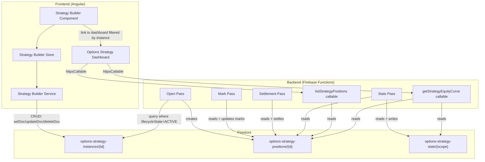

**Topic:** Strategy Builder UI  
**Issue:** #137  
**Domain:** STRAT-BUILD-UI  
**Type:** PRD  
**Status:** Approved  
**Created:** 2026-08-16  
**Last Updated:** 2026-08-16  

## Problem Statement

Options strategy instances are currently hardcoded in `functions/src/options-strategy-engine/strategy-instance-registry.ts` as a readonly `STRATEGY_INSTANCES` array. Adding, modifying, or toggling a strategy requires a code change and deployment. There is no UI for managing strategy instances — the user cannot create, edit, pause, or stop a strategy without editing source code.

## Solution

A Strategy Builder UI that provides full CRUD operations for options strategy instances, stored in Firestore and read by the backend nightly passes at runtime. The UI lets the user create configured instances of predefined spread types (cash-secured put, covered call in v1), set exit policies, toggle instances between active/paused/stopped states, and link through to the existing Options Strategy Dashboard to view positions.

The architecture is extensible — new spread types added by Topic #139 (Extend Option Strategy Engine to All Spread Types) will automatically appear in the UI's spread type selector without UI changes.

## User Stories

### Strategy Instance Management

1. As a trader, I want to view a list of all strategy instances, so that I can see what strategies are configured and their current state
2. As a trader, I want to create a new strategy instance by selecting a spread type and configuring its parameters, so that I can start trading a new strategy without code changes
3. As a trader, I want to edit an existing strategy instance's configuration, so that I can adjust parameters (delta, DTE, exit policy) as market conditions evolve
4. As a trader, I want to delete a strategy instance, so that I can remove strategies I no longer use (soft delete only — historical positions remain linked)
5. As a trader, I want to see the auto-generated instance ID before saving, so that I can verify the naming convention is correct

### Lifecycle Control

6. As a trader, I want to set a strategy instance to ACTIVE, so that the nightly passes open new positions for it
7. As a trader, I want to PAUSE a strategy instance, so that no new positions are opened but existing ones continue to be managed (mark, settlement)
8. As a trader, I want to STOP a strategy instance, so that no new positions are opened (v1: same as paused — existing positions managed manually in RH)
9. As a trader, I want to see the lifecycle state (ACTIVE/PAUSED/STOPPED) of each instance in the list view, so that I can quickly see which strategies are trading

### Configuration

10. As a trader, I want to select a spread type from a dropdown of predefined types, so that I know I'm configuring a valid strategy archetype
11. As a trader, I want to set the underlying symbol for a strategy instance, so that the engine knows what to trade
12. As a trader, I want to set the target delta, so that the engine selects options at the right moneyness
13. As a trader, I want to set the DTE range (min and max), so that the engine selects options with the right time to expiration
14. As a trader, I want to set the frequency (daily or weekly), so that the engine knows how often to open new positions
15. As a trader, I want to set the open time (PT), so that the engine opens positions at the right time of day
16. As a trader, I want to configure multiple exit policies on a single instance, so that the engine knows when and how to close or roll positions
17. As a trader, I want to set a target gain percentage for the CLOSE_AT_TARGET_GAIN exit policy, so that positions close at a defined profit level
18. As a trader, I want to set a DTE exit threshold for the CLOSE_AT_DTE_THRESHOLD exit policy, so that positions close before expiration approaches
19. As a trader, I want to set a stop loss percentage for the STOP_LOSS exit policy, so that positions close if the underlying moves against me
20. As a trader, I want to set a trailing stop percentage for the TRAILING_STOP exit policy, so that positions lock in gains as the underlying moves favorably
21. As a trader, I want to set roll parameters (DTE threshold, target delta) for the ROLL exit policy, so that positions roll to new contracts at the right time (v1: config only, BE not implemented)
22. As a trader, I want to select EXIT_AND_REPLACE as an exit policy, so that only one position is open at a time and rolls to a new position at the threshold (v1: config only, BE not implemented)
23. As a trader, I want to optionally set a market regime filter (bull/bear/neutral), so that the strategy only trades in the right market conditions (v1: config only, BE not implemented)

### Navigation

24. As a trader, I want to link from a strategy instance to the Options Strategy Dashboard filtered to that instance, so that I can see the positions and equity curve for a specific strategy
25. As a trader, I want to navigate to the Strategy Builder from the Options Strategy Dashboard, so that I can manage strategies when I see an empty or underperforming dashboard

### Wheel Strategy Support

26. As a trader, I want to configure a cash-secured put with WHEEL_IF_ASSIGNED exit policy, so that the engine automatically sells covered calls against shares if assigned
27. As a trader, I want to configure a covered call phase with its own delta and DTE parameters, so that the wheel's second phase uses different option selection criteria than the first phase

## Implementation Decisions

### Three-Layer Model

1. **Spread Type** (predefined, code) — The strategy archetype. Defined in the `PositionSpreadType` enum in `shared/options-common.ts`. v1 supports `CASH_SECURED_PUT` and `COVERED_CALL`. Topic #139 will add verticals, iron condors, straddles, strangles, calendars, ratio spreads, and custom.

2. **Strategy Instance** (config, Firestore) — A configured instance of a spread type. Stored in `options-strategy-instances/{instanceId}`. Contains the recipe: spread type, symbol, delta, DTE, frequency, exit policies, lifecycle state. The BE passes query this collection at runtime instead of importing the hardcoded registry.

3. **Position** (runtime, Firestore) — The actual opened position. Stored in the existing positions collection. One instance generates many positions over time (daily/weekly opens). Contains trade details: strike, premium, shares, assignment info, P&L.

### Unified StrategyInstanceConfig Type

Standardize on the BE `StrategyInstanceConfig` shape (from `functions/src/options-strategy-engine/types.ts`) as the single canonical type, extended with fields from the shared contracts. This replaces both the BE registry type and the shared contracts type. The `toSharedConfig` bridge in `options-strategy-passes.ts` remains as an internal BE concern — the passes still receive the narrow shape, but the Firestore doc and FE use the full unified type.

The unified type includes:
- `id`: string — auto-generated from naming convention
- `symbol`: string
- `phases`: StrategyInstancePhase[] — wheel phases (phase 1: CSP, phase 2: CC)
- `frequency`: StrategyFrequency — DAILY or WEEKLY
- `openTimePT`: string
- `exitCriteria`: ExitPolicy[] — array of exit policies with associated config fields
- `lifecycleState`: ACTIVE | PAUSED | STOPPED
- `marketRegime`: BULL | BEAR | NEUTRAL (optional, v1: stub)
- `deltaTolerance`, `overnightGridRangePct`, `overnightGridStepPct`, `maxOvernightMovePct` — from shared contracts

### Instance ID Naming Convention

Auto-generated from creation date and config: `YYMMDD-{SYMBOL}-{STRATEGY}-{DELTA}-{DTE}-{FREQ}`
- Date: creation date (YYMMDD)
- Symbol: underlying ticker (e.g., QQQM, NVDA, SPY)
- Strategy: short code (CSP, CC, WHEEL, IC, STRANGLE, etc.)
- Delta: 3 digits, decimal removed (020 = 0.20)
- DTE: max DTE from config
- Freq: D (daily) or W (weekly)

Examples: `250816-QQQM-WHEEL-020-28-D`, `250816-NVDA-CSP-018-15-D`

### Exit Policy Enum

```
HOLD_TO_EXPIRATION
WHEEL_IF_ASSIGNED
CLOSE_AT_TARGET_GAIN        → targetGainPct: number
CLOSE_AT_DTE_THRESHOLD      → dteExitThreshold: number
TRAILING_STOP               → trailingStopPct: number (defaults to stopLossPct)
STOP_LOSS                   → stopLossPct: number
HOLD_SHARES_IF_ASSIGNED
ROLL                        → rollDteThreshold: number, rollTargetDelta: number (v1: config only)
EXIT_AND_REPLACE            → only one position at a time, roll at threshold (v1: config only)
```

Multiple exit policies can apply to a single instance, evaluated in priority order.

### Lifecycle States

| State | BE behavior | v1 |
|---|---|---|
| ACTIVE | Open pass runs, mark/settlement continue | Fully implemented |
| PAUSED | Open pass skips, mark/settlement continue | Implemented |
| STOPPED | Same as PAUSED (no auto-close) | v1: same as PAUSED |

### Data Persistence

Strategy instances stored in Firestore `options-strategy-instances/{instanceId}`. Direct FE writes via Angular Firestore SDK, following the established pattern in `spread-list.service.ts`. Firestore rules scope writes to authenticated users with `userId` matching the doc. Although strategies are global (single-user app), the `userId` field follows the existing CRUD pattern and provides a path to per-user strategies later.

### BE Registry Migration

The BE `STRATEGY_INSTANCES` hardcoded array is replaced with a Firestore query: `collection('options-strategy-instances').where('lifecycleState', '==', 'ACTIVE')`. The `strategy-instance-registry.ts` file is repurposed as a Firestore repository. The `toSharedConfig` bridge remains unchanged — it transforms the unified config into the narrow shape the passes consume.

### Route

New route `/strategy-builder` registered in `core-routes.ts` with `authGuard`, lazy-loaded standalone component. Navigation link from the Options Strategy Dashboard.

### UI Layout

- **List view**: table of all instances (ID, symbol, spread type, frequency, lifecycle state, exit policies). Sortable by lifecycle state. Action buttons per row: edit, toggle lifecycle, delete, view in dashboard.
- **Create/edit form**: spread type dropdown (from enum), symbol input, phase config (delta, DTE min/max per phase), frequency dropdown, open time input, exit policy multi-select with conditional parameter fields, market regime dropdown (optional).
- **Lifecycle toggle**: three-state toggle (ACTIVE/PAUSED/STOPPED) on each row.

## Testing Decisions

- **Service layer**: unit tests for Firestore CRUD operations (create, read, update, delete, toggle lifecycle). Follow the pattern in `spread-list.service.spec.ts` if it exists, otherwise follow `options-strategy.service.spec.ts`.
- **Store layer**: unit tests for the SignalStore covering load/create/update/delete/toggle state transitions and error paths. Follow the pattern in `options-strategy-dashboard.store.spec.ts`.
- **Component layer**: component tests for the list view, create/edit form, and lifecycle toggle. Follow the pattern in `options-strategy-dashboard.component.spec.ts` using `ɵresolveComponentResources` for external templates.
- **ID generation**: unit tests for the naming convention generator covering all spread types, delta formats, DTE values, and frequencies.
- **Validation**: unit tests for form validation (required fields, delta range 0-1, DTE min < max, at least one exit policy).

## Out of Scope

- **New spread types** (verticals, iron condors, straddles, strangles, calendars, ratio spreads, custom) — Topic #139
- **BE implementation of ROLL exit policy** — config stored in v1, BE logic in Topic #139
- **BE implementation of EXIT_AND_REPLACE exit policy** — config stored in v1, BE logic in Topic #139
- **Market regime detection and filtering** — config stored in v1, BE logic deferred until regime source is identified
- **STOPPED state auto-close** — v1 STOPPED behaves identically to PAUSED; existing positions are managed manually in the RH trading account
- **Per-user strategies** — v1 is global (single user); `userId` field is included for future migration
- **Strategy duplication/cloning** — not in v1
- **Backtesting from the builder** — not in v1
- **Approval workflow** — not in v1 (single user)

## Further Notes

- The existing `shared/spread-contracts.ts` has a `SpreadType` enum (VERTICAL, STRADDLE, STRANGLE, IRON_CONDOR, CUSTOM) used by the spread viewer. This is separate from `PositionSpreadType` (CASH_SECURED_PUT, COVERED_CALL) used by the strategy engine. Topic #139 will reconcile these.
- The existing `shared/options-strategy-engine-contracts.ts` has a `StrategyInstanceConfig` with `optionType`/`side` fields. This is the shape the BE passes consume (via `toSharedConfig` bridge). The unified type standardizes on the BE registry shape and the bridge extracts `optionType`/`side` from the first phase's `spreadType`.
- The existing `StrategyContext.marketRegime` in `functions/src/rh-agent-cloud-function/strategies/base-strategy.ts` defines `bull | bear | neutral | volatile` — the same values are used for the strategy instance market regime filter.
- The existing `ExitConfig` in `base-strategy.ts` has `targetGainPct`, `stopLossPct`, `trailingStopPct`, `maxHoldDays` — these field names are reused for the exit policy parameters.

## System Context Diagram


