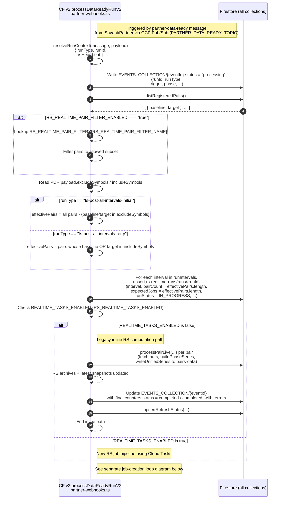
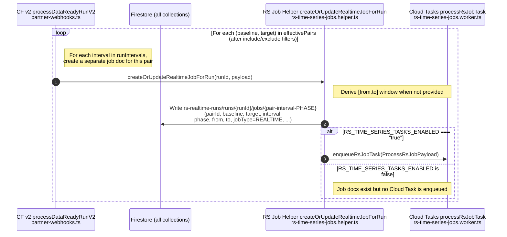

# RS PDR → RS Realtime Jobs → Cloud Tasks → Firestore

This document shows, in sequence-diagram form, how a partner **`partner-data-ready` (PDR)** message flows through the system into **RS realtime jobs**, Cloud Tasks workers, and Firestore writes.

- **Phase 1**: Outer flow inside `processDataReadyRunV2` – from Pub/Sub trigger through run metadata and **legacy inline vs new Cloud Tasks execution mode** selection.
- **Phase 1b**: For the **new Cloud Tasks mode**, creates per-pair RS job docs under `rs-realtime-runs/runs/{runId}/jobs/{...}` and (optionally) enqueues Cloud Tasks.
- **Phase 2**: For the **new Cloud Tasks mode**, Cloud Tasks worker consumes those RS job docs, runs `processRsJobInternal`, and writes RS outputs / run aggregates.

The PDR message payload may include **`excludeSymbols`** and **`includeSymbols`** lists. In **Phase 1, step 6**, `processDataReadyRunV2` reads these lists from the payload and uses them to compute `effectivePairs`, which directly controls **which RS jobs (and job docs) are created** in the later steps.

Phase 1 shows the **outer flow inside `processDataReadyRunV2`** (steps 1–9), from Pub/Sub trigger through run metadata and **inline vs Cloud Tasks execution mode** selection.



Phase 1b zooms in on **step 9 inside `processDataReadyRunV2`** – the per-pair job creation + enqueue loop handled by `createOrUpdateRealtimeJobForRun`, iterating over the
`effectivePairs` computed in **step 6** from the PDR payload's include/exclude symbol lists.



Phase 2 picks up from the **Cloud Tasks dispatch** (step 10 calling `processRsJobTask`) and shows the **internal flow of `processRsJobInternal`** (steps 11–37) as it processes a single RS job and updates Firestore.

```mermaid
%%{init: {'themeVariables': { 'fontSize': '18px' }}}%%
sequenceDiagram
  autonumber

  %%=== Actors (Phase 2: Cloud Tasks → RS worker → Firestore) ===
  participant Tasks as Cloud Tasks processRsJobTask<br/>rs-time-series-jobs.worker.ts
  participant Worker as RS Worker processRsJobInternal<br/>rs-time-series-jobs.worker.ts
  participant FS as Firestore (all collections)

  %%=== 10. Cloud Tasks dispatches RS jobs ===
  Tasks->>Worker: processRsJobTask(payload)
  Note right of Worker: payload = ProcessRsJobPayload<br/>{ jobType=REALTIME, runId, pairId,<br/>  baseline, target, interval, phase, from, to }
  Worker->>Worker: processRsJobInternal(payload)

  %%=== 11. Resolve job doc and transition to IN_PROGRESS ===
  Worker->>FS: Read rs-realtime-runs/runs/{runId}/jobs/{pair-interval-PHASE}
  alt Job doc missing
    Worker-->>Tasks: Log warning and return<br/>(no compute)
  else Job doc exists
    Worker->>FS: Merge update on job doc<br/>status=IN_PROGRESS, attempts += 1,<br/>  lastAttemptAt=serverTimestamp, updatedAt=serverTimestamp
  end

  %%=== 12. Perform RS computation for the pair/interval ===
  Worker->>Worker: runRsPairIntervalJob(payload)
  Note right of Worker: Normalize [from,to] window<br/>and compute RS series

  alt interval == DAILY
    Worker->>FS: fetchDailyBarsRange(baseline,<br/>{ from: paddedFrom, to, interval: DAILY })
    Worker->>FS: fetchDailyBarsRange(target,<br/>{ from: paddedFrom, to, interval: DAILY })

    Worker->>Worker: buildPhaseSeries(baseDaily, targetDaily, phase)
    Worker->>Worker: Filter series to lower <= day <= upper

    alt series is empty
      Worker-->>Worker: Log runRsPairIntervalJob_daily_no_series
      Worker-->>Worker: Return without writes
    else series has points
      Worker->>FS: writeUnifiedSeries(baseline, target, phase, series,<br/>  baseDaily, targetDaily, DAILY) into pairs-data archives
    end
  else interval == WEEKLY
    Worker->>FS: fetchDailyBarsRange(baseline,<br/>{ from: paddedFrom, to, interval: WEEKLY })
    Worker->>FS: fetchDailyBarsRange(target,<br/>{ from: paddedFrom, to, interval: WEEKLY })

    Worker->>Worker: buildPhaseSeries(baseWeekly, targetWeekly, phase)
    Worker->>Worker: Filter weeklySeries to lower <= day <= upper

    alt weeklySeries is empty
      Worker-->>Worker: Log runRsPairIntervalJob_weekly_no_series
      Worker-->>Worker: Return without writes
    else weeklySeries has points
      Worker->>FS: Purge and rewrite WEEKLY pairs-data archives<br/>  for this window
      Worker->>FS: writeUnifiedSeries(..., WEEKLY, windowToDay)
    end
  else interval == MONTHLY
    Worker->>FS: fetchDailyBarsRange(baseline,<br/>{ from: paddedFrom, to, interval: MONTHLY })
    Worker->>FS: fetchDailyBarsRange(target,<br/>{ from: paddedFrom, to, interval: MONTHLY })

    Worker->>Worker: buildPhaseSeries(baseMonthly, targetMonthly, phase)
    Worker->>Worker: Filter monthlySeries to lower <= day <= upper

    alt monthlySeries is empty
      Worker-->>Worker: Log runRsPairIntervalJob_monthly_no_series
      Worker-->>Worker: Return without writes
    else monthlySeries has points
      Worker->>FS: Purge and rewrite MONTHLY pairs-data archives<br/>  for this window
      Worker->>FS: writeUnifiedSeries(..., MONTHLY, windowToDay)
    end
  else Unsupported interval
    Worker-->>Worker: Log runRsPairIntervalJob_unsupported_interval
  end

  %%=== 13. Finalize job status (SUCCESS or PERMANENT_FAILURE) ===
  alt RS computation + writes succeeded
    Worker->>FS: Merge job doc update<br/>status=SUCCESS, updatedAt=serverTimestamp
  else Error thrown in runRsPairIntervalJob
    Worker->>FS: Merge job doc update<br/>status=PERMANENT_FAILURE, lastError=message,<br/>  updatedAt=serverTimestamp
  end

  %%=== 14. Update aggregate run counters for this runId ===
  alt jobType == REALTIME
    Worker->>FS: Update rs-realtime-runs/runs/{runId} counters<br/>(successJobs/permanentFailureJobs,<br/>  permanentFailurePairs)

    Worker->>FS: Read latest rs-realtime-runs/runs/{runId}
    alt run complete based on expectedJobs
      Worker->>FS: Update rs-realtime-runs/runs/{runId}<br/>runStatus = COMPLETE/PARTIAL/FAILED,<br/>  runCompletedAt, totalDuration

      %% Mirror summary back to partner-events
      Worker->>FS: Update EVENTS_COLLECTION/{runId} with<br/>runStatus and job counters
    else Run not yet complete
      Worker-->>Worker: No-op for completion
    end
  else jobType == BACKFILL
    Worker->>FS: Update rs-backfill-runs/runs/{runId} counters<br/>(successJobs/permanentFailureJobs)
  end

  %%=== 15. Worker completes task execution ===
  Worker-->>Tasks: Return (Cloud Task considered successfully handled)
  Note right of Tasks: Cloud Tasks may retry only when the worker throws
