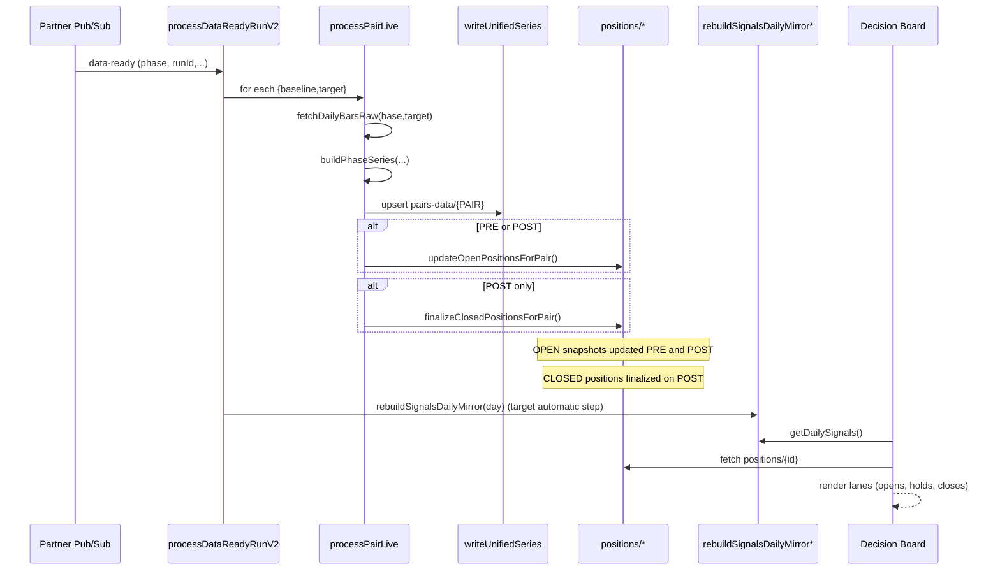

# RS> **Transition Note (Multi-Interval RS & unified ingestion):** This document was originally authored for a **daily-only RS model** and describes a **symbol-driven** ingestion pipeline wired to `partner-data-ready` / `partner-symbols-ready`. Multi-interval RS support and a **unified, run-driven ingestion engine** triggered by the universe-ready `partner-data-ready` v1 message (attributes `runType = "ts-post-all-intervals"`, `phase = "post"`) are now the target/current design; see `docs/planning/MULTI_INTERVAL_RS_TRANSITION.md`, `docs/planning/UNIFIED_INGESTION_ENGINE.md`, and `docs/partner/rs-partner-integration.md` for the up-to-date contracts. This file should be treated as **legacy background** for the symbol-driven design and daily-only assumptions. In the current deployment, the symbol-driven subscriber for `partner-symbols-ready` (`processSymbolsReady`) is **not exported** from `functions/src/index.ts` and the `.env` flag `USE_SYMBOL_DRIVEN_PIPELINE` is set to `false`, so only the pair-centric, `partner-data-ready` driven path is active. To intentionally re-enable the symbol-driven pipeline, uncomment the `processSymbolsReady` exports in `functions/src/index.ts` and set `USE_SYMBOL_DRIVEN_PIPELINE=true` in `functions/.env.rel-str` before redeploying.

# RS Data Flow and Function Grouping (High-Level)

## Overview
- Trigger (legacy): Partner publishes "data-ready" to Pub/Sub.
- Orchestrator (legacy): `processDataReadyRunV2` consumes the event, iterates registered pairs, fetches bars, computes RS, and writes per-pair archives/latest for PRE and POST phases.
- Canonical engine & activity:
  - **Live/POST:** `processPairLive` computes DAILY/WEEKLY/MONTHLY RS from Savant time series, writes archives and latest mirrors via `writeUnifiedSeries`, then runs the canonical RS engine (`runCanonicalRsEngineForPair`) to produce multi-interval canonical signals, positions, and `signals-activity` docs.
  - **Admin/backfill:** `RS_ARCHIVE_BACKFILL.md` and `RS_BACKFILL_SIGNALS.md` describe archive repair and signals/positions backfill flows that share the same canonical engine and writer helpers.

## Backend: Automatic Pipeline (Real-time) – Legacy Symbol-Driven Path
- File: `functions/src/webhooks/partner-webhooks.ts` (legacy symbol-driven orchestrator)
  - `processDataReadyRunV2` (Pub/Sub subscriber; **legacy**)
    - Input: message attributes/payload (`phase`, `runType`, `runId`, `trigger`, `heartbeat`).
    - Steps: mark event → load pairs → for each pair run `processPairLive` → write summary.
  - `processPairLive` (worker used by both legacy pipeline and admin utilities)
    - Fetch:
      - DAILY bars via `fetchDailyBarsRange(baseline|target, { from, to, interval: FIXED_INTERVAL })`.
      - WEEKLY/MONTHLY bars via `fetchDailyBarsRange(..., interval: Interval.WEEKLY|Interval.MONTHLY)`.
    - Compute: `buildPhaseSeries(baseBars, targetBars, phase, baseline, target, logger)` for each interval (PRE uses intraday fields, POST uses EOD fields).
    - Persist: `writeUnifiedSeries(baseline, target, phase, series, baseBars, targetBars, interval)` writes RS into per-interval archives (`archive-YYYY`, `archive-weekly-YYYY`, `archive-monthly-YYYY`) and latest mirrors on `pairs-data/{PAIR}`.
    - POST canonical engine:
      - Calls `runCanonicalRsEngineForPair(pairId, baseline, target, logger, series, thresholds)` which (when enabled):
        - Loads archive RS samples (DAILY/WEEKLY/MONTHLY).
        - Runs `rs-signals-engine.detectRsEvents(samples, thresholds)` per interval to get OPEN/CLOSE events.
        - Builds `RsWriteEvent[]` and calls `rs-events-consumer.applyRsEventsForPair(writes)` to write canonical signals (`pairs-data/{PAIR}/signals/*`) and root positions/timelines (`positions/{open|YYYY-closed}/items/{positionId}`).
        - Uses `generateActivityFromWrites` to derive multi-interval `ActivityEvent[]` from the same writes + RS samples.
      - Writes Signals Activity via `upsertSignalsActivityForPair` and `upsertSignalsActivityRoot` for the latest day.
    - PRE & POST position updates:
      - Calls `positions-manager.updateOpenPositionsForPair(pairId, latestDay, latestTargetClose, latestRsRaw)` to update `positions/open/items/*` snapshot fields (`currentPrice`, `currentChange`, `currentPctChange`, `currentRs`, `lastUpdateDay`).
      - Calls `positions-manager.appendOpenPositionsTimelineForPair(pairId, latestDay, latestTargetClose, rsRaw, rsNorm, prevRsRaw, prevRsNorm, source)` to append `PriceDatum` updates into each open position’s `updates[]` timeline with `source: PRE` (PRE phase) or `source: POST` (POST phase).
  - Helpers: `forEachWithConcurrency`, `resolveRunContext`.

- File: `functions/src/webhooks/pairs-writer.ts`
  - `writeUnifiedSeries`
    - Writes `pairs-data/{BASELINE}-{TARGET}` with:
      - `meta { baseline, symbol, interval, window }`
      - `lastUpdatedAt`
      - `latest { day, pre?{}, post?{} }`
      - `data[] { day, dow, pre?{}, post?{} }`

- File: `functions/src/webhooks/rs-series.ts`
  - `buildPhaseSeries`, `computeRsSeries`
    - Builds RS time series for a given phase (PRE/POST) from baseline/target bars.
    - Applies windowing, computes RS values per day, marks meta needed by writer.

- File: `functions/src/webhooks/symbol-fetch.ts`
  - `fetchDailyBarsRaw`, `fetchDailyBarsRange` (range used by admin tasks)
    - Wraps partner API/market data retrieval with retries and fixed constraints.
    - Provides bounded ranges for backfills and live runs.

- File: `functions/src/webhooks/partner-events.ts`
  - `computeEventDocId`, `formatPtSegment`, `toKebabRunType`, `markProcessing`
    - Normalizes Pub/Sub event metadata, composes per-run IDs, and tracks lifecycle in Firestore for idempotency and observability.

- File: `functions/src/webhooks/registry.ts`
  - `listRegisteredPairs`
  
- File: `functions/src/webhooks/rs-signal-detector.ts`
  - `detectDailySignalsForPairDay(rsYesterday, rsToday, thresholds)`
    - Pure helper that decides, for a single day step, whether RS crossed thresholds to trigger an OPEN and/or CLOSE, and in which direction.

- File: `functions/src/webhooks/rs-signals-engine.ts`
  - `detectRsEvents(samples, thresholds)`
    - Walks ordered RS samples with a small FSM and emits logical OPEN / HOLD / CLOSE events over time.

- File: `functions/src/webhooks/rs-events-consumer.ts`
  - `applyRsEventsForPair(events)`
    - Consumes OPEN/CLOSE events and performs Firestore writes for canonical signals (`pairs-data/{PAIR}/signals`) and root positions/timelines (`positions/{open|YYYY-closed}/items/{positionId}`).
    - Source of truth for which pairs are active; feeds `processDataReadyRunV2` and admin recomputes.

### Canonical Engine Kill Switch (DISABLE_SIGNALS_ACTIVITY_POSITIONS)

- File: `functions/src/webhooks/webhooks-config.ts`
  - Defines `DISABLE_SIGNALS_ACTIVITY_POSITIONS` from the environment:
    - `DISABLE_SIGNALS_ACTIVITY_POSITIONS = String(process.env.DISABLE_SIGNALS_ACTIVITY_POSITIONS || '').toLowerCase() === 'true'`.
- File: `functions/src/webhooks/rs-canonical-engine.ts`
  - `runCanonicalRsEngineForPair(...)` begins with:
    - If `DISABLE_SIGNALS_ACTIVITY_POSITIONS === true`, log `runCanonicalRsEngineForPair_disabled` and return `{ writes: [], activity: [] }` immediately.
    - Otherwise, run the full engine as described above.
- Effect when the flag is **true**:
  - Realtime (`processDataReadyRunV2` / `processPairLive`) and admin/backfill callers still run `writeUnifiedSeries` and update archive / latest RS data.
  - The canonical engine produces no writes/activity, so:
    - No new canonical `signals` docs are written.
    - No new `signals-activity` docs are written (per-pair or root).
    - No new positions or timeline updates are created from RS events.
- How to set the flag:
  - **Local/emulator:** add `DISABLE_SIGNALS_ACTIVITY_POSITIONS=true` to `functions/.env.rel-str` and restart the emulators.
  - **Deployed functions (prod/stage):** set `DISABLE_SIGNALS_ACTIVITY_POSITIONS=true` in the Cloud Functions / Cloud Run service env for project `rel-str`, then redeploy.

## Backend: Admin/Backfill Utilities (Manual)
- File: `functions/src/webhooks/admin-tasks.ts`
  - `recomputePairsRs` (callable): manual recompute for specific pairs/phases.
  - `recomputeRegisteredLive` (callable): manual recompute across registry.
  - `recomputeRegisteredBackfill` (HTTP, legacy): backfill ranges; token-protected. Historical admin backfill endpoint retained for compatibility and emulator flows; superseded for new RS archive backfill work by `recomputeRsBackfillAdmin`.
  - `diagnosePairDays` (callable): diagnose/optionally repair missing per-pair days.
  - `diagnosePairDaysAdmin` (HTTP): token-protected wrapper.
  - `purgePairsDataSignalsAdmin` (HTTP): deletes per-pair `signals/` subcollections and also removes any remaining legacy signal mirror docs if present.

- RS-native backfill admin entrypoint: `recomputeRsBackfillAdmin` in `functions/src/rs/time-series/rs-backfill-admin.ts` (see `RS_ARCHIVE_BACKFILL.md §10`).

References for deeper context:
- See `docs/planning/RS_SIGNAL_HISTORY.md` for aggregation details and mirror semantics.
- See `docs/planning/3_BACKEND.md` for backend architecture and function responsibilities.
- See `docs/planning/5_DATABASE_SCHEMA.md` for collection shapes and field definitions.
- See `docs/planning/7_DEV_OPS.md` for deployment/runtime considerations (service accounts, regions).

- File: `functions/src/webhooks/registry-actions.ts`
  - `validateAndRegisterPairs`, `unregisterPairs`, `seedPairRegistryManual`.
    - Validates symbols and writes membership docs in `pair-registry/{BASELINE}-{TARGET}`.
    - Updates reference counts/metadata for pairs; removal path cleans or deactivates registry entries.
    - Seeding writes new registry entries and initial metadata for onboarding.

## RsSignalHistory: Aggregation & UI Feed
- File: `functions/src/rs-signal-history.callables.ts`
  - `GetPairSignals*`, `GetPositionWithActuals`, `GetPnLSummary`, `UpdatePositionActuals` provide read/overlay flows over the canonical signals and positions.
  - Signals Activity mirrors provide the multi-interval activity/feed surface:
    - Per-pair: `pairs-data/{PAIR}/signals-activity/{YYYY}/days/{YYYY-MM-DD}`.
    - Root: `signals-activity/{YYYY}/days/{YYYY-MM-DD}`.

## Firestore Touchpoints
- `partner-events/{id}`: run status/metrics.
- `pair-registry/{BASELINE}-{TARGET}`: registry membership.
- `pairs-data/{PAIR}`: RS unified series and latest.
- `pairs-data/{PAIR}/signals/{YYYY}/opens|closes/{signalId}`: canonical OPEN/CLOSE signal docs.
- `positions/{open|YYYY-closed}/items/{positionId}`: authoritative position snapshots and timelines (`BePositionDoc`).
  - OPEN: positions currently open under `positions/open/items/*`.
  - CLOSED: immutable historical positions under `positions/{YYYY}-closed/items/*` with `exit`, `netPnL`, and `netPercentReturn`.
- `rs-warnings/*`: warning events.
- `/pairs-data/{PAIR}/archive-{YYYY}/{YYMMDD}`: archival shards for RS history (e.g., `/pairs-data/QQQ-AAPL/archive-2025/250108`).

### Firestore Write Map (who writes where)
- `partner-events/{id}`: written by `partner-events.markProcessing` lifecycle calls in `processDataReadyRunV2`.
- `pairs-data/{PAIR}`: written by `pairs-writer.writeUnifiedSeries` during `processPairLive`.
- `positions/{open|YYYY-closed}/items/{positionId}`:
  - OPEN: written by `updateOpenPositionsForPair` (PRE and POST) with `currentPrice/currentChange/currentPctChange`.
- `positions/{positionId}`:
  - OPEN/HOLD: written by `updateOpenPositionsForPair` (PRE and POST) with `currentPrice/currentChange/currentPctChange`.
  - CLOSED: written by `finalizeClosedPositionsForPair` (POST) with `exitPrice`, `exitDay/exitIso`, `netPnL`, `percentReturn`, `status: closed`.
- `pairs-data/{PAIR}/signals/{positionId}`: written by the RS signal generation pipeline when opens/closes occur for a pair (during series persistence path).
- `/pairs-data/{PAIR}/archive-{YYYY}/{YYMMDD}`: written by the persistence path when archiving per-day RS slices.
- `rs-warnings/*`: written by `logging/warn.persistWarning` from various stages on best-effort basis.
- `pair-registry/{BASELINE}-{TARGET}`: written by `registry-actions` functions on register/unregister/seed.

## Function Index by File
- partner-webhooks.ts
  - `processDataReadyRunV2`, `processPairLive`, `forEachWithConcurrency`, `resolveRunContext`
- positions-manager.ts
  - `updateOpenPositionsForPair`, `upsertDailyHoldsForPair`, `finalizeClosedPositionsForPair`,
  - `writePairSignalOpen`, `finalizePairSignalClose`, `upsertRootPositionOpen`, `finalizeRootPositionClose`,
  - `upsertPairSignalsDaily`, `upsertRootSignalsDaily`, `deleteRootSignalsDaily`, `upsertPairSignalDoc`
- pairs-writer.ts
  - `writeUnifiedSeries`
- rs-series.ts
  - `buildPhaseSeries`, `computeRsSeries`
- symbol-fetch.ts
  - `fetchDailyBarsRaw`, `fetchDailyBarsRange`, `fetchAllSymbols`
- registry.ts
  - `listRegisteredPairs`
- registry-actions.ts
  - `validateAndRegisterPairs`, `unregisterPairs`, `seedPairRegistryManual`
- admin-tasks.ts
  - `recomputePairsRs`, `recomputeRegisteredLive`, `recomputeRegisteredBackfill`, `diagnosePairDays`, `diagnosePairDaysAdmin`
- rs-signal-history.callables.ts
  - `getDailySignals`, `rebuildSignalsDailyMirror*`, `getPairSignals*`, `getPositionWithActuals`, `getPnLSummary`, `updatePositionActuals`, `cleanPairDailyPnL`
- archive.ts
  - `getPairRSArchive`, `selectRsForDay`

## Sequence (Mermaid)

Static render (PNG):

### How to view the Mermaid diagram
- In VS Code: open this file and use "Open Preview to the Side". Ensure the built-in Markdown preview supports Mermaid (VS Code 1.93+), or install a Mermaid Markdown preview extension if needed.
- Web: copy the Mermaid block to https://mermaid.live to render interactively.

## Notes
- Only `processDataReadyRunV2` runs automatically on partner events; admin tasks are manual. Root mirror rebuild is intended to be invoked automatically from this path.
- Positions are backend-authoritative for both OPEN snapshots and CLOSED exits:
  - OPEN/HOLD: backend writes `currentPrice/currentChange/currentPctChange`.
  - CLOSED: backend writes `exitPrice/netPnL/percentReturn` at close finalization.
- Admin purge also removes legacy per-pair `signalsDaily/` collections to keep schema consistent.
- **Partner Data Handling**: We strictly use the split-adjusted close value (`c`) from the partner time series API. This ensures that our price series are continuous and free from gaps caused by stock splits, which is critical for accurate Relative Strength calculations and technical analysis.

## Appendix: Data Normalization & Split Handling Strategy

### A.1 Core Principle: Split-Adjusted Continuity
We strictly adhere to using the **split-adjusted** close price (`c`) provided by the Partner Time Series API. This ensures that our price series are continuous and free from gaps caused by stock splits, which is critical for accurate Relative Strength calculations and technical analysis.

### A.2 Implementation Details
- **Ingestion:** We explicitly request split-adjusted data (e.g., `adjusted=true`) from the partner API.
- **Normalization:** The `normalizePartnerDailyBar` function maps the partner's split-adjusted `c` field directly to our internal `close` field.
- **Ignored Field (`ac`):** The `ac` (Adjusted Close) field is intentionally ignored. This field includes adjustments for **dividends** (Total Return) in addition to splits. Since the partner API does not provide corresponding dividend-adjusted Open/High/Low values, using `ac` would distort candlestick shapes.
- **Visualizations:** Charts render the split-adjusted `c` values, ensuring smooth long-term trends without split gaps while maintaining correct candlestick proportions.

### A.3 Handling of Corporate Actions
- **Stock Splits:** The `c` field is back-adjusted for splits by the provider. Therefore, there are **no price gaps** due to splits in our time series.
- **Dividends:** The `c` field is **not** adjusted for dividends. This preserves the "technical" price action, where the stock price naturally drops on the ex-dividend date. This is the desired behavior for technical analysis and signal generation.
