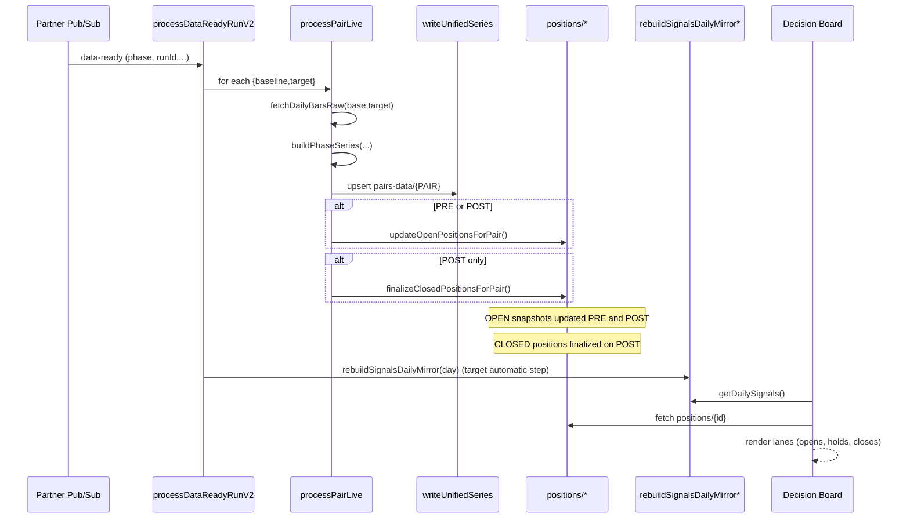

# RS Data Flow and Function Grouping (High-Level)

## Overview
- Trigger: Partner publishes "data-ready" to Pub/Sub.
- Orchestrator: `processDataReadyRunV2` consumes event, iterates registered pairs, fetches bars, computes RS, writes per-pair data, and updates open positions' snapshots on PRE and POST phases (target state; currently implemented on POST only).
- Aggregation:
  - **Live/POST:** `processPairLive` performs a best-effort same-day rebuild of the root mirror `signals-daily/{YYYY}/days/{YYYY-MM-DD}` for `latestDay` via `rebuildSignalsDailyMirrorImpl`, scoped to the processed pair.
  - **Admin/backfill:** `rs-signal-history.backfill.ts`, `rs-signal-history.callables.ts`, and `admin-tasks.ts` provide range-based rebuild/repair utilities (e.g., `rebuildSignalsDailyMirror*`, `cleanPairDailyPnL`, composed flows).

## Backend: Automatic Pipeline (Real-time)
- File: `functions/src/webhooks/partner-webhooks.ts`
  - `processDataReadyRunV2` (Pub/Sub subscriber)
    - Input: message attributes/payload (`phase`, `runType`, `runId`, `trigger`, `heartbeat`).
    - Steps: mark event → load pairs → for each pair run `processPairLive` → write summary.
  - `processPairLive`
    - Fetch: `fetchDailyBarsRaw(baseline|target, days, limit)`.
    - Compute: `buildPhaseSeries(baseBars, targetBars, phase, baseline, target)`.
    - Persist: `writeUnifiedSeries(baseline, target, phase, series, baseBars, targetBars)`.
    - PRE & POST: calls `positions-manager.updateOpenPositionsForPair(pairId, latestDay, latestTargetClose)` to update `positions/open/items/*` snapshot fields (`currentPrice`, `currentChange`, `currentPctChange`).
    - POST: calls `positions-manager.finalizeClosedPositionsForPair(pairId, latestDay)` to persist close data into per-pair signals and root positions (`exitPrice`, `exitDay`, `exitIso`, `netPnL`, `percentReturn`, and `status: closed`).
  - Helpers: `forEachWithConcurrency`, `resolveRunContext`.

- File: `functions/src/webhooks/pairs-writer.ts`
  - `writeUnifiedSeries`
    - Writes `pairs-data/{BASELINE}-{TARGET}` with:
      - `meta { baseline, symbol, interval, window }`
      - `lastUpdatedAt`
      - `latest { day, pre?{}, post?{} }`
      - `data[] { day, dow, pre?{}, post?{} }`

- File: `functions/src/webhooks/rs-series.ts`
  - `buildPhaseSeries`, `computeRsSeries`
    - Builds RS time series for a given phase (PRE/POST) from baseline/target bars.
    - Applies windowing, computes RS values per day, marks meta needed by writer.

- File: `functions/src/webhooks/symbol-fetch.ts`
  - `fetchDailyBarsRaw`, `fetchDailyBarsRange` (range used by admin tasks)
    - Wraps partner API/market data retrieval with retries and fixed constraints.
    - Provides bounded ranges for backfills and live runs.

- File: `functions/src/webhooks/partner-events.ts`
  - `computeEventDocId`, `formatPtSegment`, `toKebabRunType`, `markProcessing`
    - Normalizes Pub/Sub event metadata, composes per-run IDs, and tracks lifecycle in Firestore for idempotency and observability.

- File: `functions/src/webhooks/registry.ts`
  - `listRegisteredPairs`
    - Source of truth for which pairs are active; feeds `processDataReadyRunV2` and admin recomputes.

## Backend: Admin/Backfill Utilities (Manual)
- File: `functions/src/webhooks/admin-tasks.ts`
  - `recomputePairsRs` (callable): manual recompute for specific pairs/phases.
  - `recomputeRegisteredLive` (callable): manual recompute across registry.
  - `recomputeRegisteredBackfill` (HTTP): backfill ranges; token-protected. Invokes series writes, open-position snapshots, POST close finalization, and optionally mirror rebuild for a range.
  - `diagnosePairDays` (callable): diagnose/optionally repair missing per-pair days.
  - `diagnosePairDaysAdmin` (HTTP): token-protected wrapper.
  - `purgePairsDataSignalsAdmin` (HTTP): deletes per-pair `signals/` and `signals-daily/` subcollections, and also removes legacy `signalsDaily/` if present.

References for deeper context:
- See `docs/planning/RS_SIGNAL_HISTORY.md` for aggregation details and mirror semantics.
- See `docs/planning/3_BACKEND.md` for backend architecture and function responsibilities.
- See `docs/planning/5_DATABASE_SCHEMA.md` for collection shapes and field definitions.
- See `docs/planning/7_DEV_OPS.md` for deployment/runtime considerations (service accounts, regions).

- File: `functions/src/webhooks/registry-actions.ts`
  - `validateAndRegisterPairs`, `unregisterPairs`, `seedPairRegistryManual`.
    - Validates symbols and writes membership docs in `pair-registry/{BASELINE}-{TARGET}`.
    - Updates reference counts/metadata for pairs; removal path cleans or deactivates registry entries.
    - Seeding writes new registry entries and initial metadata for onboarding.

## RsSignalHistory: Aggregation & UI Feed
- File: `functions/src/rs-signal-history.callables.ts`
  - `rebuildSignalsDailyMirror` / `rebuildSignalsDailyMirrorRange`
    - Read per-pair `pairs-data/{PAIR}/signals-daily/{YYYY}/days/{YYYY-MM-DD}`.
    - Write root mirror `signals-daily/{YYYY}/days/{YYYY-MM-DD}` with `{ newOpens, holds, newCloses }` (each entry includes `pair`).
  - `getDailySignals`
    - Reads the year-sharded root mirror `signals-daily/{YYYY}/days/{YYYY-MM-DD}` → payload for the Decision Board.
  - `getPairSignalsWithActuals`, `getPositionWithActuals`, `getPnLSummary`, `updatePositionActuals` (aux flows).

## Firestore Touchpoints
- `partner-events/{id}`: run status/metrics.
- `pair-registry/{BASELINE}-{TARGET}`: registry membership.
- `pairs-data/{PAIR}`: RS unified series and latest.
- `pairs-data/{PAIR}/signals/{YYYY}/opens|closes/{signalId}`: canonical OPEN/CLOSE signal docs.
- `pairs-data/{PAIR}/signals-daily/{YYYY}/days/{YYYY-MM-DD}`: per-pair daily events (`newOpens`, `holds`, `newCloses`).
- `signals-daily/{YYYY}/days/{YYYY-MM-DD}`: root daily mirror (Decision Board feed) aggregated across pairs.
- `positions/{open|YYYY-closed}/items/{positionId}`: authoritative position snapshots and timelines (`BePositionDoc`).
  - OPEN: positions currently open under `positions/open/items/*`.
  - CLOSED: immutable historical positions under `positions/{YYYY}-closed/items/*` with `exit`, `netPnL`, and `netPercentReturn`.
- `rs-warnings/*`: warning events.
- `/pairs-data/{PAIR}/archive-{YYYY}/{YYMMDD}`: archival shards for RS history (e.g., `/pairs-data/QQQ-AAPL/archive-2025/250108`).

### Firestore Write Map (who writes where)
- `partner-events/{id}`: written by `partner-events.markProcessing` lifecycle calls in `processDataReadyRunV2`.
- `pairs-data/{PAIR}`: written by `pairs-writer.writeUnifiedSeries` during `processPairLive`.
- `positions/{open|YYYY-closed}/items/{positionId}`:
  - OPEN: written by `updateOpenPositionsForPair` (PRE and POST) with `currentPrice/currentChange/currentPctChange`.
- `positions/{positionId}`:
  - OPEN/HOLD: written by `updateOpenPositionsForPair` (PRE and POST) with `currentPrice/currentChange/currentPctChange`.
  - CLOSED: written by `finalizeClosedPositionsForPair` (POST) with `exitPrice`, `exitDay/exitIso`, `netPnL`, `percentReturn`, `status: closed`.
- `pairs-data/{PAIR}/signals/{positionId}`: written by the RS signal generation pipeline when opens/closes occur for a pair (during series persistence path).
- `pairs-data/{PAIR}/signals-daily/{day}`: written during per-pair daily event generation within the series persistence path.
- `signals-daily/{day}`: written by `rs-signal-history.rebuildSignalsDailyMirror*` (admin today; orchestrator planned as automatic step).
- `/pairs-data/{PAIR}/archive-{YYYY}/{YYMMDD}`: written by the persistence path when archiving per-day RS slices.
- `rs-warnings/*`: written by `logging/warn.persistWarning` from various stages on best-effort basis.
- `pair-registry/{BASELINE}-{TARGET}`: written by `registry-actions` functions on register/unregister/seed.

## Frontend Consumption (Decision Board)
- Reads: `getDailySignals` callable → `{ day, items { newOpens, holds, newCloses } }`.
- For each item, loads/enriches positions from `positions/{id}`. Today, the UI may compute `currentChange/currentPctChange` for display if missing; the target state is to rely solely on backend-provided deltas to avoid duplication.
- Holds rely on backend `updateOpenPositionsForPair` updates on PRE and POST to keep `currentPrice`, `currentChange`, `currentPctChange` fresh.

## Function Index by File
- partner-webhooks.ts
  - `processDataReadyRunV2`, `processPairLive`, `forEachWithConcurrency`, `resolveRunContext`
- positions-manager.ts
  - `updateOpenPositionsForPair`, `upsertDailyHoldsForPair`, `finalizeClosedPositionsForPair`,
  - `writePairSignalOpen`, `finalizePairSignalClose`, `upsertRootPositionOpen`, `finalizeRootPositionClose`,
  - `upsertPairSignalsDaily`, `upsertRootSignalsDaily`, `deleteRootSignalsDaily`, `upsertPairSignalDoc`
- pairs-writer.ts
  - `writeUnifiedSeries`
- rs-series.ts
  - `buildPhaseSeries`, `computeRsSeries`
- symbol-fetch.ts
  - `fetchDailyBarsRaw`, `fetchDailyBarsRange`, `fetchAllSymbols`
- registry.ts
  - `listRegisteredPairs`
- registry-actions.ts
  - `validateAndRegisterPairs`, `unregisterPairs`, `seedPairRegistryManual`
- admin-tasks.ts
  - `recomputePairsRs`, `recomputeRegisteredLive`, `recomputeRegisteredBackfill`, `diagnosePairDays`, `diagnosePairDaysAdmin`
- rs-signal-history.callables.ts
  - `getDailySignals`, `rebuildSignalsDailyMirror*`, `getPairSignals*`, `getPositionWithActuals`, `getPnLSummary`, `updatePositionActuals`, `cleanPairDailyPnL`
- archive.ts
  - `getPairRSArchive`, `selectRsForDay`

## Sequence (Mermaid)

Static render (PNG):

### How to view the Mermaid diagram
- In VS Code: open this file and use "Open Preview to the Side". Ensure the built-in Markdown preview supports Mermaid (VS Code 1.93+), or install a Mermaid Markdown preview extension if needed.
- Web: copy the Mermaid block to https://mermaid.live to render interactively.

## Notes
- Only `processDataReadyRunV2` runs automatically on partner events; admin tasks are manual. Root mirror rebuild is intended to be invoked automatically from this path.
- Positions are backend-authoritative for both OPEN snapshots and CLOSED exits:
  - OPEN/HOLD: backend writes `currentPrice/currentChange/currentPctChange`.
  - CLOSED: backend writes `exitPrice/netPnL/percentReturn` at close finalization.
- Admin purge also removes legacy per-pair `signalsDaily/` collections to keep schema consistent.
