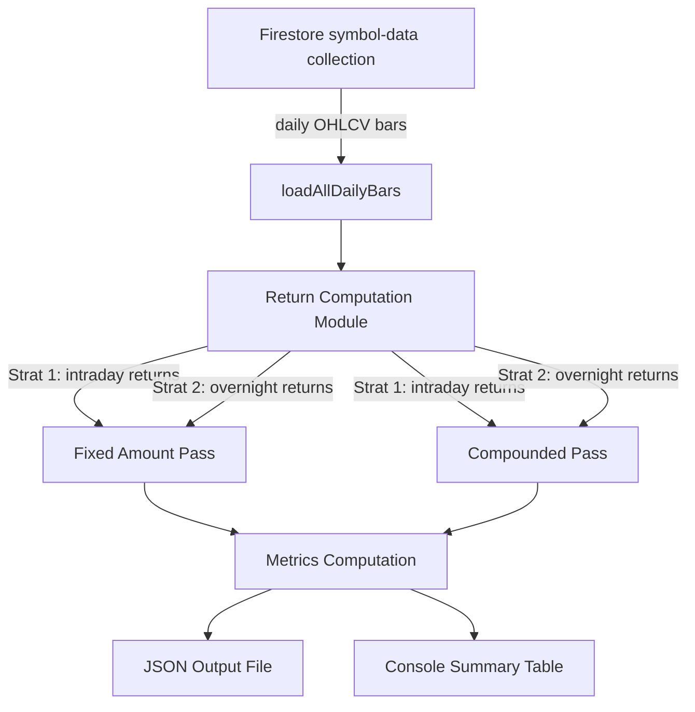

**Topic:** Trading Strategy Library
**Topic Slug:** strat-lib
**Thread:** Simple Open-Close Long
**Thread Slug:** simple-open-close-long
**Issue:** #254
**Thread Parent:** #253
**Topic Parent:** #106
**Domain:** STRAT-LIB
**Type:** PRD
**Status:** Complete
**Created:** 2026-09-09
**Last Updated:** 2026-09-09

---

## Problem Statement

A widely circulated claim asserts that buying at the close and selling at the next
day's open (overnight hold) is roughly 10x more profitable than buying at the open
and selling at the close (intraday hold). The user wants to verify this claim against
real historical data before deciding whether to productionize either strategy.

There is currently no way to compute or compare these two mechanical daily-return
strategies. The existing backtest simulator enters and exits at the close price only
and is built around the `StrategyAdapter` signal-detection contract — neither fits a
strategy that executes at the open price and has no indicator-based entry conditions.

## Solution

A standalone research script that loads historical daily OHLCV bars from Firestore for
SPY and QQQ, computes both strategies' daily returns, and outputs a side-by-side
comparison report with summary metrics and a daily return series.

The script runs locally via `npx tsx` and writes results to a JSON file plus a console
summary table. No UI, no Cloud Function, no Firestore writes — just a calculation over
cached data.

### Strategies

For each trading day, two returns are computed:

- **Strat 1 (Intraday):** `(close - open) / open` — return from the day's open to the
  day's close. Capital is deployed at the open and recovered at the close each day.
- **Strat 2 (Overnight):** `(open - yestClose) / yestClose` — return from the prior
  day's close to the current day's open. Capital is deployed at the close and recovered
  at the next day's open each day.

Both strategies produce one return per trading day, aligned by date, enabling a direct
comparison.

### Two Passes

1. **Fixed daily amount ($100k/day):** Each day, $100k is invested in the strategy.
   Daily P&L is summed. This shows the raw, undistorted edge without compounding effects.
2. **Compounded ($100k starting equity):** Each day, 100% of equity is deployed.
   `equity[i] = equity[i-1] * (1 + dailyReturn[i])`. This shows the real-world growth
   curve and total return percentage.

### System Context

## User Stories

1. As a researcher, I want to run a script that computes both open-close strategies
   against SPY historical data, so that I can see whether the overnight edge exists.

2. As a researcher, I want to run the same script against QQQ historical data, so that
   I can check whether the edge is instrument-specific or general.

3. As a researcher, I want both strategies computed in a single script run, so that I
   can compare them side-by-side without running separate commands.

4. As a researcher, I want the fixed-daily-amount pass first, so that I can see the raw
   P&L without compounding distortion.

5. As a researcher, I want the compounded pass second, so that I can see the real-world
   equity curve and total return percentage.

6. As a researcher, I want summary metrics for each strategy (total net profit, profit
   factor, percent profitable, win/loss ratio, average trade, max drawdown, Sharpe
   ratio), so that I can evaluate the risk-adjusted performance of each strategy.

7. As a researcher, I want every day's results persisted to a file — for each symbol
   and each strategy, the date, open price, close price, prior close, intraday return,
   overnight return, fixed-amount daily P&L, and compounded equity — so that I can
   analyze the day-by-day detail, not just aggregates.

8. As a researcher, I want a console summary table comparing Strat 1 vs Strat 2 for each
   instrument, so that I can quickly see the headline numbers without opening a file.

9. As a researcher, I want the script to use all available cached data for each symbol,
   so that the analysis covers the widest possible time range.

10. As a researcher, I want days with missing or zero open/close prices skipped, so that
    the calculation is not corrupted by bad data.

11. As a researcher, I want the script to report how many days were skipped and why, so
    that I can assess data quality.

12. As a researcher, I want the script to print the date range and bar count for each
    symbol, so that I know what time period the analysis covers.

13. As a researcher, I want the gross return ratio (Strat 2 total / Strat 1 total)
    printed in the summary, so that I can directly verify the "10x more profitable" claim.

14. As a researcher, I want the script to accept a `--symbol` flag to override the
    default instruments, so that I can test additional symbols without code changes.

15. As a researcher, I want the calculation logic extracted into a pure module separate
    from the script runner, so that the return computation can be unit-tested with
    synthetic data.

## Implementation Decisions

- **Script location:** `functions/scripts/open-close-strategy-comparison.ts`, following
  the existing script pattern (`backtest-qqq-underlying.ts`, `replay-missing-symbols.ts`).
  Run via `npx tsx scripts/open-close-strategy-comparison.ts` from the `functions/`
  directory.

- **Data loading:** Reuse `loadAllDailyBars(symbol)` from
  `functions/src/st-cloud-function/backtest/backtest-data-loader.ts`. This reads
  year-sharded daily bars from Firestore `symbol-data/{symbol}/daily/{YYYY}` and returns
  sorted, de-duplicated `OHLCV[]`.

- **Return computation module:** Extract the daily return calculation into a pure module
  (`functions/src/st-cloud-function/backtest/open-close-returns.ts`)
  that takes `OHLCV[]` as input and returns typed result objects. This keeps the
  calculation testable independent of Firestore and the script runner. Placed under
  `backtest/` rather than `strategies/` because this is not a `StrategyAdapter`
  implementation — it's a return calculation adjacent to the existing backtest code.
  If the research validates the edge, the module may later be wrapped or moved to
  support production deployment as a scheduled-execution strategy.

- **Return types:**
  - `OpenCloseDailyRecord`: `{ date, open, close, priorClose, intradayReturn,
    overnightReturn, intradayFixedPnl, overnightFixedPnl, intradayCompoundedEquity,
    overnightCompoundedEquity, skipped?, skipReason? }` — one record per trading day
    with both strategies' returns, fixed-amount P&L, and compounded equity.
  - `OpenCloseSymbolResult`: `{ symbol, dateRange, barCount, skippedCount,
    dailyRecords, intradayMetrics, overnightMetrics, intradayFixedTotalPnl,
    overnightFixedTotalPnl, intradayCompoundedFinalEquity,
    overnightCompoundedFinalEquity }` — aggregated result for one symbol.

- **Metrics:** Reuse the existing `BacktestMetrics` shape from
  `functions/src/st-cloud-function/backtest/backtest-types.ts` as the output type so
  results are comparable to existing backtest runs. However, do NOT reuse the
  `computeMetrics` function from `backtest-metrics.ts` — it takes `BacktestTrade[]`
  (full trade objects with entry/exit dates, marks, quantities, sides, etc.) which
  doesn't fit our return-based data. Instead, write a focused `computeReturnMetrics`
  function in the same module that takes `number[]` (daily P&L amounts) and
  `{ date, equity }[]` (equity curve) and computes the same `BacktestMetrics` shape
  directly. Each daily return is treated as one "trade" for metrics purposes
  (win = positive return, loss = negative return).

- **Fixed amount:** $100,000 per day. Daily P&L = `$100,000 * dailyReturn`. Total P&L =
  sum of daily P&L. The amount is a constant and does not compound.

- **Compounded pass:** Starting equity $100,000. Each day:
  `equity = equity * (1 + dailyReturn)`. Equity curve is one point per trading day.

- **Output file:** JSON written to `functions/scripts/output/open-close-comparison.json`.
  The file contains per-symbol results, and within each symbol a per-day record array with
  every trading day's detail for both strategies:
  - `date`, `open`, `close`, `priorClose`
  - `intradayReturn` (Strat 1), `overnightReturn` (Strat 2)
  - `intradayFixedPnl`, `overnightFixedPnl` (fixed $100k/day P&L)
  - `intradayCompoundedEquity`, `overnightCompoundedEquity` (running equity)
  - `skipped` (boolean) and `skipReason` (if applicable)

  Each symbol also carries aggregates: date range, bar count, skipped-day count, total
  fixed-amount P&L for each strategy, compounded final equity for each strategy, and
  `BacktestMetrics` for each strategy.

- **Console output:** Summary table with per-symbol, per-strategy metrics and the
  Strat 2 / Strat 1 return ratio.

- **Default symbols:** SPY and QQQ, both computed in a single run. `--symbol` flag
  overrides with a single symbol.

- **Missing data handling:** Skip any day where `open` or `close` is missing, zero, or
  not finite. For Strat 2 (overnight), skip any day where the prior day's close is
  missing. Track skipped count and reasons.

- **No StrategyAdapter integration:** This script does not register a strategy in
  `strategyRegistry` and does not use the backtest simulator. The return computation is
  independent. If the research validates the edge, production integration is a separate
  future decision.

- **No execution costs:** Gross returns only. No slippage, no fees, no bid-ask spread
  modeling. Fills assumed at exact open/close prices.

## Testing Decisions

- **Primary seam:** The return computation module
  (`open-close-returns.ts`) is a pure function: `OHLCV[] -> OpenCloseComparisonResult`.
  This is the highest-value seam because it encodes all the calculation logic and is
  fully deterministic given synthetic bars.

- **Test approach:** Unit tests with synthetic OHLCV bars covering:
  - Basic case: known open/close prices produce expected returns.
  - Strat 1 (intraday): positive return when close > open, negative when close < open.
  - Strat 2 (overnight): positive return when nextOpen > close, negative when nextOpen <
    close.
  - Missing data: days with zero/missing open or close are skipped, skipped count is
    accurate.
  - First day: Strat 2 has no prior close, so no overnight return for the first bar.
  - Fixed-amount pass: P&L sums correctly for known returns.
  - Compounded pass: equity curve compounds correctly for known returns.
  - Metrics: win/loss counts, profit factor, percent profitable match hand-computed
    values for a small synthetic dataset.

- **Prior art:** SDS tests (`tests/functions/sds-core.test.ts`) use `tsx --test` with
  synthetic inputs and assert on computed outputs. The return computation tests follow
  the same pattern.

- **What is NOT tested:** The script runner itself (Firestore connection, CLI parsing,
  file I/O) is integration-level and not unit-tested. The data loader is already covered
  by existing infrastructure.

## Out of Scope

- Production deployment as a live trading strategy.
- Integration with the `StrategyAdapter` contract or `strategyRegistry`.
- Integration with the existing backtest simulator or orchestrator.
- UI for triggering or viewing results.
- Execution cost modeling (slippage, fees, spread).
- Position sizing optimization or Kelly criterion analysis.
- Walk-forward optimization or parameter sweeps (no parameters to sweep).
- Market regime analysis or decade-by-decade breakdown (can be done later from the JSON
  output if results are interesting).
- Additional instruments beyond SPY and QQQ (can be added via `--symbol` flag but not
  the focus).

## Further Notes

- The "10x more profitable" claim is the central hypothesis being tested. The script
  prints the ratio of Strat 2 total return to Strat 1 total return for each instrument
  so the claim can be directly verified or refuted.

- If the research validates the edge, the production path would be a new
  scheduled-execution mechanism (buy at open / buy at close on a timer), not the
  signal-detection worker. That is a separate Topic/Thread decision.

- The existing `StrategyAdapter` contract and signal-detection pipeline are intentionally
  not used. This strategy has no indicators, no conditions, and no signal to review — it
  is mechanical time-based execution. Forcing it into the signal-detection framework would
  add complexity without value.

- The daily return series JSON output is deliberately persisted so that further analysis
  (regime breakdowns, correlation with VIX, drawdown periods, etc.) can be done later
  without re-running the computation.
