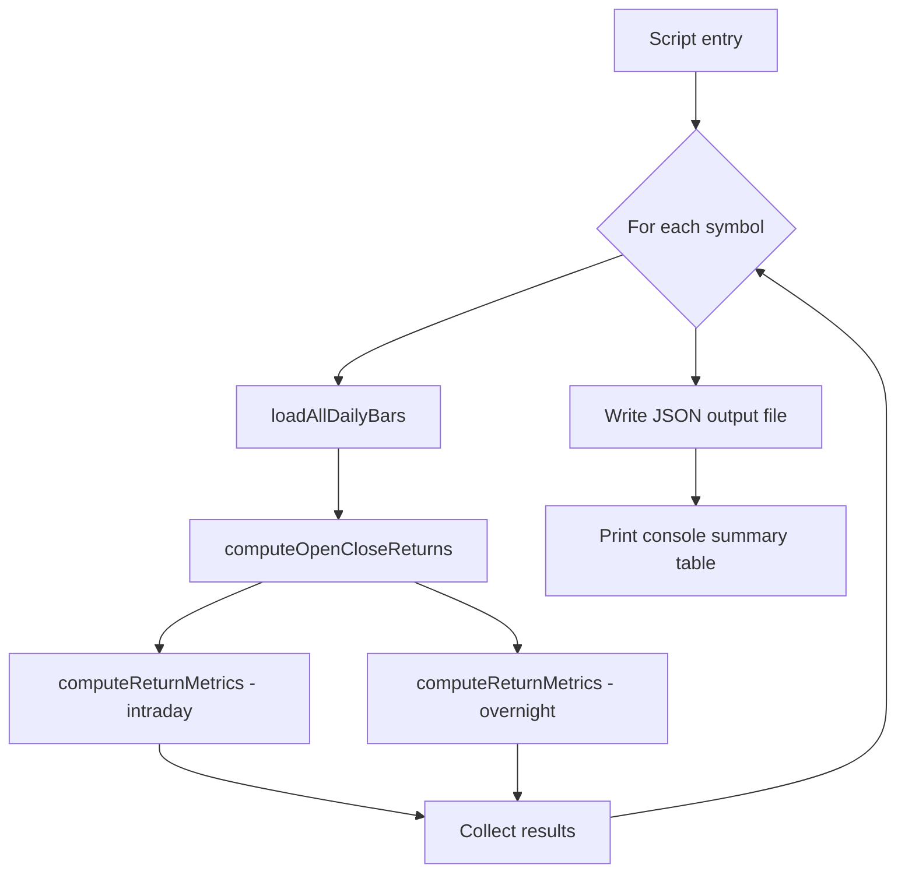

**Topic:** Trading Strategy Library
**Topic Slug:** strat-lib
**Thread:** Simple Open-Close Long
**Thread Slug:** simple-open-close-long
**Issue:** #255
**Thread Parent:** #253
**Topic Parent:** #106
**Domain:** STRAT-LIB
**Type:** Implementation Plan
**Status:** Complete
**Created:** 2026-09-09
**Last Updated:** 2026-09-09

---

## Overview

A standalone research script that compares two mechanical daily-return strategies
(intraday open-to-close vs overnight close-to-open) against SPY and QQQ historical
OHLCV data. BE-only — no FE, no SHARED.

## Areas

- **BE** — return computation module, metrics function, script runner, unit tests

## BE Implementation Plan

### Module: Return Computation

Location: `functions/src/st-cloud-function/backtest/open-close-returns.ts`

A pure module with no Firestore or I/O dependencies. Exports:

- **Types:**
  - `OpenCloseDailyRecord` — one record per trading day with both strategies' returns,
    fixed-amount P&L, compounded equity, and skip metadata.
  - `OpenCloseSymbolResult` — aggregated result for one symbol: date range, bar count,
    skipped count, daily records array, metrics for both strategies, fixed-amount totals,
    compounded final equity for both strategies.

- **`computeOpenCloseReturns(bars: OHLCV[], fixedAmount: number, initialEquity: number): OpenCloseSymbolResult`**
  - Iterates bars oldest to newest.
  - For each day `i` (starting from index 1, since Strat 2 needs prior close):
    - Strat 1 (intraday): `intradayReturn = (close - open) / open`
    - Strat 2 (overnight): `overnightReturn = (open - priorClose) / priorClose`
    - Fixed-amount P&L: `fixedAmount * return`
    - Compounded equity: `equity = equity * (1 + return)`
  - Skips days where open, close, or prior close is missing/zero/non-finite.
  - Tracks skipped count and reasons.
  - Calls `computeReturnMetrics` for each strategy.

- **`computeReturnMetrics(dailyPnl: number[], equityCurve: { date: string; equity: number }[], initialEquity: number): BacktestMetrics`**
  - Win/loss classification from `dailyPnl` (positive = win, negative = loss).
  - Gross profit, gross loss, profit factor, percent profitable, win/loss ratio.
  - Max drawdown from equity curve (peak-to-trough).
  - Sharpe ratio from daily returns derived from equity curve.
  - Calmar ratio from total return / max drawdown.
  - Returns the existing `BacktestMetrics` shape for comparability.

### Script Runner

Location: `functions/scripts/open-close-strategy-comparison.ts`

Follows the existing script pattern (`backtest-qqq-underlying.ts`):

- Parses CLI flags: `--symbol` (default: run both SPY and QQQ).
- For each symbol:
  - Calls `loadAllDailyBars(symbol)` from the backtest data loader.
  - Prints date range and bar count.
  - Calls `computeOpenCloseReturns(bars, 100_000, 100_000)`.
  - Collects results.
- Writes JSON output to `functions/scripts/output/open-close-comparison.json`.
- Prints console summary table: per-symbol, per-strategy metrics + Strat 2 / Strat 1
  return ratio.
- Requires Application Default Credentials for Firestore access.

### Output JSON Structure

```json
{
  "symbols": [
    {
      "symbol": "SPY",
      "dateRange": { "first": "2020-01-02", "last": "2026-09-08" },
      "barCount": 1680,
      "skippedCount": 3,
      "dailyRecords": [
        {
          "date": "2020-01-02",
          "open": 321.0,
          "close": 322.5,
          "priorClose": 320.5,
          "intradayReturn": 0.00467,
          "overnightReturn": 0.00156,
          "intradayFixedPnl": 467.0,
          "overnightFixedPnl": 156.0,
          "intradayCompoundedEquity": 100467.0,
          "overnightCompoundedEquity": 100156.0,
          "skipped": false
        }
      ],
      "intradayMetrics": { ... },
      "overnightMetrics": { ... },
      "intradayFixedTotalPnl": 12345.0,
      "overnightFixedTotalPnl": 98765.0,
      "intradayCompoundedFinalEquity": 112345.0,
      "overnightCompoundedFinalEquity": 543210.0
    }
  ]
}
```

### Process Flow



## Cross-Area Boundaries

None — this is BE-only with no FE or SHARED dependencies.

## Risks

- **Firestore data availability:** SPY and QQQ must have cached daily bars in
  `symbol-data/{symbol}/daily/`. If data is missing, the script reports zero bars and
  exits. Not a code risk, but a data prerequisite.
- **Future production path:** The module is placed under `backtest/` for now. If the
  research validates the edge, production deployment would require a new
  scheduled-execution mechanism. The pure computation interface
  (`OHLCV[] → OpenCloseSymbolResult`) is clean enough to extract or wrap without
  restructuring.
