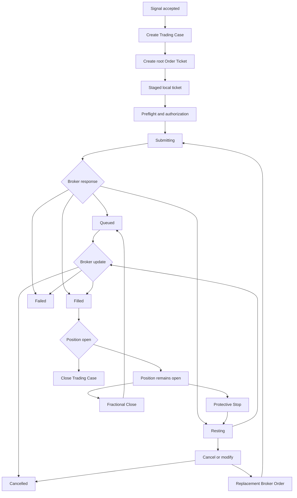

**topic:** savant trader — broker-authoritative order reconciliation  
**issue:** #223  
**topic parent:** #176  
**domain:** savant-trader  
**type:** prd  
**status:** superseded by ADR-008 (Signal Entry Record model)  
**created:** 2026-09-05  
**last updated:** 2026-09-07

---

> **⚠ SUPERSEDED by [ADR-008](../../adr/ADR-008_signal-entry-record.md)**
>
> The Trading Case aggregate, broker order mirrors, reconciliation module, and projection adapter described in this PRD were superseded on 2026-09-07. The model introduced complexity that exceeded the value of per-signal lifecycle tracking.
>
> The replacement is a lightweight **Signal Entry Record** — one Firestore document per accepted signal that results in an order. RH remains authoritative for orders, positions, fills, and stops. Firestore stores only the signal-to-order link for provenance.
>
> **What is retained from this PRD:**
> - RH is authoritative for Broker Order identity, lifecycle, fills, and Positions.
> - Signal provenance is preserved locally.
> - The signal-order page handles staging through submission.
>
> **What is removed:**
> - Trading Case aggregate and root Order Ticket model.
> - Case Summary lifecycle tracking.
> - Broker Order Mirror repository and subcollections.
> - Reconciliation module and projection adapter.
> - Broker-position adoption workflow.
> - Migration from `st_order_intents` to Trading Cases.
>
> The detailed sections below remain as historical context for the decision. New work follows ADR-008.

---

## problem statement

The order workspace currently combines three different concepts as if they were one record:

1. a local Order Ticket created from an accepted signal;
2. a Robinhood Broker Order;
3. a Robinhood Position.

They have different identities, lifecycles, and sources of truth. The current implementation loads Firestore intents and Robinhood positions asynchronously into one shared queue map. One source can replace another source's rows, causing filled positions to disappear, stale failures to remain visible, and duplicate rows to represent one broker transaction.

Broker responses can also be lost when the MCP transport succeeds but the tool returns an embedded error or a nested order response. This leaves Firestore with an inaccurate lifecycle state even though Robinhood has accepted or rejected the order.

## product decision

The system will use a Trading Case as the lifecycle aggregate for one accepted root Order Ticket.

```text
Trading Case
├── root Order Ticket
├── mutable Case Summary
├── one or more Broker Order records
└── future lifecycle extensions
```

Firestore is authoritative for local Order Ticket metadata before broker submission. Robinhood is authoritative for Broker Order identity, broker lifecycle, accepted terms, fills, and current Positions after submission. Firestore stores a durable mirror of the latest broker response and preserves local metadata Robinhood does not provide.

A symbol's history is a query across multiple Trading Cases. A later accepted signal for the same symbol creates a new case rather than extending an older case.

## scope

### included

- Equity and ETF orders only.
- Signal-generated root Order Tickets.
- Future manual root Order Tickets using the same case model.
- Market, limit, stop-market, and stop-limit equity/ETF orders.
- Robinhood queued, resting, filled, cancelled, rejected, and failed states.
- Protective Stop Broker Orders placed through Robinhood.
- Fractional-close Broker Orders where supported by Robinhood.
- Broker Order mirrors and reconciliation.
- Unmatched Broker Order adoption.
- Minimal safe handling of rare partial fills.

### excluded

- Options execution. Options will be handled under a separate Topic using this reconciliation model as a guide.
- Target exits in this milestone.
- OCO orders.
- Simultaneous resting stop and target orders.
- App-managed target execution.
- Full partial-fill workflow for equity/ETF orders.

Target exits remain a documented extension point:

```text
targetExitState: TBD
targetExitBrokerOrderId: TBD
```

They are not created, submitted, or managed by this milestone because Robinhood does not currently provide the required OCO behavior.

## source-of-truth matrix

| fact | authoritative source | firestore role |
|---|---|---|
| signal acceptance | Firestore root Order Ticket | durable local decision |
| signal context | Firestore root Order Ticket | preserve provenance |
| proposed terms before submission | Firestore root Order Ticket | editable terms |
| order authorization | local authorization record | audit and replay guard |
| Broker Order ID | Robinhood | mirror and lookup key |
| Broker Order state | Robinhood `get_equity_orders` | latest cached observation |
| accepted broker terms | Robinhood | latest cached observation |
| cumulative/filled quantity | Robinhood | latest cached observation |
| average/fill price | Robinhood | latest cached observation |
| current holding | Robinhood `get_equity_positions` | latest position snapshot |
| source signal and parent links | Firestore | local metadata |
| queue display state | reconciliation projection | derived only |

## Trading Case structure

A Trading Case is created when the first root signal is accepted. It is not created only after a broker fill.

The root case document contains the Order Ticket and Case Summary:

```text
savant-trader/data/trading-cases/{caseId}
  root Order Ticket fields
  signal context
  proposed terms
  authorization
  currentStatus
  currentOutcome
  activeBrokerOrderIds
  latestObservedAt
  entryState
  protectiveStopState
  targetExitState: TBD
  filledQuantity
  remainingQuantity
  caseProgress
```

Actual Robinhood orders are separate child records with human-readable local document IDs. The immutable Robinhood broker order ID remains a required field and the repository upsert key:

```text
savant-trader/data/trading-cases/{caseId}/broker-orders/{humanReadableBrokerOrderId}
```

There is one Broker Order record per actual broker order. A replacement order, Protective Stop, fractional close, or future target exit receives its own child record. Broker Order records are not repeatedly overwritten to represent different orders.

Each Broker Order record stores normalized fields and the latest raw broker response:

```text
brokerOrderId
instrument identity
side
type
requested quantity
cumulative quantity
remaining quantity
accepted prices
fees
time in force
market hours
trigger
placed agent
raw state
derived state
average fill price
executions
created/transaction timestamps
latest raw response
last observed timestamp
```

The latest raw response is retained on the Broker Order record. No separate broker-observation collection is created in this milestone. Repeated identical responses update observation metadata but do not create duplicate records.

## complete equity/ETF lifecycle



## raw broker state evidence

The shared lifecycle must distinguish confirmed API facts from derived application states.

| raw Robinhood state | evidence status | current treatment |
|---|---|---|
| `queued` | confirmed by the live KMEM response | preserve and display as `queued` |
| `confirmed` | observed for tested GTC limit and stop-market orders | derive `resting` only for verified trigger/price order types |
| `filled` | state value and fixture evidence confirmed; complete live coverage remains open | preserve and derive only with verified fill evidence |
| `cancelled` | state value confirmed for equity orders | preserve and derive as cancelled |
| `canceled` | not confirmed as an equity API state; compatibility spelling only | map to `cancelled` as a compatibility alias; preserve raw state |
| `rejected` | state value confirmed; exact semantics and transitions need live capture | preserve raw state; derive only through verified policy |
| `failed` | state value confirmed; exact semantics and transitions need live capture | preserve raw state; derive only through verified policy |
| `new` | state value known; semantics not verified | preserve raw state; do not guess |
| `unconfirmed` | state value known; semantics not verified | preserve raw state; do not guess |
| `voided` | state value known; semantics not verified | preserve raw state; do not guess |
| `partially_filled` | state value known; live shape not verified | preserve cumulative/remaining fields; do not claim full fill |

The backend adapter must retain the raw state and raw response. Derived UI state must be added only when the mapping is supported by live evidence or a documented broker contract. The state evidence must be expanded as real order-type fixtures are captured.

## lifecycle semantics

### local only / staged

The Trading Case and root Order Ticket exist in Firestore. No Broker Order ID exists. Terms are editable.

### submitting

The application has authorized and dispatched an order request. Broker acknowledgement is pending.

### submitted

The request reached the broker integration, but the returned broker lifecycle state has not yet been classified. This is a transient processing state, not proof of acceptance or a fill.

### unclassified

The broker returned a raw state that is not in the supported application lifecycle set (`new`, `unconfirmed`, `voided`, or any unrecognized value). The raw state is preserved on the record for diagnostics, but the derived state is `unclassified` rather than being guessed into a semantic state. This avoids treating unsupported states as first-class application lifecycle states.

### queued

Robinhood returned a queued state. The Broker Order exists at Robinhood but has not yet moved into a processed trigger/resting state or fill state.

### resting

Robinhood accepted and processed a trigger-based order that is waiting for its trigger or price condition. Limit, stop-market, stop-limit, and Protective Stop orders can be resting.

### filled

Robinhood confirms the requested order quantity has traded. Fill quantity and price come from Robinhood. A filled entry with an open Position keeps its Trading Case active.

### cancelled/rejected/failed

The Broker Order has reached a terminal negative outcome. The local Case Summary records the outcome, while the Broker Order mirror retains the broker response and error details.

### pending reconciliation

A submission or broker lookup is incomplete. Use `pending` in the Case Summary rather than creating a complex ambiguous lifecycle state. Do not retry until the original Broker Order has been reconciled.

## resting and triggered-order pathways

Resting is not a terminal outcome. A Resting Broker Order remains active until it fills, is cancelled, expires, or fails.

### limit order

A limit order has no separate trigger phase:

```text
RESTING
  → FILLED
  → CANCELLED
  → EXPIRED
  → REJECTED / FAILED
```

The limit price condition is the execution condition.

### stop-market order

A stop-market order has a transient trigger phase:

```text
RESTING
  → TRIGGERED
  → QUEUED / market processing
  → FILLED
```

It may also become `REJECTED` or `FAILED` after triggering. `TRIGGERED` is not a durable top-level queue group; it is retained as broker metadata such as `trigger` and `triggeredAt`, while the current lifecycle state advances to the next broker-confirmed state.

### stop-limit order

A stop-limit order changes from a stop condition to a limit condition:

```text
RESTING
  → TRIGGERED
  → RESTING limit phase
  → FILLED
```

After triggering, the resulting limit order may remain Resting until it fills, is cancelled, expires, or fails.

### Protective Stop

A Protective Stop follows the stop-market pathway:

```text
RESTING
  → TRIGGERED
  → QUEUED
  → FILLED
```

The Trading Case remains open when the stop triggers. It closes only after Robinhood confirms the resulting fill and the Position reconciliation confirms that no managed Position remains and no active child Broker Orders remain.

### triggered-order requirements

- Broker Order mirrors retain the raw broker state, trigger value, trigger timestamp when available, and current derived state.
- The queue does not create a permanent `TRIGGERED` group.
- The ticket shows trigger-processing information while the broker state is transitioning.
- A trigger does not imply a fill.
- A stop-limit trigger does not imply that the resulting limit order filled.
- Case closure waits for both Broker Order fill evidence and Position reconciliation.

## partial-fill policy

Equity/ETF partial fills are expected to be rare and are not a full workflow in this milestone. The Broker Order mirror and Case Summary still preserve:

```text
requestedQuantity
cumulativeQuantity
remainingQuantity
```

The system must not mark an order fully filled until Robinhood confirms the full quantity. It must not create a full-quantity Protective Stop from incomplete fill data. A persistent partial state is surfaced for manual handling and is a future extension point for options.

## Protective Stop policy

A Protective Stop is a separate Broker Order child of the Trading Case. The protected Position or root entry row displays a `PROTECTED` indicator. The Protective Stop appears once in its own queue lifecycle group.

The parent row does not render a duplicate stop row. Selecting the parent shows protection details; selecting the Protective Stop shows its own Broker Order ticket.

## unmatched Broker Orders

If Robinhood returns a Broker Order without a matching Trading Case:

- display it as `UNMATCHED BROKER ORDER`;
- preserve the complete broker mirror;
- do not fabricate signal context;
- provide `Create Trading Case` as an adoption workflow;
- show an adoption dialog before creating local metadata;
- create a read-only root Order Ticket from broker terms after confirmation.

## adoption workflow

```text
unmatched Broker Order
  → Create Trading Case
  → adoption dialog
  → user adds optional strategy/note metadata
  → user confirms
  → create Trading Case
  → attach Broker Order as first child
```

Broker terms remain read-only. Local metadata may be supplied by the user.

## queue group semantics for resting orders

The queue must distinguish broker processing from broker acceptance:

| queue group | meaning | valid next outcomes |
|---|---|---|
| Submitted | request reached Robinhood, but the broker-processed state is not yet classified | Queued, Resting, Filled, Failed, Rejected |
| Queued | Robinhood returned `state: queued`; the Broker Order exists but is waiting for further broker processing | Resting, Filled, Failed, Cancelled |
| Resting | Robinhood accepted a trigger/price-based order and it is waiting for its condition | Triggered, Filled, Cancelled, Expired, Failed |

Resting orders must expose only actions that are valid for their current broker state:

- **Modify**: cancel the current Broker Order, then create a replacement Broker Order under the same Trading Case.
- **Cancel**: request cancellation, then reconcile the Broker Order before showing it as cancelled.
- **Refresh from Broker**: fetch the latest Broker Order and Position state.
- **Trigger**: not a user action; it is a broker transition.
- **Fill**: not a user action; it is a broker-confirmed outcome.

A trigger is not a fill. A stop-market order can move from Resting to Queued/market processing before it fills. A stop-limit order can move from Resting to a new Resting limit phase after triggering.

## reconciliation behavior

Reconciliation runs:

- on initial page load;
- after order submission;
- after cancellation;
- after modify/replacement;
- after fractional close submission;
- on explicit Refresh from Broker.

There is no mandatory polling loop in this milestone. Each reconciliation cycle fetches Firestore local records, recent Robinhood Broker Orders, and current Robinhood Positions, then builds one immutable queue projection. No source replaces another source's entire collection.

The system persists only the latest Broker Order version and latest Case Summary state. Repeated identical broker responses update `latestObservedAt` but do not create history documents.

## options extension points

Options are out of scope but the reconciliation model must not assume an equity-shaped Broker Order.

The future instrument adapter may define its own:

- broker instrument identity;
- order terms;
- legs/contracts;
- quantity semantics;
- price and premium fields;
- fill semantics;
- Position identity;
- broker state mapping.

The shared reconciliation interface should operate on instrument-neutral records and delegate instrument-specific normalization to adapters. Options will be designed in a separate Topic using this PRD as architectural guidance.

## user stories and acceptance criteria

### story 1: create a Trading Case on signal acceptance

As a trader, I want an accepted signal to create a durable Trading Case immediately so that staged and broker lifecycle work has one stable parent.

**acceptance criteria**

- Accepting a signal creates one Trading Case and root Order Ticket.
- The case exists before broker submission.
- Re-accepting the same signal occurrence does not create an accidental duplicate case.
- A later signal for the same symbol creates a separate case.

### story 2: reconcile Broker Orders from Robinhood

As a trader, I want Robinhood's Broker Order state to be authoritative after submission so that the queue reflects reality rather than stale local optimism.

**acceptance criteria**

- Broker Order ID is the identity key after submission.
- Queued, resting, filled, cancelled, rejected, failed, and pending states are represented.
- The latest normalized and raw broker response is persisted.
- A lost response does not trigger an unsafe duplicate order.

### story 3: preserve local and broker data separately

As a trader, I want signal context and broker facts preserved together without overwriting each other.

**acceptance criteria**

- Proposed local terms remain distinguishable from accepted broker terms.
- Broker Orders are child records under the Trading Case.
- Each actual broker order has one child record.
- Case Summary progress is mutable; Broker Order identity is not overwritten.

### story 4: show current Positions without fabricating orders

As a trader, I want current Robinhood Positions visible for management without confusing holdings with orders.

**acceptance criteria**

- Positions are reconciled from `get_equity_positions`.
- A Position does not create a fake Broker Order.
- Open positions remain visible when Firestore and Robinhood complete loading in either order.
- Fractional positions do not expose unsupported stop-loss actions.

### story 5: manage Protective Stops

As a trader, I want a Protective Stop represented as its own Broker Order while seeing which Position it protects.

**acceptance criteria**

- A Protective Stop has one Broker Order child record.
- The parent entry/Position shows a protection indicator.
- The Protective Stop appears once in the queue.
- The parent ticket shows protection details without duplicating the child row.

### story 6: adopt unmatched Broker Orders

As a trader, I want to create a Trading Case for a Broker Order that has no local case so that broker activity is not lost.

**acceptance criteria**

- Unmatched Broker Orders are visible.
- `Create Trading Case` opens an adoption dialog.
- Broker terms are read-only in the dialog.
- Confirming creates a case and preserves the Broker Order as its first child.

### story 7: close cases from broker Position state

As a trader, I want cases to remain active while a Position or Broker Order remains active and close only after the broker confirms the position is closed.

**acceptance criteria**

- A filled entry with a resting Protective Stop remains active.
- A case closes only when no Position remains and no active child Broker Orders remain.
- The final Case Summary records the outcome and closure reason.

## migration and rollout

The implementation starts fresh. The small number of remaining legacy `order-intents` documents will be deleted manually before the new Trading Case flow is enabled.

There is no compatibility adapter, eager backfill, migration marker, or legacy-document conversion in this milestone. New accepted root Order Tickets create new Trading Cases using the new model from the beginning.

The implementation must include clean empty-state behavior when no Trading Cases exist and must not assume legacy records are present.

## technical constraints

- Robinhood MCP tool responses may report transport success while embedding tool-level errors in `redacted.isError`.
- Broker order responses may be nested under `parsed.data.order`.
- The implementation must preserve raw broker data needed to diagnose future response-shape changes.
- API polling should remain bounded; repeated identical responses must not create unbounded Firestore history.
- Account identifiers and sensitive fields must follow existing redaction and storage rules.
