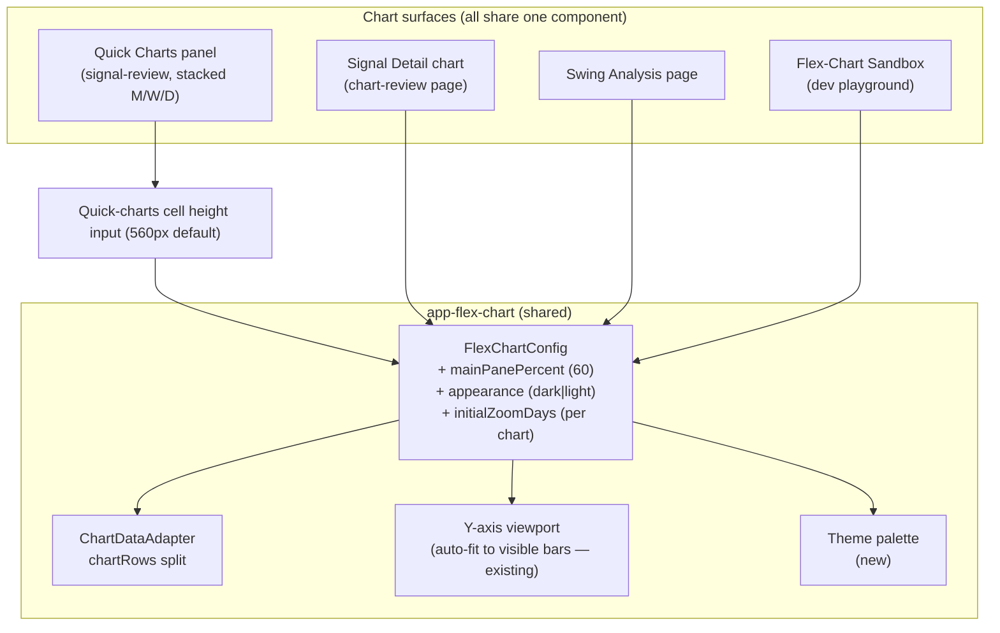

**Topic:** Flex Chart Visual Polish  
**Topic Slug:** visual-polish  
**Issue:** #214  
**Topic Parent:** #213  
**Domain:** FLEX-CHART  
**Type:** PRD  
**Status:** Approved  
**Created:** 2026-10-01  
**Last Updated:** 2026-10-01  

# PRD: Flex Chart Visual Polish — Pane Prominence, Bar Clarity, Dark Surfaces

## Problem Statement

Every chart built on the shared `app-flex-chart` component is hard to read. The signal-review quick-charts panel is where the pain surfaced, but all consumers share the same defects:

- **The main price pane is too small.** Lower indicator panes get a fixed 55% of vertical space regardless of how many are active, leaving the price pane with ~46%.
- **Candles are thin and fuzzy.** Quick charts show 100 bars squeezed into a narrow cell — "flat spaghetti" that hides price action.
- **Contracting price patterns leave the pane looking empty.** With a 100-bar visible window, a recent tight consolidation is scaled against months of historical range.
- **The chart surface is harsh and low-contrast.** The white background glares, and pastel-ish line/fill colors make indicator output hard to distinguish.

The result: the user has stopped using quick charts and chart review for decisions and defers to TradingView.

## Solution

Make flex-chart visually competitive with TradingView, fixing the shared component once so every surface benefits:

1. **Dark chart surfaces with a vibrant palette** — dark background, light axis text/gridlines, bright high-contrast candle and indicator colors, behind an `appearance` flag on the shared chart config. Default: dark.
2. **A bigger price pane** — the main pane's vertical share becomes a configurable percentage (default 60%); active lower panes split the remainder evenly.
3. **Shorter visible windows on dense charts** — daily and weekly quick charts show the last 30 bars; monthly keeps 100 for long-term context. Wider, clearer candles, and the existing Y-axis auto-fit (already scales to visible bars) now fits recent price action instead of months of range.
4. **Taller quick-chart cells** — the chart cell height becomes configurable (default 560px, up from a fixed 420px) so lower panes stay legible under the new split.

The new look is the config default: quick-charts, signal-detail/chart-review, swing-analysis, and the flex-chart sandbox all adopt it on merge. The sandbox is the pre-merge eyeball surface.

## User Stories

1. As a trader viewing any chart, I want a dark surface with bright, vibrant series colors, so that candles and indicator lines are easy to distinguish at a glance — like TradingView.
   - *Acceptance:* Every `app-flex-chart` instance renders a dark background with light axis labels/gridlines and a high-contrast palette; no series is illegible against the dark background.
2. As a trader, I want the price pane to occupy most of every chart, so that price action — not indicators — dominates.
   - *Acceptance:* With three active lower panes, the main pane is visibly ~60% of chart height; lower panes share the rest evenly.
3. As a trader, I want the main pane's share to grow automatically when fewer lower panes are active, so unused indicator space never crowds out price.
   - *Acceptance:* With one active lower pane the main pane renders noticeably taller than with three; with zero lower panes it takes the full height.
4. As a trader scanning a symbol on signal-review, I want daily and weekly quick charts to show ~30 bars, so candles are wide and crisp instead of thin and fuzzy.
   - *Acceptance:* Daily and weekly quick charts display ~30 candles each, clearly distinguishable at normal panel width.
5. As a trader, I want the monthly quick chart to keep a long window (~100 bars), so multi-year context is preserved on the long-horizon chart.
   - *Acceptance:* Monthly shows ~100 bars while daily/weekly show ~30.
6. As a trader reviewing a contracting pattern, I want the Y-axis scaled to recent price action, so the pattern fills the pane instead of leaving it empty.
   - *Acceptance:* On a symbol whose last 30 daily bars trade in a narrow range, visible bars fill most of the price pane vertically (subject to the existing ~3% padding).
7. As a trader doing deep review, I want the chart-review page's detail chart to get the same improved look, so deep review is as readable as the quick scan.
   - *Acceptance:* The signal-detail chart renders dark with the 60% main pane by default.
8. As a trader, I want the swing-analysis chart to get the same look too, so no chart in the app is left on the old washed-out style.
   - *Acceptance:* The swing-analysis chart renders dark with the 60% main pane by default.
9. As a developer, I want pane split, theme, cell height, and visible-bar count to be configuration values rather than hardcoded constants, so tuning the look requires no changes to layout math.
   - *Acceptance:* Each value is a chart config input (or component input for cell height) with the stated defaults; no consumer hardcodes the old 55%/420px/100-bar behavior.
10. As a developer, I want a light appearance to remain selectable via the theme flag, so the prior look is recoverable without a revert.
    - *Acceptance:* Setting `appearance` to `'light'` renders the previous light palette and background.
11. As a developer validating changes, I want the flex-chart sandbox to exercise the new options, so I can eyeball the new look before merge.
    - *Acceptance:* The sandbox chart renders dark with the 60% main pane; the new config inputs are exercised there.

## System Context

## Implementation Decisions

- **`FlexChartConfig.mainPanePercent?: number`** — new input, default `60`. The chart adapter computes each active lower pane's height as `(100 - mainPanePercent) / activePaneCount` percent; the main pane takes the remainder; inactive lower panes collapse to 0%. Replaces the hardcoded 55% lower share — one change upgrades every consumer.
- **`FlexChartConfig.appearance?: 'dark' | 'light'`** — new input, default `'dark'`. Drives chart background, axis label/gridline colors, and the series palette. `'light'` preserves the current look.
- **Dark palette** — TradingView-dark is the visual reference: near-black background, subdued gridlines, light axis text, brighter/vibrant candle and indicator colors. Exact hex values are chosen at implementation; every hardcoded color fallback in the chart template and indicator definitions routes through the active palette.
- **Quick-charts visible windows** — per-chart `initialZoomDays`: Daily `30`, Weekly `30`, Monthly `100`. Replaces the shared `QUICK_BARS = 100` constant. Fetch behavior unchanged (full datasets still load; display-only).
- **Quick-charts cell height** — a component input (default `560`px) on the quick-charts cell, replacing the fixed 420px rule.
- **No Y-axis changes** — the existing viewport controller already auto-fits the Y-axis to visible bars with ~3% padding; shorter windows resolve the empty-pane symptom.
- **Ship-day behavior** — new values are config *defaults*, so all consumers flip on merge. Sandbox is the pre-merge eyeball surface, not a gated rollout phase.

## Testing Decisions

- External behavior only: assert computed row heights from the adapter for varying `mainPanePercent` and active-pane counts; assert `appearance` produces dark vs. light axis/series config; assert quick-charts passes the new per-interval `initialZoomDays` and cell-height defaults.
- Prior art: the chart adapter and flex-chart component already have spec files covering computed configs; the new inputs extend those seams — no new seams needed.
- Visual verification (palette legibility, candle clarity) is manual in the sandbox + QA pass; no pixel-level snapshot tests.

## Technical Context

- Quick charts have no zoom controls, scrollbar, or mouse-wheel zoom — the visible window is fixed, which is why window size doubles as the "zoom" lever.
- The pane split and theme live in the shared chart component: signal-detail (chart-review page), swing-analysis, and the sandbox inherit the new defaults on merge. Each needs a spot-check after the change.
- Lower panes shrink in absolute pixels under the 60% default (e.g., ~75px each at 560px cell height with three panes) — bounded 0–100 indicators remain readable but this is the tightest legibility point.

## Out of Scope

- App-wide dark mode / theme system. Only chart surfaces go dark; the rest of the app's light theme is unchanged.
- Interactive zoom/scroll for quick charts.
- Changes to indicator computation, signal dots, HTF windows, or crosshair behavior.
- Per-user persisted chart preferences.

## Further Notes

- Motivation: the user currently ignores in-app charts and makes decisions in TradingView; success is these surfaces becoming usable for daily review again.
- If 30 bars proves too short for daily context in practice, the per-chart config makes it a one-line adjustment.
