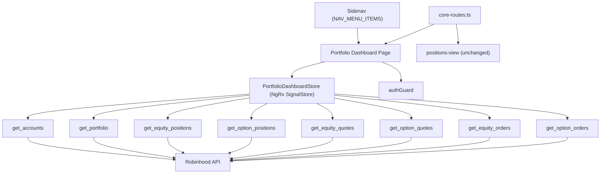

**topic:** portfolio dashboard — init impl  
**issue:** #275  
**topic parent:** #219  
**thread:** #274  
**thread slug:** `init-impl`  
**topic slug:** `portfolio-dashboard`  
**domain:** portfolio  
**type:** prd  
**status:** approved  
**created:** 2026-07-17  
**last updated:** 2026-07-18

---

## Problem Statement

A trader with multiple Robinhood accounts has no single screen to see the current state of their portfolio. To check open positions, they navigate to the positions-view page (which reads from Firestore, not the broker). To check open orders, they go to the signal-order workspace. To see order history, they use the rh-account-inquiry observation dashboard. There is no cross-account summary — Robinhood itself doesn't provide one — so the trader must mentally aggregate value, exposure, and cash across accounts.

The data exists in Robinhood via the MCP tool surface, but no UI consolidates it. The existing `PositionsStore` reads from Firestore and was not built for this purpose. The existing `PortfolioService` fetches an account snapshot but only exposes it to the order workspace. The existing `OrderExecutionService` wraps order MCP calls but exposes no browseable order history UI.

The trader needs a single dashboard that pulls live broker state from Robinhood, computes position-level PnL, and presents it all in one place — across all accounts.

## Solution

A new top-level **Portfolio Dashboard** page at route `portfolio-dashboard`, accessible from the sidenav, and set as the default landing page. The dashboard fetches live data from Robinhood MCP for all agentic-allowed accounts, computes per-position unrealized PnL, and presents:

- A **cross-account aggregate summary bar** showing total value, total exposure, total cash, and total PnL across all accounts — something Robinhood itself does not provide.
- **Per-account tabs** — one tab per agentic-allowed account.
- Within each tab:
  - An **account summary** (value, exposure, cash, buying power, margin usage, position count).
  - **Open Positions** — equity and options in **separate tables** (columns differ significantly). Each shows cost basis, current price, and unrealized PnL. A toggle reveals closed positions (off by default).
  - **Open Orders** — equity and options combined, live/resting orders only. Each order indicates whether it is a stop-loss protecting an existing position.
  - **Order History** — equity and options combined, available on demand via a toggle (not shown by default).

The dashboard is **view-only** for the initial implementation. Order management (cancel, place) is a future enhancement. The existing `positions-view` page coexists unchanged.

## User Stories

1. As a trader, I want a Portfolio Dashboard page in the sidenav, so that I can access my portfolio overview from anywhere in the app.
2. As a trader, I want the Portfolio Dashboard to be the default landing page, so that I see my portfolio immediately when I open the app.
3. As a trader, I want a cross-account aggregate summary at the top of the dashboard, so that I can see my total portfolio value, exposure, cash, and PnL across all accounts in one place.
4. As a trader, I want a tab for each of my Robinhood accounts, so that I can inspect each account independently.
5. As a trader, I want each account tab to show an account summary (value, exposure, cash, buying power, margin usage, position count), so that I can understand the account's allocation at a glance.
6. As a trader, I want to see my open equity positions in a dedicated table with cost basis, current price, and unrealized PnL, so that I can assess which positions are profitable or losing.
7. As a trader, I want to see my open option positions in a separate table with cost basis, current price, and unrealized PnL, so that I can assess my options book.
8. As a trader, I want equity and option positions in separate tables (not combined), so that the columns are appropriate for each instrument type.
9. As a trader, I want a toggle to show closed positions, so that I can review exited positions when needed without cluttering the default view.
10. As a trader, I want to see my open orders (equity and options combined) in a separate section, so that I can quickly see what's live at the broker.
11. As a trader, I want open orders to indicate whether an order is a stop-loss protecting an existing position, so that I can see which positions are protected.
12. As a trader, I want order history available on demand via a toggle (not shown by default), so that I can review past trades when needed without cluttering the dashboard.
13. As a trader, I want a manual refresh button, so that I can re-fetch live data from Robinhood on demand.
14. As a trader, I want the dashboard to auto-load data on page navigation, so that I see current data without clicking refresh.
15. As a trader, I want the dashboard to pre-fetch data for all account tabs after the initial load, so that switching tabs is instant.
16. As a trader, I want per-section error messages with retry buttons, so that a single failed MCP call doesn't blank out the entire dashboard.
17. As a trader, I want the dashboard to show a loading indicator per section, so that I know when data is being fetched.
18. As a trader, I want the account summary to include buying power and margin exposure/capability, so that I know how much I can spend and how much margin I'm using from each account.

## Acceptance Criteria

### US1 — Sidenav entry
- A "Portfolio Dashboard" entry appears in the sidenav navigation.
- Clicking it navigates to the `portfolio-dashboard` route.
- The route is protected by `authGuard`.

### US2 — Default route
- Navigating to the root URL (`/`) redirects to `portfolio-dashboard`.
- The existing `positions-view` route remains accessible at its current path.
- The existing `positions-view` sidenav entry remains unchanged.

### US3 — Aggregate summary bar
- A summary bar is displayed above the account tabs.
- It shows: total account value, total exposure, total cash, total unrealized PnL — summed across all agentic-allowed accounts.
- Values are formatted as currency.
- The summary bar updates when the refresh button is clicked.
- If an account's portfolio data fails to load, the aggregate still computes from successfully loaded accounts, and the failed account's contribution is noted as unavailable.

### US4 — Per-account tabs
- One tab is rendered per agentic-allowed account returned by `get_accounts`.
- Each tab label includes the account name and account number (or a truncated form).
- Selecting a tab shows that account's data.
- The first tab is selected by default on page load.

### US5 — Account summary
- Each account tab displays: account value, exposure, cash, buying power, margin usage, position count.
- Values come from `get_portfolio` (value, exposure, cash, buying power, margin) and position counts from `get_equity_positions` + `get_option_positions`.
- Values are formatted as currency (except position count).
- **Open technical question:** Whether `get_portfolio` returns margin exposure/capability directly. The tool description says "market value breakdown by asset type and buying power" — margin fields may be present but are not confirmed from the catalog alone. This must be verified during implementation by inspecting the actual `get_portfolio` response shape. If margin data is not available from `get_portfolio`, it may be derivable from `get_accounts` (account type indicates margin vs cash) or may require a separate approach.

### US6 — Open equity positions with PnL
- A dedicated equity positions table shows: symbol, quantity, cost basis (average buy price), current price, unrealized PnL ($), unrealized PnL (%).
- Cost basis comes from `get_equity_positions` → `average_buy_price`.
- Current price comes from `get_equity_quotes`.
- Unrealized PnL = (current price - cost basis) × quantity.
- PnL% = unrealized PnL / (cost basis × quantity) × 100.
- Only open positions (non-zero quantity) are shown by default.

### US7 — Open option positions with PnL
- A separate option positions table shows: underlying symbol, option type (call/put), strike, expiration, quantity, cost basis, current price, unrealized PnL ($), unrealized PnL (%).
- Cost basis comes from `get_option_positions`.
- Current price comes from `get_option_quotes` (by instrument UUID).
- Unrealized PnL is computed the same way as equity.
- Equity and option positions are in separate tables because their columns differ significantly (options have strike, expiration, call/put that equity does not).

### US8 — Positions layout
- Equity positions and option positions are displayed as separate tables within the positions section.
- Each table is independently sortable by at least symbol/underlying and PnL.
- Both tables share the same "Show closed positions" toggle.

### US9 — Closed positions toggle
- A "Show closed positions" toggle is present on the positions section.
- Default state: off (only open positions shown).
- When toggled on, closed positions (zero-quantity) appear in the same table with visually muted styling.
- Toggling does not trigger a new MCP call — closed positions are already returned by `get_option_positions` (with `nonzero=false`) and `get_equity_positions`.

### US10 — Open orders section
- A separate "Open Orders" section appears below the positions section.
- It shows equity and option orders in a single table.
- Columns include: symbol/description, side, order type, quantity, price, state, instrument type.
- Only live/resting order states are shown (new, queued, confirmed, partially_filled, pending_cancelled).
- Filled, cancelled, rejected, and failed orders are excluded from this section.
- Each open order row indicates whether it is a stop-loss order protecting an existing position. Stop-loss orders are identified by order type (stop_market, stop_limit) and matched to positions by symbol.

### US11 — Order history (on demand)
- Order history is not shown by default.
- A "Show order history" toggle reveals an order history table below the open orders section.
- The toggle is off by default — the user must explicitly request it.
- When toggled on, it shows equity and option orders in a single table.
- Columns include: symbol/description, side, order type, quantity, fill price (or limit price if unfilled), state, date.
- Orders are sorted newest-first by creation date.
- Alternatively, order history may be folded into the closed positions table (showing the closing order alongside the closed position) — implementation decision.

### US12 — Manual refresh button
- A refresh button is visible at the top of the dashboard.
- Clicking it re-fetches all data for all accounts.
- The button shows a loading/disabled state while fetching.
- After refresh completes, all sections reflect the latest data.

### US13 — Auto-load on navigation
- When the user navigates to the dashboard, data fetching begins automatically.
- The initial load fetches: `get_accounts`, then `get_portfolio` + `get_equity_positions` + `get_option_positions` for all accounts (for the aggregate summary bar + first tab).
- A loading indicator is shown per section while data is being fetched.

### US14 — Pre-fetch all tabs
- After the initial page load completes, the dashboard pre-fetches order data (`get_equity_orders`, `get_option_orders`) and quote data (`get_equity_quotes`, `get_option_quotes`) for all remaining account tabs in the background.
- When the user switches to a pre-fetched tab, data is displayed immediately without a loading state.
- If the user switches to a tab whose pre-fetch is still in progress, the loading indicator shows until it completes.

### US15 — Per-section error handling
- Each data section (positions, open orders, order history, account summary) tracks its own loading and error state per account.
- If a section's MCP call fails, an inline error message appears in that section with a retry button.
- Other sections and other accounts are unaffected by the failure.
- Clicking retry re-fetches only the failed section for that account.

### US16 — Per-section loading indicators
- Each section shows a loading indicator (spinner or skeleton) while its data is being fetched.
- The indicator is scoped to the section, not the entire page.
- Sections that have already loaded data do not show a loading indicator when an unrelated section is fetching.

### US18 — Buying power and margin in account summary
- The account summary for each tab includes buying power and margin exposure/capability.
- Buying power comes from `get_portfolio` (not `get_accounts`, which does not return reliable buying power).
- Margin exposure/capability comes from `get_portfolio` if available (see open technical question in US5).
- Both are formatted as currency.

## Technical Context

### Data sources

All data comes from Robinhood MCP via `RobinhoodMcpObservationService` (HTTP proxy to `/api/rh/tools/{name}`). No Firestore reads for portfolio data. The existing `PositionsStore` (Firestore-based) is not used.

### MCP tool calls per account

| Tool | Purpose | Phase |
|---|---|---|
| `get_accounts` | List agentic-allowed accounts | Once on load |
| `get_portfolio` | Account value, exposure, cash, buying power | Initial load (all accounts) |
| `get_equity_positions` | Open equity positions (cost basis, quantity) | Initial load (all accounts) |
| `get_option_positions` | Open option positions (cost basis, quantity) | Initial load (all accounts) |
| `get_equity_quotes` | Current equity prices (batched ~20 symbols) | After positions load |
| `get_option_quotes` | Current option prices (batched ~20 UUIDs) | After positions load |
| `get_equity_orders` | Equity order history + open orders | Pre-fetch (all tabs) |
| `get_option_orders` | Option order history + open orders | Pre-fetch (all tabs) |

### Load strategy

1. **Phase 1 (initial):** `get_accounts` → for each account: `get_portfolio` + `get_equity_positions` + `get_option_positions` (all parallel). Renders aggregate summary bar + first tab positions.
2. **Phase 2 (pre-fetch):** After phase 1, for each account: `get_equity_quotes` + `get_option_quotes` + `get_equity_orders` + `get_option_orders` (all parallel). Fills in PnL and orders for all tabs.

### State management

A new `PortfolioDashboardStore` (NgRx SignalStore) at `src/app/features/portfolio-dashboard/`. Feature-scoped, following the existing `signalStore` pattern used by `PositionsStore` and `SpreadViewerStore`. The store manages:
- Account list and selected account.
- Per-account: portfolio snapshot, equity positions, option positions, equity quotes, option quotes, equity orders, option orders.
- Per-account, per-section loading and error state.
- Computed aggregate summary across all accounts.
- Computed per-position PnL (joining position cost basis with quote current price).

### Routing

- New route: `portfolio-dashboard` in `core-routes.ts`, protected by `authGuard`.
- Default route redirect changes from `positions-view` to `portfolio-dashboard`.
- New sidenav entry in `NAV_MENU_ITEMS`: name `portfolio-dashboard`, text "Portfolio Dashboard".
- New `AppRoutes` enum value: `PORTFOLIO_DASHBOARD = 'portfolio-dashboard'`.
- The existing `positions-view` route and sidenav entry remain unchanged.

### Error handling

Per-call error tracking. Each data section per account has independent loading/error state. A failed call shows an inline error with a retry button scoped to that section and account. The aggregate summary bar computes from successfully loaded accounts and notes any unavailable accounts.

### Out of scope for this Thread

- Order management (cancel, place) — future Thread.
- Realized PnL, win/loss metrics, equity curve, drawdown analysis — Thread #276 (analytics-suite).
- Polling / auto-refresh — future enhancement.
- Merged "All Accounts" tab — future enhancement.
- ST navigation reorganization — Topic #178.
- Firestore `PositionsStore` integration — not used; RH MCP is the primary data source.

### Future work references

- **Thread #276** (analytics-suite): Full analytics — time-series PnL, equity curve, drawdown, per-symbol breakdowns, win/loss metrics, profit factor. MCP tools `get_realized_pnl` and `get_pnl_trade_history` are available for this.
- **Thread #279** (order-placement): Order placement from the dashboard — primarily closing open positions, but also manual order entry. Can share an order entry component with the signal-order page's unimplemented manual entry button. MCP tools `place_equity_order`, `cancel_equity_order`, `review_equity_order`, `place_option_order`, `cancel_option_order`, `review_option_order`, `get_equity_tradability` are available.
- **Topic #178**: Unified navigation for trading features — ST route grouping and sidenav reorganization.

## System Context

## Out of Scope

- Order placement or cancellation from the dashboard — Thread #279 (order-placement).
- Realized PnL, trade-level analytics, equity curves, drawdown analysis — Thread #276 (analytics-suite).
- Polling or push-based auto-refresh.
- Merged cross-account position/order table ("All Accounts" tab).
- Firestore `PositionsStore` integration — RH MCP is the sole data source.
- ST navigation reorganization — Topic #178.
- Options multi-leg strategy display (single-leg option positions only in initial implementation).

## Further Notes

- The `get_accounts` MCP tool returns all accounts; the dashboard filters to `agentic_allowed === true`, consistent with `TradingConfigService.getAccounts()`.
- `get_portfolio` is the authoritative source for buying power. `get_accounts` explicitly does not return reliable buying power.
- `get_equity_quotes` drops closes above 20 symbols per call — batch in groups of ~20.
- `get_option_quotes` has the same 20-symbol batching behavior, keyed by instrument UUID.
- `get_option_positions` supports `nonzero=true` for open-only and `nonzero=false` (or omitted) for open + closed. The dashboard loads with `nonzero=false` to support the closed-positions toggle without an extra call.
- The existing `PortfolioService` extracts only `total_value`, `equity_value`, and `cash` from `get_portfolio`. The dashboard needs additional fields (buying power, per-asset-type breakdown). The service should be extended or a new parsing path added.
- The existing `broker-order-adapter.ts` and `broker-position-normalizer.ts` in `functions/src/rh-agent-mcp/broker/` normalize MCP responses into `RawBrokerOrder` and `RawSymbolPosition`. The dashboard's data layer should reuse or mirror these normalizations on the client side.
- Robinhood MCP `get_realized_pnl` and `get_pnl_trade_history` are available for the analytics-suite Thread (#276) and significantly reduce the complexity of computing realized P&L — Robinhood provides it directly rather than requiring client-side entry/exit matching.
