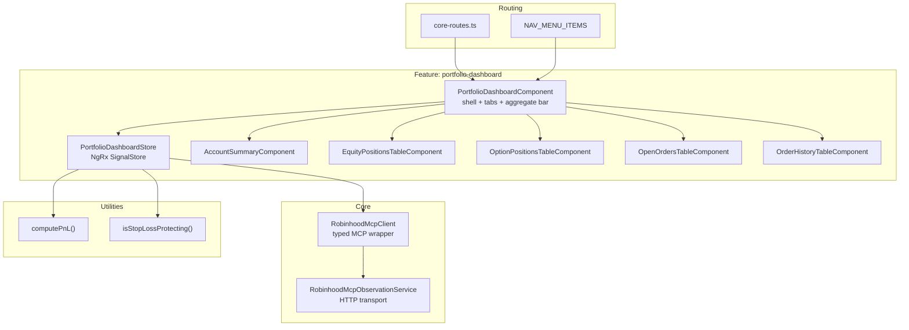

**Topic:** Portfolio Dashboard — Init Impl  
**Topic Slug:** `portfolio-dashboard`  
**Thread:** Portfolio Dashboard — Init Impl  
**Thread Slug:** `init-impl`  
**Issue:** #278  
**Thread Parent:** #274  
**Topic Parent:** #219  
**Domain:** PORTFOLIO  
**Type:** Implementation Plan  
**Status:** Draft  
**Created:** 2026-07-18  
**Last Updated:** 2026-07-18  

---

# Implementation Plan: Portfolio Dashboard — Init Impl (FE)

## Area

FE only. No BE or SHARED work. All MCP tools are already enabled in the backend proxy (`functions/src/rh-agent-mcp/tools/robinhood-tools.ts`). No new backend functions, Firestore schema changes, or callables.

## Architecture Overview



## Modules

### 1. RobinhoodMcpClient (core/robinhood-mcp/)

Typed wrapper over `RobinhoodMcpObservationService`. One method per MCP tool. Each method:
- Calls `executeTool(toolName, { args: { ... } })`
- Checks `result.success`
- Parses `result.parsed` into a typed return shape
- Throws a typed `RobinhoodMcpError` on failure

**Methods:**
- `getAccounts(): Promise<AccountInfo[]>` — filters to `agentic_allowed === true`
- `getPortfolio(accountNumber: string): Promise<PortfolioSnapshot>` — extracts value, exposure, cash, buying power, margin fields (if available)
- `getEquityPositions(accountNumber: string): Promise<EquityPosition[]>` — symbol, quantity, averageBuyPrice, sharesHeldForSells
- `getOptionPositions(accountNumber: string, nonzero?: boolean): Promise<OptionPosition[]>` — underlying, option type, strike, expiration, quantity, cost basis, instrument ID
- `getEquityQuotes(symbols: string[]): Promise<Map<string, EquityQuote>>` — deduplicates symbols, batches into ~20-symbol chunks, parallel fetch, merges into one map
- `getOptionQuotes(instrumentIds: string[]): Promise<Map<string, OptionQuote>>` — same batching pattern, keyed by instrument UUID
- `getEquityOrders(accountNumber: string, opts?: { state?: string }): Promise<BrokerOrder[]>` — symbol, side, type, state, quantity, fill price, created date
- `getOptionOrders(accountNumber: string, opts?: { state?: string }): Promise<BrokerOrder[]>` — same shape, may include option-specific fields (legs, chain_id)

**Types:** `AccountInfo`, `PortfolioSnapshot`, `EquityPosition`, `OptionPosition`, `EquityQuote`, `OptionQuote`, `BrokerOrder`, `RobinhoodMcpError`.

### 2. PortfolioDashboardStore (features/portfolio-dashboard/)

NgRx SignalStore, `providedIn: 'root'`.

**State:**
```typescript
interface DashboardState {
  accounts: AccountState[];
  selectedAccountIndex: number;
  showClosedPositions: boolean;
  showOrderHistory: boolean;
  globalLoading: boolean;
}

interface AccountState {
  accountNumber: string;
  accountName: string;
  accountType: string;
  portfolio: SectionData<PortfolioSnapshot>;
  equityPositions: SectionData<EquityPosition[]>;
  optionPositions: SectionData<OptionPosition[]>;
  equityQuotes: SectionData<Map<string, EquityQuote>>;
  optionQuotes: SectionData<Map<string, OptionQuote>>;
  equityOrders: SectionData<BrokerOrder[]>;
  optionOrders: SectionData<BrokerOrder[]>;
}

interface SectionData<T> {
  data: T | null;
  loading: boolean;
  error: string | null;
}
```

**Computed selectors:**
- `selectedAccount` — `accounts[selectedAccountIndex()]`
- `aggregateSummary` — reduces across all accounts: total value, total exposure, total cash, total PnL
- `equityPositionsWithPnL` — joins equity positions with equity quotes via `computePnL`
- `optionPositionsWithPnL` — joins option positions with option quotes via `computePnL`
- `openOrders` — filters equity + option orders to live/resting states, merges into one list
- `orderHistory` — filters to terminal states (filled, cancelled, rejected, failed)
- `stopLossProtectedSymbols` — `Set<string>` of symbols protected by stop-loss orders, computed in O(orders + positions)

**Methods:**
- `loadAccounts()` — calls `client.getAccounts()`, initializes `AccountState[]`
- `loadPhase1()` — for each account: `client.getPortfolio()` + `client.getEquityPositions()` + `client.getOptionPositions()` in parallel. Sets per-section loading/error.
- `loadPhase2()` — collects unique symbols/instrument IDs across all accounts, calls `client.getEquityQuotes()` + `client.getOptionQuotes()` once. Then for each account: `client.getEquityOrders()` + `client.getOptionOrders()` in parallel. Distributes quote results to each account's section.
- `retrySection(accountIndex, sectionName)` — re-fetches one section for one account
- `refresh()` — re-runs loadAccounts + loadPhase1 + loadPhase2
- `selectAccount(index)` — sets `selectedAccountIndex`
- `toggleClosedPositions()` — flips `showClosedPositions`
- `toggleOrderHistory()` — flips `showOrderHistory`

### 3. Pure utilities (features/portfolio-dashboard/utils/)

- `computePnL(costBasis: number, currentPrice: number, quantity: number, isShort: boolean): PnLResult` — returns `{ pnl: number, pnlPercent: number }`. Short positions invert the formula. Missing current price returns `{ pnl: null, pnlPercent: null }`.
- `isStopLossProtecting(order: BrokerOrder, positions: EquityPosition[]): boolean` — checks order type is `stop_market` or `stop_limit`, order side matches closing direction for an open position with the same symbol.
- `computeProtectedSymbols(orders: BrokerOrder[], positions: EquityPosition[]): Set<string>` — single-pass O(n+m) computation returning the set of protected symbols. Used by the store computed.

### 4. Routing + shell (features/portfolio-dashboard/ + core/)

- New `AppRoutes.PORTFOLIO_DASHBOARD = 'portfolio-dashboard'` in `core/common/interfaces.ts`
- New route in `core-routes.ts` with `authGuard`
- Default redirect changes from `positions-view` to `portfolio-dashboard`
- New `NAV_MENU_ITEMS` entry: name `portfolio-dashboard`, text "Portfolio Dashboard"
- `PortfolioDashboardComponent` — standalone, imports section components. Template: aggregate bar, refresh button, account tabs (MatTabGroup), per-tab sections.

### 5. Section components (features/portfolio-dashboard/components/)

Each is a standalone component receiving data via `@Input`, emitting retry via `@Output`.

- `AccountSummaryComponent` — `@Input() snapshot: PortfolioSnapshot | null`, `@Input() loading: boolean`, `@Input() error: string | null`, `@Output() retry: void`
- `EquityPositionsTableComponent` — `@Input() positions: EquityPositionWithPnL[]`, `@Input() loading`, `@Input() error`, `@Input() showClosed`, `@Output() retry`, `@Output() toggleClosed`
- `OptionPositionsTableComponent` — same pattern, option-specific columns
- `OpenOrdersTableComponent` — `@Input() orders: BrokerOrder[]`, `@Input() protectedSymbols: Set<string>`, `@Input() loading`, `@Input() error`, `@Output() retry`
- `OrderHistoryTableComponent` — `@Input() orders: BrokerOrder[]`, `@Input() loading`, `@Input() error`, `@Output() retry`

### 6. Integration + wiring

- Connect store to shell component via `inject(PortfolioDashboardStore)`
- Wire `loadAccounts()` + `loadPhase1()` on component init
- Wire `loadPhase2()` after phase 1 completes
- Wire refresh button to `store.refresh()`
- Wire tab selection to `store.selectAccount(index)`
- Wire toggles to `store.toggleClosedPositions()` / `store.toggleOrderHistory()`
- Wire retry outputs to `store.retrySection(accountIndex, sectionName)`
- Per-section loading/error display
- Empty states (no accounts, no positions, no orders)

## Task breakdown

| # | Task | Depends on | Stage |
|---|---|---|---|
| 1 | RobinhoodMcpClient + typed return shapes + quote batching | (none) | 4_BACKLOG |
| 2 | Pure utilities: computePnL, isStopLossProtecting, computeProtectedSymbols | (none) | 4_BACKLOG |
| 3 | PortfolioDashboardStore: state shape, computed selectors, load methods, retry | 1, 2 | 4_BACKLOG |
| 4 | Routing + shell: AppRoutes enum, core-routes, NAV_MENU_ITEMS, default redirect, PortfolioDashboardComponent shell | 3 | 4_BACKLOG |
| 5 | Section components: AccountSummary, EquityPositionsTable, OptionPositionsTable, OpenOrdersTable, OrderHistoryTable | 3 | 4_BACKLOG |
| 6 | Integration + wiring: connect store to components, loading/error states, toggles, pre-fetch, empty states | 4, 5 | 4_BACKLOG |

## Cross-area dependencies

None. This is FE-only. The backend MCP proxy already supports all required tools.

## Open technical questions

- Whether `get_portfolio` returns margin exposure/capability fields. Must be verified by inspecting the actual MCP response during implementation. If not available, margin may be derivable from `get_accounts` account type, or may need to be deferred.
- Exact response shape of `get_option_positions` — fields for cost basis, instrument ID, strike, expiration, option type. Must be verified during implementation.
- Whether `get_equity_orders` and `get_option_orders` return enough fields to identify stop-loss orders (order type field) and match to positions by symbol.
