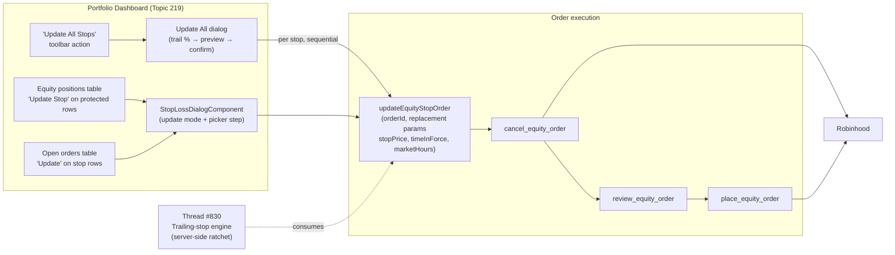

# PRD: Portfolio Dashboard — Update Stop Loss

**Topic:** Portfolio Dashboard  
**Topic Slug:** portfolio-dashboard  
**Thread:** Portfolio Dashboard — Update Stop Loss  
**Thread Slug:** update-stop-loss  
**Issue:** #832  
**Thread Parent:** #829  
**Topic Parent:** #219  
**Domain:** PORTFOLIO  
**Type:** PRD  
**Status:** Approved  
**Created:** 2026-10-06  
**Last Updated:** 2026-10-07  

## Problem Statement

A trader with a protected equity position cannot adjust its stop price from the Portfolio Dashboard. Today the row action reads "Add Stop" and is *disabled* for protected positions — the only way to move a stop is to find the order in Open Orders, cancel it, and manually re-place it (recomputing price and re-entering quantity by hand). As the position gains, the trader wants to ratchet the stop up with the same one-dialog convenience that Add Stop provides.

## Solution

The disabled "Add Stop" action on protected rows becomes an enabled "Update Stop" action. It opens the same stop-loss dialog, prefilled with the position's current stop price. Submitting performs an **Update Stop**: cancel the existing protective stop order, then place a new stop-market order at the entered price — the identical flow to Add Stop, minus the manual cancel.

Update Stop is a **per-order** operation: it replaces one specific broker order. When a symbol has multiple protective stops, the dialog first asks which one to update. The same Update action also appears on stop-order rows in the Open Orders table, where the target order is the row itself — no picker needed.

The cancel-then-place sequence is packaged as a reusable primitive (`updateEquityStopOrder`) in the order-execution layer. This primitive is the foundation for the Trailing Stops thread (Topic #828, Thread #830): a trailing stop is Update Stop invoked repeatedly as the mark ratchets. This Thread builds the primitive and the manual UX; Thread #830 builds the automated server-side engine on top of it.

The Thread also ships **Update All Stops** — a preview-gated batch ratchet. The trader enters a trail percentage; the dialog lists every updatable stop in the selected account with its computed new price; on confirm, each stop is updated sequentially via the same primitive, but only where the computed price *tightens* the stop (a stop never ratchets down). This is a manual, one-shot trailing pass — the on-demand version of what Thread #830 automates.

Finally, the shared stop-loss form gains the full order-ticket parameters it currently lacks: today it hardcodes `timeInForce: 'gtc'` and `marketHours: 'regular_hours'` in its preview and emits only a stop price. The form gains the same Day/GTC and Regular/Extended/All Day controls the main order ticket exposes, and emits them in its payload — so Add Stop, Update Stop, and Update All all produce complete tickets.

## User Stories

1. As a trader, I want the row action on a protected position to read "Update Stop" and be enabled, so that I can adjust my stop from the same place I created it.
   - *Acceptance:* A position whose symbol has an active protective stop shows an enabled "Update Stop" action in the same slot where "Add Stop" appears on unprotected rows.

2. As a trader, I want the update dialog to show my current stop price and prefill the form with it, so that I can see what I'm changing and only adjust the delta.
   - *Acceptance:* The dialog opens titled "Update Stop Loss — {symbol}", displays the existing stop price, and the stop-price field starts at the current value. The time-in-force and market-hours controls prefill from the existing order's values (defaulting to GTC / regular hours when the order doesn't report them).

3. As a trader, I want submitting the dialog to replace my stop in one step, so that I don't have to cancel and re-enter it manually.
   - *Acceptance:* On submit, the existing stop order is cancelled and a new stop-market sell order is placed at the entered price for the full position quantity, without leaving the dialog.

4. As a trader, I want confirmation that the update completed and the dashboard to reflect it, so that I can trust the protection is in place.
   - *Acceptance:* Success shows the new stop price in the dialog's success state; dismissing refreshes positions and open orders.

5. As a trader with multiple stops on one symbol (e.g., different retracement levels), I want to pick which stop to update, so that my other levels stay untouched.
   - *Acceptance:* When more than one updatable protective stop exists for the symbol, the dialog first presents each stop (price, quantity) for selection; only the chosen order is replaced.

6. As a trader, I want an Update action directly on stop orders in Open Orders, so that I can adjust a specific order without going through the position row.
   - *Acceptance:* Updatable protective stop rows in the open-orders table offer an Update action that opens the dialog already targeted at that order — no picker step.

7. As a trader, I want transient failures retried automatically, so that a network blip doesn't leave my stop half-updated.
   - *Acceptance:* When the new-order placement fails with a retryable error, the primitive retries the same ticket (same `refId`) a bounded number of times before surfacing an error.

8. As a trader, I want to be clearly told if my position ended up unprotected, so that I can act on it immediately.
   - *Acceptance:* If the cancel succeeded but all place attempts fail, the error state states plainly that the previous stop was cancelled and the position is currently unprotected, with a manual retry action.

9. As a trader, I want the same safety gating as Add Stop, so that updates can't happen on accounts or position types that don't support them.
   - *Acceptance:* Update Stop appears only on equity positions in agent-enabled accounts — the same gating that governs Add Stop today.

10. As a trader, I want protection against accidental double-placement, so that a retry can't create two stops.
    - *Acceptance:* Retries reuse the same `refId` idempotency key, matching the existing submit/retry pattern.

11. As a trader, I want to raise every stop in my account to a trail percentage below the current price in one action, so that a broad rally can be locked in without touching each position.
    - *Acceptance:* A dashboard-level "Update All Stops" action opens a dialog requesting a trail %.

12. As a trader, I want to preview the computed new price for every stop before anything is cancelled, so that a typo'd percentage can't rewrite my whole account.
    - *Acceptance:* The dialog lists each updatable stop (symbol, current stop, computed new stop, update/skip disposition) and executes nothing until Confirm.

13. As a trader, I want stops already tighter than the computed level left alone, so that "update all" can never loosen my protection.
    - *Acceptance:* Stops whose current price is already above the computed level are marked "skipped — already tighter" in the preview and are not touched on confirm.

14. As a trader, I want a per-order outcome summary after the batch runs, so that I know exactly which positions ended up unprotected.
    - *Acceptance:* After execution the dialog reports updated / skipped / failed per symbol; any cancel-succeeded-place-failed symbol is flagged unprotected, with a retry affordance for that order.

15. As a trader, I want the batch to process orders one at a time, so that a mid-batch failure doesn't leave the account in an unknown state.
    - *Acceptance:* Orders update sequentially, each through the same primitive (cancel → review → place with bounded auto-retry). An unrecoverable per-order failure aborts the remaining queue and reports which stops completed, which failed, and which never ran — a systemic failure must not keep cancelling healthy stops.

16. As a trader, I want the stop form to expose every order parameter the main ticket does — time-in-force and market hours — so that Add/Update Stop tickets aren't silently pinned to hidden defaults.
   - *Acceptance:* The form shows Day/GTC and Regular/Extended/All Day controls matching the order ticket's pills; the preview JSON and the emitted submit payload carry the selected `timeInForce` and `marketHours` (`symbol`, `side`, `orderType`, `quantity`, `stopPrice`, `stopLossPercent`, `timeInForce`, `marketHours`, `accountNumber` — the full ticket shape). **Amended during #886:** RH rejects non-regular stop orders (`Extended hours orders cannot have stop price`), so Extended/All Day render disabled with a hint — the pills stay visible to communicate the constraint, and `marketHours` is still carried in the payload (`'regular_hours'` in practice).

## Implementation Decisions

- **Primitive:** `OrderExecutionService` gains an `updateEquityStopOrder` method — per-order signature taking the target order id plus the replacement order parameters (stop price, `timeInForce`, `marketHours`), implemented as `cancel_equity_order` then `review_equity_order` → `place_equity_order`. A bare `(orderId, newStopPrice)` signature would silently drop the original order's TIF/hours — the parameters travel with the call. This is the shared foundation Thread #830 (Trailing Stops) builds on.
- **Ordering:** cancel-first, always. Robinhood commits the position's shares to the resting order, so placing the replacement first is rejected. The #685 OOMA matrix probes (X4a/X4b "cancel+replace" pattern) are the live verification path for this assumption.
- **Updatable set:** only market-type protective stops — `stop_market`, or `market`/`limit`-typed orders carrying a `stopPrice` (the Robinhood stop-order shapes). `stop_limit` orders are not updatable through this path: silently downgrading them to stop-market would discard the user's limit protection. They remain cancellable via Open Orders.
- **Replacement shape:** the new order carries the full ticket parameter set (`stop_loss` order type, full truncated position quantity) with `timeInForce` and `marketHours` from the dialog's controls — prefilled from the original order's values in update mode. Stop orders default to GTC: anything shorter is transient protection, and `Update All` always writes GTC while preserving each original order's market-hours setting.
- **Quantity:** full truncated position quantity, same as Add Stop. An intentional partial stop becomes full-quantity on update — accepted per product decision.
- **Full ticket params:** `StopLossFormComponent` (shared) gains Day/GTC and Regular/Extended/All Day controls identical to `OrderTicketComponent`'s pills, includes them in its preview object, and emits them in the `placeStopLoss` payload; `buildStopLossTicketBase`/`buildPositionStopLossTicket` accept and thread them through. Both Add Stop and Update Stop inherit this automatically.
- **UI:** `StopLossDialogComponent` gains an update mode — accepts the target order alongside position context, changes title/labels, prefills stop price and the order's `timeInForce`/`marketHours`, and calls the primitive instead of `submitEquityOrder`. A picker step renders first only when multiple updatable stops match the symbol.
- **Entry points:** positions table (relabeled action) and open-orders table (per-row Update on updatable stop orders). Same dialog in both.
- **Retry:** bounded auto-retry on retryable errors using the same `refId`; non-retryable rejections surface immediately. Terminal failure shows the unprotected warning.
- **Update All Stops:** a batch orchestration layer over the same per-order primitive — not a second mechanism. Entry point is a toolbar-level action on the positions view, scoped to the selected agentic account. Computes `new stop = currentPrice × (1 − pct%)` per protected symbol from the dashboard's position prices; a stop updates only when that tightens it. Preview dialog lists every candidate (symbol, current stop, computed price, update/skip) before any mutation; confirm runs orders sequentially and reports per-order outcomes. An unrecoverable failure aborts the remaining queue.

## Testing Decisions

- Good tests assert external behavior: emitted outputs, dialog state transitions, service call order (cancel → review → place), and rendered labels — not internal implementation.
- **Table specs** (existing `equity-positions-table` / `open-orders-table` harnesses): "Update Stop" enabled on protected rows, absent/disabled where expected, emits the position/order.
- **Dialog specs** (existing `stop-loss-dialog` harness): update-mode title, prefill, picker step when multiple stops, calls the primitive with the picked order's id.
- **Form specs** (existing `stop-loss-form` harness): TIF and market-hours controls render, selecting values updates the preview JSON and the emitted `placeStopLoss` payload, and `buildStopLossTicketBase` writes the selected values onto the ticket; update-mode prefill reflects the original order's TIF/hours.
- **Service specs** (existing `order-execution.service` style): call sequence cancel→review→place, retry on retryable failure reusing `refId`, non-retryable surfacing, cancel-failure short-circuits place.
- **Selector specs** (existing `portfolio-dashboard.store.selectors` pattern): updatable-stop identification per symbol, exclusion of `stop_limit`.
- **Batch specs:** ratchet computation (tighten-only, skip already-tighter), preview list construction, sequential dispatch order, abort-on-failure, per-order summary — all testable with the `OrderExecutionService` mocked.

## Technical Context

- **Unprotected window:** between the cancel and the place the position has no stop (~one round-trip). Unavoidable — the broker has no order-amend operation and rejects a second sell on committed shares. Update All serializes this window per order; it also repeats on every trailing-stop repricing once Thread #830 is live.
- **Stale prices:** the batch computes new stops from the dashboard's last-known position prices, which may lag the market; the preview shows the price basis used.
- **Data freshness:** protection state is derived from the open-orders snapshot; a just-placed stop may take a refresh to appear.
- **GTC policy:** stop orders are always GTC by product decision — a shorter-lived stop is transient protection. `Update All` writes GTC on every replacement; the manual dialog prefills the original order's TIF so a `gfd` original surfaces visibly rather than silently upgrading.
- **Extended-hours stops (unverified):** the form offers Regular/Extended/All Day matching the main order ticket, but whether Robinhood accepts `extended_hours`/`all_day_hours` on stop orders is not verified — RH may reject at place time, which surfaces through the normal failure path. Worth a live check; if rejected, the control can be constrained to Regular for stop orders.

## Out of Scope

- Automated trailing repricing — Thread #830 (Topic #828) consumes the primitive this Thread builds.
- `stop_limit` update support (requires a limit-price input and preserved limit semantics).
- Option positions, non-agentic accounts, partial-quantity control.
- Consolidating same-level duplicate stops — stays manual via Open Orders.
- Cross-account batch updates (Update All is scoped to the selected agentic account), dollar-distance trail mode (percent only), and deliberately loosening stops via the batch (ratchet is tighten-only).

## System Context

