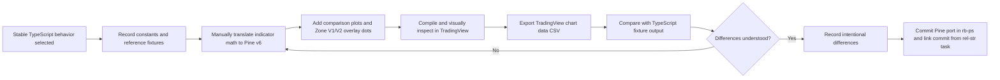

**Topic:** Export ST indicators to PineScript for TradingView  
**Issue:** #222  
**Topic Parent:** #221  
**Domain:** SAVANT-TRADER  
**Type:** PRD  
**Status:** Approved  
**Created:** 2026-09-05  
**Last Updated:** 2026-09-05  

# Export ST Indicators to PineScript for TradingView

## Summary

Create a standalone Pine Script v6 indicator that ports a selected, stable version of the Savant Trader (ST) indicator system for local use in TradingView. The script will display the four existing ST indicator families and reproduce the useful Zone V1/V2 signal-event dots in the main price pane.

The Pine script is a deliberate point-in-time port, not a permanently synchronized second implementation. TypeScript remains the active implementation during normal ST development and experimentation. When the ST behavior is considered ready for TradingView, the selected behavior is frozen, manually translated to Pine, and validated through visual comparison and exported data comparison.

## Goals

- Make the four ST indicator families available as one local TradingView indicator.
- Preserve the current ST calculations and fixed defaults at the point of porting.
- Show Zone V1/V2 signal-event dots directly on the main price pane.
- Paint developing higher-timeframe values on interim bars instead of waiting for higher-timeframe candle confirmation.
- Keep the final Pine source in the `rb-ps` repository so it can be opened in the IDE and copied into TradingView.
- Use the existing TypeScript implementation and direct visual comparison as the validation reference.
- Define a repeatable port-and-validation process for future deliberate ports.

## Non-goals

- No in-app Pine export or download workflow.
- No data snapshot export as a product feature.
- No public or private TradingView publishing workflow.
- No requirement that every future TypeScript indicator change update Pine in the same task or commit.
- No Trend Strength dot-marker overlay in the main price pane.
- No Pine user inputs for ST parameters in the first version.
- No ST-Trigger-Band port in this Topic; it is not part of the four currently implemented families.

## Scope

The single Pine indicator will contain:

1. **ST-Trend-Bands** — four smoothed Heikin-Ashi-derived bands overlaid on price.
2. **ST-Zone V1** — zone classification plotted in a lower pane.
3. **ST-Zone V2** — zone classification plotted in a lower pane.
4. **ST-Trend-Strength** — DI+/DI− and related strength plots in a lower pane.
5. **Zone signal-event overlay** — V1 and V2 long/short event dots plotted on the main price pane.

The first port uses the established fixed parameters:

| Parameter | Value |
|---|---:|
| CTF fast length | 5 |
| CTF slow length | 10 |
| HTF multiplier | 3 |
| DI period | 14 |
| DI upper threshold | +10 |
| DI lower threshold | -10 |

These values are implementation defaults, not user-facing Pine inputs. Parameter controls may be added in a later Topic or refinement.

## User stories and acceptance criteria

### Story 1: View all ST indicator families in TradingView

As a Savant Trader user, I want one local Pine indicator containing the ST indicator families so that I can inspect the same trend, zone, and strength context in TradingView.

**Acceptance criteria**

- The checked-in Pine file compiles in TradingView Pine v6.
- A user can add the one script to a TradingView chart.
- Trend Bands render in the main price pane.
- Zone V1 and Zone V2 render their discrete zone series in a lower pane.
- Trend Strength renders its intended DI/strength series in a lower pane.
- The script uses the fixed ST parameter values listed in this PRD.
- The script does not require an app login, backend endpoint, or exported data file at runtime.

### Story 2: See Zone V1/V2 signal events on price

As a user reviewing price action, I want Zone V1/V2 signal events visible on the main price chart so that I can identify the equivalent of the app's current dot markers without switching panes.

**Acceptance criteria**

- Zone V1 and Zone V2 event dots are plotted only for signal events, not on every bar.
- Long events appear below the relevant candle and short events appear above it.
- Marker placement uses the ST convention of an ATR-based offset equivalent to `2.5 × ATR`.
- V1 and V2 remain visually distinguishable.
- Long and short directions remain visually distinguishable.
- Trend Strength does not produce a main-pane dot overlay in v1.
- The marker event bar and direction visually match the selected TypeScript behavior, allowing for the documented realtime/developing-HTF behavior.

### Story 3: Paint current higher-timeframe values

As a user monitoring an active chart, I want interim bars to use current developing higher-timeframe values so that the indicator responds during the active higher-timeframe candle.

**Acceptance criteria**

- The Pine script uses current/developing higher-timeframe values for interim bars.
- The script does not wait for higher-timeframe candle confirmation before painting.
- The documentation explicitly states that unconfirmed higher-timeframe values may change as the higher-timeframe candle develops.
- The validation plan compares realtime/developing behavior separately from confirmed historical values.

### Story 4: Port a selected stable ST version

As a maintainer, I want a deliberate port workflow so that Pine is created when ST behavior is ready rather than becoming a burden during every experiment.

**Acceptance criteria**

- TypeScript remains the active development implementation during experimentation.
- A port begins by recording the selected TypeScript behavior/version and fixed parameters.
- The Pine implementation is manually translated from the selected TypeScript algorithms and existing ST reference material.
- The final `.pine` file is committed in `rb-ps` with the Pine implementation work and is copyable from the IDE.
- The final Pine file and any optional comparison notes are maintained in `rb-ps`.
- Future TypeScript changes do not require Pine changes unless a new deliberate port is initiated.
- The port records intentional differences, including any Pine/runtime limitations and developing-HTF behavior.

### Story 5: Validate the Pine port

As a maintainer, I want to compare the standalone Pine indicator against the existing TypeScript behavior so that I can identify visual or calculation drift before relying on it.

**Acceptance criteria**

- The Pine script exposes the required plots and overlays without any app or backend dependency.
- Visual comparison covers band shape, zone state, trend-strength shape, and V1/V2 marker placement.
- Optional TradingView chart-data CSV comparison can be used when visual comparison is insufficient.
- Differences are classified as a defect, an expected realtime/developing-HTF difference, or an accepted Pine/runtime limitation.
- Validation notes record the selected TypeScript behavior, TradingView symbol/timeframe assumptions, and known differences.

## Technical context

- The existing backend indicator implementation is in `functions/src/indicators/` and `functions/src/st-cloud-function/indicator-computation.ts`.
- The existing frontend chart implementation is in `src/app/features/shared/components/flex-chart/indicators/`.
- The migration notes identify the original ST Pine sources and non-negotiable constants in `docs/MIGRATION-FROM-RB-PS.md`.
- The original Pine repository is `C:\aa\projects\rb-ps`, remote `https://github.com/rinebob/rb-ps.git`, and contains the historical Pine libraries and indicator wrappers. The Pine implementation and its commit belong there; the Topic remains managed from `rel-str`.
- Trend Bands use four bands: two chart-timeframe bands and two higher-timeframe bands with multiplier `3`.
- Zone values are discrete values from `-3` through `+3`.
- Zone event dots are price-pane markers positioned using ATR offset from the signal candle.
- Developing higher-timeframe values are intentionally allowed to repaint while the higher-timeframe candle is open. This is required for timely display and is not treated as a defect.
- TradingView's chart-data export can provide CSV values for indicator plots after the chart has loaded sufficient history; the comparison process must ensure the same symbol, timeframe, visible history, and session assumptions are used.

## Porting workflow

## Validation matrix

| Area | TypeScript reference | Pine validation |
|---|---|---|
| Trend Bands | Four band OHLC/mid/direction series | Main-pane candle/band plots and CSV export |
| Zone V1 | Per-bar zone and event markers | Lower-pane zone plot and main-pane V1 dots |
| Zone V2 | Per-bar zone and event markers | Lower-pane zone plot and main-pane V2 dots |
| Trend Strength | DI+/DI−/strength series | Lower-pane plots and CSV export |
| HTF behavior | Current implementation output | Confirmed historical and developing realtime comparisons |

## Open questions for implementation

- Which exact symbols, chart timeframes, and date ranges should become the canonical parity fixtures?
- Does the first Pine port need all four Trend Band candle bodies, or are band midlines sufficient for the initial TradingView presentation?
- Which existing TypeScript signal-detection rules define the V1/V2 event dots to port, and which are display-only backend artifacts?
- How should Pine-specific limitations be recorded when TradingView's available history or realtime execution differs from the app's cached-bar computation?
