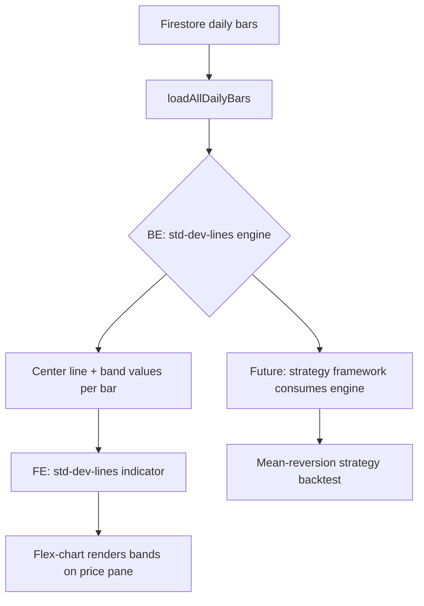

**Topic:** Trading Indicator Library  
**Topic Slug:** indicator-lib  
**Thread:** Standard Deviation Lines  
**Thread Slug:** std-dev-lines  
**Issue:** #263  
**Thread Parent:** #262  
**Topic Parent:** #261  
**Domain:** INDICATOR-LIB  
**Type:** PRD  
**Status:** Approved  
**Created:** 2026-09-09  
**Last Updated:** 2026-09-09  

---

## Problem Statement

Traders need to identify when price has deviated far enough from its mean to
expect a mean-reversion move. Without standard deviation bands plotted on the
chart, there is no systematic way to see how far price has stretched relative
to its recent average, and no calculation engine for strategies to consume
deviation signals programmatically.

## Solution

A standard deviation lines indicator that computes a configurable moving
average (SMA or EMA) as the center line, then plots two independent sets of
deviation bands above and below it:

1. **Standard dev lines** at 0.5, 1.0, 1.5, 2.0, 2.5 standard deviations
2. **Fibonacci dev lines** at 0.618, 1.618, 2.618 standard deviations

Both sets can be shown independently or combined. In combined view, fills
are rendered between the nearest regular and Fibonacci lines, creating
banded zones that highlight the gap between statistical and Fibonacci
deviation levels. When price exceeds the outer bands (2.0-2.5 std dev or
1.618-2.618 fib), the trader looks for mean-reversion entries.

The indicator has two components:

- **BE computation engine** — a pure module that takes OHLCV bars and
  configuration parameters, returns the center line and all band values per
  bar. Strategies can import this engine directly for systematic backtesting.
- **FE chart indicator** — follows the existing `st-trend-bands` pattern,
  registers in the `StIndicator` enum, and renders the bands on the flex-chart
  component.

## User Stories

1. As a trader, I want to see standard deviation lines on the price chart, so
   that I can visually identify when price has stretched far from its mean.

2. As a trader, I want to choose between SMA and EMA as the center line
   calculation, so that I can match the indicator to my preferred smoothing
   style.

3. As a trader, I want to configure the moving average period, so that I can
   tune the indicator to different timeframes (e.g., 50-day or 100-day).

4. As a trader, I want to toggle between standard dev lines (0.5-2.5) and
   Fibonacci dev lines (0.618-2.618), so that I can focus on one set when I
   don't need both.

5. As a trader, I want to view both sets combined with fills between the
   nearest regular and Fibonacci lines, so that I can see the banded zones
   where statistical and Fibonacci deviation levels diverge.

6. As a trader, I want to independently enable/disable each set of deviation
   lines, so that I can reduce visual clutter when I only need one set.

7. As a trader, I want the bands to update continuously as new bars arrive, so
   that I always see the current deviation context.

8. As a strategy developer, I want a pure computation engine that takes OHLCV
   bars and returns band values per bar, so that I can backtest mean-reversion
   strategies programmatically.

9. As a strategy developer, I want the engine to be configurable (MA type,
   period, deviation levels), so that I can sweep parameters systematically.

10. As a developer, I want the engine to have extension points for future VWAP
    support, so that adding a VWAP center line later doesn't require rewriting
    the module.

11. As a developer, I want the chart indicator to follow the existing
    `st-trend-bands` pattern (IndicatorOption + IndicatorCalculator), so that
    it integrates cleanly with the flex-chart component.

## Implementation Decisions

- **BE engine location:** `functions/src/indicators/std-dev-lines.ts` — pure
  computation, no Firestore, no I/O. Follows the `st-trend-bands.ts` pattern.

- **Shared primitives:** Reuse `emaSeries` and other primitives from
  `functions/src/indicators/primitives.ts`. Add `smaSeries` if not already
  present.

- **Engine interface:** Takes `OHLCV[]` and a config object, returns a result
  with the center line array and band value arrays for each configured level.
  Config includes MA type, period, and which deviation levels to compute.

- **FE indicator location:**
  `src/app/features/shared/components/flex-chart/indicators/std-dev-lines.indicator.ts`
  — exports `IndicatorOption` and `IndicatorCalculator` matching the
  existing pattern.

- **StIndicator enum:** Add `STD_DEV_LINES = 'std-dev-lines'` to the enum in
  `flex-chart.types.ts`.

- **Chart rendering:** Bands render as continuous lines on the overlay pane
  (same pane as price), using the price axis scale. Center line rendered as
  a distinct line; upper and lower bands rendered as paired lines. Supports
  three display modes: regular-only, Fibonacci-only, or combined. In
  combined mode, fills are rendered between the nearest regular and Fibonacci
  lines to create banded zones.

- **Default parameters:**
  - MA type: SMA
  - MA period: 50
  - Std dev levels: 0.5, 1.0, 1.5, 2.0, 2.5
  - Fib dev levels: 0.618, 1.618, 2.618

- **Extension points:** The engine's config accepts a `centerLineType`
  field (`'sma' | 'ema'`). Future values (`'vwap'`, `'session-vwap'`) can be
  added without changing the engine's output interface.

- **Integration with #106:** Standalone for now. When a specific
  mean-reversion strategy emerges, a new Thread under #106 (or here) will
  wire the engine into the strategy framework.

## Testing Decisions

- **BE engine unit tests:** Pure function tests with synthetic OHLCV bars
  and known prices. Assert exact band values at each level. Cover SMA and
  EMA center lines, edge cases (insufficient bars for period, single bar,
  empty input), and configuration variations. Follow the
  `open-close-returns.test.ts` pattern from #106.

- **FE indicator:** Verified by running the dev server and confirming the
  bands render correctly on the chart — check directly via browser or walk
  the user through what they should see. No automated E2E test unless the
  project has an existing E2E convention.

- **Verification script:** A script that loads real SPY/QQQ daily bars from
  Firestore, runs the engine, and prints the center line and band values for
  a sample of dates to confirm correctness against real data. Follows the
  `strat-lib-257-compute.ts` pattern.

## Out of Scope

- VWAP center line (future extension point only — not implemented in this
  Thread)
- Intraday bar support (daily bars only for now)
- Automated mean-reversion strategy backtest (standalone indicator only —
  strategy integration is a future Thread)
- Alerts or notifications when price crosses bands
- Multi-timeframe analysis (HTF bands like `st-trend-bands` has)

## Technical Context

- **Data source:** Daily OHLCV bars from Firestore
  (`symbol-data/{symbol}/daily/`), loaded via the existing
  `loadAllDailyBars` function.
- **Chart framework:** Syncfusion charts via the `flex-chart` component.
  The indicator must conform to the `IndicatorOption` and
  `IndicatorCalculator` interfaces defined in `flex-chart.types.ts`.
- **Existing indicator pattern:** `st-trend-bands.indicator.ts` is the
  reference implementation — same file structure, same export pattern, same
  chart integration approach.

## System Context

## Further Notes

- The Fibonacci levels (0.618, 1.618, 2.618) are applied as multipliers
  of the standard deviation, not as direct price levels. So "1.618 fib dev
  line" means the band at 1.618 × stdDev from the center line.
- The 1.0 level is in the standard set only, avoiding overlap between the two
  sets when both are displayed.
- The engine should be pure (no side effects, no I/O) to match the #106
  computation module philosophy and enable unit testing without Firestore.
