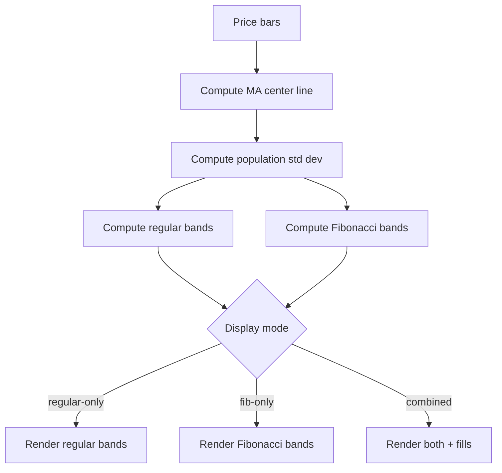

**Topic:** Trading Indicator Library  
**Topic Slug:** indicator-lib  
**Thread:** Standard Deviation Lines  
**Thread Slug:** std-dev-lines  
**Issue:** #264  
**Thread Parent:** #262  
**Topic Parent:** #261  
**Domain:** INDICATOR-LIB  
**Type:** Implementation Plan  
**Status:** Complete  
**Created:** 2026-09-09  
**Last Updated:** 2026-09-09  

---

## Overview

Standard Deviation Lines indicator with BE computation engine and FE chart
indicator. BE-only and FE-only areas — no SHARED.

## Areas

- **BE** — computation engine, unit tests, verification script
- **FE** — chart indicator with inline calculation, three display modes

## BE Implementation Plan

### Module: Standard Deviation Lines Engine

Location: `functions/src/indicators/std-dev-lines.ts`

A pure module with no Firestore or I/O dependencies. Follows the
`st-trend-bands.ts` pattern. Exports:

- **Types:**
  - `StdDevLinesConfig` — config object with MA type, period, std dev
    levels, and fib dev levels.
  - `StdDevLinesResult` — center line array and band value arrays for each
    configured level (both upper and lower).

- **`computeStdDevLines(bars: OHLCV[], config: StdDevLinesConfig): StdDevLinesResult`**
  - Computes SMA or EMA center line using `smaSeries` / `emaSeries` from
    `primitives.ts`.
  - Computes population standard deviation over the same period as the MA.
  - For each configured std dev level (default: 0.5, 1.0, 1.5, 2.0, 2.5),
    computes upper and lower band values: `center ± level × stdDev`.
  - For each configured fib dev level (default: 0.618, 1.618, 2.618),
    computes upper and lower band values: `center ± level × stdDev`.
  - Returns NaN for insufficient data (first `period - 1` bars).

- **`StdDevLinesConfig` fields:**
  - `centerLineType: 'sma' | 'ema'` (extension point for future `'vwap'`)
  - `period: number`
  - `stdDevLevels: number[]` (default: [0.5, 1.0, 1.5, 2.0, 2.5])
  - `fibDevLevels: number[]` (default: [0.618, 1.618, 2.618])

### Standard Deviation Calculation

Population standard deviation (divide by N, not N-1). The std dev
calculation matches the center line type:

- **SMA center line:** rolling-window population std dev over `period` bars,
  measuring dispersion from the SMA value.
- **EMA center line:** exponentially-weighted std dev using the same decay
  factor (k = 2/(period+1)) as the EMA, so recent prices contribute more to
  the volatility. This keeps the bands visually consistent with the EMA
  center line.

For SMA, at each bar `i` where `i >= period - 1`:

```
mean = SMA at bar i
stdDev = sqrt( sum( (close[j] - mean)^2 for j in [i-period+1, i] ) / period )
```

For EMA, seeded at bar `period - 1` with the population variance of the
first `period` closes around the EMA seed, then updated with EWMA:

```
k = 2 / (period + 1)
diff[i] = close[i] - EMA[i]
var[i] = k * diff[i]^2 + (1 - k) * var[i-1]
stdDev[i] = sqrt(var[i])
```

### Verification Script

Location: `functions/scripts/verify/indicator-lib-265-engine.ts`

Follows the `strat-lib-257-compute.ts` pattern:

- Loads SPY daily bars from Firestore via `loadAllDailyBars`.
- Calls `computeStdDevLines` with default config.
- Prints center line and band values for a sample of dates.
- Validates structure: center line array length, band arrays, NaN handling
  for first `period - 1` bars.
- Confirms band values are symmetric around the center line.

## FE Implementation Plan

### Module: Standard Deviation Lines Chart Indicator

Location:
`src/app/features/shared/components/flex-chart/indicators/std-dev-lines.indicator.ts`

Follows the `st-trend-bands.indicator.ts` pattern. Inline calculation for
visual verification (no import from functions package — matches all existing
ST indicators).

- **`STD_DEV_LINES_INDICATOR: IndicatorOption`** — indicator config with:
  - `id: 'std-dev-lines'`
  - `label: 'Std Dev Lines'`
  - `type: StIndicator.STD_DEV_LINES`
  - `defaultPane: 'overlay'`
  - `axisScale: 'price'`
  - Params: `period` (default 50), `maType` (default 'sma')

- **`calculateStdDevLines: IndicatorCalculator`** — inline calculation:
  - Computes SMA or EMA center line.
  - Computes population std dev over the period window.
  - Returns per-bar data points with center line and band values.
  - Supports three display modes via params: `regular-only`, `fib-only`,
    `combined`.

- **`StIndicator` enum** — add `STD_DEV_LINES = 'std-dev-lines'` to
  `flex-chart.types.ts`.

### Chart Rendering

- Center line: rendered as a distinct line series.
- Regular bands: 5 pairs of lines (upper/lower at each std dev level).
- Fibonacci bands: 3 pairs of lines (upper/lower at each fib level).
- Combined mode: fills between nearest regular and Fibonacci lines to
  create banded zones.
- All bands render on the overlay pane (same pane as price), using the
  price axis scale.

### Process Flow



## Cross-Area Boundaries

- FE depends on BE for the engine interface (config shape, result shape) to
  mirror in the inline calculation. FE is blocked by BE.
- No SHARED area — the FE has its own inline copy of the calculation.

## Risks

- **Standard deviation edge cases:** First `period - 1` bars have no std dev.
  Handle with NaN consistently across BE and FE.
- **Combined mode fills:** Syncfusion chart may not support arbitrary fill
  regions between non-adjacent series. May need custom rendering or a
  workaround. Validate during FE implementation.
- **Performance:** Computing std dev for every bar on every chart update
  could be slow for large datasets. The inline calculation should use the
  same rolling-window optimization as `smaSeries`.
