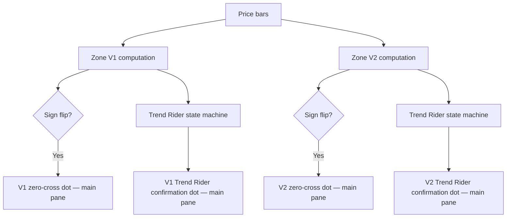

**Topic:** Trading Indicator Library  
**Topic Slug:** indicator-lib  
**Thread:** Trend Rider Zero Cross  
**Thread Slug:** trend-rider-zero-cross  
**Issue:** #305  
**Thread Parent:** #304  
**Topic Parent:** #261  
**Domain:** INDICATOR-LIB  
**Type:** PRD  
**Status:** Approved  
**Created:** 2026-09-13  
**Last Updated:** 2026-09-13  

---

## Problem Statement

The existing Trend Rider signal dots render in the main price pane, but
those dots only fire after the zone is already established (≥ +1 for
longs, ≤ -1 for shorts) and then upticks/downticks again. This delays
entry until the trend is confirmed, causing traders to miss the earliest
opportunity — the moment the zone crosses the zero line and the regime
shifts.

## Solution

Add Trend Rider Zero Cross signal dots to the main price pane. These
fire immediately when Zone V1 or V2 flips sign between consecutive bars —
no confirmation delay, no state machine gating. The dots appear
alongside the existing Trend Rider confirmation dots, giving the trader
two layers within the Trend Rider system:

1. **Trend Rider Zero Cross dot** — early entry signal (regime shift)
2. **Trend Rider confirmation dot** — trend established + uptick

The zero-cross detection is a thin signal layer on top of the already-
computed zone values. No new computation engine is needed.

## User Stories

1. As a trader, I want to see a Trend Rider Zero Cross dot on the main
   price chart the moment Zone V1 crosses from negative to positive, so
   that I can identify a bullish regime shift at the earliest possible
   point.

2. As a trader, I want to see a Trend Rider Zero Cross dot on the main
   price chart the moment Zone V1 crosses from positive to negative, so
   that I can identify a bearish regime shift at the earliest possible
   point.

3. As a trader, I want the same zero-cross dots for Zone V2, so that I
   can see regime shifts on the 4-band classification as well.

4. As a trader, I want the zero-cross dots to appear alongside the
   existing Trend Rider confirmation dots, so that I see both the early
   signal and the confirmation signal on the same chart.

5. As a trader, I want the zero-cross dots to be visually distinct from
   the Trend Rider confirmation dots, so that I can immediately tell which
   is the early signal and which is the confirmation.

6. As a developer, I want the Pine and TypeScript implementations to
   produce identical signals, so that the TradingView chart and the local
   flex-chart show the same dots at the same bars.

### Acceptance Criteria

- **US1:** A teal hollow-circle dot appears below the bar when Zone V1
  transitions from a negative value to a positive value (sign flip). The
  dot is placed at `bar.low - ATR(14) * 2.5`.
- **US2:** An orange hollow-circle dot appears above the bar when Zone V1
  transitions from a positive value to a negative value (sign flip). The
  dot is placed at `bar.high + ATR(14) * 2.5`.
- **US3:** The same zero-cross dots render for Zone V2 sign flips, using
  the same placement logic.
- **US4:** Zero-cross dots and Trend Rider confirmation dots both render
  on the same chart without one hiding the other.
- **US5:** Zero-cross dots use hollow circles with teal (long) and
  orange (short) to distinguish from the Trend Rider confirmation dots
  (which use solid circles for V1 and crosses for V2). The color
  direction is consistent (green/teal = long, red/orange = short).
- **US6:** Given the same zone data and price bars, the Pine
  implementation and the TypeScript implementation produce dots at the
  same bars with the same placement.

## Signal Rules

A Trend Rider Zero Cross occurs when the zone value changes sign between
consecutive bars:

- **Bullish cross (long):** `prevZone < 0 and currZone > 0`
- **Bearish cross (short):** `prevZone > 0 and currZone < 0`

Edge cases:
- `prevZone == 0`: not a cross (0 is neutral, not a sign)
- `currZone == 0`: not a cross (landed on neutral, not a new sign)
- Jump from -1 to +1 (skipping 0): IS a cross (sign flipped)
- Jump from -2 to +1: IS a cross (sign flipped)
- Jump from +1 to -3: IS a cross (sign flipped)

No state machine, no gating, no confirmation delay. The dot fires on the
bar where the sign flip is first observed.

## Visual Design

| Signal | Shape | Color | Placement |
|---|---|---|---|
| V1 zero-cross long | hollow circle | teal | `low - ATR(14) * 2.5` |
| V1 zero-cross short | hollow circle | orange | `high + ATR(14) * 2.5` |
| V2 zero-cross long | hollow circle | teal | `low - ATR(14) * 2.5` |
| V2 zero-cross short | hollow circle | orange | `high + ATR(14) * 2.5` |

Existing Trend Rider confirmation dots for comparison:

| Signal | Shape | Color | Placement |
|---|---|---|---|
| V1 Trend Rider long | solid circle | green | `low - ATR(14) * 2.5` |
| V1 Trend Rider short | solid circle | red | `high + ATR(14) * 2.5` |
| V2 Trend Rider long | cross | lime | `low - ATR(14) * 2.5` |
| V2 Trend Rider short | cross | orange | `high + ATR(14) * 2.5` |

The zero-cross dots use teal (long) and orange (short) to distinguish
from the Trend Rider confirmation dots' green (long) and red (short).
Both use hollow circles to visually signal "early, unconfirmed."

## Implementation Decisions

- **Extend the Trend Rider system, not a new indicator:** The zero-cross
  dots are a new signal type within the existing Trend Rider dot system.
  Extend `st-trend-rider-dots.indicator.ts` and the Pine Trend Rider
  section of `rb-st-zones.pine`.

- **FE + Pine only:** No BE computation engine. The zero-cross is a pure
  function of already-computed zone values. If a future strategy needs
  programmatic access, a BE engine can be added under a separate Thread.

- **Always on:** Zero-cross dots always render when the Zones indicator
  is active. No toggle input. If clutter becomes an issue, a toggle can
  be added later.

- **Pine and TS must be identical:** The same zone data and price bars
  must produce the same dots at the same bars in both implementations.

- **No new indicator registration:** The zero-cross dots are an extension
  of the existing Trend Rider dot output, not a new `StIndicator` enum
  entry.

## Technical Context

- **Zone V1 values:** -3, -2, -1, 0, +1, +2, +3 (computed by
  `st-zone.indicator.ts` / Pine `stZoneV1`)
- **Zone V2 values:** -4, -3, -2, -1, 0, +1, +2, +3, +4 (computed by
  `st-zone-v2.indicator.ts` / Pine `stZoneV2`)
- **ATR offset:** `ATR(14) * 2.5` — same as existing Trend Rider dots
- **Pine file:** `rb-ps/rb-ta/ind/rb-st-zones.pine` — zero-cross plots
  added with `force_overlay=true` in the Trend Rider section
- **TS file:** `st-trend-rider-dots.indicator.ts` — add a
  `detectZoneZeroCrossDots` function alongside `detectZoneUptickDots`

## System Context

## Out of Scope

- BE computation engine for zero-cross signals
- Strategy framework integration
- Alerts or notifications
- Toggle to enable/disable zero-cross dots independently
- Zero-cross signals for indicators other than Zone V1 and V2
