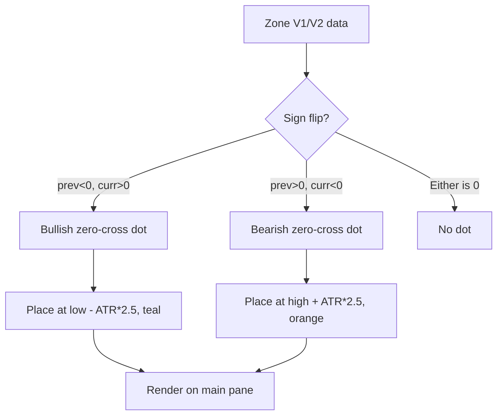

**Topic:** Trading Indicator Library  
**Topic Slug:** indicator-lib  
**Thread:** Trend Rider Zero Cross  
**Thread Slug:** trend-rider-zero-cross  
**Issue:** #307  
**Thread Parent:** #304  
**Topic Parent:** #261  
**Domain:** INDICATOR-LIB  
**Type:** Implementation Plan  
**Status:** Complete  
**Created:** 2026-09-13  
**Last Updated:** 2026-09-13  

---

## Overview

Trend Rider Zero Cross signal dots — early entry signals that fire when
Zone V1 or V2 flips sign. SHARED area: TS frontend + Pine, no BE.

## Areas

- **SHARED** — TS detection function + chart wiring, Pine plots, both
  must produce identical signals

## SHARED Implementation Plan

### Module: Zero-Cross Detection (TS)

Location: `src/app/features/shared/components/flex-chart/indicators/st-trend-rider-dots.indicator.ts`

Add `detectZoneZeroCrossDots` alongside the existing `detectZoneUptickDots`:

- **Signature:**
  ```ts
  export function detectZoneZeroCrossDots(
    zoneData: { x: Date; y: number }[],
    bars: PriceBar[],
    longColor: string,
    shortColor: string,
  ): UptickDotPoint[]
  ```
  Simpler than `detectZoneUptickDots` — no HTF data needed (no window
  check), no state machine.

- **Logic:**
  - For each bar `i` from 1 to end:
    - `prevZone = zoneData[i-1].y`, `currZone = zoneData[i].y`
    - If `prevZone < 0 and currZone > 0`: bullish cross → dot at
      `bar.low - ATR(14) * 2.5` with `longColor`
    - If `prevZone > 0 and currZone < 0`: bearish cross → dot at
      `bar.high + ATR(14) * 2.5` with `shortColor`
    - Skip if either zone is 0 (neutral, not a sign)
  - Reuse the existing `computeATR` helper and `ATR_OFFSET_MULT` constant

- **Colors:**
  - Long: `#009688` (teal)
  - Short: `#FF9800` (orange)

### Module: Chart Wiring (TS)

Files to update:
- `src/app/features/savant-trader/utils/chart-indicators/base-indicators.ts`
  - Add `zeroCrossDotsV1?` and `zeroCrossDotsV2?` to the chart extras
    interface (alongside existing `uptickDotsV1`/`uptickDotsV2`)
  - Add `addUptickDots` calls for the zero-cross dots (reuse the same
    rendering function — scatter points are scatter points)

- `src/app/features/savant-trader/components/signal-detail/signal-detail.component.ts`
  - Compute `zeroCrossDotsV1` and `zeroCrossDotsV2` using
    `detectZoneZeroCrossDots` with V1 and V2 zone data
  - Pass them into the chart extras for both daily and weekly

- `src/app/features/savant-trader/components/quick-charts/quick-charts.component.ts`
  - Same wiring as signal-detail for the quick-charts view

### Module: Pine Plots

Location: `rb-ps/rb-ta/ind/rb-st-zones.pine`

Add zero-cross detection and plots in the Trend Rider section (after the
existing Trend Rider state machine, before the existing `plot` calls):

```pine
// Trend Rider Zero Cross: sign flip detection (no state machine)
bool stV1ZeroCrossLong = stZoneV1[1] < 0 and stZoneV1 > 0
bool stV1ZeroCrossShort = stZoneV1[1] > 0 and stZoneV1 < 0
bool stV2ZeroCrossLong = stZoneV2[1] < 0 and stZoneV2 > 0
bool stV2ZeroCrossShort = stZoneV2[1] > 0 and stZoneV2 < 0
```

Plot with `force_overlay=true`, hollow circle style, teal/orange colors:

```pine
plot(stV1ZeroCrossLong ? low - stDotOffset : na, "V1 Zero Cross Long",
     style=plot.style_circles, linewidth=3, color=color.teal, force_overlay=true)
plot(stV1ZeroCrossShort ? high + stDotOffset : na, "V1 Zero Cross Short",
     style=plot.style_circles, linewidth=3, color=color.orange, force_overlay=true)
plot(stV2ZeroCrossLong ? low - stDotOffset : na, "V2 Zero Cross Long",
     style=plot.style_circles, linewidth=3, color=color.teal, force_overlay=true)
plot(stV2ZeroCrossShort ? high + stDotOffset : na, "V2 Zero Cross Short",
     style=plot.style_circles, linewidth=3, color=color.orange, force_overlay=true)
```

Note: Pine `plot.style_circles` renders as filled circles. For hollow
circles, use `plot.style_cross` or a custom approach. The visual
distinction from Trend Rider dots (which use `style_circles` for V1 and
`style_cross` for V2) is achieved through color (teal/orange vs
green/red/lime/orange).

### Process Flow



## Cross-Area Boundaries

- No BE dependency — zero-cross is a pure function of already-computed
  zone values
- TS and Pine must produce identical dots given the same zone data and
  price bars

## Risks

- **Pine hollow circle rendering:** Pine `plot.style_circles` is filled.
  True hollow circles may require `plotchar` or a workaround. The color
  distinction (teal/orange) provides the primary visual differentiation.
- **ATR computation parity:** The TS `computeATR` and Pine `ta.atr` must
  produce the same values. The existing Trend Rider dots already rely on
  this parity, so it's a known-good pattern.
