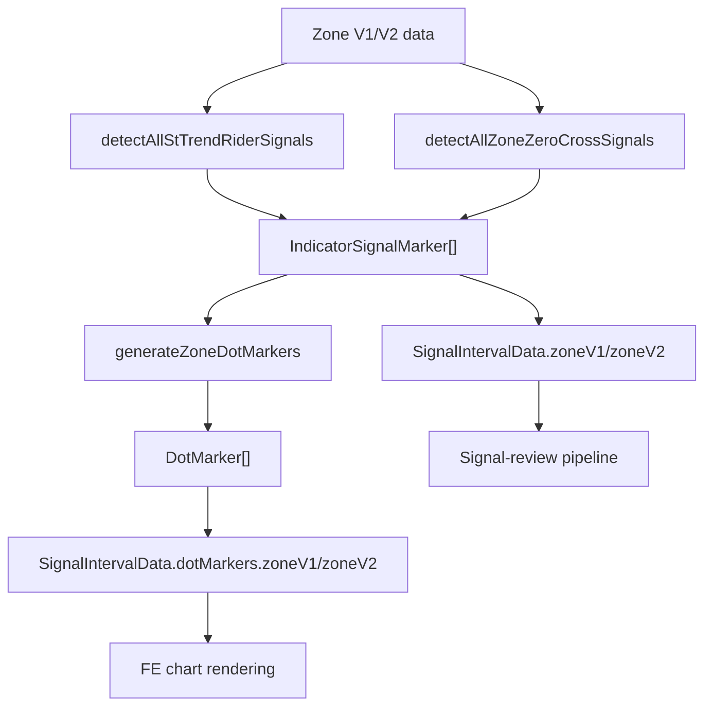

**Topic:** Trading Indicator Library  
**Topic Slug:** indicator-lib  
**Thread:** Trend Rider Zero Cross  
**Thread Slug:** trend-rider-zero-cross  
**Issue:** #316  
**Thread Parent:** #304  
**Topic Parent:** #261  
**Domain:** INDICATOR-LIB  
**Type:** PRD  
**Status:** Approved  
**Created:** 2026-09-14  
**Last Updated:** 2026-09-14  

---

## Summary

Add zero-cross detection (zone sign flips) to the existing BE Trend Rider signal pipeline. Zero-cross signals and dots are Trend Rider signals and dots — no distinction, no separate pipeline. They are detected alongside confirmation signals, merged into the same arrays, and returned to the FE in the same `SignalIntervalData` structure.

## Motivation

Zero-cross dots are currently computed client-side (Task #310) and render as chart overlays only. They do not appear in the signal-review pipeline because the backend does not detect them. Adding zero-cross detection to the BE pipeline means zero-cross signals flow through signal-list, signal-table, and signal-history like existing Trend Rider signals.

## User Stories

### US1: BE zero-cross detection
As a developer, I want the backend to detect zone sign flips and emit them as Trend Rider signals, so they appear in the signal-review pipeline alongside confirmation signals.

**Acceptance criteria:**
- `detectAllZoneZeroCrossSignals()` in `signal-detection.ts` detects sign flips:
  - `prevZone < 0 && currZone > 0` → long
  - `prevZone > 0 && currZone < 0` → short
  - Zero is neutral (transitions to/from zero do not fire)
  - `NaN`/null zones break the sequence (no cross fabricated across a gap)
- Signals use the same `signalType` as existing Trend Rider signals (e.g. `D_ST_TREND_RIDER_V1_LONG`)
- Signals include a `reason` describing the zero-cross (e.g. "ST Trend Rider: V1 zone crossed zero -2→+1")
- Signals are merged into the existing `zoneV1`/`zoneV2` arrays in `SignalIntervalData`

### US2: BE zero-cross dot markers
As a developer, I want the backend to generate DotMarkers for zero-cross signals using the same `generateZoneDotMarkers()` function.

**Acceptance criteria:**
- DotMarkers generated from zero-cross signals using existing `generateZoneDotMarkers()` (same ATR offset, same version)
- DotMarkers merged into existing `dotMarkers.zoneV1`/`zoneV2` arrays
- DotMarkers use the same `y` placement: `bar.low - ATR(14) * 2.5` (long), `bar.high + ATR(14) * 2.5` (short)

### US3: FE uses BE-provided dots
As a developer, I want the frontend to use BE-provided zero-cross DotMarkers instead of computing them client-side.

**Acceptance criteria:**
- Remove client-side `detectZoneZeroCrossDots` and `computeZeroCrossDots`
- Remove `zeroCrossDotsV1`/`zeroCrossDotsV2` from chart extras
- Remove `ST_ZONE_V1_ZERO_CROSS_DOTS_INDICATOR` / `ST_ZONE_V2_ZERO_CROSS_DOTS_INDICATOR` options
- Zero-cross dots come from the same `dotMarkers.zoneV1`/`zoneV2` arrays as confirmation dots
- Zero-cross dots render in the main price pane alongside confirmation dots

### US4: Signal-review integration
As a user, I want zero-cross signals to appear in signal-list, signal-table, and signal-history alongside existing Trend Rider signals.

**Acceptance criteria:**
- Zero-cross signals appear in signal-list with the same signalType as Trend Rider
- Zero-cross signals appear in signal-table with direction, date, and reason
- Zero-cross signals appear in signal-history
- No separate filter or category — they're all Trend Rider signals

### US5: Parity with existing detection
As a developer, I want zero-cross detection to match the TS implementation's sign-flip semantics.

**Acceptance criteria:**
- Same detection logic as `detectZoneZeroCrossDots` (Task #310): strict sign flips, zero is neutral, null breaks sequence
- Same `signalType` naming as existing Trend Rider signals
- Same ATR(14) * 2.5 offset for dot placement

## Technical Context

### Backend pipeline

The existing BE signal pipeline in `functions/src/st-cloud-function/`:

1. `indicator-computation.ts` computes zone V1/V2 values per bar
2. `generateZoneSignals()` calls `detectAllStTrendRiderSignals()` (state machine with READY/FIRED)
3. `generateZoneDotMarkers()` generates DotMarkers from signals + bars
4. `generateSymbolSignals()` orchestrates everything into `SignalIntervalData`

For zero-cross, add detection alongside the existing state machine in the same pipeline:
- `detectAllZoneZeroCrossSignals()` in `signal-detection.ts` — simple sign-flip detection, no state machine
- Merge zero-cross signals into the same `IndicatorSignalMarker[]` array before `generateZoneDotMarkers()` runs
- `generateZoneDotMarkers()` already works on any `IndicatorSignalMarker[]` — no changes needed
- No new `SignalIntervalData` fields — everything goes into existing `zoneV1`/`zoneV2` and `dotMarkers.zoneV1`/`zoneV2`

### Frontend changes

- Remove `detectZoneZeroCrossDots` from `st-trend-rider-dots.indicator.ts`
- Remove `computeZeroCrossDots` from `signal-marker-converters.ts`
- Remove `zeroCrossDotsV1`/`zeroCrossDotsV2` from chart extras
- Remove `ST_ZONE_V1_ZERO_CROSS_DOTS_INDICATOR` / `ST_ZONE_V2_ZERO_CROSS_DOTS_INDICATOR` options
- Zero-cross dots come from the same `dotMarkers.zoneV1`/`zoneV2` arrays as confirmation dots

### Pine

No changes needed. Pine has its own zero-cross detection for visual display and does not use the BE signal pipeline.

## System Context

## Constraints

- BE detection must match TS `detectZoneZeroCrossDots` semantics (strict sign flips, zero neutral, null breaks sequence)
- Same `signalType` as existing Trend Rider signals — no distinction
- Same ATR(14) * 2.5 offset for dot placement
- Pine is unaffected (separate visual detection)
- No new `SignalIntervalData` fields — merge into existing `zoneV1`/`zoneV2` and `dotMarkers.zoneV1`/`zoneV2`

## Risks

- **Signal volume**: Zero-cross signals may fire more frequently than confirmation signals (no state machine gate). This increases signal-review volume.
- **Latency**: Adding zero-cross detection to the BE pipeline adds computation time. Current BE pipeline takes ~5s; zero-cross detection is O(n) so the impact should be minimal.
- **FE migration**: Removing client-side detection and separate indicator options (from Task #310) is a rollback of sorts. Need to ensure BE-provided dots render correctly.
- **Duplicate signals**: If a zero-cross and confirmation fire on the same bar, both signals appear in the array. This is intentional — they're different events.
