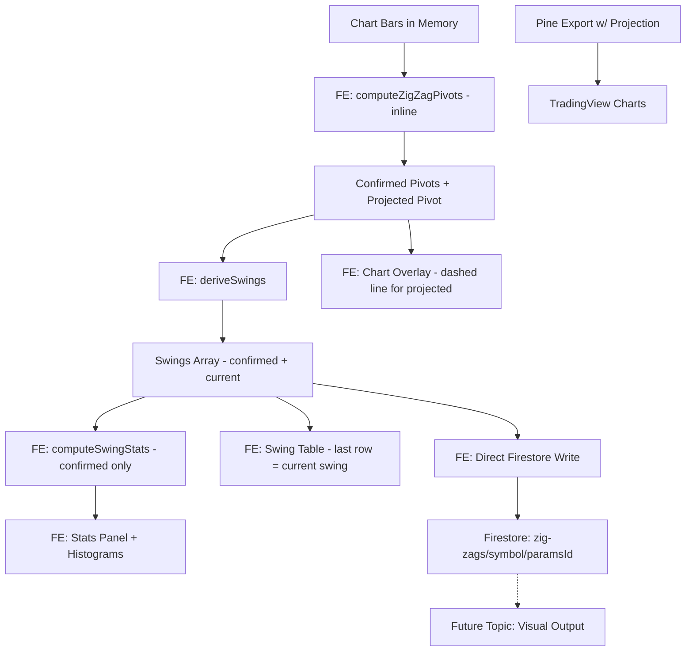

**Topic:** Trading Indicator Library  
**Topic Slug:** indicator-lib  
**Thread:** ST ZigZag Indicator  
**Thread Slug:** st-zigzag  
**Issue:** #323  
**Thread Parent:** #322  
**Topic Parent:** #261  
**Domain:** INDICATOR-LIB  
**Type:** PRD  
**Status:** Approved  
**Created:** 2026-09-15  
**Last Updated:** 2026-09-15  

---

## Problem Statement

Savant Trader has no tool for identifying and analyzing price swings.
Traders need to understand the historical distribution of swing
magnitude and duration to set expectations for future price movements.
The existing chart indicators (StdDevLines, Trend Bands, Zones) focus on
mean-reversion and trend-following overlays — none identify the discrete
pivot points that define market swings.

Without swing analysis, a trader reviewing a chart sees price action but
cannot easily answer: "How far do up-swings typically move? How long do
they last? Is this swing unusually large or still within the normal
range?" This requires identifying confirmed pivots, deriving swing
segments between them, and computing statistical distributions — then
presenting both a visual overlay and a sortable, filterable data table.

## Solution

Add a ZigZag indicator to the Trading Indicator Library that identifies
significant price pivots using a two-gate model:

1. **Depth confirmation** — a bar must be a local extreme confirmed by
   `leftDepth` bars to the left (past) and `rightDepth` bars to the right
   (future). A pivot cannot be declared until `leftDepth` bars have
   passed beyond the candidate bar.

2. **Deviation threshold** — once a bar passes depth confirmation, the
   candidate pivot's price must deviate from the last pivot's price by at
   least `devThreshold`% in the opposite direction to register as a new
   pivot (reversal). If the deviation is in the same direction, the
   candidate extends the current swing (updates the last pivot to the
   more extreme price) rather than creating a new one.

The indicator operates across three layers, with projection
pivots (unconfirmed developing swings) supported in all layers:

1. **SHARED Pine export** — a standalone Pine v6 script (ported from the
   TradingView official ZigZag library v9, MPL 2.0, with projection
   pivots) for use in TradingView charts.

2. **FE computation + chart overlay + analysis page** — the FE computes
   pivots inline from bars already loaded in the chart, derives swings
   (segments between consecutive pivots with magnitude, duration,
   volume), computes statistical distributions (summary stats +
   histograms split by direction), and renders:
   - A ZigZag line overlay in the existing flex-chart indicator menu,
     with the current projected swing shown as a dashed line
   - A separate analysis page with an isolated chart (ZigZag only), a
     sortable/filterable swing table (with the current developing swing
     as the last row), and a stats panel with histograms

3. **FE Firestore persistence** — when the user is satisfied with the
   analysis parameters, the FE writes the swing analysis results directly
   to Firestore (`zig-zags/{symbol}/{paramsId}`). This creates a database
   of swing data for a set of stocks that a future Topic will consume
   for additional visual output.

## User Stories

1. As a trader, I want to see ZigZag lines overlaid on the price chart in
   flex-chart, so that I can visually identify historical price swings
   alongside my other indicators.

2. As a trader, I want to configure the ZigZag deviation threshold
   (percentage), so that I can control how significant a price move must
   be to count as a swing reversal.

3. As a trader, I want to configure the left depth and right depth
   separately, so that I can control how many bars on each side of a
   candidate bar must confirm it as a pivot.

4. As a trader, I want to toggle whether a pivot high and pivot low can
   register on the same bar (`allowZigZagOnOneBar`), so that I can
   compare swing statistics with and without double-pivot detection.

5. As a trader, I want to open a dedicated swing analysis page with an
   isolated chart showing only the ZigZag overlay, so that I can review
   swings without the visual noise of other indicators.

6. As a trader, I want the analysis page to show a sortable table of
   individual swings, so that I can review each swing's direction, start
   date, end date, duration, magnitude (both % and $), start price, end
   price, and cumulative volume.

7. As a trader, I want to sort the swing table by any column, so that I
   can quickly find the largest, longest, or most recent swings.

8. As a trader, I want to filter the swing table by direction (up/down),
   so that I can analyze bullish and bearish swings separately.

9. As a trader, I want to filter the swing table by date range, so that
   I can focus on a specific period of interest.

10. As a trader, I want to filter the swing table by duration range
    (min/max bars), so that I can isolate short-term or long-term swings.

11. As a trader, I want to filter the swing table by magnitude range
    (min/max % or $), so that I can focus on significant or minor swings.

12. As a trader, I want the analysis page to show distribution summary
    statistics for swing magnitude and duration, split by direction (up
    vs down), so that I can understand the typical range of swing
    behavior.

13. As a trader, I want the summary statistics to include mean, median,
    standard deviation, percentiles (10/25/50/75/90), min, and max for
    both magnitude and duration, so that I can assess the distribution
    shape and identify outliers.

14. As a trader, I want to see histograms of swing magnitude and
    duration, split by direction, so that I can visually assess the
    distribution shape and spot clustering or skew.

15. As a trader, I want to save the current swing analysis (swings +
    stats + params) directly to Firestore, so that I can build a
    persistent database of swing data across multiple stocks for future
    analysis.

16. As a trader, I want the FE to compute pivots inline from bars already
    loaded in the chart, so that I get instant results without a network
    round-trip or stale cached data.

17. As a trader, I want a standalone Pine Script export of the ZigZag
    indicator (with projection pivots), so that I can use the same swing
    detection logic in TradingView charts.

18. As a trader, I want the Pine export to include the MPL 2.0 license
    header and TradingView attribution, so that the ported code complies
    with the original library's license.

19. As a trader, I want the chart overlay to show the current developing
    swing as a dashed line (projection pivot), so that I can see the
    in-progress swing in real time before it is confirmed.

20. As a trader, I want the swing table to include the current developing
    swing as the last row (visually distinguished from confirmed swings),
    so that I can see the in-progress swing's magnitude, duration, and
    volume alongside the confirmed historical swings.

21. As a trader, I want the statistical analysis to exclude the
    unconfirmed projected swing from distribution calculations, so that
    the stats reflect only completed historical swings.

## Implementation Decisions

### Architecture

- **All computation is FE-side.** The FE computes pivots inline from bars
  already loaded in the chart. No BE callable, no BE engine module.

- **Swing analysis results are persisted to Firestore via direct FE
  write.** When the user is satisfied with the analysis, the FE writes
  directly to `zig-zags/{symbol}/{paramsId}`. No BE callable needed.

### Firestore Persistence

Direct FE write to `zig-zags/{symbol}/{paramsId}` where `paramsId` is a
human-readable string of the params (e.g. `dev5_L5_R5_1barY_projY`).
Re-saving with the same params overwrites. Each document contains
`{ symbol, params, swings, stats, createdAt, updatedAt }`. The
subcollection-per-symbol structure keeps the Firestore console
readable when analyzing many symbols.

### Pivot Computation Model

The FE implements a batch `computeZigZagPivots(bars, config)` function
that walks bars sequentially and returns confirmed pivots plus the
current projected pivot (if `projectionPivots` is enabled). This is a
port of the TradingView library's `findPivotPoint` +
`newPivotPointFound` + `findProjectionPivot` + `updateProjectionPivot`
logic, adapted from Pine's per-bar `update()` model to a batch
computation over a full bar array.

Projection pivots represent the current developing swing — a tentative
pivot that meets the deviation and depth criteria but is not yet
confirmed by enough bars to the right. The projected pivot is returned
separately from the confirmed pivots array so the FE can render it as a
dashed line and include it as the last row in the swing table while
excluding it from statistical calculations.

### Configuration Parameters

```typescript
interface ZigZagConfig {
  devThreshold: number;        // % deviation to reverse direction (default 5.0)
  leftDepth: number;            // bars to the left (past) for confirmation (default 5)
  rightDepth: number;           // bars to the right (future) for confirmation (default 5)
  allowZigZagOnOneBar: boolean; // allow high+low pivot on same bar (default true)
  projectionPivots: boolean;    // calculate projected (unconfirmed) pivot (default true)
}
```

`leftDepth` and `rightDepth` are separate parameters (both default 5,
matching TradingView's `depth=10` halved to 5/5). Asymmetric depths are
supported from day one at no additional cost.

### Pivot Type

```typescript
interface Pivot {
  barIndex: number;   // index in the bar array
  time: number;       // timestamp (ms)
  price: number;      // high for pivot high, low for pivot low
  isHigh: boolean;    // true = pivot high, false = pivot low
  confirmed: boolean;  // true = confirmed by depth, false = projected
}
```

### Swing Type (derived FE-side)

```typescript
interface Swing {
  direction: 'up' | 'down';
  start: { time: number; price: number; barIndex: number };
  end:   { time: number; price: number; barIndex: number };
  magnitudePercent: number;  // price change as % of start price
  magnitudeAbsolute: number; // price change in absolute terms
  duration: number;           // bars between start and end pivots
  volume: number;             // cumulative volume across the swing
  confirmed: boolean;          // true = both pivots confirmed, false = current developing swing
}
```

### Statistical Output

Distribution summary split by direction (up swings, down swings).
Only confirmed swings (both pivots confirmed) are included in the
distribution — the current projected swing is shown in the table but
excluded from stats:

- **Magnitude (%)**: mean, median, std dev, percentiles (10/25/50/75/90),
  min, max
- **Duration (bars)**: same stats
- **Count**: number of swings in each direction
- **Histograms**: binned distributions for magnitude (1% buckets) and
  duration (5-bar buckets), per direction

Fitted distributions (lognormal, Weibull) are deferred to the future
visual output Topic.

### Firestore Persistence Model

Swing analysis documents stored under `zig-zags/{symbol}/{paramsId}`.
Each document is self-contained — the derived swings, summary stats,
histogram data, and the parameters that produced them. The future Topic
reads this collection for additional visual output.

### Chart Indicator

The flex-chart indicator (`st-zigzag.indicator.ts`) calls the
`getZigZagPivots` endpoint and renders the ZigZag lines as an overlay.
Confirmed pivots render as solid lines; the current projected pivot
renders as a dashed line. Registered in the indicator menu alongside the
existing ST indicators. The indicator handles only chart rendering — no
table, no stats.

### Analysis Page

A separate feature area (e.g. `swing-analysis/`) with its own route,
containing:
- A chart component (flex-chart configured to show only the ZigZag
  overlay, no other indicators; projected swing shown as dashed line)
- The swing table (sortable/filterable; last row is the current
  developing swing, visually distinguished from confirmed swings)
- The stats panel (distribution summaries + histograms; confirmed
  swings only)
- Param controls (symbol, devThreshold, leftDepth, rightDepth,
  allowZigZagOnOneBar, projectionPivots)
- A "Save Analysis" button that calls `saveSwingAnalysis`

### Pine Export

A standalone Pine v6 script (`rb-st-zigzag.pine`) ported from the
TradingView official ZigZag library v9 (MPL 2.0). Includes projection
pivots — the port is a near-direct copy of the verified source with
parameter naming adapted (`depth` split into `leftDepth`/`rightDepth`).
Includes the MPL 2.0 license header and TradingView attribution. No
`import` dependency on the TradingView library.

### Two-Gate Pivot Model

Both gates must pass for a new pivot to be registered:

1. **Depth gate** (`findPivotPoint`): For a high pivot, the candidate
   bar's high must be strictly above all bars `leftDepth+1` to
   `leftDepth+rightDepth` bars back, and above or equal to all bars `0`
   to `rightDepth-1` bars back. (Mirror for low pivot.)

2. **Deviation gate** (`newPivotPointFound`): The candidate pivot's price
   must deviate from the last pivot's price by at least `devThreshold`%
   in the opposite direction. Same-direction candidates extend the
   current swing (update the last pivot to the more extreme price).

## Testing Decisions

### BE Pivot Engine (parity module)

No BE module exists. All computation is FE-side. If a future need arises
(batch processing, server-side computation, a callable), the FE pure
function can be ported to `functions/src/indicators/zigzag.ts`.
- **Key test cases:**
  - Simple uptrend → one pivot high at the peak
  - Alternating highs/lows → correct pivot sequence
  - `devThreshold` filtering: small moves don't create pivots
  - Same-direction extension: a higher high updates the last pivot, not
    creates a new one
  - `allowZigZagOnOneBar = false`: high+low on same bar → only one
    registered
  - Asymmetric depths: `leftDepth ≠ rightDepth` produces correct
    confirmation window
  - Edge cases: insufficient bars for confirmation, single bar, all-NaN
    prices
  - Projection: projected pivot returned separately, correct direction
    (opposite of last confirmed), invalidation when price exceeds
    projected pivot, `projectionPivots: false` returns no projection

### FE Swing Derivation + Stats

- **Test seam: pure function.** `deriveSwings(pivots)` and
  `computeSwingStats(swings)` are pure functions. Test with synthetic
  pivot arrays.
- **Prior art:** `st-std-dev-lines.indicator.spec.ts` tests the
  indicator's computation functions directly.
- **Key test cases:**
  - Correct swing direction alternation
  - Magnitude calculation (both % and $)
  - Duration = bar count between pivots
  - Volume accumulation
  - Stats: mean/median/percentiles on known swing sets
  - Projected swing: `confirmed: false` flag, excluded from stats,
    included as last table row
  - Histograms: correct bucket assignment and counts

### FE Chart Indicator

- **Test seam: IndicatorOption metadata.** Verify the indicator config
  has correct id, type, pane, and params. Prior art:
  `st-std-dev-lines.indicator.spec.ts` metadata tests.

### Pine Export

- No automated test. Manual verification against TradingView charts with
  matching parameters. The Pine port is a near-direct copy of the verified
  source with `depth` split into `leftDepth`/`rightDepth`.

## Out of Scope

- **Fitted distributions** (lognormal, Weibull) — probabilistic
  projection from swing distributions. Deferred to the future visual
  output Topic.
- **Future visual output** — the separate Topic that consumes the
  persisted swing data for additional visualizations. Explicitly a
  different Topic.
- **ATR-based deviation model** — only percentage-based `devThreshold`
  is supported. ATR-based can be added later as a threshold calculation
  swap.
- **Trading decisions** — the ZigZag indicator is for analysis only, not
  for generating trading signals or order recommendations.
- **Cross-symbol comparison** — analyzing swings across multiple
  symbols simultaneously. Each symbol is analyzed independently. Cross-
  symbol aggregation belongs in the future visual output Topic.

## Further Notes

### Reference Source

The definitive source for the pivot detection algorithm is the
TradingView official ZigZag Pine Script v6 library v9 (© TradingView,
MPL 2.0, 2026.02.25), saved at
`docs/topics/261-indicator-lib/reference/zigzag-lib-source.pine` and
verified byte-for-byte against the TradingView published source.

The BE engine ports `findPivotPoint`, `calcDev`, `newPivotPointFound`,
`findProjectionPivot`, `updateProjectionPivot`, and the full `update()`
logic including the `removed`/`invalidated` projection handling. The
projected pivot is returned separately from the confirmed pivots array.

### Parameter Naming Convention

The TradingView library uses a single `depth` parameter (halved
internally to per-side depth). This Thread exposes `leftDepth` and
`rightDepth` separately (both default 5, matching TradingView's
`depth=10` → 5/5). This supports asymmetric depths from day one without
performance cost.

### Existing Pattern

This Thread follows the established indicator pattern in Topic #261:
FE chart indicator (`flex-chart/indicators/`) with inline computation, and
Pine export (`rb-ps/rb-ta/ind/`). The new elements are the separate
analysis page and the direct FE Firestore persistence to
`zig-zags/{symbol}/{paramsId}`.


