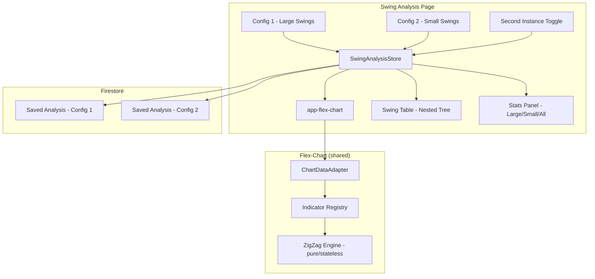

**Topic:** Trading Indicator Library  
**Topic Slug:** indicator-lib  
**Thread:** Dual ST ZigZag Overlay  
**Thread Slug:** dual-st-zigzag-overlay  
**Issue:** #384  
**Thread Parent:** #383  
**Topic Parent:** #261  
**Domain:** INDICATOR-LIB  
**Type:** PRD  
**Status:** Approved  
**Created:** 2026-09-17  
**Last Updated:** 2026-09-17  

---

# PRD — Dual ST ZigZag Overlay

## Problem

The swing analysis page currently renders a single ST ZigZag instance. The user
needs to see small and large swings simultaneously to understand how small swings
compose into large swings — to "see inside" a large swing and analyze the
hierarchical relationship between swing magnitudes.

This is for historical statistical analysis of swing magnitude and duration, not
for trading decisions.

## Audience

The primary user is a researcher performing historical swing analysis on the
dedicated swing analysis page (`/savant-trader/swing-analysis`). They need to
overlay two ZigZag configurations on the same chart and see how smaller swings
nest within larger swings.

## Solution

Add a second ST ZigZag instance to the swing analysis page chart with its own
independent config controls. When enabled, the chart shows both instances
overlaid, and the swing table becomes a nested tree where small swings are
grouped inside their containing large swings.

### Instance roles

- **Instance 1 (primary)** — large swings. Higher deviation threshold, larger
  depths. This is the "outer" swing set.
- **Instance 2 (secondary)** — small swings. Lower deviation threshold, smaller
  depths. This is the "inner" swing set, nested inside the primary.

### Toggle behavior

- When the second instance is **off**, the page behaves exactly as today:
  single ZigZag, flat swing table, single stats panel.
- When the second instance is **on**, the chart shows both ZigZags overlaid
  and the table becomes a nested tree.

## User Stories

### US-1: Remove bars from saved analyses

**As a** researcher,
**I want** saved swing analyses to not duplicate the full price bar array,
**so that** Firestore storage is not wasted with identical bar data across
every saved analysis for the same symbol.

**Acceptance criteria:**
- The `SwingAnalysisInput` type no longer includes a `bars` field.
- `loadAnalysis` reloads bars from the chart service instead of reading them
  from the saved doc.
- Existing saved analyses that contain `bars` are handled gracefully (field
  ignored, bars reloaded from chart service).
- Saving an analysis does not write bars to Firestore.
- The swing analysis page still renders correctly after loading a saved
  analysis (bars loaded from service, config/pivots/swings/stats from doc).

### US-2: Toggle second ZigZag instance

**As a** researcher,
**I want** to toggle a second ZigZag instance on/off on the swing analysis page,
**so that** I can compare small and large swings when needed, and use the
single-ZigZag view when I don't.

**Acceptance criteria:**
- A toggle control is visible on the swing analysis page.
- When off, the page behaves exactly as today (single ZigZag, flat table).
- When on, the chart renders two ZigZag instances with independent configs.
- The toggle state is page-local (not persisted to Firestore).
- Toggling off removes the second instance's lines from the chart and
  restores the flat table.

### US-3: Independent config controls

**As a** researcher,
**I want** each ZigZag instance to have its own config controls,
**so that** I can independently adjust deviation, leftDepth, rightDepth, and
line color for each instance.

**Acceptance criteria:**
- Two stacked collapsible config sections are shown when the second instance
  is enabled.
- Each section controls one instance's: deviation, leftDepth, rightDepth, and
  line color.
- Projection pivots are always on for both instances (no toggle).
- `allowZigZagOnOneBar` remains configurable per instance.
- Changing either config immediately recomputes that instance's pivots/swings
  and updates the chart and table.
- Instance 1 (primary) defaults to larger swings (e.g., dev=10, leftDepth=10,
  rightDepth=10).
- Instance 2 (secondary) defaults to smaller swings (e.g., dev=3, leftDepth=3,
  rightDepth=3).

### US-4: Multi-ZigZag chart rendering

**As a** researcher,
**I want** both ZigZag instances rendered on the same chart with distinct
visual styling,
**so that** I can visually distinguish small and large swings.

**Acceptance criteria:**
- Flex-chart's `ChartDataAdapter.zigZagSeries` supports multiple ST_ZIGZAG
  indicator configs (not just the first via `.find()`).
- Each instance's lines are rendered with its configured color.
- Line keys and names are namespaced per instance (no key collisions).
- Projection pivots (dashed lines) are rendered for both instances.
- A single ZigZag config still works exactly as today (backward-compatible).
- The chart legend/tooltips distinguish the two instances by name.

### US-5: Nested tree swing table

**As a** researcher,
**I want** the swing table to show small swings nested inside their
containing large swings,
**so that** I can see how small swings compose into large swings without
switching between two tables.

**Acceptance criteria:**
- When the second instance is enabled, the swing table becomes a nested tree.
- Parent rows = large swings (instance 1).
- Child rows = small swings (instance 2) whose time range falls within the
  parent large swing's time range.
- An expand/collapse all button is available.
- Individual parent rows can be expanded/collapsed independently.
- The "current swing" for each instance is the last row at its level (last
  parent for large, last child for small).
- Sorting applies to parent rows; children stay in chronological order within
  their parent.
- When the second instance is disabled, the table reverts to the flat
  single-config view.

### US-6: Stats panel with large/small/all toggle

**As a** researcher,
**I want** the stats panel to show statistics for large swings, small swings,
or both,
**so that** I can analyze each swing magnitude independently or together.

**Acceptance criteria:**
- When the second instance is enabled, the stats panel has a toggle: large /
  small / all.
- "Large" shows stats for instance 1 swings only.
- "Small" shows stats for instance 2 swings only.
- "All" shows combined stats across both instances.
- When the second instance is disabled, the stats panel shows single-config
  stats as today.

### US-7: Independent Firestore persistence

**As a** researcher,
**I want** each ZigZag config saved independently to Firestore,
**so that** I can mix and match any small-swing config with any large-swing
  config without data duplication.

**Acceptance criteria:**
- Each config saves under its own `paramsId` (derived from its own config
  params).
- Saving does not duplicate the other config's data.
- Loading a saved analysis loads one config; the user can load a second
  config independently.
- The page remembers the last-loaded secondary config in component state
  (not Firestore) so the current pairing is preserved on page refresh.

## Technical Context

- **Flex-chart changes:** The `ChartDataAdapter.zigZagSeries` computed must
  iterate over all ST_ZIGZAG configs (`.filter()` not `.find()`), and the
  chart template must loop over multiple ZigZag result sets. Line keys,
  names, and colors must be namespaced per `IndicatorConfig.id`. These
  changes are in the shared flex-chart component but are backward-compatible.
- **Store changes:** The `SwingAnalysisStore` must support a secondary config
  and its derived pivots/swings/stats. The architecture should be N-ready
  (array of configs, not two hardcoded fields).
- **Tree table:** Angular Material does not have a built-in tree table
  component. Custom row expansion logic is required.
- **Bars deduplication:** Removing `bars` from saved analyses changes the
  Firestore document shape. Existing docs with `bars` must be handled
  gracefully (field ignored on load, bars reloaded from chart service).
- **Pine export:** The standalone Pine export (`rb-st-zigzag.pine`) is
  unaffected — it remains a single-instance indicator.

## System Context

## Out of Scope

- N-instance UI (user-addable ZigZag instances beyond 2). The architecture
  should be N-ready, but the UI supports exactly 2.
- Pine Script changes (standalone export remains single-instance).
- Bars deduplication across symbols (only per-symbol deduplication via
  chart service reload).
- Swing analysis on the main flex-chart page (this is swing-analysis-page
  only).
- Automated swing projection or forecasting (the user performs manual
  statistical analysis).
