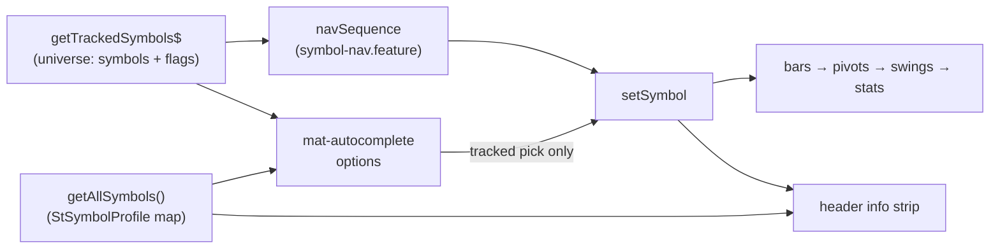

**Topic:** Trading Indicator Library  
**Topic Slug:** indicator-lib  
**Thread:** Misc fixes & polish — swing analysis  
**Thread Slug:** misc-fixes-swing  
**Issue:** #484  
**Thread Parent:** #414  
**Topic Parent:** #261  
**Domain:** INDICATOR-LIB  
**Type:** PRD  
**Status:** Approved  
**Created:** 2026-09-22  
**Last Updated:** 2026-09-22  

# PRD: Swing-analysis symbol picker + company info header

## Problem

Two friction points on the swing-analysis page while triaging the
~900-symbol tracked universe:

1. **Symbol selection is weak.** Prev/next steps one symbol at a time;
   picking an arbitrary symbol means opening the settings dialog and
   typing a ticker blind — no company-name matching, no validation
   (anything typpable is accepted), no discoverability.
2. **No company context.** The header shows only a ticker. An analyst
   paging through unfamiliar symbols can't tell what a company is —
   name, sector, exchange, size — without leaving the page.

## Concept

Two additions to the swing-analysis page chrome:

**Permanent symbol picker in the nav row.** The static symbol label
between the prev/next buttons becomes an always-visible
`mat-autocomplete` input fed by the tracked-symbols universe. Options
render as `TICKER — Company Name` and match on either. **Only tracked
symbols commit** — typing an untracked ticker reverts on blur; adding
symbols to the universe stays in SA (new-symbols flow). Prev/next,
position, and the watchlist filter are unchanged.

**Company info strip in the page header.** Every `StSymbolProfile`
field renders inline to the right of the title — name, sector,
industry, exchange, market cap, cap tier, beta, P/E, 52-week range,
ma50/ma200, dividend yield — no expando, no click. Profiles load once
per session via `signalService.getAllSymbols()` indexed by symbol; the
same map feeds the autocomplete's display names. Missing fields render
as `—` (ETFs and unsynced profiles are sparse).

## User stories

### US-1: Permanent autocomplete symbol picker

As an analyst, I want a visible symbol input in the nav row so I can
jump straight to any tracked symbol by ticker or company name.

**Acceptance criteria:**

- An `mat-autocomplete` input sits between prev and next, displaying
  the current symbol; focusing it opens the dropdown.
- Options come from the tracked universe, render `TICKER — Name`, and
  filter on substring match against ticker AND company name.
- Selecting an option or Enter-ing an exact tracked ticker calls
  `setSymbol` — bars, pivots, swings, stats, and saved sets all reload
  through the existing path.
- Input limited to tracked symbols: an untracked value reverts to the
  current symbol on blur/Enter; the page never navigates to it.
- Esc or blur without a selection reverts to the current symbol.
- While the tracked universe is still loading, the input is disabled
  (or shows a loading affordance) — never accepts a guess.
- The existing settings-dialog free-text symbol input is removed —
  the nav picker is the only entry point (tracked-only enforcement
  would otherwise be bypassable).

### US-2: Company info strip in the page header

As an analyst paging symbols, I want the company's identifying data
visible on arrival so I don't leave the page to figure out what it is.

**Acceptance criteria:**

- The header shows the current symbol's full `StSymbolProfile`
  inline: name, sector, industry, exchange, market cap, market-cap
  tier, beta, P/E, 52-week high/low, ma50, ma200, dividend yield.
- The strip updates immediately when the symbol changes (prev/next,
  picker, saved-set load — any `setSymbol` path).
- Missing/absent fields render `—`; a symbol with no profile doc
  shows the ticker plus `—` fields, not an error.
- Profiles load once per session (single `getAllSymbols()` call,
  indexed by symbol); no per-symbol fetch on navigation.
- The strip does not block or delay chart/swing rendering — it's
  auxiliary text that fills in when profiles arrive.

### US-3: Single source of truth for company display name

As a maintainer, I want one canonical source for a symbol's company
name so surfaces can't show divergent names.

**Acceptance criteria:**

- `StSymbolProfile.name` is the canonical display name everywhere on
  this page — autocomplete options AND the header strip read it.
- `Company.company` (the partner-API name from `getTrackedSymbols`)
  is not used for display on this page; the callable remains the
  universe source (which symbols exist + `supported`/`isBaseline`).
- A tracked symbol with no synced profile name displays its ticker
  (honest "unsynced" signal — no silent fallback to the partner name).
- CONTEXT.md records the SOT decision.

## Technical context

- **Two name sources exist and can disagree**: the partner API's
  tracked-symbol `name`/`company` (TTL-cached by the
  `getTrackedSymbols` callable) vs `StSymbolProfile.name` (SA overview
  sync). Profiles win — same pipeline as every other header field.
- `StSymbolProfile` fields: `name, sector, industry, exchange,
  marketCap, marketCapTier, beta, peRatio, week52High, week52Low,
  ma200, ma50, dividendYield` — all optional; sparse docs are normal.
- `getAllSymbols()` returns all profiles in one call — load once,
  index `Map<symbol, profile>`; ~900 small docs, session-cached.
- Profile sync can lag the tracked list (newly-added symbol has no
  profile yet) — handled by the `—`/ticker fallback, not blocking.
- `mat-autocomplete` precedent: `stock-list-form`, `spread-builder-dialog`.

## System context

