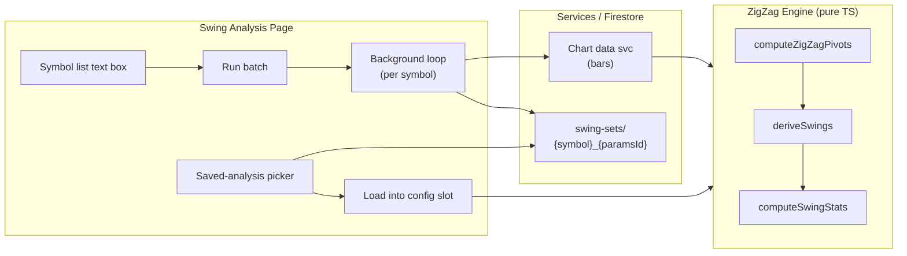

**Topic:** Trading Indicator Library  
**Topic Slug:** indicator-lib  
**Thread:** Auto run/save swings  
**Thread Slug:** auto-run-save-swings  
**Issue:** #417  
**Thread Parent:** #416  
**Topic Parent:** #261  
**Domain:** INDICATOR-LIB  
**Type:** PRD  
**Status:** Approved  
**Created:** 2026-09-19  
**Last Updated:** 2026-09-19

# PRD — Auto run/save swings

## Problem

Swing analysis is currently single-symbol: load a symbol, inspect the chart, save manually. Building a historical library of swing statistics across a symbol set — for cross-symbol comparison of magnitude/duration distributions — requires repeating the load→wait→save ritual per symbol. Two gaps block the workflow:

1. **No batch save.** Each symbol must be loaded and saved by hand.
2. **No saved-analyses browser.** Saved analyses can be written but never loaded back — there is no list of what exists or a way to view it.

## Goal

Batch-run swing analysis over a user-provided symbol list using the page's current ZigZag configs, persist each result to Firestore, and let the user browse + load any saved analysis for viewing and comparison.

## Non-goals

- Cloud functions, scheduled/unattended runs — the ZigZag engine is frontend TypeScript; a backend port is a separate effort.
- Watchlist integration — the provided list is curated by hand (existing watchlists don't target option-volume symbols).
- Batch run history/metadata — each analysis doc is a point-in-time computation stamped with `savedAt`.
- Trading decisions — analysis and comparison only.

## User Stories

### US-1: Batch-run a symbol list

As an analyst, I paste a symbol list into a text box and click **Run batch** so that each symbol is analyzed and saved without babysitting.

- Symbols are entered as comma-, space-, or newline-separated tickers; the list is normalized (trim, uppercase, dedupe) before the run.
- For each symbol the batch fetches bars, computes pivots/swings/stats for every config currently active on the page, and saves one doc per config to `swing-sets/{symbol}_{paramsId}` (overwrite semantics; `savedAt` records freshness).
- Dual mode active → two docs per symbol; single mode → one doc per symbol. Different param sets coexist — `dev5_L5_R5...` and `dev10_L3_R3...` are separate docs under the same symbol.
- The run does not disturb the displayed symbol — batch compute runs in the background via service + pure engine calls; the current chart/table/stats remain on the current symbol.
- A progress line shows `n/total — SYMBOL` as each save completes.
- A symbol whose bars fail to load (bad ticker, API error) is skipped and recorded; the run continues and reports failures at the end.
- A second batch run is disabled while one is in progress.
- **Verify:** run a 3-symbol list in dual mode → 6 docs written, progress shown, current page symbol unchanged, a bad ticker in the list is reported but doesn't abort the run.

### US-2: Browse saved analyses

As an analyst, I pick a symbol and see every saved param combo for it, so I know what analyses exist without guessing paramsIds.

- A saved-sets section lists symbols that have at least one saved doc, plus a param-set (dev threshold) picker to filter/select the saved doc.
- Selecting a symbol lists its saved docs (paramsId + savedAt), most recent first.
- **Verify:** after a batch run, each swept symbol appears in the list with one entry per saved config.

### US-3: Load a saved analysis for viewing

As an analyst, I load a saved analysis into a config slot so I can view its chart, swing table, and stats.

- Picking a saved analysis applies its config to a target config slot, recomputes pivots/swings/stats on fresh bars, and renders it on the chart.
- Loading does not re-save anything.
- Two different saved param sets can be viewed side-by-side (e.g., dev 5 in the large slot, dev 10 in the small slot) for direct comparison.
- **Verify:** save a dev5 analysis for QQQ, switch params to dev10, reload the dev5 doc into a slot → chart/stats reflect dev5 values again.

## Technical Context

- **Persistence shape:** flat collection `swing-sets/{symbol}_{paramsId}` (e.g. `swing-sets/QQQ_dev5_L5_R5_1barY_projY`). Bars are never persisted; docs store config + pivots + swings + stats + savedAt + userId.
- **Symbol enumeration:** the flat collection makes this free — one `getDocs` returns all docs (~1K docs max at ~100 symbols × ~10 params); the browser groups by `symbol` client-side. No parent-doc materialization needed.
- **Batch runs are frontend-serial** — symbols processed one at a time; bars API calls are sequential. Expect roughly 1–3 s per symbol; a 20-symbol sweep takes under a minute. The browser tab must stay open during the run.
- **Analysis freshness:** an analysis reflects the bars available at save time. Re-running a batch refreshes docs in place (overwrite); it does not accumulate history.
- **Auth:** saves are user-scoped (`userId` stamped by the service; security rules enforce read/write own analyses).

## System Context

## Out of Scope (explicit)

- Cross-symbol stats aggregation view (e.g., one histogram across all symbols) — docs exist individually; aggregation is a future thread if wanted.
- Deleting saved analyses from the browser UI.
- The batch UI persisting the symbol list between sessions (can be added later if the list churns).
