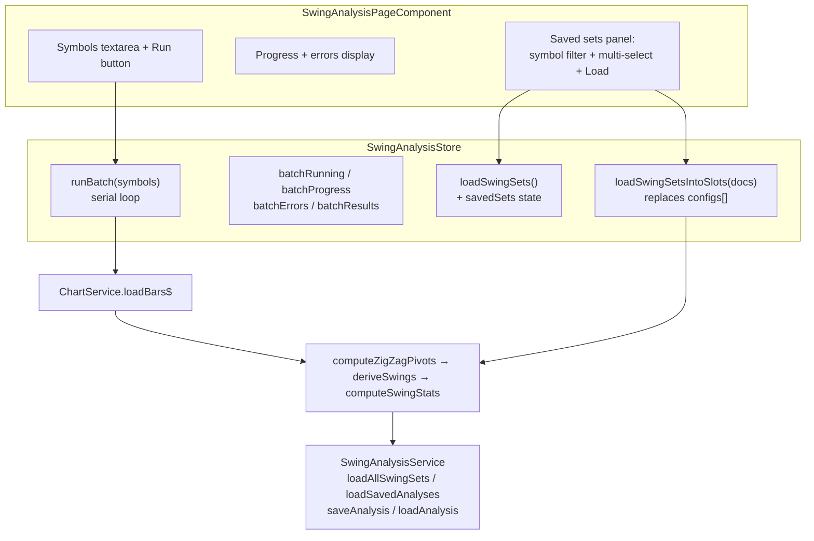

**Topic:** Trading Indicator Library  
**Topic Slug:** indicator-lib  
**Thread:** Auto run/save swings  
**Thread Slug:** auto-run-save-swings  
**Issue:** #419  
**Thread Parent:** #416  
**Topic Parent:** #261  
**Domain:** INDICATOR-LIB  
**Type:** IMPL  
**Status:** Complete  
**Created:** 2026-09-19  
**Last Updated:** 2026-09-21

# IMPL — FE: Auto run/save swings

## Architecture

All orchestration lives in `SwingAnalysisStore` (project convention: store owns orchestration, components are thin bindings). Two additions: a **batch runner** and a **saved-sets browser** with N-slot loading.



## Store additions

### Batch state + `runBatch(symbols: string[])`

New state fields:

```ts
batchRunning: boolean;                 // true while a sweep is in flight
batchProgress: { done: number; total: number; current: string | null };
batchResults: { symbol: string; ok: boolean; error?: string }[];
```

`runBatch` flow (serial — `concatMap`-style loop, NOT parallel; keeps API + Firestore pressure sane):

1. Guard: no-op if `batchRunning` or empty list. Normalize symbols — split on `[,\s\n]+`, trim, uppercase, dedupe.
2. Per symbol:
   - `chartService.loadBars$(symbol)` → `result.daily.bars` (same call `setSymbol` uses; do NOT call `setSymbol` — the visible symbol/chart must not be disturbed).
   - For each config in `store.configs()` (snapshot once at batch start — config changes mid-run don't affect the in-flight run): `computeZigZagPivots` → `deriveSwings` → `computeSwingStats` → `saveAnalysis({ symbol, paramsId, config, pivots, projection, swings, stats, savedAt })`.
   - `paramsId = deriveParamsId(config)` — overwrite semantics by design.
   - Per-symbol errors (bars failure, save failure) are caught, recorded in `batchResults`, and the loop continues.
3. `patchState` progress after each symbol; final state `batchRunning: false`.

Cancellation: `cancelBatch()` aborts the sweep subscription (Cancel button while running); done/total remain as a post-mortem, `current` clears. An in-flight save is a promise — it may land after cancel.

### Saved-sets browser state + methods

```ts
savedSets: SwingAnalysisDoc[];          // all docs from loadAllSwingSets()
savedSetsLoading: boolean;
```

- `loadSwingSets()` — calls `service.loadAllSwingSets()`, patches `savedSets`. Called on-demand when the panel opens (not on page init — avoids a full-collection read on every visit).
- `loadSwingSetsIntoSlots(docs: SwingAnalysisDoc[])` — the multi-load path:
  - Guard: all docs must share one `symbol` (UI enforces, store re-validates).
  - If `symbol !== store.symbol()` → run the `setSymbol` flow for that symbol first, then apply.
  - Set `configs` to the docs' configs (replace the array — N slots), recompute all slots on the loaded bars via existing `recomputeAll`, patch state.
  - Does NOT re-save anything; `savedAnalyses` for that symbol refresh as today.

No `dualMode` changes needed — the toggle continues to manage 1↔2 configs; loading N sets simply replaces `configs` with N entries and the config-section UI already iterates `configs()`.

## Component additions

### Batch section

- `textarea` for symbols (comma/space/newline separated), `data-testid="batch-symbols"`.
- `Run batch` button — disabled while `batchRunning` or input empty.
- Progress line: `{done}/{total} — {current}`.
- Post-run result list: per-symbol ✓/✗ + error message. `data-testid="batch-results"`.

### Saved sets section (collapsible)

- Lazy-loads via `loadSwingSets()` on first expand.
- Symbol filter: dropdown of distinct `doc.symbol` values.
- Doc list: checkbox per doc showing `paramsId` + `savedAt` (~10 per symbol).
- `Load N selected` button — disabled unless ≥1 checked AND all checked docs share the same symbol.
- Calls `store.loadSwingSetsIntoSlots(selectedDocs)`.

## Boundaries / risks

- **Bars are never persisted** — loading a saved set re-derives pivots/swings on fresh bars; if bars grew since `savedAt`, recomputed values may differ slightly from the saved stats (expected — the saved doc is a snapshot; the loaded view is current). The saved doc's own stats are shown in the picker context, not recomputed.
- **Serial batch cost** — ~1–3 s/symbol (bars API dominant). 20-symbol sweep ≈ under a minute. No retry logic in v1 — failed symbols are reported, user can re-run.
- **`loadSwingSetsIntoSlots` and the dualMode toggle** — after loading N>2 sets, the toggle's 1↔2 semantics still apply if the user clicks it (collapses to 1 or adds the default second config). Acceptable — toggle is orthogonal.
- **Config snapshot** — batch uses configs captured at run start; editing params mid-run affects only subsequent runs.
- **Firestore reads** — `loadAllSwingSets` fetches the whole collection (~1K docs ceiling). Fine on-demand; do not wire it into page init.
