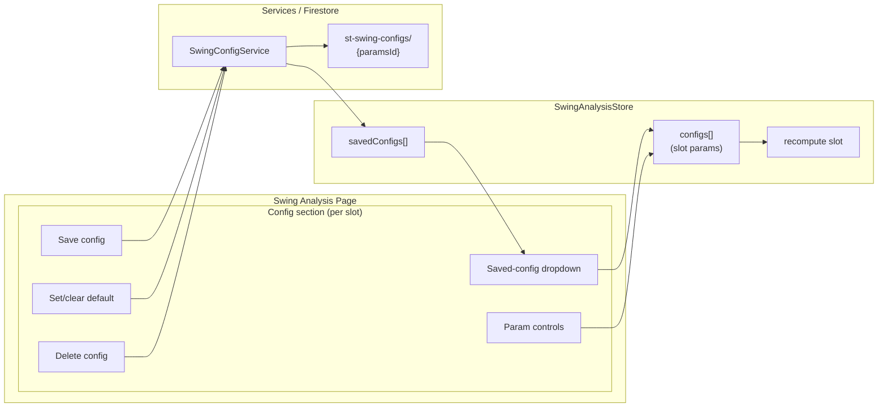

**Topic:** Trading Indicator Library  
**Topic Slug:** indicator-lib  
**Thread:** Persist swing configurations  
**Thread Slug:** persist-swing-configs  
**Issue:** #444  
**Thread Parent:** #443  
**Topic Parent:** #261  
**Domain:** INDICATOR-LIB  
**Type:** PRD  
**Status:** Approved  
**Created:** 2026-09-20  
**Last Updated:** 2026-09-20  

# PRD — Persist swing configurations

## Problem

The swing-analysis page's ZigZag detection params are ephemeral. Each slot ("Large Swings" / "Small Swings") boots from hardcoded `LARGE_CONFIG`/`SMALL_CONFIG` constants, and any tuned combination — deviation threshold, left/right depth, one-bar and projection flags — is lost on reload. Tuning is exploratory: the analyst iterates on params until the swing segmentation looks right, then has no way to recall that parameter set for another symbol or a later session. The only workaround is memorizing or re-deriving the numbers.

## Goal

Persist individual swing configurations to Firestore so the analyst can save a slot's current params, select a saved config into a slot from a dropdown, mark a config as a slot's default (applied on page load), and delete configs no longer needed — all without leaving the swing-analysis page.

## Non-goals

- **No persisted colors.** Slot line colors stay hardcoded in the UI (`LARGE_CONFIG`/`SMALL_CONFIG` `lineColor`); a saved config carries detection params only.
- **No named presets or pairs.** A saved config is a single param tuple labeled by its derived `paramsId` — not a user-named entity, and not a large+small pair snapshot.
- **No coupling to saved analyses.** Selecting a config sets params and recomputes; it does not auto-load `st-swing-sets` results, and the picker does not annotate which analyses exist.
- **No per-symbol configs or defaults.** Configs and defaults are global — the same param set applies to any symbol.
- **No backend work.** Reads/writes go through a frontend Firestore service; no Cloud Functions.

## User Stories

### US-1: Save a slot's current params

As an analyst, I save the current params of a config slot so I can recall the exact detection setup later.

- Each config section gets a **Save config** action that persists the slot's current `ZigZagConfig` params to `st-swing-configs/{paramsId}`.
- The doc id is the derived `paramsId` (`dev{N}_L{N}_R{N}_1bar{Y|N}_proj{N|Y}`) — saving identical params twice updates the same doc instead of duplicating it.
- `lineColor` is not written; the saved doc holds the five detection params + `savedAt` + `userId` + default flags.
- **Verify:** set Large slot to dev7/L4/R4 → Save config → reload page → the saved config appears in the dropdown and re-selecting it restores dev7/L4/R4.

### US-2: Select a saved config into a slot

As an analyst, I pick a saved config from a dropdown in a config section so the slot's params snap to that saved set and the analysis recomputes.

- A select control at the top of each config section lists all saved configs, labeled by `paramsId`.
- Selecting a config patches the slot via the existing `updateConfig` path — pivots, swings, and stats recompute automatically from the loaded bars.
- Applying a config does not change the slot's line color (colors are hardcoded per slot).
- In dual mode each slot's dropdown applies to its own slot only.
- The dropdown shows an empty/disabled state with a hint when no configs are saved yet.
- **Verify:** save dev5 config and dev10 config → select dev10 in the Small slot → small-slot inputs show dev10 params and the chart/table recompute with those params.

### US-3: Set a per-slot default config

As an analyst, I mark a saved config as the default for a slot so the page boots with my preferred params instead of the hardcoded constants.

- A per-section control (e.g. "Set as default") flags the currently-selected saved config as that slot's default via `defaultForLarge` / `defaultForSmall` on the config doc.
- Setting a new default clears the flag on the previously-defaulted doc — the two writes happen together (batch) so only one config can be a slot's default at a time.
- The same config may be default for both slots.
- On page load, each slot resolves its config as: flagged default saved config → else hardcoded `LARGE_CONFIG`/`SMALL_CONFIG`.
- A visible affordance (e.g. "clear default" or toggling the same control) unsets a slot's default, restoring the hardcoded fallback.
- **Verify:** flag dev7 config as Large default → reload → Large slot boots at dev7/L4/R4, Small slot still boots from `SMALL_CONFIG`. Clear the default → reload → Large slot boots from `LARGE_CONFIG` again.

### US-4: Delete a saved config

As an analyst, I delete a saved config I no longer use so the dropdown stays uncluttered.

- A delete action on a selected saved config removes its `st-swing-configs` doc.
- Deleting a config that is a slot's default automatically clears that default (the flag lives on the deleted doc — no dangling pointer).
- If the deleted config is currently applied to a slot, the slot's in-memory params remain unchanged until the user edits or selects another config.
- **Verify:** delete the dev10 config → it disappears from both slots' dropdowns → if it was Small's default, Small boots from `SMALL_CONFIG` on next load.

### US-5: Dropdown reflects the live config list

As an analyst, I see the dropdown stay in sync as I save and delete configs, without a page reload.

- The saved-configs list loads once on page init and updates in-place on save/delete.
- If the slot's current params match a saved config's `paramsId`, that entry is shown as selected; editing params manually deselects it (custom state).
- **Verify:** save a config, then edit one param → the dropdown returns to its unselected/custom state; select the saved config again → inputs snap back.

## Technical Context

- **Persistence shape:** flat collection `st-swing-configs/{paramsId}` — e.g. `st-swing-configs/dev5_L5_R5_1barY_projY`. Doc fields: `devThreshold`, `leftDepth`, `rightDepth`, `allowZigZagOnOneBar`, `projectionPivots`, `defaultForLarge`, `defaultForSmall`, `savedAt`, `userId`. Follows the repo's flat `st-`-prefixed convention (AGENTS.md) rather than the nested `configs/{feature}/configs/{id}` precedent.
- **Cardinality:** tiny — a handful of param tuples per user; a single `getDocs` enumerates the whole collection.
- **Auth:** docs are user-scoped (`userId` stamped by the service; security rules enforce read/write own configs), matching `st-swing-sets`.
- **Defaults resolution order:** saved default → hardcoded constants. If the flagged doc is deleted out-of-band, resolution falls back to the hardcoded constant for that slot.
- **Recompute cost:** selecting a config triggers the existing per-slot recompute path — identical cost to editing the params by hand.

## System Context

## Implementation Decisions

- New `SwingConfigService` (frontend, Firestore) — `loadConfigs`, `saveConfig`, `deleteConfig`, `setDefault/clearDefault` (batch write clearing the previous slot default). Mirrors `PctChangeConfigService`'s observable API but targets the flat `st-swing-configs` collection.
- `SwingAnalysisStore` gains a `savedConfigs` slice plus methods: `loadSavedConfigs` (init), `saveSlotConfig(slotIndex)`, `applySavedConfig(slotIndex, paramsId)`, `setSlotDefault(slotIndex, paramsId)`, `clearSlotDefault(slotIndex)`, `deleteSavedConfig(paramsId)`.
- Selection matches by `paramsId` — the dropdown's selected state derives from comparing the slot's current `paramsId` against saved docs; no separate "active config id" state is needed.
- Default resolution runs inside the store's init/symbol-load path, after `savedConfigs` loads.
- Security rules: add `st-swing-configs` rules matching the `st-swing-sets` owner-read/write pattern.

## Testing Decisions

- **Highest seam:** store + mocked `SwingConfigService` — covers save/apply/default/delete flows, dedup, and fallback resolution without Firestore.
- **Lower seams:** pure helpers (default resolution, paramsId matching) as unit tests; component TestBed specs for dropdown render/select/empty state.
- **Prior art:** `swing-analysis.store.spec.ts`, `pct-change-config.service` usage patterns, `swing-set-picker.component.spec.ts` for picker-style component tests.
- Good tests assert external behavior: state after `applySavedConfig`, emitted Firestore writes, boot-time default resolution — not internal call sequencing.

## Out of Scope (explicit)

- Persisted or editable config colors — colors remain hardcoded per slot.
- User-entered config names — label is always the derived `paramsId`.
- Pair/preset save (capturing both slots at once) — each config is saved and applied per-slot.
- Per-symbol configs or defaults.
- Loading saved `st-swing-sets` analyses from the config picker, or annotating which configs have saved analyses for the current symbol.
- Import/export of configs, sharing configs across users.

## Further Notes

- The existing "Save {Large|Small}" buttons on the page save **analysis results** (`st-swing-sets`), not configs — naming the new action "Save config" keeps the two distinct.
- `paramsId` excludes `lineColor`, which is consistent with colors being non-persisted: two slots can share a config while keeping their own colors.
