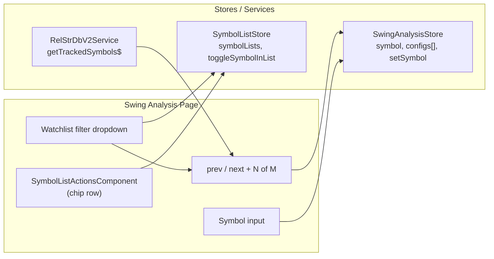

**Topic:** Trading Indicator Library  
**Topic Slug:** indicator-lib  
**Thread:** Add previous/next symbols capability to Swing Analysis  
**Thread Slug:** symbol-prev-next  
**Issue:** #452  
**Thread Parent:** #451  
**Topic Parent:** #261  
**Domain:** INDICATOR-LIB  
**Type:** PRD  
**Status:** Approved  
**Created:** 2026-09-20  
**Last Updated:** 2026-09-20  

# PRD — Previous/next symbol navigation in Swing Analysis

## Problem

Evaluating whether a stock's swings look tradable means loading symbols one at a time by typing each ticker into the symbol input. Walking a universe of candidates — the natural triage workflow — requires retyping a symbol per chart. Meanwhile the app already has the two ingredients this workflow needs and the page can't reach them: the tracked-symbols universe (the canonical symbol list) and the user's watchlist lists (PRIMARY/SECONDARY/NEUTRAL/AVOID/HIDE/PAST_SIGNALS) used for triage elsewhere.

## Goal

Let the analyst step through symbols on the swing-analysis page with prev/next buttons — swings recompute on the fly using the page's current params — optionally narrowed to a watchlist, and triage the viewed symbol into a list without leaving the page.

## Non-goals

- **No saved-analysis pull.** Navigation recomputes from bars with the current slot configs; it does not load `st-swing-sets` docs and does not cycle symbol+params combos — nav is at the symbol level only.
- **No new list model.** Watchlist filtering and assignment reuse the existing `SymbolListStore`/`SymbolListService` and `SymbolListActionsComponent`.
- **No backend changes.** Tracked symbols come from the existing `getTrackedSymbols$` callable; list membership writes use the existing service.
- **No persisted filter/nav state.** The selected list filter and position are session state.

## User Stories

### US-1: Step through tracked symbols

As an analyst, I click next/previous buttons beside the symbol input so the chart, swing table, and stats reload for the adjacent symbol — with my current slot params applied.

- The nav sequence is the tracked-symbols universe from `getTrackedSymbols$`, sorted alphabetically when no watchlist filter is active.
- Next/prev call the existing `setSymbol` path — current `configs[]` persist and pivots/swings/stats recompute on the new symbol's bars.
- A position indicator shows `N of M` — the current index and the sequence length — updating as the user pages.
- The sequence **wraps**: next on the last symbol returns to the first, prev on the first returns to the last.
- Buttons remain responsive while a load is in flight — the store's existing stale-request cancellation handles rapid paging.
- **Verify:** load three consecutive tracked symbols via next → each shows correct symbol, recomputed swings, and `N of M` increments; next past the last wraps to the first.

### US-2: Filter the nav sequence to a watchlist

As an analyst, I pick a watchlist from a dropdown so prev/next walk only that list's symbols, in the list's own order.

- A list select offers `All tracked` plus each `SymbolListName`; the choice narrows the nav sequence to that list's symbols in stored order.
- With a filter active, `N of M` reflects the filtered length.
- If the current symbol is not in the filtered sequence, prev/next simply move within the sequence (position counts the sequence, not the current symbol's membership).
- An empty filtered list disables prev/next with the indicator showing `0 of 0`.
- **Verify:** filter to PRIMARY (2 symbols) → next cycles only those two, indicator reads `1 of 2`; a symbol outside the list keeps its chart while nav moves within the list.

### US-3: Triage the viewed symbol into a list

As an analyst, I assign the currently-viewed symbol to a watchlist from the swing-analysis page so a symbol that looks tradable (or not) is filed immediately.

- The existing `SymbolListActionsComponent` chip row renders on the page, bound to the current symbol and `SymbolListStore.symbolLists`.
- Toggling a chip calls `toggleSymbolInList` — exclusive membership (a symbol lives in at most one list), persisted atomically to Firestore.
- The chips reflect the symbol's current membership when navigating to a new symbol.
- If the symbol is assigned into the currently-active nav filter, it stays in the sequence; if it's moved out of the filtered list, the sequence updates on next nav.
- **Verify:** viewing QQQ, click the PRIMARY chip → QQQ appears in PRIMARY list; navigate away and back → chip state persists.

### US-4: Failed symbols land visibly

As an analyst, when a symbol in the sequence fails to load (bad ticker, missing bars) I land on it with the existing error display so the gap is visible and I can keep paging.

- A failed `setSymbol` shows the existing error state; prev/next remain usable to continue past it.
- No silent skipping — position numbering stays honest (the failed symbol occupies its index).
- **Verify:** a symbol with no bars in the middle of the sequence shows the error state on arrival; next continues to the following symbol.

## Technical Context

- **Tracked symbols** come from `getTrackedSymbols$` (callable; backend-mirrored `tracked-symbols` collection) — the same source `stock-list-v2` uses for `supportedSymbolsListV2`. Returns `Company[]`; the nav sequence uses the `symbol` field.
- **Watchlists** live in `SymbolListStore.symbolLists: Record<string, string[]>` — membership is exclusive and writes are atomic batch moves via `SymbolListService.moveToList`.
- **Recompute cost** per nav step is the existing `setSymbol` → bars fetch → `recomputeAll` path; identical to typing the symbol manually. No new compute path.
- **Session-only state** — filter choice and position don't persist; reload returns to `All tracked`.

## System Context

## Implementation Decisions

- `SwingAnalysisStore` gains a nav slice: `trackedSymbols`, `navFilter` (`'ALL' | SymbolListName`), and a derived ordered `navSequence` (alphabetical for `ALL`, stored list order otherwise) + `navIndex`/position. Methods: `nextSymbol()`, `prevSymbol()`, `setNavFilter()` — each resolving the target symbol then delegating to `setSymbol`.
- Tracked symbols load once on page init (`getTrackedSymbols$`, existing TTL-cached path); `SymbolListStore.loadSymbolLists()` is invoked if lists aren't loaded.
- Position derives from `indexOf(symbol)` in the sequence — the `N of M` indicator and wrap-around fall out of index math.
- The page renders the filter dropdown, prev/next buttons + indicator beside the symbol input, and `SymbolListActionsComponent` for the current symbol.
- `SymbolListActionsComponent` is reused as-is (inputs `symbol`, `symbolLists`, `activeListFilter`; outputs wired to the store).

## Testing Decisions

- **Highest seam:** `SwingAnalysisStore` specs with mocked `RelStrDbV2Service`/`ChartService` — nav ordering, wrap-around, filter narrowing, error landing, params persistence across nav.
- **Lower seams:** pure sequence/ordering helpers as unit tests; component TestBed specs for button clicks, indicator text, filter dropdown, and chip-row rendering.
- **Prior art:** `swing-analysis.store.spec.ts`, `group.store` specs (SymbolListStore mocking precedent), `symbol-list-actions` usage in `symbol-row.component`.
- Assert external behavior: `symbol()` after nav, indicator values, chip state — not internal subscription wiring.

## Out of Scope (explicit)

- Reading `st-swing-sets` to populate nav or display saved analyses.
- Editing/creating watchlists themselves (rename, reorder lists) — only per-symbol membership assignment.
- Persisting nav position or filter selection across sessions.
- Keyboard shortcuts for prev/next (easy follow-on if wanted).
- The separate `persist-swing-configs` Thread's per-slot defaults — nav always uses whatever configs are currently active.

## Further Notes

- This thread and #443 (`persist-swing-configs`) compose naturally: saved configs set the params, nav walks symbols — but neither depends on the other's implementation.
- The swing-compare surface in option-chain-pct-change consumes saved analyses; unrelated to this nav sequence.
