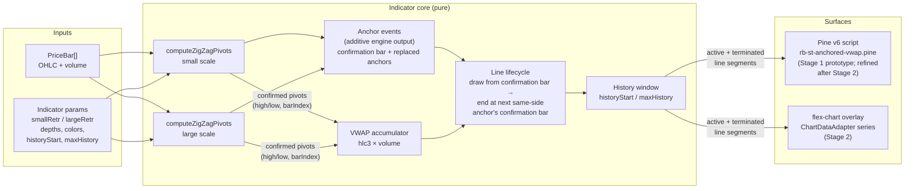

# PRD — ST Anchored VWAP

**Topic:** Trading Indicator Library  
**Topic Slug:** indicator-lib  
**Thread:** ST Anchored VWAP  
**Thread Slug:** st-anchored-vwap  
**Issue:** #836  
**Thread Parent:** #835  
**Topic Parent:** #261  
**Domain:** INDICATOR-LIB  
**Type:** PRD  
**Status:** Approved  
**Created:** 2026-10-06  
**Last Updated:** 2026-10-07  

## Problem Statement

Traders using Savant Trader can see where ZigZag pivots occurred, but not how volume-weighted price has behaved *since* a significant swing point. Anchored VWAP answers "what has the market paid, on average, since this pivot?" — a widely used measure of whether price is trading rich or poor relative to a swing's participants. Today there is no way to see that on ST charts, and no way to compare the answer at two different swing scales (a tight 2% retracement vs. a structural 5% retracement) at once.

## Solution

A new **ST Anchored VWAP** chart indicator that draws VWAP lines anchored to ZigZag-detected swing pivots. The indicator runs the existing ZigZag pivot engine internally at **two retracement scales** (small and large), and for each scale draws a VWAP line forward from the most recent confirmed pivot high and the most recent confirmed pivot low — four active lines. A pivot only confirms ~`rightDepth` bars after it forms, so **every line is drawn only from its confirmation bar forward — never back to the pivot bar.** When a new same-side pivot confirms, the old line keeps running *through the confirmation bar* (the bar on which the new pivot became knowable) and stops there, and the new line starts on that same bar. Nothing is back-attached to the actual pivot bar: doing so would draw lines that could not have existed in real time. Superseded lines remain visible as faded history for retrospective analysis.

A line is still *anchored* to its pivot — its VWAP accumulates from the pivot bar's data — but the line is not *drawn* before its confirmation bar. Its first drawn value is the VWAP of the pivot bar through the confirmation bar.

There is therefore a single, causal rendering: what the chart shows at any bar depends only on bars up to and including that bar, so the lines are safe to compare against signals and to use in strategies.

The indicator is delivered **in two stages**: a TradingView Pine v6 prototype first (`rb-ps/rb-ta/ind/rb-st-anchored-vwap.pine`), then the web implementation inside flex-chart. **Stage 1 so far confirmed only the indicator's relevance for general use** — it is not a refined reference. Once Stage 2 (web) is complete, the work returns to Stage 1 to refine the Pine script to match the finished web behaviour.

### Parameters

| Param | Type | Default | Notes |
|---|---|---|---|
| `smallRetracementPct` | number | 2.0 | ZigZag `devThreshold` for the small-scale pivot set |
| `largeRetracementPct` | number | 5.0 | ZigZag `devThreshold` for the large-scale pivot set |
| `leftDepth` | number | 5 | Shared pivot-confirmation depth (bars left) |
| `rightDepth` | number | 5 | Shared pivot-confirmation depth (bars right) — also the confirmation lag: a pivot's line first appears `rightDepth` bars after the pivot bar |
| `smallHighColor` / `smallLowColor` | color | pale magenta `#FF8CFF` / pale cyan `#8CF5FF` | Small-scale line hues |
| `largeHighColor` / `largeLowColor` | color | magenta `#FF00E6` / cyan `#00E5FF` | Large-scale line hues |
| `historyStart` | date | unset | Only render terminated segments anchored on/after this date |
| `maxHistory` | number | 100 | Max terminated segments per scale. Pine prototype clamps to 48 per scale (see Technical Context); web has no platform cap |

`allowZigZagOnOneBar` is fixed `true` internally; `projectionPivots` is irrelevant (confirmed pivots only).

## User Stories

1. As a trader, I want a VWAP line drawn forward from the most recent confirmed pivot high, so that I can see the volume-weighted mean price since that swing high.
2. As a trader, I want a second VWAP line from the most recent confirmed pivot low, so that I can see both sides of the current swing structure.
3. As a trader, I want VWAP lines at two retracement scales simultaneously, so that I can compare short-swing vs. structural-swing volume positioning without reconfiguring the indicator.
   - *Acceptance:* the chart shows up to four active lines — high/low × small/large scale — each extending to the latest bar.
4. As a trader, I want the VWAP lines to *not* depend on the ST ZigZag indicator being enabled, so that I can run AVWAP alone or alongside a differently-tuned ZigZag.
   - *Acceptance:* enabling AVWAP with no ZigZag indicator on the chart still renders anchor lines correctly.
5. As a trader, when a new pivot high confirms, I want the previous high-anchored line to continue through the **confirmation bar** and stop there, and a new line to begin on that same bar, so that the chart shows only what was knowable at each bar.
   - *Acceptance:* the superseded line's last rendered point is the new pivot's confirmation bar; the new line's first point is the same bar. At most one active high line and one active low line per scale cover any given bar.
6. As a trader, I want no line ever drawn before its confirmation bar — no back-attachment to the actual pivot bar — so that I never read a line that could not have existed in real time.
   - *Acceptance:* for every drawn segment, its first point's bar is its pivot's confirmation bar (pivot bar + `rightDepth` for a normal pivot, or the bar on which a more extreme same-side pivot replaced the anchor). No segment has a point earlier than that. Every line's content at bar `t` is identical whether computed from bars `0..t` or from the full series. The History Window only filters which terminated segments draw, so which *history* segments are shown can legitimately depend on how much history exists; a drawn segment's content never does.
7. As a trader, I want superseded lines to stay visible as faded history, so that I can see where prior anchors and their VWAP trajectories sat.
8. As a trader doing historical analysis, I want to enter a `historyStart` date and see the anchor lines drawn forward from that era (up to `maxHistory`), so that I can study an older period's VWAP handoffs.
   - *Acceptance:* with `historyStart` set, terminated segments anchored on/after the date render chronologically until the cap is hit; nothing before the date renders.
9. As a trader on the default view, I want the most recent `maxHistory` terminated segments (oldest pruned first), so that history always runs up to the latest bar.
   - *Acceptance:* with `historyStart` unset and history deeper than the cap, the *earliest* segments are dropped — never the recent ones.
10. As a trader, I want VWAP computed on typical price (H+L+C)/3, matching TradingView's Anchored VWAP convention.
    - *Acceptance:* the VWAP of an anchor evaluated at its own pivot bar equals that bar's typical price; the first *drawn* value (at the confirmation bar) is the VWAP of pivot bar through confirmation bar.
11. As a trader, I want the line to continue across bars with missing or zero volume without breaking, so the line never fragments.
    - *Acceptance:* a zero/missing-volume bar contributes nothing to the sums and the line carries flat.
12. As a trader, I want per-scale color/width distinction (large scale thick and saturated, small scale thin and pale) with configurable colors, so the four lines are distinguishable at a glance.
    - *Acceptance:* hue encodes side (magenta = pivot-high anchor, cyan = pivot-low anchor); saturation and thickness encode scale. The default palette avoids red/green pairing (colour-vision accessibility) and does not collide with the blue and yellow already used by other ST indicators.
13. As a trader, I want the indicator as an opt-in toggle in the ST indicator menu — not auto-loaded — rendered on the price overlay pane.
14. As a trader, I want a TradingView Pine version of the indicator, so that I can judge the indicator's relevance on real charts.
    - *Acceptance:* `rb-ps/rb-ta/ind/rb-st-anchored-vwap.pine` loads in TradingView and shows the four-line + history behavior. **Prototype delivered; relevance confirmed.** The prototype predates the no-backfill rule above, so it is to be refined to match the web behaviour after Stage 2.

## Implementation Decisions

- **Pivot engine reuse.** The indicator calls the existing `computeZigZagPivots(bars, config)` pure engine twice — once per scale — with `smallRetracementPct`/`largeRetracementPct` mapped to `devThreshold` and shared `leftDepth`/`rightDepth`. It does not read, depend on, or share config with any visible ST ZigZag indicator instance.
- **Confirmed pivots only.** The engine's unconfirmed `projection` pivot is never used as an anchor — a projected anchor would produce a line that jumps or vanishes as the projection mutates.
- **VWAP accumulation.** Per anchor: `cumPV += typicalPrice * volume`, `cumV += volume`, `vwap = cumPV / cumV`, accumulating from the pivot bar inclusive; the line is drawn from the confirmation bar and extends to the latest bar while active. `typicalPrice = (high + low + close) / 3`. Missing/zero volume contributes nothing — the line carries flat.
- **Line lifecycle.** Each anchor produces a VWAP series seeded at its pivot bar and first drawn at its **confirmation bar**. A series is *active* until a later same-side anchor confirms, then it is *terminated* with its final rendered point at the superseding anchor's **confirmation bar** — the old line is never trimmed back to the new pivot's bar. A terminated segment therefore spans exactly *its confirmation bar → the next same-side anchor's confirmation bar*. There is no retroactive drawing at any point.
- **Replaced anchors are real anchors.** When a more extreme same-side pivot replaces the current anchor (the engine overwrites the last pivot), the replaced anchor *was* the live anchor until that confirmation bar, so its line is drawn and terminated at the replacement's confirmation bar like any other. The replacement's line starts on that bar.
- **History window semantics.** `historyStart` set → render terminated segments anchored on/after the date, chronologically forward, stopping at `maxHistory` (prunes the *recent* end). `historyStart` unset → render the most recent `maxHistory` terminated segments (prune *oldest*-first). Active lines are never pruned or windowed. `maxHistory` is a per-scale input (default 100); the Pine prototype clamps it to its polyline budget (48 per scale); the web build has no platform cap.
- **One indicator, dual scales.** A single `st-anchored-vwap` indicator carries both scales' params — the two sets are guaranteed by construction rather than by the user adding two instances.
- **Rendering (web).** Multi-segment output can't use the flat `{x,y}` `IndicatorCalculator` contract — it gets a bespoke computed series in `ChartDataAdapter` like `zigZagSeries`/`stdDevLineSeries`, mapped to index-keyed line segments. Overlay pane, price axis. New `StIndicator` member + `IndicatorOption` + registry entry; opt-in via the ST indicator menu (not in `DEFAULT_ST_INDICATORS`).
- **Engine seam — requirement found in review.** The existing `computeZigZagPivots` returns only *surviving* pivots: a more extreme same-side candidate overwrites the last pivot (`pivots[pivots.length - 1] = candidate`), so replaced anchors are lost, and `Pivot` carries `barIndex` but no confirmation bar. Because lines now start at the confirmation bar and every live anchor (including later-replaced ones) must be drawn, the indicator needs both. The engine must therefore additionally expose an **anchor event sequence** (confirmation bar, pivot bar, side, and whether it replaced the prior same-side anchor), or an equivalent additive output. This must be additive — existing ZigZag callers and `Pivot` consumers must be unaffected. A survivor's confirmation bar is exactly `barIndex + rightDepth`; replacements are what the survivor list cannot reconstruct. *Design of this seam is deferred to Blueprint.*
- **Visual encoding.** Per-side hue (high = magenta family, low = cyan family), per-scale saturation and weight (large saturated and thick, small pale and thin). Terminated segments render the same hue/weight at reduced opacity (the prototype used ~45% transparency; terminated lines should stay clearly readable). Palette is configurable; defaults avoid red/green. Confirmation-bar markers are *not* required: a line's first point is already the confirmation bar.
- **Legend naming.** `AVWAP-H {pct}%`, `AVWAP-L {pct}%` per scale.
- **Pine prototype (Stage 1, to be refined after Stage 2).** `rb-ps/rb-ta/ind/rb-st-anchored-vwap.pine`, Pine v6, `overlay=true`. A stripped port of the `rb-st-zigzag.pine` detection core (confirmed pivots only); each VWAP segment is one `polyline` (a VWAP is a curve; `line` is two-point); per-bar history held in arrays indexed by `bar_index` (avoids Pine history-buffer limits that broke an earlier `series[offset]` approach); active polylines drawn once on the last bar. It currently implements the earlier *backfill-to-pivot-bar* model, plus thin step lines, confirmation markers and a temporary debug table that this PRD no longer calls for. It is not updated during Stage 2; the refinement pass after Stage 2 brings it in line with this PRD.

## Stage sequencing

**Stage 1 — Pine prototype (relevance check). Complete.** Built and viewed on real TradingView charts (2026-10-06). It confirmed only that the indicator is relevant for general use; it is not a refined reference, and it still implements the earlier backfill-to-pivot-bar model.

**Stage 2 — Web implementation. Next.** Flex-chart indicator + engine anchor-event seam + adapter series + tests, built to the no-backfill, confirmation-bar semantics in this PRD. Refinement iteration happens here, in ST, rather than in TradingView.

**Stage 1b — Pine refinement (after Stage 2).** Return to the Pine script and refine it to match the finished web behaviour.

## Testing Decisions

- **Pine stage:** manual visual verification on TradingView (same convention as prior Pine exports — QA #381), plus a documented verification checklist in the task. Applies to the post-Stage-2 refinement pass.
- **Web stage:** unit tests against the pure computation — anchor selection from a known pivot set, VWAP accumulation correctness (typical price, volume edge cases), lines starting at the confirmation bar and terminating at the next same-side anchor's confirmation bar, and the `historyStart`/`maxHistory` windowing rules in both modes. Prior art: `st-zigzag.engine.spec.ts`, `st-zigzag.pivots.spec.ts` test pure pivot math the same way.
- **No-lookahead property test.** For the full output, assert that the output at bar `t` computed from `bars[0..t]` equals the output at `t` computed from the full series, for every `t`. This is the direct guard against drawing anything back to a pivot bar, and should be property-style over varied bar sets. Also assert no segment has a point earlier than its confirmation bar, and that a replaced anchor's segment ends exactly on its replacement's confirmation bar.
- **Engine-seam tests.** The additive anchor-event output must be tested against known bar sets: survivor confirmation bar = `barIndex + rightDepth`; replaced anchors appear in the event sequence but not in the surviving pivot list; existing `computeZigZagPivots` output is unchanged (regression).
- **Seam:** the pure computation function (bars + params → line segments) is the highest seam; the Syncfusion render is verified by the existing flex-chart spec patterns.

## Technical Context (user-affecting)

- **Confirmation lag.** A pivot only confirms after `rightDepth` bars, so a new line starts `rightDepth` bars after its pivot, and the previous same-side line runs that much longer. This is inherent to ZigZag-based anchoring, not a defect. By design the chart never shows a line before its confirmation bar.
- **Forming-bar caveat.** Lines do not repaint on closed bars, but ZigZag pivots can still change on the forming (live) bar. Anything making real-time decisions should act on closed bars only.
- **Pine drawing budget (prototype only).** The Pine prototype draws every segment as a `polyline`, which TradingView caps (the script sets `max_polylines_count = 100`, which compiled; worth verifying against current Pine documentation that 100 is the platform maximum). With four active lines reserved, history is clamped to 48 terminated segments per scale. The earlier assumption of a 500-*line* budget does not apply to polylines. The web build has no such cap.
- **Volume dependency.** Symbols/bars without volume data produce flat-carrying lines rather than gaps.

## Out of Scope

- Projected/unconfirmed pivot anchoring.
- More than two scales, or per-scale depth params.
- Anchoring on anything other than ZigZag pivots (manual anchors, session anchors, earnings anchors).
- Standard (un-anchored, session-reset) VWAP.
- Any backend/pipeline *consumption* of AVWAP (strategies, signals, alerts) — chart-rendered only in this thread. Because the rendering is causal, such consumption becomes possible later without redesign, but wiring it into strategies is not part of this thread.
- Updating the Pine script during Stage 2 (it is refined afterwards, in Stage 1b).
- Hindsight (back-attached) lines, a separate causal-vs-hindsight toggle, and confirmation-bar markers — dropped by design.

## Prototype Findings (Stage 1)

What the Pine prototype established, and what it left open:

- **Relevant.** The four-line, two-scale picture is readable on real charts and worth building. This is all Stage 1 established — a relevance check, not a refined design.
- **Back-attached lines are misleading.** Seeing lines drawn from the "perfect" pivot made the retroactive nature of ZigZag anchoring vivid, and led to the decision to draw nothing before the confirmation bar (stories 5–6). The prototype still draws the back-attached version; that is why it is to be refined later.
- **Pine constraints were severe** (history-buffer limits on conditionally-read series, `max_bars_back` unusable on builtins and function parameters, polyline cap, execution time from per-bar rebuilds) — a main reason the next work happens in the web build.
- **Decided — VWAP accumulates from the pivot bar, not the confirmation bar.** The line is still a true anchored VWAP of the pivot; only the *drawing* starts at the confirmation bar, so its first drawn value is the VWAP of pivot bar through confirmation bar. Accumulating from the confirmation bar was considered and rejected (user decision, 2026-10-07).
- **Open — refinement list.** The prototype was judged to need "a lot of work"; the specific items have not yet been enumerated. They are to be captured during ST iteration and folded into this PRD or into follow-up tasks. Not guessed here.
- **Open — does AVWAP resemble ST signals?** The user's hypothesis is that the lines and ST signals look very similar. Unverified; worth checking once the indicator runs alongside signals in ST.

## Further Notes

- The indicator's `devThreshold` params are the user's requested "retracement percent" — a pivot only exists (and therefore can only anchor a line) when price retraces by that percentage.
- Prior threads shipped Pine exports under `rb-ps/rb-ta/ind/` (`rb-st-std-dev-lines.pine`, `rb-st-zigzag.pine`); this follows the same pattern.

## System Context

