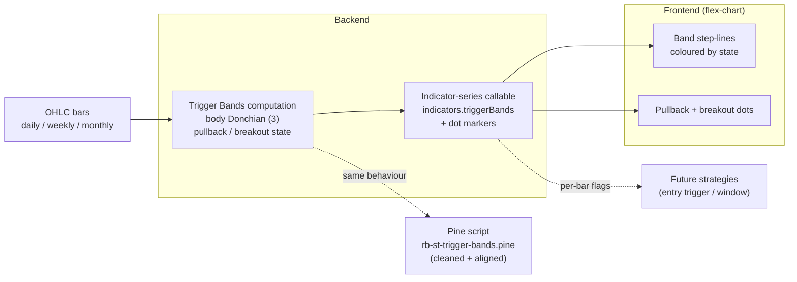

# PRD — ST Trigger Bands

**Topic:** Trading Indicator Library  
**Topic Slug:** indicator-lib  
**Thread:** Implement ST Trigger Bands in ST Indicator Library  
**Thread Slug:** st-trigger-bands  
**Issue:** #863  
**Thread Parent:** #862  
**Topic Parent:** #261  
**Domain:** INDICATOR-LIB  
**Type:** PRD  
**Status:** Approved  
**Created:** 2026-10-06  
**Last Updated:** 2026-10-07  

> **Amended 2026-10-07 (during Blueprint, user decision):** Trigger Bands is an **indicator only**, a building block that other strategies will use as an entry trigger. The original draft specified a standalone ST Trigger Bands strategy, new signal types and persisted warning signals; those are removed. D/W signal markers and a weekly pullback projection onto daily bars were also dropped from this Thread; they will be designed separately.

## Problem Statement

ST's existing entry signals (Trend Rider on zones V1/V2) react slowly. The trader has a TradingView indicator, `rb-st-trigger-bands.pine`, built on Donchian channels over candle bodies, that gives a much faster entry trigger. A **pullback** (the band on one side stops expanding) warns that a setup is forming, and a **breakout** (body crosses the prior band after a pullback) is the trigger. The trader intends to use it as a component of larger strategies, for example treating a higher-timeframe pullback as an "open window" and a lower-timeframe breakout inside it as the entry. Today it exists only in TradingView; it cannot be seen on ST charts and its per-bar state is not available to ST strategies.

## Solution

Port the indicator to the ST Indicator Library as an **indicator**:

1. The computation runs on the **backend** and is returned through the existing indicator-series callable (the `triggerBands` slot is already reserved there), so the chart and any future strategy read the same per-bar numbers.
2. A **chart indicator** draws the upper and lower trigger bands on the price overlay, coloured by pullback / breakout state, with **dots** on pullback and breakout bars.
3. Per-bar pullback / pullback-state / breakout flags for both sides are part of the series data, ready for future strategies to consume.
4. The Pine script is cleaned up and aligned with the finished behaviour.

### Definitions (from the Pine source)

Bands use candle **bodies**: `bodyHigh = max(open, close)`, `bodyLow = min(open, close)`.

- `upper = highest(bodyHigh, 3)`, `lower = lowest(bodyLow, 3)`. Length 3 and body-based values are fixed (no inputs). Bands are empty until 3 bars exist.
- **Long pullback** (bar `t`): `upper[t] <= upper[t-1]`, the upper band is not rising.
- **Long breakout** (bar `t`): all of: `upper[t-2] >= upper[t-1]`; `bodyHigh[t] > upper[t-1]` and `bodyHigh[t-1] <= upper[t-2]` (Pine `ta.crossover(bodyHigh, upper[1])`); and the long pullback state was on at `t-1`.
- **Long pullback state:** turns on at any long pullback bar; turns off at a long breakout; otherwise carries. It starts off.
- **Short side** mirrors the long side on the lower band: pullback = `lower[t] >= lower[t-1]`; breakout = `lower[t-2] <= lower[t-1]`, `bodyLow[t] < lower[t-1]` and `bodyLow[t-1] >= lower[t-2]` (Pine `ta.crossunder(bodyLow, lower[1])`), and the short pullback state was on at `t-1`.

Not ported: the midpoint line, the commented-out retrace logic, wick-based variants, the `horzOffset`/`vertOffset` inputs, and the debug logging.

### Timeframes

The backend computes the indicator for every interval the callable already returns. The chart shows it on the daily and weekly charts. Monthly is not rendered.

## User Stories

1. As a trader, I want the ST Trigger Bands (upper and lower body-Donchian bands, length 3) drawn on the price overlay, so that I can see the trigger levels on ST charts.
   - *Acceptance:* with the indicator enabled, the chart shows an upper and a lower step-line band. For a known bar set, the band values equal `highest(bodyHigh, 3)` / `lowest(bodyLow, 3)` at every bar from the third bar on.
2. As a trader, I want the bands coloured by state, so that I can read pullback and breakout at a glance.
   - *Acceptance:* the upper band is coloured differently on long-pullback bars and long-breakout bars than on neutral bars; the lower band likewise for the short side. Default colours avoid collisions with other ST indicators (blue and yellow are already used elsewhere; settled in the FE task).
3. As a trader, I want dots on the chart for pullbacks and breakouts, so that I can see where the trigger fired.
   - *Acceptance:* a breakout dot on every long/short breakout bar and a pullback dot on every bar where the pullback condition holds (the trader's choice; expect it to be dense). Long and short are visually distinct, and breakout and pullback dots are visually distinct.
4. As a strategy author, I want the per-bar state, so that a future strategy can use the breakout as an entry trigger and the pullback as a warning or window.
   - *Acceptance:* the series returned by the callable carries, for every bar and both sides, the pullback, pullback-state and breakout flags, the same values the chart colours and dots are drawn from. For a known bar set the flags match the Pine script on the same bars.
5. As a trader, I want the indicator as an opt-in toggle in the ST indicator menu, rendered on the price overlay pane, on the daily and weekly charts.
   - *Acceptance:* not in the default ST indicator set; enabling it renders bands and dots on the overlay; weekly charts use the weekly series.
6. As a trader, I want the Pine script cleaned up and aligned with the web behaviour, so that TradingView and ST show the same thing.
   - *Acceptance:* `rb-st-trigger-bands.pine` lives in `rb-ps/rb-ta/ind/` in this repo, has no dead code or debug logging, and produces the same bands and flags as the web implementation on the same bars.

## Implementation Decisions

- **Backend computation.** A pure function in `functions/src/indicators/st-trigger-bands.ts`: bars to per-bar `upper`, `lower` and the pullback, pullback-state and breakout flags for both sides. Wired into the indicator-series computation and returned in `indicators.triggerBands` (the empty `TriggerBandsPoint` stub gets its fields).
- **Dots.** Breakout and pullback dots are returned as dot markers for the trigger-bands family, following the existing dot-marker conventions. The dot-marker version tag and the callable's response filtering are extended additively; existing families are unaffected.
- **No strategy, no signals.** No strategy adapter, signal type, worker change or Firestore storage change. `signals.triggerBands` and `StrategyFamily.TRIGGER_BANDS` stay unused.
- **Fixed parameters.** Length 3 and body-based values are not configurable.
- **Opt-in.** Not part of the default indicator set requested by the chart; requested only when the user enables it.
- **Rendering.** Step-line bands plus dots on the overlay pane, price axis. New `StIndicator` member, `IndicatorOption` and registry entry; opt-in via the ST indicator menu. The FE has no calculator: it plots from the callable response.
- **Pine cleanup.** Stripped of the midpoint, retrace logic, wick variants, offsets, unused `rbLib` import and logging. Pine version (v5 today; sibling scripts use v6) is decided in the Pine task.

## Testing Decisions

- **Computation:** unit tests against known bar sets, covering band values, warm-up, pullback/breakout flags and state transitions (the "band flat or falling the bar before" gate, the crossover's previous-bar condition, the "state on previous bar" gate, state reset on breakout), both sides. Prior art: `tests/functions/std-dev-lines.test.ts`.
- **Callable:** tests that `triggerBands` is present when requested and absent otherwise, that dot markers are returned only for the requested family, and that existing families are unchanged (regression).
- **FE:** converter and indicator-config specs against a sample callable response; band colour runs follow the flags. Prior art: `indicator-converters.spec.ts`, `st-std-dev-lines.indicator.spec.ts`.
- **Pine:** manual verification on TradingView against the web chart on the same symbol and period (same convention as prior Pine exports, QA #381).
- **Seam:** the pure backend function is the highest seam; Syncfusion rendering is verified by the existing flex-chart spec patterns.

## Technical Context (user-affecting)

- **Dot density.** Pullback dots fire on every pullback bar and the bands use a 3-bar window, so expect many dots. This is by design; if it proves noisy, a first-bar-only cadence is a follow-up.
- **Closed bars.** Bands and flags depend on the current bar's body; on a live forming bar they can change until the bar closes. Real-time decisions should act on closed bars.
- **Faster than zones.** The trigger reacts to a 3-bar body window and is intentionally faster than Zone V1/V2.

## Out of Scope

- A Trigger Bands strategy, new signal types, warning signals, worker/persistence changes, gallery or signal-review surfacing.
- Composing Trigger Bands into a strategy (higher-timeframe pullback window plus lower-timeframe breakout entry); a separate, more refined effort.
- D/W signal markers and a weekly pullback projection onto daily bars.
- User-configurable length or body/wick toggle.
- The midpoint line and the retrace pullback/breakout logic from the Pine source.
- User-facing notifications.
- Monthly rendering.
- Server-side screenshot capture parity (the screenshot assembler maps its own indicator set).

## Open Questions

- Default colours for band states and dot styles.
- Pine version (v5 vs v6) for the cleaned-up script.

## System Context

