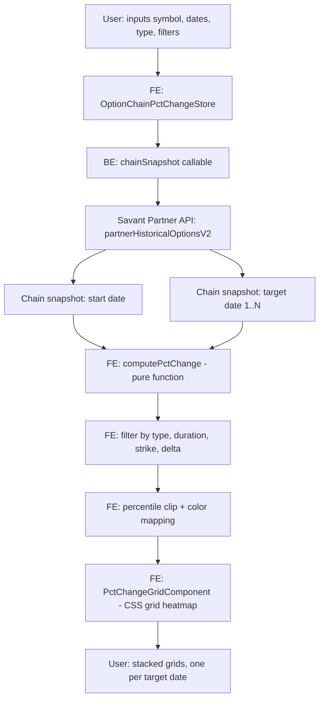

**Topic:** Option chain percent change grid  
**Topic Slug:** option-chain-pct-change-grid 
**Thread:** Option chain percent change grid
**Thread Slug:** initial-impl 
**Issue:** #328  
**Thread Parent:** #327
**Topic Parent:** #326  
**Domain:** OPTIONS  
**Type:** PRD  
**Status:** Approved  
**Created:** 2026-09-15  
**Last Updated:** 2026-09-15  

---

## Problem Statement

As a trader analyzing options, I want to see which option contracts had the
greatest percent price change over a specific date range, so that I can
identify the "sweet spot" — the strike/expiry/delta combination that
maximizes returns for a given swing duration.

A deep OTM call won't move as much as an ATM call over a short time period,
but after a significant price move the deep OTM call will have a higher
percent change than the ATM call due to its much lower base price. There is
no existing view in the app that surfaces this trade-off across the entire
chain at once.

## Solution

A new in-app view that fetches historical option chain snapshots for a
start date and one or more target dates, computes the percent price change
per contract (using `mark` as the pricing basis), and renders the results as
a heatmap grid — rows = strikes, columns = expirations, color intensity =
magnitude of % change. One grid per target date, stacked vertically.

The user provides a symbol, a start date, one or more target dates, a
contract type (calls or puts), and optional filters (duration range, strike
range, delta range). The grid shows which contracts moved the most,
revealing where the sweet spot sits for each time duration.

This is **phase 1** (single-run, manual date entry). **Phase 2** (batch
aggregation across all swings in a time range) is deferred until Topic #261
(ZigZag indicator) is live, since phase 2 depends on automatic swing
identification.

## User Stories

1. As a trader, I want to enter a symbol, start date, and one or more
   target dates, so that I can define the time range(s) to analyze.

2. As a trader, I want to select whether this run is for calls or puts,
   so that the grid shows the right contract type for my analysis.

3. As a trader, I want to filter contracts by a duration range (e.g.
   7d–30d), so that only expirations within that range appear as columns
   in the grid.

4. As a trader, I want to filter contracts by a strike range, so that I
   can focus on the strikes relevant to my analysis.

5. As a trader, I want to optionally filter contracts by delta range
   (e.g. |delta| between 0.05 and 0.95), so that I can exclude deep
   OTM/ITM contracts that may add noise.

6. As a trader, I want the grid to show expiration as columns and strike
   as rows, so that I can scan the full chain shape at a glance.

7. As a trader, I want each cell colored by the percent price change
   (green for up, red for down, intensity by magnitude), so that I can
   instantly see where the biggest moves are.

8. As a trader, I want a separate grid for each target date, stacked
   vertically, so that I can compare how the % change pattern shifts
   across durations.

9. As a trader, I want each grid to show the target date and the duration
   from the start date in its header, so that I know which time range
   each grid represents.

10. As a trader, I want to hover over a cell and see the contract details
    (contractID, strike, expiration, delta, start price, target price,
    % change), so that I can inspect individual contracts.

10a. As a trader, I want each cell to display the starting price, ending
    price, and percent change, so that I can see the actual price values
    alongside the percentage move without hovering.

11. As a trader, I want contracts that don't exist in both the start and
    target snapshots excluded from the grid, so that I only see contracts
    with a valid % change.

12. As a trader, I want the color scale to auto-adjust per grid using a
    percentile clip (5th/95th), so that a single outlier contract doesn't
    compress everyone else's color into a flat shade.

13. As a trader, I want the % change computed using the `mark` price, so
    that the comparison is consistent across the entire chain and not
    distorted by stale last trades or wide bid/ask spreads.

14. As a trader, I want to see the top N gainers for each target date
    highlighted or listed, so that I can quickly identify the sweet spot
    contracts without scanning every cell.

15. As a trader, I want the view accessible from the app navigation
    alongside other options views, so that I can reach it without
    remembering a URL.

16. As a trader, I want to re-run the analysis with different dates or
    filters, so that I can iterate on the analysis interactively.

17. As a trader, I want calls and puts to be separate independent runs
    with different date semantics (calls: swing low → swing high; puts:
    swing high → swing low), so that each run measures the right price
    direction for its contract type.

## Implementation Decisions

### Data access strategy

Chain snapshots via the existing Savant Partner API endpoint
`partnerHistoricalOptionsV2`. One call per date (1 start + N targets =
N+1 calls total). Each call returns the full options chain for that
symbol on that date. Contracts are matched across snapshots by
`contractID`. The backend proxy function
`callPartnerHistoricalOptions` already exists in
`functions/src/options-contract-proxy.ts` — it takes `{symbol, date}`
and returns the full chain with `mark`, `last`, `bid`, `ask`, greeks,
volume, and open_interest per contract.

A new callable wraps this for the FE, since the existing
`OptionsContractService` does not expose chain snapshots yet (it only
wraps per-contract V2 and contract index/catalog endpoints).

### Pricing basis

`mark` — the fair-value estimate field from the chain snapshot.
Consistent with the rest of the app. Used for all % change calculations.

### Percent change computation

For each contract present in both the start and target snapshots:
`pctChange = (targetMark - startMark) / startMark * 100`. Contracts
missing from either snapshot are excluded (no null cells). Each cell
carries `startPrice`, `targetPrice`, and `pctChange` so the grid can
display all three values.

### Filtering

Applied after fetching both snapshots, before computing % change:
- **Type:** calls OR puts (selected per run, never both)
- **Duration range:** filter expirations by contract length relative to
  the start date (e.g. 7d–30d). Contracts with expirations outside the
  range are excluded.
- **Strike range:** `strikeGte` / `strikeLte` — exclude strikes outside
  the range.
- **Delta range:** `deltaGte` / `deltaLte` — optional, exclude contracts
  with delta outside the range. Delta is read from the start-date
  snapshot.

### Color scale

Diverging green/red scale with percentile clip:
- Compute the 5th and 95th percentile of the grid's % change
  distribution.
- Values at or below the 5th percentile saturate to max-intensity red.
- Values at or above the 95th percentile saturate to max-intensity green.
- Values between are interpolated linearly from red (negative) through
  neutral (0%) to green (positive).
- Percentiles are computed per grid (per target date), so each grid
  auto-scales to its own distribution.

### Heatmap rendering

Custom CSS grid component — standalone Angular component using CSS
grid/flexbox. Each cell is a `div` with `background-color` computed from
the % change via the color mapping function. No new charting
dependency. Follows the existing pattern in
`heatmap-chart-heatmap.component` (divs with `[style.background-color]`).
Syncfusion's HeatMap module is NOT added.

### Grid layout

Rows = strikes (sorted ascending), columns = expirations (sorted
ascending). One grid per target date. Grids stacked vertically with a
header showing the target date and duration from start. Calls and puts
are separate runs — no toggle, just an input parameter.

### App placement

New page under `savant-trader/pages/option-chain-pct-change/`. New
route `OPTION_CHAIN_PCT_CHANGE` in the `AppRoutes` enum and
`core-routes.ts`, with `authGuard`. Consistent with existing options
views (`option-chart`, `spread-chart`, `options-strategy-dashboard`).

### State management

NgRx signal store following the existing pattern in
`options-contract-viewer.store.ts`. The store holds the input
parameters, loading state, and computed grid data. The computation
(% change, filtering, percentile clip) happens in a pure function
invoked from the store's methods.

### Persistence

None in phase 1. Results are ephemeral. The user re-runs the analysis
to see results again. Persistence (and phase 2 batch aggregation) will
be designed after evaluating whether the grids produce useful insights.

### Phased scope

- **Phase 1 (this Thread):** Single-run grid. User manually enters
  start date, target dates, type, and filters. No ZigZag dependency.
- **Phase 2 (after Topic #261 is live):** Batch aggregation across all
  swings in a time range. Uses ZigZag pivots for automatic swing
  identification. Aggregates top gainers across runs to find the
  consistent sweet-spot pattern per duration.

## Technical Context

- **Data source:** `partnerHistoricalOptionsV2` is a live on-demand proxy
  to Alpha Vantage — not a Firestore-backed reader. Each accepted request
  results in a live AV call. No raw response is persisted, no
  service-side cache. (Source: SA discovery doc
  `historical-options-discovery.md`.)
- **Data freshness:** Chain snapshots are fetched live from the Savant
  Partner API on each run. No caching. Each run makes N+1 partner API
  calls (one per date). Response time depends on Alpha Vantage's
  processing time for historical chain snapshots (~10-30s per date).
- **Symbol coverage:** The raw chain endpoint accepts any symbol in the
  `tracked_symbols` collection — not just QQQ/TQQQ. The QQQ/TQQQ
  restriction applies only to per-contract time-series endpoints
  (`partnerHistoricalOptionsContractV2`, `partnerContractCatalogV2`)
  which read from a GCS corpus backfilled only for QQQ (TQQQ pending).
  Expanding options coverage to a new symbol means adding it to
  `tracked_symbols` first.
- **Rate limits:** Alpha Vantage can return 429 RATE_LIMITED; consumers
  should use bounded exponential backoff with jitter. Large responses
  may be rejected with 413 RESPONSE_TOO_LARGE. Upstream failures return
  502/504. A valid date can still have no vendor data.
- **SA caching roadmap:** SA's discovery doc states "A future release
  may use Google Cloud Storage (GCS) for a bounded server-side cache."
  This would not change the request contract. See the ST proposal doc
  (`326-327-329-PROPOSAL-...`) for a concrete caching design that
  aligns with SA's roadmap.
- **Payload size:** Each chain snapshot can contain hundreds to
  thousands of contracts. The FE receives the full chain and filters
  client-side. This is a one-time fetch per date, not a streaming
  concern. SA notes full chains can be too large for one Firestore
  document — GCS (not Firestore) is the appropriate cache layer.
- **FE service gap:** The existing FE `OptionsContractService` only
  wraps per-contract and index endpoints; this feature adds the
  chain-snapshot endpoint to the FE service.

## System Context

## Testing Decisions

### Primary test seam: % change computation (pure function)

`computePctChange(startChain, targetChain, options)` is a pure function
— input two chain snapshots plus filter options, output a matrix of
`{contractID, strike, expiration, delta, startPrice, targetPrice,
pctChange}`. Test at this level with synthetic chain snapshots. This
is the highest and most reliable seam — it contains all the business
logic (matching by contractID, computing % change, filtering,
percentile computation).

Key test cases:
- Contracts present in both snapshots → correct % change
- Contract only in start snapshot → excluded
- Contract only in target snapshot → excluded
- Filter by type → only matching type retained
- Filter by duration range → only matching expirations retained
- Filter by strike range → only matching strikes retained
- Filter by delta range → only matching deltas retained
- Percentile clip → 5th/95th percentiles computed correctly, outliers
  saturate, middle values interpolate

### Secondary seam: color mapping (pure function)

`pctChangeToColor(pctChange, p5, p95)` → CSS color string. Test with
synthetic values: 0% → neutral, p5 → max red, p95 → max green, values
between → interpolated.

### Backend callable (integration)

Test that the new chain-snapshot callable correctly proxies
`callPartnerHistoricalOptions` and returns the chain. Prior art:
existing `options-contract.callables.ts` test pattern.

### Component rendering (shallow)

Test that `PctChangeGridComponent` renders the correct number of
rows/columns from a `GridData` input and applies the correct
background colors. Prior art: existing `heatmap-chart-heatmap.component`
pattern.

## Out of Scope

- **Phase 2 batch aggregation** — running analysis across all swings
  in a time range and aggregating results. Deferred until Topic #261
  (ZigZag indicator) is live.
- **Persistence** — no saving of results or parameters in phase 1.
  Will be designed after evaluating grid value.
- **Spread-type analysis** — same % change analysis for option spread
  types (verticals, calendars, etc.). Explicitly deferred to a
  followup Thread.
- **Syncfusion HeatMap module** — not added; custom CSS grid is used
  instead.
- **Both calls and puts in one view** — calls and puts are separate
  independent runs with different date semantics.

## Further Notes

- The calls/puts date semantics differ: calls measure from a swing low
  to a swing high (upward price move), puts measure from a swing high
  to a swing low (downward price move). In phase 1 the user enters
  these dates manually. In phase 2 the ZigZag indicator will identify
  the swings automatically.
- The existing `heatmap-chart` feature is RS-domain (relative strength)
  and its data model (`HeatmapCell` with `rsValue`, `phase`) does not
  match options % change. This feature builds a separate, options-
  specific grid component rather than forcing a generic abstraction.
- The partner API's contract catalog endpoint
  (`partnerContractCatalogV2`) already supports the same filter
  parameters (`type`, `strikeGte`/`strikeLte`, `deltaGte`/`deltaLte`,
  `expirationGte`/`expirationLte`) and could be used to pre-filter
  before fetching snapshots, but the chain snapshot itself is the
  source of truth for prices.
