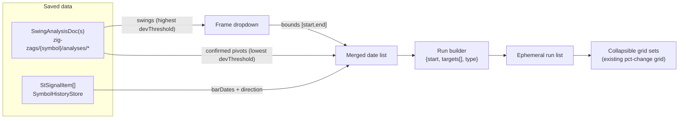

**Topic:** Option chain percent change grid  
**Topic Slug:** `option-chain-pct-change-grid`  
**Thread:** Pivot-signal selector  
**Thread Slug:** `pivot-signal-selector`  
**Issue:** #360  
**Thread Parent:** #359  
**Topic Parent:** #326  
**Domain:** OPTIONS  
**Type:** PRD  
**Status:** Approved  
**Created:** 2026-09-18  
**Last Updated:** 2026-09-18  

---

# PRD — Pivot-signal selector for pct-change analysis

## Problem / Goal

Today the pct-change page requires manually typed start and target dates.
The user's analysis goal is to compare option strategies over historical
swings: does holding one far-OTM (~0.1 delta) contract across a large
swing outperform chaining short swing trades on the small swings inside
it? Answering that requires anchoring analyses to *real* swing/signal
dates — which already exist as saved swing analyses and signal history —
instead of typing dates by hand.

This Thread adds a picker that turns saved swing-analysis pivots and
signal-review signals into grid runs, plus an ephemeral run list so
multiple start→target ranges can be compared side by side.

## Data sources

- **Saved swing analyses** — `SwingAnalysisDoc`s at
  `zig-zags/{symbol}/analyses/{paramsId}`: `config`, `pivots[]`
  (`time`, `price`, `isHigh`, `confirmed`), `swings[]` (start/end,
  direction, magnitudePercent, duration), `stats`. Loaded per symbol via
  the swing-analysis service (`loadSavedAnalyses`).
- **Signals** — `StSignalItem`s via `SymbolHistoryStore.loadSignalHistory(symbol)`
  (existing cached fetch): `barDate`, `direction` (LONG/SHORT),
  `timeframe`, `signalType`, `closePrice`.

The pct-change page does not compute ZigZag itself. If no saved analyses
exist for the symbol, the selector shows an empty state directing the
user to the swing-analysis page (save an analysis, return, refresh).

## User stories

### US-1 — Frame selection (large swing bounds the analysis)

As a user, when I enter a symbol that has saved swing analyses, I see a
dropdown listing the swings from the analysis with the highest
`devThreshold` (the "large" config). Each entry shows start date → end
date, direction (up/down), magnitude %, and duration. Selecting one sets
the analysis frame `[frameStart, frameEnd]`.

*Verify:* dropdown lists only large-config swings (small-config swings
never appear); selection bounds the date list; with a single saved
analysis, that analysis supplies both frame and extremes.

### US-2 — Merged date list

As a user, after picking a frame I see a sorted list of every date
inside `[frameStart, frameEnd]` from:

- **Confirmed pivots** of the lowest-`devThreshold` saved analysis —
  labeled swing high / swing low (projected/unconfirmed pivots excluded).
- **Signals** — labeled LONG / SHORT with `signalType`.

*Verify:* list contains only dates within the frame; unconfirmed pivots
never appear; each entry is labeled by kind.

### US-3 — Run builder (start + targets per grid set)

As a user, from the date list I pick a start date and one or more target
dates, then add the run to a list. Each run carries
`{startDate, targetDates[], type}` where `type` defaults from the
start's direction — swing low or LONG signal → calls; swing high or
SHORT signal → puts — and is overridable per run.

*Verify:* start must precede all its targets; runs with mixed call/put
types can coexist in the list.

### US-4 — Run list + side-by-side grid sets

As a user, each run in the list renders one collapsible section
containing the pct-change grid(s) for its target date(s) — one grid per
target, reusing the existing grid, mini-chart, and filters. Sections are
collapsed by default and render lazily on expand so large multi-run
views don't overwhelm the DOM (learned from the #412 crash).

*Verify:* adding two runs produces two independent collapsible grid
sets; opening a section renders its grids; deleting a run removes its
section; the list is session-only (ephemeral — not persisted).

### US-5 — Empty states

As a user with no saved analyses for the symbol, the selector shows an
empty state pointing to the swing-analysis page to run and save an
analysis first. If no signals exist, the list simply shows pivots only.

*Verify:* no crash on missing data; message is actionable.

## Out of scope (this Thread)

- Persisting the run list to Firestore (saved configs already persist
  param tuples; the compare list is exploratory/ephemeral).
- Auto-computed chain-vs-hold return comparison (needs a contract-roll
  rule — a separate design).
- Unconfirmed/projected pivots in the list.
- In-page ZigZag computation or param forms (params live in
  swing-analysis).

## Technical context

- **Hindsight caveat:** pivots and signals are retrospective. The grids
  show what the market did after each anchor — not what was knowable
  when a signal fired. This is a research tool, not a signal validator.
- **Snapshot reuse:** option-chain snapshots are cached per date; runs
  sharing dates reuse cached snapshots automatically.
- **Supersedes:** the disabled `swing-extremes` stub in the target-type
  selector (its inputs + "coming soon" placeholder) — this feature
  replaces that concept with the frame + run-list model.

## System context

