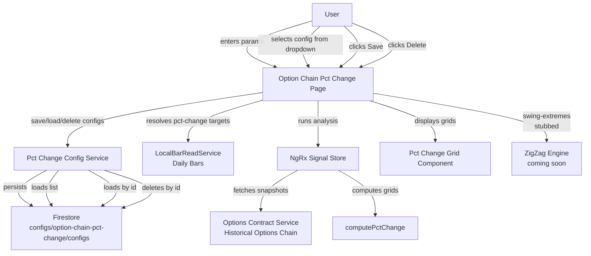

**Topic:** Option chain percent change grid  
**Topic Slug:** option-chain-pct-change-grid  
**Thread:** Save param configuration  
**Thread Slug:** save-param-config  
**Issue:** #362  
**Thread Parent:** #361  
**Topic Parent:** #326  
**Domain:** OPTIONS  
**Type:** PRD  
**Status:** Approved  
**Created:** 2026-09-17  
**Last Updated:** 2026-09-17  

---

# PRD — Save param configuration

## Problem

The option chain percent change grid requires the user to manually enter
symbol, start date, target dates, type, and filters every time they want
to run an analysis. There is no way to persist a parameter set for reuse.
Users who repeatedly run the same or similar analyses must re-enter all
inputs each session.

## Audience

The single analyst user of Savant Trader who runs option chain percent
change analyses and wants to recall, modify, and re-run saved parameter
configurations without manual re-entry.

## Intended outcome

Users can save named parameter configurations to Firestore, select from
a list of saved configurations to populate the analysis inputs, modify
the inputs before running, and delete configurations they no longer need.

## User stories

### US1 — Save a configuration

**As a user, I want to save the current analysis parameters as a named
configuration so I can recall them later.**

Acceptance criteria:
- A "Save" button is present on the option chain pct change page.
- Clicking "Save" persists the current symbol, start date, target type,
  target-type-specific parameters, resolved target dates, option type,
  and filter to Firestore at
  `configs/option-chain-pct-change/configs/{configId}`.
- The config doc ID is
  `{symbol}-{startDate}-{numberOfTargets}-{targetType}-{uid}` where
  `uid` is a short unique string appended to guarantee no collisions.
- After saving, the new config appears in the config dropdown.
- How to verify: save a config, reload the page, confirm the config
  appears in the dropdown and loads the same inputs.

### US2 — Load a configuration

**As a user, I want to select a saved configuration from a dropdown so
its parameters populate the analysis inputs.**

Acceptance criteria:
- A dropdown lists all saved configurations by their generated ID.
- Selecting a config populates: symbol, start date, target type,
  target-type-specific parameters, target dates, option type, and filter.
- Loading a config does NOT auto-run the analysis — the user clicks
  "Run" manually.
- The user can modify any populated input before clicking "Run".
- How to verify: save a config, change some inputs, load the saved
  config, confirm inputs match the saved values, confirm "Run" has not
  executed.

### US3 — Delete a configuration

**As a user, I want to delete a saved configuration I no longer need.**

Acceptance criteria:
- A "Delete" button is present alongside the config dropdown.
- Clicking "Delete" removes the currently selected config from
  Firestore and from the dropdown.
- Deleting requires the user to confirm (to prevent accidental loss).
- How to verify: save a config, delete it, reload the page, confirm it
  no longer appears in the dropdown.

### US4 — Select target type

**As a user, I want to choose how target dates are determined so I can
use automated resolution or manual entry.**

Acceptance criteria:
- A segmented button group with three options is displayed:
  "Pct Change", "Swing Extremes", "User Dates".
- Selecting an option swaps the input UI below the button group to show
  the relevant inputs for that target type.
- The currently selected option is visually distinct.
- How to verify: click each button, confirm the input UI below changes
  to match the selected target type.

### US5 — Pct Change target resolution (list mode)

**As a user, I want to specify a list of percentage changes from the
starting underlying price and have the system resolve them to target
dates.**

Acceptance criteria:
- In "Pct Change" mode, a toggle between "List" and "Gradation" is shown.
- In "List" mode, the user enters a comma-separated list of percentages
  (e.g., `-3, 5, 10`).
- The system scans daily closing prices forward from the start date
  (using `LocalBarReadService` data) and finds the first date where the
  close reaches or exceeds each percentage from the start close.
- Resolved target dates are displayed in the target dates input and are
  editable by the user.
- If a percentage is never reached in the available data, that target
  is skipped.
- How to verify: enter a known symbol and start date, enter percentages
  that correspond to known historical price moves, confirm the resolved
  dates match the expected dates.

### US6 — Pct Change target resolution (gradation mode)

**As a user, I want to specify a step size, count, and direction to
generate a series of percentage targets.**

Acceptance criteria:
- In "Gradation" mode, the user enters: step (e.g., 5), count (e.g., 4),
  and direction ("up" or "down").
- The system generates percentages: for up, `[5, 10, 15, 20]`; for down,
  `[-5, -10, -15, -20]`.
- The generated percentages are resolved to target dates the same way
  as list mode.
- Resolved target dates are displayed and editable.
- How to verify: enter step=5, count=3, direction=up, confirm three
  target dates are resolved at +5%, +10%, +15%.

### US7 — Swing Extremes target resolution (stubbed)

**As a user, I want to specify a count and ZigZag parameters to resolve
target dates at swing extremes.**

Acceptance criteria:
- In "Swing Extremes" mode, inputs are shown for: count, deviation,
  depth, backstep.
- For calls, targets resolve to swing highs; for puts, swing lows.
- Until the ZigZag integration is complete, a "Coming soon" message is
  displayed and targets are not resolved.
- How to verify: select "Swing Extremes", confirm inputs are visible,
  confirm "Coming soon" message is displayed.

### US8 — User Dates target entry (manual)

**As a user, I want to manually enter specific target dates.**

Acceptance criteria:
- In "User Dates" mode, a sub-toggle between "Manual" and "Interval" is
  shown.
- In "Manual" mode, the user adds and removes specific dates (current
  behavior).
- How to verify: select "User Dates" → "Manual", add dates, confirm they
  appear in the target dates list.

### US9 — User Dates target entry (interval)

**As a user, I want to generate N target dates at a fixed interval from
the start date, then adjust them if needed.**

Acceptance criteria:
- In "Interval" mode, the user enters: count (e.g., 5) and interval in
  days (e.g., 5).
- The system generates `count` dates starting from the start date,
  spaced `interval` days apart.
- Generated dates are displayed in the target dates input and are
  editable by the user.
- How to verify: start date 2025-04-07, count=3, interval=5, confirm
  dates 2025-04-07, 2025-04-12, 2025-04-17 are generated.

## Technical context

- **Storage:** Firestore, no user scoping (single user). Path:
  `configs/option-chain-pct-change/configs/{configId}`.
- **Doc ID format:** `{symbol}-{startDate}-{numberOfTargets}-{targetType}-{uid}`
  where `uid` is a short unique string (e.g., 6-char nanoid).
- **Data source for pct-change resolution:** `LocalBarReadService`
  daily bars (same data already fetched by the page). Scan closes
  forward from start date.
- **Swing-extremes integration:** Stubbed until Topic #261 ZigZag work
  is complete. UI shows inputs + "Coming soon" message.
- **Config doc shape:**
  ```typescript
  interface PctChangeConfigDoc {
    symbol: string;
    startDate: string;          // YYYY-MM-DD
    type: OptionType;          // CALL or PUT
    targetType: 'pct-change' | 'swing-extremes' | 'user-dates';
    targetDates: string[];     // resolved dates (YYYY-MM-DD)

    // pct-change mode
    pctMode?: 'list' | 'gradation';
    pctValues?: number[];      // list mode
    pctStep?: number;          // gradation mode
    pctCount?: number;         // gradation mode
    pctDirection?: 'up' | 'down';

    // swing-extremes mode
    zigzagDeviation?: number;
    zigzagDepth?: number;
    zigzagBackstep?: number;
    swingCount?: number;

    // user-dates mode
    userDatesMode?: 'manual' | 'interval';
    intervalCount?: number;
    intervalDays?: number;

    // filters
    filter: PctChangeFilter;
  }
  ```

## System context



## Out of scope

- User authentication / multi-user scoping (single user assumed).
- Caching of resolved target dates (re-resolved on each load).
- Sharing configurations between users.
- ZigZag integration for swing-extremes mode (stubbed).
