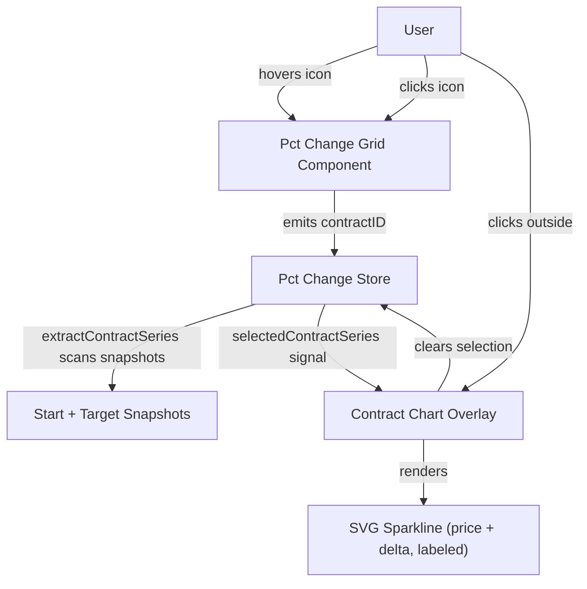

**Topic:** Option chain percent change grid  
**Topic Slug:** option-chain-pct-change-grid  
**Thread:** Contract chart popup  
**Thread Slug:** contract-chart-popup  
**Issue:** #401  
**Thread Parent:** #400  
**Topic Parent:** #326  
**Domain:** OPTIONS  
**Type:** PRD  
**Status:** Approved  
**Created:** 2026-09-18  
**Last Updated:** 2026-09-18  

---

# PRD — Contract chart popup

## Problem

When scanning the percent change grids, the user sees the same contract
repeated across multiple grids with its price and delta changing with the
trend. Understanding a single contract's trajectory requires mentally
diffing cells across grids. There is no way to see a contract's price and
delta over the analysis window without leaving the page.

## Audience

The single analyst user of Savant Trader who scans option chain percent
change grids to identify strike/expiration sweet spots and wants to
quickly inspect how an individual contract behaved across the analysis
window.

## Intended outcome

Hovering a small chart icon on any populated grid cell shows a compact
overlay with a sparkline of that contract's price and delta across the
start date and all loaded target dates — with real numeric values, not
an unlabeled line. Clicking the icon pins the overlay open until the
user clicks outside it.

## User stories

### US1 — Hover sparkline overlay

**As a user, I want to hover a small icon on a grid cell and immediately
see that contract's price and delta charted across the analysis window
so I can understand its trajectory without any clicks.**

Acceptance criteria:
- Every populated data cell (a cell with a matched contract) displays a
  small chart icon in a corner of the cell. Empty cells (no contract)
  show no icon.
- The icon is visually subtle at rest (low opacity) and becomes
  prominent on cell hover.
- Hovering the icon opens an overlay positioned near the cell showing a
  sparkline of the contract's price across the start date plus every
  target date for which that contract has data.
- The sparkline also shows the contract's delta across those same dates
  as a second series.
- The chart displays actual numeric values — not an unlabeled line:
  - The overlay header shows the contract ID, strike, expiration, and
    option type.
  - Price values are labeled (e.g., start and end values, or y-axis
    ticks for the price series).
  - Delta values are labeled (e.g., start and end values, or y-axis
    ticks for the delta series on its own scale).
- The overlay closes when the pointer leaves the icon and overlay area
  (small grace delay so the pointer can move into the overlay without
  it snapping shut).
- How to verify: run an analysis with 2+ target dates, hover an icon on
  a populated cell, confirm an overlay appears near the cell showing the
  contract's price and delta with real values labeled, move the pointer
  away, confirm the overlay closes.

### US2 — Click to pin

**As a user, I want to click the chart icon to pin the overlay open so I
can study it without keeping the pointer still.**

Acceptance criteria:
- Clicking the icon pins the overlay open; it stays visible when the
  pointer moves away.
- Clicking anywhere outside the pinned overlay closes it and clears the
  selection state.
- While a pinned overlay is open, hovering other cells' icons does
  nothing — no second overlay, no content swap.
- After the pinned overlay is closed, hover and click-to-pin work
  normally again on any icon.
- Only one overlay can exist at a time (transient or pinned).
- How to verify: pin an overlay, move the pointer to another cell's
  icon, confirm nothing happens; click outside, confirm the overlay
  closes; hover another icon, confirm a new overlay appears.

### US3 — Series from loaded data only

**As a user, I want the overlay to show whatever data exists for the
contract — even if the contract expires before the last target date or
only has a few points.**

Acceptance criteria:
- The chart includes a point for the start date and one point per
  target date where the contract appears in that date's snapshot.
- A contract that expires before the last target date shows a line that
  simply stops at its last available point — no extrapolation, no gap
  markers, no error state.
- A contract present in only one target date still gets an icon and a
  2-point chart (start + that target).
- Contracts with very low prices (e.g., $0.01) are charted the same as
  any other — no suppression by price or data sparsity.
- The overlay shows for every populated cell regardless of how few
  points the contract has.
- How to verify: run an analysis where a contract is absent from the
  last target date's snapshot; confirm its overlay shows the line
  ending at its last available point.

### US4 — Extraction owned by the store

**As a user, I want the interaction to feel instant because the data is
already loaded — no fetching happens on hover.**

Acceptance criteria:
- The chart data comes entirely from snapshots already loaded by the
  page (start snapshot + target snapshots). No network requests are
  made on hover or click.
- A lightweight pure function extracts the contract's `{date, price,
  delta}` series by scanning each loaded snapshot for the contract —
  it does not rebuild grid cells or run full cross-snapshot matching.
- The store owns the selection state (`selectedContractID`, pinned
  flag, and the extracted series signal). Components emit the contract
  ID; the store extracts; the overlay renders the store signal.
- How to verify: with DevTools open on the network tab, hover several
  icons, confirm zero new requests are issued.

## Technical context

- **Data already loaded:** the page's store holds the start snapshot
  and target snapshots (`HistoricalOptionContract[]` per date). Each
  contract carries `contractID`, `last`/`mark`/`bid`/`ask`, `delta`,
  `theta`, `gamma`, `vega`, `rho`.
- **Price resolution:** reuse the existing mark → bid/ask midpoint →
  last fallback logic used by the grid.
- **Delta scale:** delta ranges roughly [-1, 1] while price can be
  $0.01–$100+. The chart needs two scales — price on one axis, delta
  on a secondary axis or normalized overlay.
- **Overlay mechanism:** Angular CDK `ConnectedOverlay` anchored to the
  icon element (Material is already a dependency). One overlay at a
  time.
- **Chart rendering:** pure inline SVG sparkline — two polylines
  (price, delta), axis value labels, contract header, legend. No
  Syncfusion for this mini-chart; it should still look polished.
- **Selection state:** `selectedContractID` + `isPinned` in the page
  store; `selectedContractSeries()` computed signal.

## System context

## Out of scope

- **Theta series** — fast-follow: plumb `theta`/`targetTheta` through
  `PctChangeCell` and add a third series to the overlay.
- **QQQ/TQQQ full daily time-series** — separate follow-up Thread (soon).
  Would fetch the contract's complete daily history via the existing
  `OptionsContractViewerStore` / option-chart pipeline for symbols with
  persisted GCS data (QQQ, TQQQ only).
- Multiple simultaneous overlays / side-by-side contract comparison.
- Right-click interactions or a context menu.
- Intraday data — all points are EOD snapshot marks.
- Editing or annotating charts.
