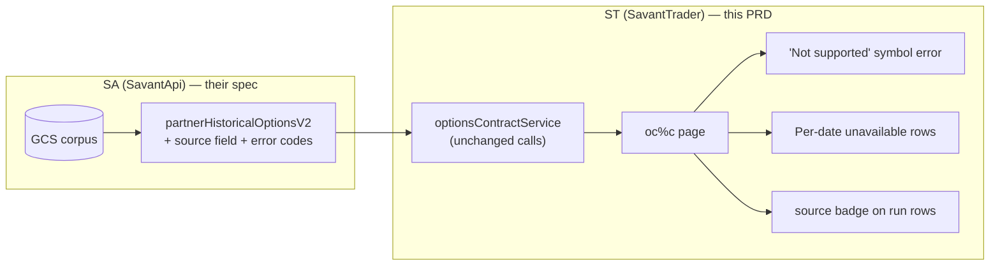

**Topic:** Option chain percent change grid  
**Topic Slug:** option-chain-pct-change-grid 
**Thread:** Corpus-backed chain data
**Thread Slug:** corpus-chain-data 
**Issue:** #505  
**Thread Parent:** #504
**Topic Parent:** #326  
**Domain:** OPTIONS  
**Type:** PRD  
**Status:** Approved  
**Created:** 2026-09-22  
**Last Updated:** 2026-09-22  

---

# PRD: Corpus-backed chain data for the pct-change grid

## Problem

Every oc%c run fetches each snapshot date through `partnerHistoricalOptionsV2`,
a live Alpha Vantage proxy — ~1s per date on success, burst-502 rejections
under concurrency (mitigated by a concurrency-3 cap), and the same immutable
historical data re-fetched on every repeat run and param variation.

SA is building a GCS corpus of chain snapshots behind the same endpoint
(scope and build mechanics are SA's to spec — see the SA handoff doc).
This PRD covers only what changes on the ST surface.

## Concept

ST keeps calling `partnerHistoricalOptionsV2` unchanged — same request shape,
same response shape. What changes for the user: corpus-covered dates return
fast; dates outside the corpus return a clear per-date error; symbols outside
SA's enabled options universe return a clear "not supported" error instead of
a generic failure.

## User stories

### US-1: Faster runs on corpus-covered dates

As an analyst, I want repeat and pivot-date analyses to return quickly,
so iterating on filters and run comparisons doesn't stall on partner fetches.

**Acceptance criteria:**

- No ST request-path changes are required — `getHistoricalOptionsChain$`
  continues calling `partnerHistoricalOptionsV2` per date.
- When SA serves from the corpus, runs complete noticeably faster with no
  burst-502 failures on covered dates.
- `SNAPSHOT_FETCH_CONCURRENCY` stays at 3 — harmless for cache hits, still
  protects any live upstream path.

### US-2: Clear errors for unsupported symbols

As an analyst, when I run oc%c on a symbol SA hasn't enabled for options, I
want a clear "this symbol is not supported for options analysis" message —
not a generic fetch failure.

**Acceptance criteria:**

- A non-enabled symbol produces a distinct, human-readable error on the page
  (not "Failed to fetch chain snapshots: UPSTREAM_ERROR").
- Depends on SA returning a distinguishable error code for
  non-enabled symbols (contract item below).

### US-3: Per-date missing data is handled cleanly

As an analyst, when a requested target date has no corpus doc and no upstream
data, I want that date's row to show an unavailable state while the rest of
the run succeeds — the existing per-date error rows already do this; verify
they work against whatever error SA returns for a corpus miss.

**Acceptance criteria:**

- A missing date does not fail the whole run — other dates' grids render.
- The per-date error row shows a meaningful message for "no snapshot for this
  date" vs a transient failure (retry affordance stays).

### US-4: `source` field surfaced (post-hoc)

As an analyst, I want completed runs to show which dates were served from the
corpus vs fetched live, so I can tell a cold fetch from a cache hit.

**Acceptance criteria:**

- When SA populates `source` (`"gcs" | "live"` — field already declared
  optional on `GetHistoricalOptionsChainResponse`), ST displays it on the
  run's per-date rows (e.g., a small badge on live-fetched dates).
- **Honest limitation:** `source` arrives *with* the response — it cannot
  drive a loading indicator during the fetch. A pre-run "these dates are
  cold" warning would need an SA availability endpoint (open question).

## SA contract (what ST depends on — not SA's internal spec)

- `partnerHistoricalOptionsV2` request/response shape unchanged.
- `source` field populated on responses: `"gcs"` (corpus hit) / `"live"`
  (upstream fetch). Optional for ST correctness; required for US-4's badge.
- A distinguishable error for **non-enabled symbol** (e.g., a specific code
  or 404-with-reason) so ST can render US-2's message.
- A distinguishable "no data for this date" vs transient-failure signal so
  ST's per-date rows can render US-3 correctly.

## Technical context

- SA handoff doc (their spec: swing-set platform, `optionable`/`optionsEnabled`
  flags, corpus seeding on confirmed pivots, backfill script) is produced
  under this thread as a separate doc — SA owns their own topic/tasks.
- Swing-analysis page cutover to SA swing files is out of scope — future
  #261 work.
- Param-hash grid cache deferred — measure corpus read latency first.
- "Current-day snapshot appearing as a pivot" — deferred can of worms; ST
  renders only what SA delivers.

## System context

## Open questions

- Does SA expose an availability/coverage endpoint (`symbol → dates[]` or
  `optionsEnabled` list) that ST could use for a pre-run "cold dates" warning
  or to disable the symbol picker for non-enabled symbols? Nice-to-have, not
  blocking.
- What error code/shape will SA return for a non-enabled symbol and for a
  corpus-miss date? Needed to wire US-2/US-3 detection.

## Out of scope

- All SA internals: corpus build, flag management, swing-set generation,
  backfill scripts, per-contract docs, contract viewer.
- Swing-analysis page swing-set migration (#261).
- Batch read endpoint — revisit only if measured latency justifies it.
