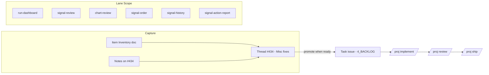

**Topic:** Signal Pipeline Maintenance  
**Topic Slug:** signal-pipeline-maint  
**Thread:** Misc fixes  
**Thread Slug:** misc-fixes  
**Issue:** #435  
**Thread Parent:** #434  
**Topic Parent:** #433  
**Domain:** SIGNAL-REVIEW  
**Type:** PRD  
**Status:** Complete  
**Created:** 2026-09-19  
**Last Updated:** 2026-09-20  

# PRD: Misc fixes — signal pipeline maintenance lane

## Problem Statement

The signal pipeline surfaces — run-dashboard, signal-review, chart-review, signal-order, signal-history, and signal-action-report, plus the FE/BE code that supports them — accumulate small bugs, tweaks, and enhancements that don't warrant a full Topic each. Today there is no organized home for this work: fixes get lost, fixed ad hoc without review, or deferred indefinitely because spinning up a Topic per tweak is too heavy.

## Solution

An open-ended maintenance lane — the **Misc fixes** Thread under the Signal Pipeline Maintenance Topic — that owns the signal lifecycle end to end. Candidate work is captured at near-zero friction in a living **Item Inventory** doc; when an item is ready to be worked it is promoted to a task issue under the Thread and flows through the normal `implement → review → ship` lifecycle. The lane never "ships" as a whole — items ship individually.

## Operating Rules (lane charter)

- **Scope** — the signal lifecycle: generation, storage, retrieval, display, and review of signals across the six in-scope pages and their supporting code (components, stores, services, Firestore docs, callable functions).
- **Intake** — append a one-liner to the Item Inventory doc (`433-434-435-INVENTORY-SIGNAL-REVIEW-signal-pipeline-maint-misc-fixes.md`) or drop a note on Thread issue #434. No issue required at capture time.
- **Promotion** — when an item is ready to work, it becomes a task issue under the Thread's Blueprint for its area, labeled `4_BACKLOG`, then worked via `/proj implement` → `/proj review` → `/proj ship`.
- **Sizing rule** — if an item turns out to need design decisions, touch multiple areas, or is really a feature, it is pulled out into its own Thread (or Topic) rather than bloating this lane.
- **Review gate** — every promoted item passes the standard review before shipping. There is no trivial bypass; the lane trades friction at capture time for quality at ship time.
- **Blueprint** — a one-time skeleton blueprint establishes the area Blueprint issues (FE/BE as needed) and the task template. Tasks are appended ad hoc thereafter; blueprint is not re-run per item.

## User Stories (lane charter)

1. As a maintainer, I want a single lane that owns signal-pipeline fixes so that small work has one durable home instead of being scattered or lost.
2. As a maintainer, I want a low-friction inventory doc so that I can capture a todo in seconds without creating a GitHub issue or breaking flow.
3. As a maintainer, I want captured items promoted to real task issues only when ready to work so that the backlog label means "ready," not "someday."
4. As a maintainer, I want every promoted item to pass the normal implement/review/ship gate so that lane work meets the same quality bar as feature work.
5. As a maintainer, I want oversized items escalated out of the lane so that the lane stays a fast path for small fixes.

## Seed Items

### Item 1 — ACR actions on prior runs

**Problem:** On the signal-review page, viewing any run other than the latest completed run disables all ACR action buttons (Review / Accept / Consider / Reject / Reset). The gate is `isActionableRun` (viewed run === latest completed run) applied in `symbol-row.component.html` and enforced for every mutation via `runIfActionable` in `signal-review.facade.ts`. Signals from prior runs are still valid and actionable — the user reviews runs retroactively and currently cannot act on them, including staging an order ticket via Accept.

**User stories:**

1. As a signal reviewer viewing a prior run, I want to Accept a symbol's signals so that an order ticket is staged for it — prior-day signals remain tradeable.
2. As a signal reviewer viewing a prior run, I want to use Review / Consider / Reject / Reset so that triage state is recorded against the run I am actually viewing.
3. As a signal reviewer, I want decisions made on a prior run recorded against that run's context (runId / marketDate) so that decision history stays truthful.

**Acceptance criteria:**

- When viewing a non-latest completed run, all five ACR buttons are enabled and functional.
- Accept on a prior run stages an order ticket whose `signalContext` references the viewed run (runId, barDate) — not the latest run's.
- De-accept on a prior run removes the staged ticket for that symbol.
- Reject/Reset on a prior run writes/removes `occurrence_decision` records against the viewed run.
- Latest-run behavior is unchanged.
- The existing stale-decision indicator still displays when a decision came from a different run.

### Item 2 — Order queue header aggregates and row data

**Problem:** On the signal-order page, the order-queue header bar shows only a total count. The user wants aggregate totals for all groups visible in the header bar. Additionally, the trailing info on each queue row appears to be placeholder values rather than real ticket data.

**User stories:**

1. As a trader on the signal-order page, I want aggregate totals for every group in the header bar so that I can see queue state at a glance without expanding groups.
2. As a trader, I want every field on a queue row to display real ticket data so that I can trust what I am looking at.

**Acceptance criteria:**

- The header bar displays per-group aggregates (at minimum per-group counts; whether dollar/quantity totals are also wanted is decided at task time).
- Every field on each queue row renders real data from the ticket; no placeholder-looking fallbacks remain.
- Empty groups are handled sensibly (hidden or zero-count — decided at task time).
- Candidates for the placeholder-looking trailing fields, to be confirmed at task time: the `???` source-badge fallback, the `—` date fallback, and the `$100` default-dollar fallback in `order-queue.component.ts`.

## Implementation Decisions

- **Lane mechanics:** one-time skeleton blueprint creates the area Blueprint issues and a task template; tasks append ad hoc under the matching area Blueprint with `4_BACKLOG`.
- **Item Inventory:** a living doc at `docs/topics/433-signal-review/` linked from the Thread and Topic issue bodies; PRD references it as the canonical capture point.
- **Item 1 decision:** ALL ACR actions unlock on prior runs, not just Accept — decided during grilling. Prior-run signals are still actionable; the user does not use Reject, so accidental-reject risk is accepted.
- **Item 1 mechanism (task-time):** relax `isActionableRun` gating — currently `symbol-row.component.html` binds `[disabled]="!isActionableRun()"` and `signal-review.facade.ts` wraps every mutation in `runIfActionable`. Accept/reset paths must use the viewed run's id and marketDate rather than assuming latest.
- **Item 2 mechanism (task-time):** aggregates computed in `order-queue.component.ts` from `groups()`; row field audit to identify placeholder sources.

## Testing Decisions

- Per-item tests at the highest existing seam: Jest + TestBed specs. Prior art: `order-queue.component.spec.ts`, `signal-review.facade.spec.ts`, `group.store` specs, and the swing/pct-change store specs added in adjacent work.
- Item 1: facade/store spec covering prior-run Accept → `stageTicket` with viewed-run context; spec for each unlocked mutation path writing against the viewed run.
- Item 2: `order-queue.component.spec.ts` additions for header aggregate rendering and row-field values.
- Only external behavior is tested, not implementation details.

## Technical Context

- Review decisions are durable per run — `occurrence_decision` records are keyed by runId, so prior-run triage writes against the viewed run, not today's.
- Staged order tickets carry `signalContext` (`runId`, `barDate`, `timeframe`, `direction`, `decisionId`), so prior-run tickets retain correct provenance once actions are unlocked.
- `isActionableRun` is a pure computed (`viewed run === latestCompletedRun`); no data migration is implied by unlocking actions, but the semantics of "decision currency" for prior-run decisions should be verified at task time.

## System Context

## Out of Scope

- Swing-analysis subsystem (swing-sets, zigzag engine, batch sweep) — adjacent but separate.
- Options surfaces (option-chain-pct-change, option-chart, spread-chart) and strategy-builder.
- Generic order plumbing not tied to signals.
- Bar-data ingestion — DATA-PIPELINE territory.
- Redesigns or features beyond small fixes/enhancements — those escalate into their own Thread or Topic.

## Further Notes

- signal-history and signal-action-report are legacy pages; they are in scope for fixes, but substantial rework on them probably warrants a separate Topic.
- Re-entry point for the lane: capture in the Inventory doc or on #434, then `/proj implement 433 {task-#}` once blueprint has promoted items.
