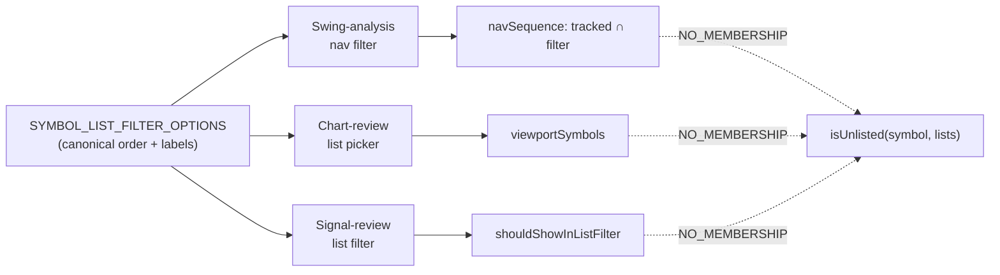

**Topic:** Watchlist management  
**Topic Slug:** watchlist-mgmt  
**Thread:** Misc issues  
**Thread Slug:** misc-issues  
**Issue:** #467  
**Thread Parent:** #466  
**Topic Parent:** #465  
**Domain:** WATCHLIST  
**Type:** PRD  
**Status:** Approved  
**Created:** 2026-09-21  
**Last Updated:** 2026-09-21  

# PRD: Symbol List filters — fixed option order and "No memberships"

## Problem

Every list-filter dropdown in the app drew its options differently: the
swing-analysis nav filter sorted whatever list docs happened to exist in
Firestore alphabetically, the chart-review list picker was missing HIDE
entirely, and no surface offered a way to see symbols that belong to no
list. An analyst triaging a symbol universe cannot answer "which symbols
haven't I filed yet?" — the unlisted remainder is invisible.

## Concept

One shared, ordered definition of list-filter options —
`SYMBOL_LIST_FILTER_OPTIONS` in `savant-trader/common/constants.ts` —
consumed by every list-filter dropdown. Each surface keeps its own
"show everything" entry (All / All symbols / None) ahead of the shared
options.

Canonical order: **Primary, Secondary, Neutral, Avoid, Hidden,
No memberships, Monitor.**

"No memberships" is a new pseudo-filter value (`NO_MEMBERSHIP`) that
selects symbols belonging to zero Symbol Lists. It is deliberately not
`SymbolListName.NONE` — chart-review already uses `NONE` to mean "no
list filter applied" (show everything), which is the opposite semantic.

## User stories

### US-1: Fixed canonical option order on every list-filter dropdown

As an analyst, I want every list-filter dropdown to show the same options
in the same order so the UI is predictable no matter which page I'm on.

**Acceptance criteria:**

- The swing-analysis nav filter, the chart-review list picker, and the
  signal-review list filter all render: `All/None`, Primary, Secondary,
  Neutral, Avoid, Hidden, No memberships, Monitor — in that order.
- The option set is fixed and does not depend on which list documents
  exist in Firestore (previously the nav filter only listed existing docs,
  alphabetized).
- All three surfaces build their options from the shared
  `SYMBOL_LIST_FILTER_OPTIONS` constant, so adding a list later propagates
  to every dropdown from one edit.
- The chart-review picker gains the previously missing "Hidden" option.
- The membership chip row order is unchanged (it already matches the
  canonical order).

### US-2: "No memberships" filter shows unlisted symbols

As an analyst, I want to select "No memberships" so I can see the symbols
I haven't filed into any list yet.

**Acceptance criteria:**

- Swing-analysis nav: selecting "No memberships" makes prev/next step
  through the tracked-symbols universe filtered to symbols in zero lists.
- Signal review: selecting "No memberships" filters the grouped view to
  profiles whose symbol is in zero lists (`shouldShowInListFilter`).
- Chart review: selecting "No memberships" filters the viewport to
  review symbols in zero lists, in both signals and browse modes.
- Export (TradingView TXT) with "No memberships" active exports the
  unlisted subset of the symbol universe instead of failing or exporting
  an empty file.
- Symbols in the Monitor list count as "in a list" — a monitored symbol
  is not unlisted.
- The Monitor list's Firestore doc is renamed `PAST_SIGNALS` → `MONITOR`;
  `SymbolListService.loadAllLists` lazily migrates the legacy doc (merge
  into MONITOR, delete PAST_SIGNALS) so no manual data step is needed.

## Technical context

- `NO_MEMBERSHIP` is a client-side filter value only — no Firestore
  schema changes, no migration. Membership semantics are unchanged:
  triage lists are exclusive (atomic `moveToList`); MONITOR is
  non-exclusive via the Monitor action, so a monitored symbol may also
  be filed in a triage list — and either way counts as "in a list" for
  No-membership purposes.
- The nav filter previously offered only lists present in Firestore; it
  now always offers the full canonical set, so an empty list yields an
  empty nav sequence rather than a missing option.
- `SymbolListFilter` (`SymbolListName | 'ALL' | 'NO_MEMBERSHIP'`) is the
  shared type for filter state across surfaces.
- Changing the nav filter jumps to the sequence's first symbol ("1 of N");
  the saved-sets panel follows the page symbol (resyncs picker, drops
  stale checks, refetches that symbol's sets while open, and refetches
  on reopen when its loaded docs are stale).

## System context

