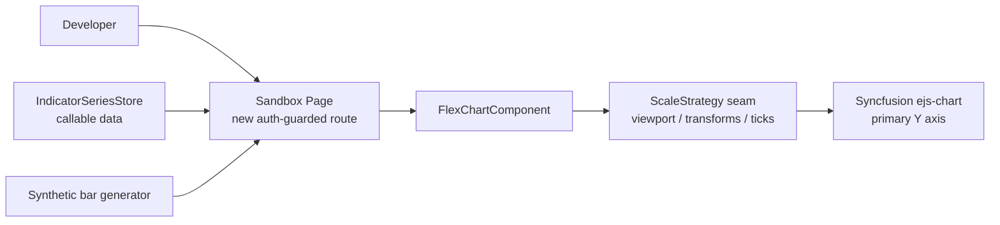

**Topic:** Flex Chart Maintenance  
**Topic Slug:** flex-chart-maint  
**Thread:** Fix Log Scale Y-Axis  
**Thread Slug:** fix-log-y-axis  
**Issue:** #470  
**Thread Parent:** #469  
**Topic Parent:** #468  
**Domain:** FLEX-CHART  
**Type:** PRD  
**Status:** Approved  
**Created:** 2026-09-21  
**Last Updated:** 2026-09-22  

# PRD: Fix Log Scale Y-Axis

## Problem

`flex-chart` exposes a `logScale` config flag and a `LogarithmicScaleStrategy`, but the logarithmic Y-axis has never worked: the axis extents cannot be driven by the visible data's high/low, so enabling log scale renders charts that are useless for analysis. The current implementation leans on Syncfusion's built-in `Logarithmic` axis, which snaps labels to powers of 10 and does not honor arbitrary min/max ranges; a `zoomFactor`/`zoomPosition` workaround was attempted and failed.

Traders need a true log scale so that equal *percentage* moves occupy equal vertical space — essential when comparing a $10→$20 move against a $100→$200 move, or viewing long histories where early price action is compressed into the bottom of a linear axis.

## Goal

Prove — inside a dedicated sandbox page — that flex-chart can render a correct, dynamically-ranging logarithmic price axis, where the axis extents always auto-fit the visible bars' high/low and every consumer-facing surface (labels, tooltips, crosshair, indicator overlays) reads real prices.

## Non-Goals

- **No rollout.** This Thread ends when log scale works in the sandbox. Rolling the fix into `quick-charts`, `signal-detail`, `swing-analysis-page`, or any option-chart surface is explicitly deferred — each consumer's implications get assessed in a later Thread/phase after the sandbox proves the approach.
- **`rs-chart` is permanently out of scope.** It is a separate `ejs-chart` implementation plotting RS ratios near 1, where log scale is not useful.
- No persistence of the user's scale preference; the toggle is session/config state only.
- Pane'd indicators on their own axes (RSI, MACD) are unaffected — log applies to the primary price axis only.

## System Context

## User Stories

### Sandbox

1. As a developer, I want a new auth-guarded route hosting a minimal `flex-chart` instance, so I can iterate on the log axis without interfering with any production chart surface.
   - **Verify:** navigating to the route renders a working chart; no existing pages are modified to host it.
2. As a developer, I want a symbol input that loads real market data through `IndicatorSeriesStore` (the same callable pipeline quick-charts uses), so the fix is proven against real price ranges and real indicator overlays.
   - **Verify:** entering a symbol (e.g. SPY, a low-priced stock) loads that symbol's bars and overlays.
3. As a developer, I want a toggleable synthetic-data mode producing deterministic OHLC — including wide ratio ranges and series containing zero/negative values — so edge cases can be exercised without hunting for real-world examples.
   - **Verify:** switching modes swaps the dataset; synthetic mode includes at least one series with a ≤0 value and one with a ≥10x high/low ratio.
4. As a developer, I want a debug readout showing the computed axis min/max alongside the visible-range data high/low, so correctness is verifiable numerically rather than by eyeballing.
   - **Verify:** the readout updates on zoom/pan and its values match what the axis displays.

### Log axis behavior (proved in the sandbox)

5. As a user, I want to toggle the price axis between linear and logarithmic at runtime, so I can switch representations without reloading.
   - **Verify:** toggling re-renders the axis and series without a page reload and without chart artifacts.
6. As a user, when log scale is on, I want the Y-axis extents to auto-fit the visible bars' high/low on every zoom and pan, so the visible data fills the vertical space.
   - **Verify:** zooming to a window whose bars span e.g. 95–105 yields axis extents approximating that range (with padding); panning to a different window updates extents accordingly. This is the property the Syncfusion built-in axis failed to deliver.
7. As a user, I want the geometry to be genuinely logarithmic — equal percentage moves occupying equal pixel distances.
   - **Verify:** the pixel distance between $10 and $20 equals the distance between $100 and $200.
8. As a user, I want axis labels, tooltips, and the crosshair readout to display real price values (not log-space internals), so I can read actual prices.
   - **Verify:** hovering a bar shows its actual OHLC; axis labels read as prices.
9. As a user, I want price-axis indicator overlays (EMAs, trend bands, zones, signal dots) to align with the price series in log mode, so overlays remain meaningful.
   - **Verify:** an overlay known to sit at a given price lands at that price's position on the log axis.
10. As a user, I want tick and gridline placement to approximate a genuine log axis (round-number steps adapted to zoom level, TradingView-style), so the chart reads like a real log chart.
    - **Verify:** ticks land at log-sensible prices rather than evenly-spaced linear values mapped through log. Minor imperfection is tolerable; correct extents and geometry are the hard requirement.
11. As a user, when a series contains values ≤ 0 (e.g., a dead option contract's zero mark), I want those points clamped to a small positive floor so the chart still renders in log mode.
    - **Verify:** a synthetic series containing 0 renders without error, with affected points at the floor. Per-consumer gating (e.g., disabling the toggle for all-negative series) is deferred to rollout work.

## Technical Context

- **Chart library:** Syncfusion `ejs-chart`. Its built-in `Logarithmic` valueType snaps axis labels to powers of 10 and does not support arbitrary min/max ranges — the root cause of the current failure. A `zoomFactor`/`zoomPosition` workaround exists in `LogarithmicScaleStrategy` but never produced correct extents.
- **Implementation approach is deliberately unspecified.** The mechanism (repairing the built-in axis vs. a manual `log10` data transform on a `Double` axis vs. another alternative) is decided empirically in the sandbox. The PRD fixes the *behavior*, not the mechanism.
- **Extensibility seam:** `ScaleStrategy` (`scale-strategy.types.ts`) already isolates viewport computation, label formatting, and pixel↔price conversion per scale mode; the sandbox fix is expected to live behind this seam.
- **Data constraint:** log scale is undefined at ≤0. Zero marks occur in real option data (worthless contracts). Negative spread prices are believed real under the project's spread-price convention (`long marks − short marks`; CONTEXT.md) but could not be verified in-repo — the computation lives in the partner service. Clamp-to-floor is the working rule either way.
- **Latency/perf:** viewport recomputation happens on every zoom/pan; the computation must stay cheap enough to not degrade interaction (it already runs per zoom event for linear).

## Open Risks

- Transforming data values (if the manual approach is chosen) means every series bound to the primary axis — OHLC, indicator overlays, markers — must be transformed consistently, and every place that interprets axis values as prices must invert the transform. The `ScaleStrategy` seam covers some of this; a data-transform seam may need to be added.
- Syncfusion may have undocumented behaviors (dataBind timing, axis rect reporting) that only surface empirically — the sandbox exists precisely to flush these out.
