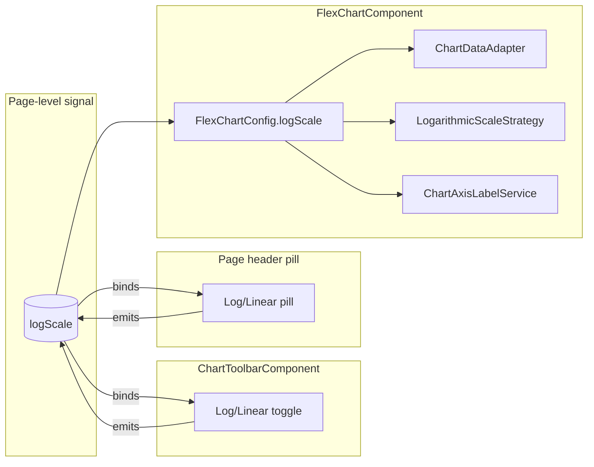

# PRD — Roll log y-axis scale to all FlexChart consumers

**Topic:** Flex Chart Maintenance  
**Topic Slug:** flex-chart-maint  
**Thread:** Roll log y-axis scale to all consumers  
**Thread Slug:** roll-out-log-y-axis  
**Issue:** #539  
**Thread Parent:** #538  
**Topic Parent:** #468  
**Domain:** FLEX-CHART  
**Type:** PRD  
**Status:** Complete  
**Created:** 2026-09-23  
**Last Updated:** 2026-09-23  

## Problem

The manual logarithmic Y-axis transform has been proven in the sandbox
(#469). It solves the core complaint that the auto-scaled log axis could
not fit to the visible data range, making charts useless for symbols
with very wide or very low price ranges. Until now the behavior is
only reachable on the hidden `/flex-chart-sandbox` route. Every
production surface that uses `FlexChartComponent` still renders a
linear Y-axis by default and has no way to switch.

## Goal

Make the proven log-axis seam the default for every `FlexChartComponent`
instance, with an optional shared **linear/log** toggle. The behavior
lives in the shared component layer; consumers only decide whether to
surface a toggle. No one-off transform logic per consumer.

## In scope

- **Shared layer**:
  - `FlexChartComponent` defaults `config.logScale` to `true` if the
    consumer does not supply it.
  - `ChartToolbarComponent` gets a reusable `logScale` input + output so
    pages that already use the toolbar can expose the toggle without
    adding extra chrome.
- **Consumer wiring** (no transform logic):
  - `quick-charts` — bind the same page-level `logScale` signal to every
    chart card; add a page header pill if no toolbar is used.
  - `swing-analysis-page` — bind its page-level `logScale` signal to the
    single chart; add a header pill.
  - `signal-detail` — bind the page-level `logScale` signal to all three
    `ChartToolbarComponent` instances (each toolbar reflects the same
    state).
- Re-use the existing transform seam:
  `log-transform.ts`, `LogarithmicScaleStrategy`, `ChartDataAdapter`,
  `ChartAxisLabelService`, `ChartLifecycleFacade`.

## Out of scope

- User-level preference persistence (Firestore/localStorage).
- Per-chart-instance toggles within a page.
- Changing the default for non-FlexChart surfaces (e.g. option-chart,
  spread-chart).
- New indicator math — existing ST indicators continue to render through
  the same adapter path.

## User stories

### US-1 — Log axis on by default

> As a trader viewing any FlexChart, I see the Y-axis in logarithmic
> scale by default, because equal percentage moves are visually equal
> and the axis fits the visible range.

**Acceptance:**
- Every production FlexChart surface renders with `logScale: true` on
  first load.
- The visible high/low of the data is correctly mapped to the axis
  extents (same behavior verified in the sandbox).
- No error or NaN axis is produced for typical symbol price ranges
  (penny to multi-thousand dollar).

### US-2 — Page-level linear/log toggle

> As a trader, I can toggle the entire page between linear and log
> Y-axis so I can choose the view that fits my current analysis.

**Acceptance:**
- Pages without `ChartToolbarComponent` (quick-charts, swing-analysis)
  expose a pill toggle in the page header: "Log" / "Linear".
- Pages with `ChartToolbarComponent` (signal-detail) expose the same
  toggle inside the toolbar; all charts on the page share the same
  page-level state.
- The toggle reflects the current mode and updates every chart on the
  page synchronously.
- The toggle is per-session only — a reload restores the default log-on
  state.

### US-3 — No regression in overlays or indicators

> As a trader, I still see ST indicators (trend bands, std-dev lines,
> zigzag) aligned with price candles when log scale is active.

**Acceptance:**
- Main-pane overlays are transformed to log units; lower-pane
  indicators remain in native units (same rule as the sandbox).
- Tooltips show real prices, not log units, on every production surface.
- Crosshair price labels show real prices on every production surface.
- Gutter labels and gridlines remain sensible across multi-decade ranges.

### US-4 — Staged rollout with per-surface regression coverage

> As a developer, I can ship the rollout one consumer at a time so that
> a regression in one surface doesn't block the others.

**Acceptance:**
- Each surface gets its own task and can be merged independently.
- Every surface task includes a focused spec that asserts the
  `FlexChartConfig.logScale` signal/value is wired through to the chart
  and that toggling it flips the config.
- The shared `ChartToolbarComponent` has its own spec for the toggle
  emission.

## System context

## Technical context

- The log transform is already implemented and unit-tested in
  `strategies/log-transform.ts`, `LogarithmicScaleStrategy`, and
  `ChartDataAdapter`.
- `FlexChartConfig` already has a `logScale: boolean` field.
- `FlexChartComponent` currently has `config = input<FlexChartConfig>({ indicators: [] })`.
  The default will be expanded so `logScale: true` is applied when the
  consumer does not provide it.
- `ChartToolbarComponent` currently emits `fullscreenToggle`. It needs a
  new `logScaleToggle` output and a `logScale` input so pages can
  two-way bind the same page-level signal to every toolbar.
- Consumers only pass a page-level `logScale` signal into the chart and
  (optionally) a toolbar. They do not implement any log/linear math.
- No persistence or account-level preference is required for this phase.

## Rollout order

All consumer work is wiring only; the shared-layer work lands first.

1. **Shared layer** — `FlexChartComponent` default + `ChartToolbarComponent`
   toggle + specs.
2. **quick-charts** — smallest, lowest-risk surface; validates the shared
   toolbar-less pill pattern.
3. **swing-analysis-page** — single main chart; validates header pill
   pattern on a detail page.
4. **signal-detail** — highest-touch surface; validates toolbar toggle
   with three synchronized charts.

## Risks and mitigations

| Risk | Mitigation |
|---|---|
| A consumer builds `FlexChartConfig` in a way that ignores `logScale`. | Each surface task asserts the config includes `logScale: true` and that the toggle flips it. |
| Indicator overlays on a consumer are computed outside the adapter and bypass transform. | Each surface task includes a visual smoke test comparing overlay points to candle bodies under log mode. |
| Toolbar toggle conflicts with existing fullscreen emit or future toolbar controls. | Add a dedicated output; do not overload `fullscreenToggle`. |
| Sub-$1 or corrupt data on a production symbol exposes an edge case not covered by sandbox presets. | Quick-charts task adds a regression spec using the existing `non-positive` / `penny` fixtures if the consumer allows. |

## Open questions

- Does any production consumer build series outside `ChartDataAdapter`
  (e.g., raw `SfSeries` injected separately)? Audit during task
  breakdown.
- Should `FlexChartComponent` force `logScale: true` even when the parent
  passes `logScale: false`? No — the input config wins; the default only
  applies when the field is absent.

## Decisions

- Toggle label: "Log Y-axis" with Yes/No state (Yes = log, No = linear),
  consistent across the shared toolbar and page-level pills.
