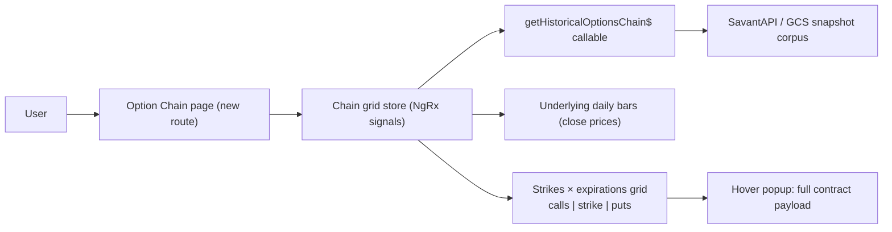

# PRD: Today's Option Pricing View (Option Chain Browser)

**Topic:** Current option pricing  
**Topic Slug:** current-option-pricing  
**Thread:** Today's option pricing view  
**Thread Slug:** today-option-pricing-view  
**Issue:** #488  
**Thread Parent:** #487  
**Topic Parent:** #486  
**Domain:** OPTIONS  
**Type:** PRD  
**Status:** Approved  
**Created:** 2026-09-22  
**Last Updated:** 2026-09-22  

## Overview

Options traders need to see an entire option chain — all strikes across all
expirations — in one place, without clicking through one expiration at a
time. This feature adds a new **Option Chain** page that renders a single
trading session's chain in the percent-change grid's visual form (strikes as
rows, expirations as columns), but with chain data: current price, change vs
the prior session, delta, and IV in each cell, and the full contract payload
on hover.

The view defaults to the most recent available session ("today's pricing"),
but doubles as a historical chain browser: picking any past date shows that
session's chain with change vs *its* prior session.

This Thread delivers the browse/inspect experience only. Cell-click
interactions (contract selection → chart popup, order ticket, spread
building for the agentic account) are intentionally deferred to a follow-on
Thread.

## Goals

- Show a symbol's complete option chain for one session in a single
  strikes × expirations matrix — no per-expiration navigation.
- Default to the latest available session so the page is "today's option
  pricing" with zero input.
- Surface per-contract price, session-over-session change, delta, and IV
  at a glance; full quote + greeks detail on hover.
- Support calls-only, puts-only, and combined (calls | strike | puts)
  layouts.
- Reuse the pct-change grid's filter contract (symbol, strike range,
  expiration window, delta band).

## Non-Goals

- Cell-click contract selection, contract mini-chart popup, order ticket,
  spread builder (separate Thread).
- Field-switchable primary cell metric, IV surface / volatility-skew
  visualization, IV Rank (future extensions — see Open Questions).
- Intraday/streaming quotes — the data source is EOD snapshots only.

## Technical Context (user-affecting constraints)

- **Data is end-of-day.** Chain snapshots come from SavantAPI's immutable
  date-keyed corpus (`getHistoricalOptionsChain$`, Alpha Vantage upstream).
  There is no intraday data; "today" resolves to the latest session that has
  a snapshot.
- **Session resolution:** before 1:00 PM PT (market close, expressed in
  the user's timezone — the app standardizes on PT), "today" = the prior
  trading session. After 1 PM PT, the view tries today's date and falls
  back to the prior session if no snapshot exists. On weekends and
  holidays, resolution walks back to the most recent trading day (cap:
  7 calendar days).
- **Change basis:** each cell's $ and % change is computed vs the contract's
  price in the previous trading session's snapshot. Contracts that have no
  prior-session counterpart (newly listed, or missing data) show no change
  values.
- **Price field:** cells display `mark` price. No fallback to `last` — a
  missing mark renders as "n/a" so a data gap is visible, not masked.
- **Freshness/source transparency:** the page shows which session date is
  displayed and whether the snapshot came from the cached corpus or an
  upstream fetch (existing source flag: `gcs` vs upstream).
- **Scale:** full chains can contain thousands of contracts. The grid uses
  the existing pct-change grid's performance patterns (delegated event
  handlers, precomputed cell view-models, no per-cell Angular components).

## User Stories

### US-1: View today's chain by default

As a trader, when I open the Option Chain page for a symbol, I want to see
the most recent session's full chain without entering a date.

**Acceptance criteria:**
- Given a symbol, the page auto-resolves the latest available session and
  renders the chain grid.
- Intraday (before the session's snapshot exists), the resolved date is the
  prior trading session.
- Post-session, the resolved date is today; if today's snapshot isn't
  available yet, it falls back to the prior session.
- The displayed session date is visible on the page so the user always knows
  which session they're looking at.

### US-2: "Today" button

As a trader, I want a "Today" button that re-resolves to the latest session
so I don't have to type today's date.

**Acceptance criteria:**
- Clicking "Today" sets the date input to the resolved latest session and
  loads that chain.
- The resolution + fallback rules from US-1 apply.

### US-3: Browse any historical session

As a trader, I want to pick any past date and see that session's chain with
change vs its own prior session, so I can inspect historical pricing.

**Acceptance criteria:**
- A date input accepts any valid past date, with both manual entry and a
  datepicker control.
- The grid renders that session's chain; each cell's change values compare
  against the contract's price in the session immediately before the picked
  date.
- If the picked date has no snapshot (weekend/holiday/pre-coverage), the
  page shows a clear "no data for {date}" state rather than a broken grid.

### US-4: Calls / puts / both layout

As a trader, I want to toggle between calls-only, puts-only, and a combined
view so I can focus on one side or see the whole chain.

**Acceptance criteria:**
- A CALLS / PUTS / BOTH toggle controls the layout.
- CALLS and PUTS render a single strikes × expirations grid for that type.
- BOTH renders a shared strike column with calls on the left and puts on
  the right (classic chain layout).

### US-5: Cell contents

As a trader, each cell shows the contract's key numbers so I can scan the
chain without opening detail views.

**Acceptance criteria:**
- Each populated cell shows: mark price, $ change and % change vs prior
  session, delta, and IV.
- A missing mark renders as "n/a" — no silent fallback to another field.
- Change values are visually signed (positive/negative distinguishable at a
  glance).
- Cells with no contract render as empty.

### US-6: Full contract detail on hover

As a trader, hovering a cell shows everything the snapshot has for that
contract so I don't need to click for detail.

**Acceptance criteria:**
- Hover popup shows: contract ID, mark/last, bid/ask and sizes, volume,
  open interest, IV, delta, gamma, theta, vega, rho, $/% change, and the
  prior-session price.
- Popup does not require a click and does not interfere with scanning
  adjacent cells.

### US-7: Filters

As a trader, I want to narrow the chain by strike range, expiration window,
and delta band so the grid stays readable on large chains.

**Acceptance criteria:**
- Filter panel matches the existing pct-change grid's semantics: symbol,
  strike range, expiration window, delta band.
- Delta band defaults to |delta| ≤ 0.6 and applies to both calls and puts
  (calls capped at +0.6, puts floored at −0.6).
- Filters apply to whichever layout (CALLS/PUTS/BOTH) is active.

### US-8: Page header context

As a trader, I want the page header to show the symbol's company info and
the underlying's close for the displayed session (plus prior close) so I
have pricing context for the chain.

**Acceptance criteria:**
- Header shows symbol, company name when available, underlying close for
  the displayed session, and prior-session close.

### US-9: Per-side strike orientation

As a trader, I want strikes ordered high→low (top→bottom) by default —
matching how charts read — with an independent orientation toggle per side
in BOTH mode.

**Acceptance criteria:**
- Default orientation is highest strike at top, lowest at bottom.
- In BOTH mode, the calls side and puts side each have an independent
  orientation toggle; they may differ.
- In single-type mode a single toggle applies.

### US-10: Empty and error states

**Acceptance criteria:**
- No contracts after filtering → "No contracts matched the current filters."
- Snapshot fetch failure → clear error state with the failed date.
- Fallback chain (today → prior session → earlier sessions) is transparent:
  the user can always see which date was actually loaded.

## Future Extensions (not in this Thread)

- **Cell-click contract selection** → contract detail / mini-chart popup,
  order ticket, spread builder for the agentic account.
- **Field-switchable primary cell metric** (price | chg% | IV | delta |
  volume | OI).
- **IV surface / volatility-skew view** — the snapshot already carries
  per-contract `implied_volatility`; an IV-colored heatmap over the same
  matrix is a visualization extension, not new data.
- **IV Rank** — requires a symbol-level IV time series (e.g., daily ATM or
  blended IV over ~1 year). Not derivable cheaply from per-day chain
  snapshots client-side; needs an SA-side precomputed endpoint. Flag as a
  partner ask.

## Resolved Questions

- **Session boundary:** 1:00 PM PT (= 4:00 PM ET market close; app
  standardizes on PT). Before → prior session; after → try today, fall back.
- **Walk-back cap:** 7 calendar days (covers weekends + holiday clusters).

## Open Questions
- Saved filter configs (the pct-change grid has save/load config) — reuse
  the same persistence for this page or keep filters session-local?

## System Context

