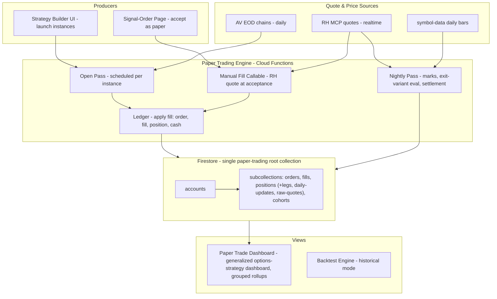

**Topic:** Paper Trading Infra  
**Topic Slug:** paper-trading-infra  
**Thread:** Core Infra  
**Thread Slug:** core-infra  
**Issue:** #555  
**Thread Parent:** #554  
**Topic Parent:** #553  
**Domain:** PAPER-TRADING  
**Type:** PRD  
**Status:** Approved  
**Created:** 2026-09-24  
**Last Updated:** 2026-09-24 (revised: exit variants = independent lifecycles; RH-only marks; single `paper-trading` root collection; monitoring consolidated in dashboard; add-on/pyramiding follow-on)  

# PRD: Paper Trading Infra — Core Infra

## Problem Statement

As a strategy researcher, I want a unified simulated-trading system — one paper-trading ledger that both automated position-lifecycle strategies and manually accepted ST signals write into — so that I can accumulate a large database of simulated trades and determine which strategies, signals, instrument expressions, and exit rules actually work, historically and in real time, before risking real capital.

Today this is impossible: the Options Position Strategy Engine (#108) paper-tracks option strategy positions but deliberately has no account, order, or fill semantics; the ST signal→order flow can only send real orders to Robinhood; and backtest results live apart from forward results. There is no unified simulated-trade record to measure against.

## Solution

Build a general **Paper Trading engine** — generalizing the #108 position/mark/settlement core — around an **account-centric ledger**: paper accounts ("buckets"), orders, fills, positions, and a cash ledger. Two producers write through the same ledger:

1. **Strategy instances** — registered position-lifecycle strategies (CSP ladder, wheel, verticals, …) configured and launched from a new strategy-builder UI, many running in parallel, each with its own account bucket.
2. **Signal→paper orders** — an affordance on the signal→order page to accept an ST signal as a *paper* trade instead of a live RH order: fill at the acceptance-time quote, then fan out into a **cohort** — the underlying position plus one position per configured option-expression template — so signal quality and expression quality are measurable from the same entry.

Each entry is evaluated against **all configured exit variants as independent lifecycles**: every variant maintains its own state (trailing level, days held) and closes at its own trigger — so a time stop that would fire a month after a trailing stop is measured on its own timeline, not against a position that's already dead. One variant per position is designated **governing** — it determines the position's real close and ledger P&L, mirroring the real-world constraint that RH allows one exit type per trade. The remaining variants run as **shadow tracks**: pure counterfactual measurement (would-be exit date, price, P&L) that informs which exit type to choose next time — they never touch the ledger and may evaluate past the position's real close. Exit rules evaluate on **end-of-day data** in a nightly pass. All paper monitoring lives in one place: the options-strategy dashboard generalized into the **paper trade dashboard** (grouped by strategy / signal / exit variant / expression). Historical validation stays with the existing backtest engine — every strategy must be runnable in both modes with comparable result shapes.

## User Stories

1. As a researcher, I want every paper trade to belong to an **account bucket** — one per strategy instance plus one shared manual bucket — so that each strategy's capital usage and P&L are isolated and comparable.
   - **Verify:** each launched strategy instance gets its own account document; all signal-driven paper trades land in the manual account; per-account cash/equity can be read independently.

2. As a researcher, I want every paper position to originate from an auditable **order → fill** record, so that the trade log is complete and explainable.
   - **Verify:** every open position links to an order doc (terms, source, timestamp) and a fill doc (fill price, quantity, quote provenance); no position exists without both.

3. As a researcher, I want paper positions to model **multi-leg structures** (option legs and share legs), so that spreads and assigned-share positions are first-class, matching the #108 leg model.
   - **Verify:** a spread position persists N legs; an equity position is a single share leg; P&L aggregates across legs.

4. As a researcher, I want the cash ledger to be **tracked but not enforced**, so that I can observe the real capital requirement of each strategy without trades being artificially rejected.
   - **Verify:** account cash reflects every fill's cash flow; a balance may go negative and the deficit is visible in the UI rather than blocking fills.

5. As a researcher, I want the existing #108 strategy engine to **write through the ledger**, so that strategy-driven and manual trades share one accounting model.
   - **Verify:** a strategy instance's open produces order+fill+position+cash records identical in shape to a manual paper trade; settlement produces a closing fill and realized P&L.

6. As a researcher, I want the engine's **scheduled passes preserved** — open pass at each instance's configured time, nightly mark pass, settlement pass — so that existing strategy behavior is unchanged apart from writing through the ledger.
   - **Verify:** after migration, a running CSP instance continues to open on cadence, mark nightly, and settle at expiration, with all artifacts visible in the ledger.

7. As a researcher, I want a **strategy-builder UI** to configure and launch instances of registered strategy types (symbol, spread type, delta/DTE targets, cadence, open time, exit policies), so that starting a new experiment requires no Firestore surgery.
   - **Verify:** creating an instance in the UI produces a valid instance document; the next scheduled open pass creates positions for it; no direct Firestore writes are needed.

8. As a researcher, I want a configurable **exit-variant registry** — initial stop loss, trailing stop, limit exit at StdDevLines-generated levels, time stop — where each position has **one governing variant** (RH allows one exit type per trade) and all other configured variants run as shadow measurement tracks, so that the data answers "which exit type should I pick" without variants counting as separate trades.
   - **Verify:** each exit variant is a named config entry; a position carries one governing variant key; every configured variant produces an exit evaluation per position; only the governing variant's exit affects cash and realized P&L; adding a new variant type requires a rule definition plus registration, not engine surgery.

9. As a user, I want an **"accept as paper" affordance** on the signal→order page, so that I can route an accepted signal to the paper engine instead of placing a real RH order.
   - **Verify:** the accept flow offers paper vs live; choosing paper creates a paper order filled at the acceptance-time RH quote and **no** call is made to `place_equity_order`.

10. As a researcher, I want each accepted signal to fan out into a **cohort** — the underlying position plus each configured option-expression template — so that I can compare how different instruments expressed the same signal.
    - **Verify:** accepting one LONG signal creates a cohort doc containing the share position and one position per configured bullish expression template, all sharing the same entry timestamp and signal reference.

11. As a researcher, I want every entry evaluated against **each exit variant as an independent lifecycle** — each variant maintains its own state and closes at its own trigger — so that exit strategies are compared on identical entries, each answering "if this were my only exit rule, when do I exit and at what P&L?"
    - **Verify:** for one entry with 4 configured variants, each variant produces its own exit outcome (date, price, P&L, days held); a slow variant (e.g., time stop) is evaluated on its own timeline even when a fast variant (trailing stop) triggers earlier — including past the position's real close, since shadow tracks are counterfactual measurement.

12. As a researcher, I want **nightly EOD exit evaluation** — each variant's rule checked against that day's close, the governing variant closing the real position, shadow variants recording would-be exits on their own timelines — so that exits are simulated consistently at daily granularity.
    - **Verify:** a breached governing trailing stop produces a closing fill at that close and ends the position; a shadow time stop continues evaluating and records its own exit event when it later fires.

13. As a researcher, I want all open positions **marked daily** — option legs via the **RH MCP quote provider only** (the real data source for this use case), share legs via the nightly `symbol-data` close — so that unrealized P&L is consistently computed.
    - **Verify:** each trading day produces a daily-update record per open position with the RH-sourced mark and the underlying close; no option mark originates from AV EOD.

14. As a researcher, I want option positions to **settle at expiration** reusing the #108 semantics — expired worthless, assigned (creating a share position at strike cost basis), or cash-settled — so that the full lifecycle including the wheel is paper-tracked.
    - **Verify:** an ITM expiration produces an assignment record, a closing fill for the option leg, and a share position whose marks use daily closes thereafter.

15. As a researcher, I want the **options-strategy dashboard generalized into the paper trade dashboard** — the single monitoring surface for all paper activity — reading the ledger with grouping by strategy / signal / exit variant / expression, so that "what works and when" is answerable from one place.
    - **Verify:** the dashboard renders ledger positions, exit events, and equity curves for a selected grouping dimension; manual-bucket positions and strategy-bucket positions are both visible.

16. As a researcher, I want **all paper monitoring consolidated in the dashboard** — including per-signal cohorts (positions grouped by expression, with each variant's exit events) — while the signal-order page hosts only the entry affordance, so that monitoring has exactly one home.
    - **Verify:** a signal-driven cohort is viewable in the dashboard grouped by its signal; the signal-order page exposes the paper accept action but no monitoring UI.

17. As a researcher, I want **every strategy runnable historically and forward** — the backtest engine for the past, the paper engine for the future, with comparable result shapes — so that forward performance can be judged against backtest expectations.
    - **Verify:** the same strategy config produces a backtest equity curve (existing `backtest-simulator`) and a forward paper equity curve in the same metric shape.

18. As a researcher, I want **raw quote data persisted** for every contract actually touched (per the #108 `RawQuote` convention), so that fills and marks have an audit trail without storing full chain snapshots.
    - **Verify:** every fill and daily-update links to a raw-quote record; no raw docs exist for untouched contracts.

19. As a researcher, I want **no real broker order calls** on the paper path, so that paper trading can never accidentally spend money.
    - **Verify:** no code path reachable from paper order submission calls `place_equity_order` or any broker mutation tool.

## Implementation Decisions

- **Engine host: backend.** Fill/mark/exit evaluation runs in Cloud Functions on schedule and on data arrival; manual paper orders go through a callable. The paper account must be truthful when the app is closed.
- **Generalize #108, don't fork it.** The position-repository, open/mark/settlement/stats passes, quote providers, and OCC↔RH instrument map become the engine core; an order→fill→cash layer is added beneath them.
- **One root collection: `paper-trading`.** No new top-level collections — a single `paper-trading` root holds account docs (`paper-trading/{accountId}` — one per strategy instance plus the shared manual bucket), and everything else lives in subcollections under the account: `orders`, `fills`, `positions` (with `legs`, `daily-updates`, `raw-quotes` subcollections, mirroring #108), `cohorts`. Existing `options-strategy-*` collections migrate under this root (or are folded in during the refactor — decided at Blueprint).
- **Dimension fields** on every order/fill/position — `source` (`strategy` | `signal`), `strategyInstanceId`, `signalId`, `symbol`, `expression`, `cohortId` — so rollups group at several levels even within one account's subcollections.
- **Signal→paper fills** use the RH MCP quote at acceptance time — the paper trade and its live alternative start from the same moment. Quantity inherits the order ticket's computed sizing (whole shares).
- **Cohort model:** one cohort doc per accepted-as-paper signal; the cohort = the underlying position + one position per configured expression template. Expression templates reuse the #108 strategy config shape (spread type, target delta, DTE band) mapped by signal direction.
- **Each exit variant runs an independent lifecycle sharing the entry; one is governing.** The governing variant closes the position and writes ledger P&L — matching the real-world constraint that RH allows one exit type per trade. All other configured variants run as **shadow tracks** (own state, own would-be exit date/price/P&L, evaluated on their own timelines including past the real close) — measurement-only records that answer "which exit type should I pick" without counting as separate trades. Shadow tracks never affect cash or positions. Evaluated once daily at EOD; intraday evaluation is a follow-on.
- **Option marks and fills come exclusively from the RH MCP quote provider** — the real data for this use case. AV EOD remains only for contract-selection screening at open time (chain scan by delta/DTE).
- **Reuse wherever possible:** `backtest-simulator` (historical mode), `OptionQuoteProvider` abstraction, `option-contract-selection` leg picker, OCC ID helpers, `symbol-data` daily bars for equity marks and settlement, RawQuote audit convention, order ticket `refId` idempotency pattern.
- **Strategy builder UI** launches instances of registered strategy types only — new strategy *types* remain code. The free-form spread→backtest→promote pipeline is a follow-on.

## Testing Decisions

- **Backend (node:test):** pure-function tests for fill math, cash accounting, P&L, and each exit-variant rule; pass-level tests using the existing dependency-injection seam (passes take `deps` with stubbed quote providers and repositories) — same pattern as `tests/functions/options-strategy-engine/*`.
- **Primary seam:** the quote-provider + repository interfaces (existing). The one new seam worth having: a single "apply fill" boundary function (order → fill → position/cash mutation) that both the manual callable and strategy passes call — testable without Firestore via injected writers.
- **Frontend (jest + TestBed):** store specs for cohort/ledger state; component specs for the launcher UI and the paper affordance; mock the callables rather than Firebase directly.

## Technical Context

- **EOD granularity:** stops, targets, and time exits evaluate once daily at the close. An intraday breach that recovers by the close is invisible — accepted limitation; intraday evaluation is a follow-on thread.
- **Option fill/mark price** = RH MCP quote provider mark exclusively (mid when absent, then last — the existing `resolveMark` fallback chain). Equity fills for signals = RH MCP quote at acceptance; equity marks = daily-bar close. AV EOD is used only for contract-selection screening, never for marks or fills.
- **SA realtime options endpoint** remains a dependency for intraday noon opens, exactly as in #108 — EOD paths are unblocked regardless.
- **Data freshness:** marks and account equity are as-of the last nightly pass; intraday views show stale marks — this is a batch research tool, not a live ticker.
- **Early assignment is not modeled** (carried over from #108) — acceptable for paper research; matters only for live trading.

## Out of Scope (this Thread)

- **Manual option order ticket** (leg-builder → paper fill on demand) — follow-on thread.
- **Intraday exit evaluation** — follow-on thread.
- **Replay mode** (running the paper engine backward over historical data, seeding the same ledger) — follow-on thread.
- **Spread → backtest → promote-to-strategy pipeline** (one-off spread builder → backtest → promote to strategy config) — follow-on thread.
- **Add-on / pyramiding** (when to add to an existing open position) — follow-on thread.
- Real broker order submission; capital enforcement; early-assignment modeling; free-form strategy composition (no DSL).

## System Context Diagram

## Further Notes

- Domain terms to formalize in `CONTEXT.md` during planning/blueprint: **Paper Account (bucket)**, **Cohort**, **Expression Template**, **Exit Variant** (with **governing** vs **shadow** classification), **Exit Event**. These extend the existing **Signal Strategy** vs **Position-Lifecycle Strategy** distinction — the paper engine is the shared substrate both feed.
- Exit-strategy comparison is a designed experiment: identical entries, each variant evaluated on its own timeline to its own exit — the dataset records when each variant would have fired and at what P&L, and only the governing variant's outcome enters the ledger.
- The manual bucket doubles as the container for all signal-driven cohorts; per-signal breakdown is a `cohortId`/`signalId` rollup, not separate accounts.
