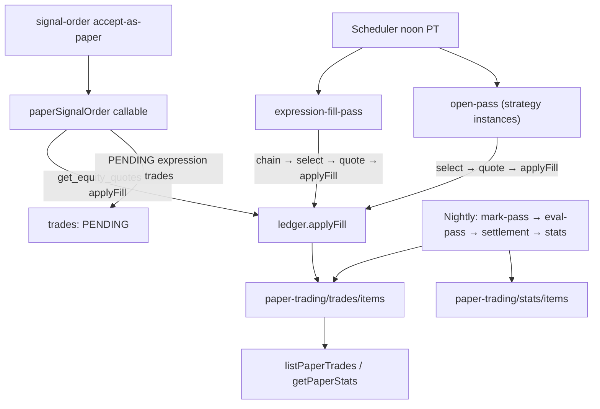

**Topic:** Paper Trading Infra  
**Topic Slug:** paper-trading-infra  
**Thread:** Core Infra  
**Thread Slug:** core-infra  
**Issue:** #556  
**Thread Parent:** #554  
**Topic Parent:** #553  
**Domain:** PAPER-TRADING  
**Type:** IMPL  
**Status:** Draft  
**Created:** 2026-09-24  
**Last Updated:** 2026-09-24  

# Implementation Plan: Paper Trading Infra — BE

## Module layout

New `functions/src/paper-trading/` module absorbing and generalizing the `options-strategy-engine` internals:

```
functions/src/paper-trading/
  collections.ts            # paper-trading root + anchor/items paths
  ids.ts                    # human-readable id builders (trade, cohort, rq, stats)
  repository.ts             # account/trade/cohort/instance read-write helpers
  ledger.ts                 # applyFill boundary: order → fill → trade + cash mutation
  exits/
    registry.ts             # exit-variant registry (key → rule)
    rules.ts                # initial-stop, trailing-stop, time-stop, limit-stddev
    eval-pass.ts            # nightly per-variant evaluation
  passes/
    open-pass.ts            # strategy opens (moved + ledgerified)
    mark-pass.ts            # nightly marks (RH MCP only for options)
    settlement-pass.ts      # expiration outcomes (moved)
    held-shares-pass.ts     # assigned-share marks (moved)
    stats-pass.ts           # rollup stats (moved)
    expression-fill-pass.ts # noon-PT fill of queued signal expressions
  callables.ts              # paperSignalOrder, listPaperTrades, getPaperStats, ...
  quote-providers/          # moved from options-strategy-engine (RH MCP + AV EOD selection)
  instrument-map/           # moved OCC↔RH map
```

`options-strategy-engine/` is retained only as a re-export shim during migration, then deleted. The `robinhood-mcp` session manager stays where it is — it's shared infrastructure.

## Phase 1 — Ledger core

- `collections.ts`: `paperTradingDoc(kind)` / `itemsCollection(kind)` path helpers.
- `ids.ts`: builders per the SHARED IMPL formats; collision suffix `-HHMM` when a same-day trade id exists.
- `repository.ts`: CRUD for accounts, trades, cohorts, instances, stats, raw-quotes; `appendMark`, `appendFill`, `updateVariantRun` helpers that mutate the embedded maps/arrays in one write.
- `ledger.ts` — the single seam: `applyFill(order, quoteResult) → { trade, accountDelta }` creates/updates the trade doc (fills[], legs[], marks seed) and applies the cash delta to `acct-{userId}`. Pure decision function + injected writers — testable without Firestore.

## Phase 2 — Engine migration

- Move open/mark/settlement/held-shares/stats passes onto `paper-trading` collections; positions become `trades` docs (source `strategy`, expression = spread code).
- Instance reads move from `options-strategy-instances` to `paper-trading/instances/items` — update `strategy-instance-repository` + FE `StrategyBuilderService` path.
- **Data migration script**: copy `options-strategy-instances` → `inst` docs, `options-strategy-positions` (+ legs/daily-updates/raw-quotes subcollections) → `trades` docs with embedded legs/marks, `options-strategy-stats` → `stats` docs. One-off admin callable or script; idempotent.
- Open pass unchanged semantically (noon PT, delta/DTE selection via AV EOD chain, RH MCP fill quote) but writes order+fill into the trade doc and debits account cash.

## Phase 3 — Exit engine

- `registry.ts`: variant definitions keyed by `variantKey` (e.g. `initial-stop-10`, `trailing-20`, `time-30d`, `limit-sd1`). Each has params + a pure `evaluate(trade, mark, underlyingClose, run) → { trigger: boolean, newWorkingState }`.
- Every open trade gets `variantRuns[]` seeded for all configured variants; exactly one `governing: true` (default per source/instance config).
- `eval-pass.ts` (nightly, after marks): for each open trade, evaluate every ACTIVE variant run on that day's mark. Governing trigger → closing fill at the close, trade → CLOSED, cash credited. Shadow trigger → `exitEvent` written, run → EXITED. Shadow runs continue evaluating after a governing close (they track `lastMark` from marks history) — counterfactual measurement only.
- Initial variants: `initial-stop` (pct below entry), `trailing-stop` (pct off high-water mark), `time-stop` (days held ≥ N), `limit-stddev` (underlying crosses StdDevLines-derived level — wires to the ST StdDevLines algo when it lands; until then register with a stubbed level source).

## Phase 4 — Signal→paper path

- `paperSignalOrder` callable:
  1. Read the order ticket (signal provenance, symbol, side, quantity).
  2. `get_equity_quotes` via RH MCP → entry fill at acceptance price → `applyFill` creates the `sig-{sym}-EQ` trade.
  3. Create cohort doc; for each configured expression template (per signal direction) create a `PENDING` trade (`sig-{sym}-{SPREAD}-{DELTA}-{DTE}`) carrying its template params.
  4. Seed variantRuns on every trade (equity + pending expressions).
- `expression-fill-pass` at noon PT (same cadence as strategy opens): for each PENDING expression trade, `get_option_chains` → `selectOptionContract` by template delta/DTE → `get_option_quotes` → `applyFill` → trade → OPEN.
- No broker mutation calls anywhere on this path (`place_*`/`review_*` unused).

## Phase 5 — Read APIs

- `listPaperTrades` (filters: status, source, instanceId, cohortId, symbol, expression, variantKey), `getPaperStats(scope)`, `listExitVariants`, `getPaperAccount`.
- `stats-pass` extends to paper-wide scopes: `all`, per-instance, per-variant, per-cohort, per-symbol.

## Technical risks

- **Migration correctness**: embedded legs/marks must reproduce existing P&L — migration verified by diffing computed equity curves old-vs-new on the same data.
- **Variant-run state drift**: shadow runs reading `marks` map must tolerate missing dates (gaps → skip that day, don't fire).
- **RH MCP batching**: noon pass may fill many pending expressions; reuse the provider's existing batch/chunk handling.
- **Callable auth**: `paperSignalOrder` requires auth; userId scopes `acct-{userId}`.

## Diagram


