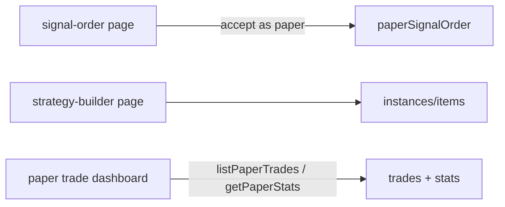

**Topic:** Paper Trading Infra  
**Topic Slug:** paper-trading-infra  
**Thread:** Core Infra  
**Thread Slug:** core-infra  
**Issue:** #556  
**Thread Parent:** #554  
**Topic Parent:** #553  
**Domain:** PAPER-TRADING  
**Type:** IMPL  
**Status:** Draft  
**Created:** 2026-09-24  
**Last Updated:** 2026-09-24  

# Implementation Plan: Paper Trading Infra — FE

All FE work is extension of existing surfaces under `src/app/features/savant-trader/` — no new feature area. FE reads paper data via callables only (never writes trade/ledger docs directly).

## Phase 1 — Paper data service + store

- `PaperTradingService` (Angular): wrappers around the BE callables — `paperSignalOrder`, `listPaperTrades`, `getPaperStats`, `getPaperAccount`, `listExitVariants`. Follows the existing `OptionsStrategyService` / `OrderTicketService` pattern.
- `PaperTradingStore` (signal store): account, trades list (filtered), stats, loading/error — mirrors `OptionsStrategyDashboardStore` shape.

## Phase 2 — Signal-order page: paper affordance

- `order.component` / `order-ticket.component`: beside the existing submit path add an **"Accept as paper"** action on staged signal tickets.
- Calls `paperSignalOrder` callable; on success the ticket transitions to a paper state (visually distinct from RH-submitted — e.g. a `PAPER` badge) and the queue shows it without RH-order polling.
- The paper path performs **no** `review_equity_order`/`place_equity_order` calls; confirmation dialog reused with "paper" copy.

## Phase 3 — Strategy builder: instance management on new path

- `StrategyBuilderService` repointed to `paper-trading/instances/items` (read/write path change only — UI unchanged).
- Builder form gains the exit-variant section: pick governing variant per instance + params; list of configured variants comes from `listExitVariants`.
- Optional: governing-variant selector shown on instance detail.

## Phase 4 — Dashboard generalization → paper trade dashboard

- `options-strategy-dashboard` becomes the paper trade dashboard (rename route/title or keep and extend — decide at implementation; nav label "Paper Trading").
- Data source switches from `listStrategyPositions`/`getStrategyEquityCurve` to `listPaperTrades`/`getPaperStats` — same table + chart components.
- New grouping selector: **group by** strategy instance / signal (cohort) / exit variant / expression / symbol. Trades table renders legs, marks history, and variant runs (governing exit + each shadow variant's would-be exit date/price/P&L).
- Cohort view: select a signal cohort → its trades grouped by expression, variant outcomes side-by-side.
- Account header: cash, equity, realized/unrealized P&L, required-capital readout (negative balance visible, never blocking).

## Key risks

- Dashboard regroups are client-side over a potentially large trade list — paginate/query BE-side per grouping rather than pulling everything (stats docs carry the heavy aggregates already).
- Paper-vs-live visual distinction must be unmissable on the order page (badge + color), or a user may mistake a paper fill for a real one.

## Diagram

