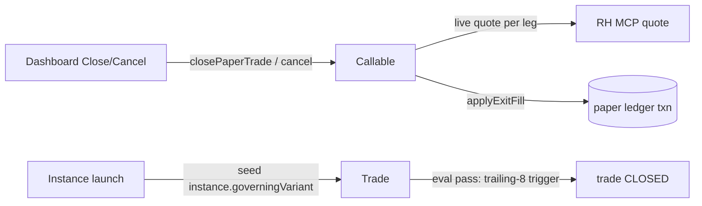

# PRD — Paper Trading: Trade Exits

**Status:** Approved  
**Created:** 2026-09-28  
**Last Updated:** 2026-09-28  
**Topic:** #553 Paper Trading Infra  
**Thread:** #652 Trade Exits  
**Idea:** #629  

> **Amended (same day):** model simplified to a single governing trailing
> stop per trade — the real-world constraint. No shadow runs, `none` not
> offered for new trades, no backward-compat handling (existing docs'
> inert `none` runs simply never fire).
>
> **Amended 2026-09-29 — purpose clarified.** Paper trading is an
> **execution-fidelity** system (did the plan get followed), not an
> exit-policy research harness — counterfactual exit comparison belongs
> to backtesting, which can replay N policies over the same history.
> Consequence: the variant machinery stays as *pluggable exit
> definitions* for enforcement (trailing stop now, std-dev target later),
> and the governing-select guard simplifies from a terminal-family
> taxonomy to "must be a registered exit variant".

## Problem

Paper trades today can only end two ways: option expiry (settlement-pass)
or a governing variant firing. Signal trades govern on `none`, so trades —
especially equity legs — stay `OPEN` forever with no exit path; `PENDING`
expression trades can't be cancelled before the noon fill pass; and
`instance.governingVariant` is stored but ignored when strategy instances
launch trades, so configured exits never take effect.

## Goal

Every paper trade gets a way to end — automatically via its trailing stop,
or manually — so entry-anchored data collection produces finished,
comparable outcomes that mimic a real broker's "one stop per position".

## Model — one governing trailing stop per trade

- Every new trade seeds exactly **one** variant run: governing
  `trailing-{pct}` (default `trailing-8`). When the mark reverses `pct%`
  off the favorable water mark, the nightly eval pass closes the trade at
  that day's mark — data collection ends. A real position has one stop;
  the paper trade mirrors it.
- `trailing-N` seeds its water mark at the entry fill, so day-1 behavior is
  identical to an initial stop — `initial-stop` is a redundant alias and is
  not offered for new trades.
- No shadow runs are seeded. Post-exit counterfactual paths die with the
  trade (marks stop landing anyway); exit-policy comparison is a
  **backtesting** concern (replayed over shared history), not a live
  shadow-eval concern.
- `none` remains in the registry vocabulary but is never seeded or offered
  on new trades; the governing select is restricted to registered exit
  variants (today: `trailing-*` — new exits like `limit-sd*` arrive as
  registry defs when backtesting promotes them).

## User stories

### US1 — Close an open paper trade

From the dashboard, close any `OPEN` trade — equity, option, or spread
(spreads close as a unit; all legs exit together). The exit prices at the
**live RH quote at click time** (per leg, netted to an order-level exit
price); realized P&L books, cash credits, and the governing run records a
manual exit.

**AC:**  
- Close action on trade rows (table + cohort drill-down) → confirm →
  `CLOSED`, realized P&L written, account credited, governing run `EXITED`
  with its exit event.
- Live-quote failure → visible error, trade stays `OPEN`, retry possible.
- No fallback to stale marks. No manual price entry.

### US2 — Cancel a pending expression trade

Before the noon-PT fill pass resolves a contract, a `PENDING` trade can be
cancelled.

**AC:**  
- Cancel action → status `CANCELLED`; no cash moves; excluded from stats.

### US3 — Strategy launches honor their governing variant

An instance configured with e.g. `trailing-15` seeds that run as governing
on each launched trade; when it triggers, the eval pass auto-closes the
trade at the mark.

**AC:**  
- Launched trades carry the instance's governing key (not hardcoded 'none').
- Eval pass closes the trade on a governing terminal trigger.

### US4 — Governing select restricted to trailing stops

The strategy-builder's governing-variant select offers `trailing-{pct}`
(param-configurable, default 8) — the only terminal family in scope.

**AC:**  
- Builder emits `trailing-{pct}` keys only; `initial-stop`, `time-*`,
  `limit-sd*`, and `none` are not selectable for new instances.

## Out of scope

- Shadow/counterfactual variant runs on new trades
- Per-leg closes (spreads close as a unit only)
- Post-exit tracking or back-calculation of hypothetical exits
- Notifications beyond the dashboard (`CLOSED` + governing exit event)
- Manual/user-entered exit prices
- Backward-compat migration for existing docs (`none`/shadow runs on old
  trades are inert — manual close covers them)

## Technical context

- Exit pricing is **live RH quote only** — closing requires the credential
  to be healthy; failure surfaces as an error (no silent stale-mark close).
- Options still settle/expire on their own via the settlement pass;
  manual close is additive.

