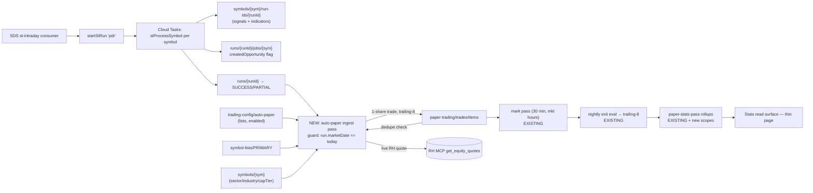

**Topic:** Paper Trading Infra  
**Topic Slug:** paper-trading-infra  
**Thread:** Signals Auto Paper Trade  
**Thread Slug:** signals-auto-paper-trade  
**Issue:** #905  
**Thread Parent:** #904  
**Topic Parent:** #553  
**Domain:** PAPER-TRADING  
**Type:** PRD  
**Status:** Approved  
**Created:** 2026-10-07  
**Last Updated:** 2026-10-07  

# PRD — Signals Auto Paper Trade

## Problem

We cannot answer "how would this signal have done?" for Savant Trader signals. Signals fire daily, get reviewed, and evaporate — nothing records their real-market outcome. The paper-trading engine already knows how to open, mark, and close a position, but it only papers signals a human manually accepts through an FE order ticket. With ~100–200 ST signals a day, manual acceptance can never build a statistically useful dataset.

## Concept

The paper-trading engine **is** the capture mechanism. When a live-date signal run completes, every fired signal automatically becomes an isolated paper position, filled at the live RH quote. Closed positions then carry entry/exit prices, percent return, hold time, and exit reason — and each trade doc is stamped with the signal's indicator values and slice dimensions, so `paper-trading/trades/items` alone is the forensics dataset. No separate forensic store, no new pipeline.

This simulates the eventual live process one step early: signals are meant to drive an EOD→next-open entry, but auto-paper takes them at ~noon PT on the firing day — a deliberate head start. The `signalStatus` stamp (INTERIM vs CONFIRMED) preserves the ability to measure what that head start costs or earns.

## System context

## User stories

### US1 — Automatic paper capture

> As the operator, every daily ST Trend Rider signal fired by a live-date run is auto-papered without any manual step, so the dataset accumulates whether or not I look at the dashboard.

Acceptance criteria:

- After a `pdr` or `manual` run completes with `marketDate` == the current trading day, each `D_ST_TREND_RIDER_{V1,V2}_{LONG,SHORT}` signal in the run's `run-ids` docs produces exactly one trade doc in `paper-trading/trades/items`.
- Entry fill price is the live RH equity quote fetched at ingest time; a raw-quote record is retained for audit.
- Runs whose `marketDate` is not the current trading day produce zero trades (historical replay is Thread #906's job).
- A signal whose symbol is not on the configured capture list produces no trade.
- **How to verify:** trigger a same-day manual run against a symbol known to fire; confirm one trade doc exists with the expected signalType, direction, entry fill, and stamps. Re-run: confirm no second trade. Trigger a historical `?date=` run: confirm zero trades.

### US2 — Isolated per-signal outcomes

> As the operator, every signal occurrence is an independent trade with no position limits, no interaction rules, and no account-level reasoning, so each row measures the signal alone.

Acceptance criteria:

- A same-direction re-fire on a later barDate opens a second position even while the first is open (stacking by design).
- An opposite-direction signal opens its own trade; neither affects the other.
- Trades book to a dedicated `auto-paper` account id — never to a real user account; positions never commingle with manual paper trades or live holdings.
- Dedupe is `(symbol, signalType, barDate)` across all runs of that day — timed and manual — so retries and re-runs never double-paper one event; a next-day re-fire is a new trade.
- **How to verify:** force a symbol to fire V1 long on consecutive days → two OPEN trades coexist. Fire the short while longs are open → a SHORT trade also opens. Re-run the same day → still exactly one trade per signal per day.

### US3 — Default exit under trailing-8

> As the operator, every auto-papered trade exits on the existing `trailing-8` governing variant via the nightly eval pass, so outcomes are closed automatically with a consistent, already-QA'd exit rule.

Acceptance criteria:

- Each created trade carries an ACTIVE variant run with `variantKey: 'trailing-8'`, `governing: true`; no shadow runs.
- The existing intraday mark pass and nightly eval pass mark, evaluate, and close these trades without code changes to those passes.
- A closed trade carries exit fill, percent return, days held, and exitEvent.
- **How to verify:** create a trade, drive marks below the trailing threshold via test fixtures, run the eval pass, confirm CLOSED with exitEvent populated.

### US4 — Sliceable dataset

> As the analyst, every auto-papered trade is stamped with signal provenance, indicator values at fire time, and classification dimensions, so outcomes can be sliced by signal type, direction, sector, industry, cap tier, and interim/confirmed status without joins.

Acceptance criteria:

- Trade doc carries flat queryable fields: `symbol`, `signalType`, `direction`, `timeframe`, `barDate`, `marketDate`, `runId`, `signalId`, `signalStatus` (INTERIM/CONFIRMED), `captureList`, `sector`, `industry`, `marketCapTier`, and the `indicators` map copied from the signal entry.
- Dedupe fields (`symbol`, `signalType`, `barDate`) are top-level and indexed.
- **How to verify:** inspect a created trade doc — all fields present; Firestore composite query on the dedupe triple returns in production.

### US5 — Config-gated capture scope

> As the operator, which symbol lists auto-paper is a config value, so I can widen capture to the whole universe for a few runs and tighten it back without a code change.

Acceptance criteria:

- A `trading-config/auto-paper` doc controls `enabled` and `lists` (default `['PRIMARY']`); `lists: ['*']` captures globally.
- The trade doc records which list matched (`captureList`).
- **How to verify:** flip the config to `['*']`, run, confirm non-PRIMARY symbols paper; flip back, confirm they don't.

### US6 — Stats surface

> As the analyst, a thin read view shows hit rate, average percent return, and counts per slice dimension over auto-papered trades, so I can rank signal quality.

Acceptance criteria:

- `paper-stats-pass` gains scopes for `sigtype-`, `dir-`, `sector-`, `industry-`, `captier-`, `sigstatus-` in addition to the existing scope set.
- A read page enumerates the `stats-*` rollup docs; percent return (not dollars) is the displayed unit. Distribution histograms are out of scope — the closed-trade list supports sampling studies.
- **How to verify:** after trades close, the stats docs for each new scope contain non-zero counts consistent with the trade set; the page renders them.

## Technical context

- **Entry timing:** fills happen at the ~noon-PT live quote on the day the signal fires — one step ahead of the intended EOD→next-open live process. Trades are stamped `signalStatus` so interim-vs-confirmed remains measurable.
- **Exit marks:** trailing-8 evaluates nightly against the last intraday mark (~1 PM PT live quote), not the official close. Post-1PM breakdowns trigger the following day.
- **Nightly dependency:** eval and stats ride the SDS `settlement` consumer chain — currently unreliable; the same nightly debugging covers this.
- **Quantity:** 1 share per trade. Dollar P&L is ceremonial; percent return is the unit of record.
- **Failure model:** a failed RH quote at ingest produces no trade; per-day dedupe means the next same-day run retries it naturally. Log line only, no retry machinery.
- **Signal source:** ingest reads `runs/{runId}/jobs` (createdOpportunity) → `symbols/{sym}/run-ids/{runId}`. `signal-history` (nightly-only writes) is not involved.
- **~100–200 signals/day** expected on the PRIMARY list — the per-signal quote calls at run completion are a bounded burst against RH MCP rate limits; worth a batching check at blueprint time.

## Non-goals / radar

- Historical synthesis of "as-if-papered" outcomes — **Thread #906** (Historical Signal Replay).
- Options-expression legs on signal trades — stubs only when the position-group pipeline exists.
- Shadow exit variants — revisit when counterfactual evaluation is needed; backtest covers it meanwhile.
- Position Group entity, slots/units sizing, options price-forecasting engine — future threads.
- Gallery card "Paper" button — becomes "view paper position" once every signal is already papered; UX change lives in Topic #743, not here.
- Forward-return stamps and reFireCount — derivable later by sampling studies.
- Trigger Bands and other signal families — out of scope until they land in the signal pipeline and are explicitly added.

## Open questions resolved in grilling

See Idea #905 for the raw list; all resolved — entry semantics (live quote at run completion), dedupe (per signal per day), isolation (no interaction rules), exit (trailing-8 governing only), sizing (1 share), capture scope (PRIMARY via config), run eligibility (live dates only), account (dedicated auto-paper id).
