**Topic:** Portfolio Allocation  
**Topic Slug:** `portfolio-allocation`  
**Thread Parent:** #577  
**Issue:** #578  
**Topic Parent:** #576  
**Domain:** PORTFOLIO  
**Type:** PROCESS  
**Status:** Current  
**Created:** 2026-09-26  
**Last Updated:** 2026-09-26  

---

# Allocation Manager — Process Diagrams

How accounts, buckets, attribution, cash, and reconciliation actually flow. Four views: refresh/reconciliation, attribution lifecycle, bucket lifecycle, multi-account + cash movement. Source of truth for behavior: PRD + shared contracts (`portfolio-allocation-contracts.ts` / `-ids.ts` / `-utils.ts`).

> Diagrams are pre-rendered SVGs (dark theme, large font) — the mermaid
> sources live alongside them in `diagrams/*.mmd`. To regenerate after a
> change: `npx mmdc -i diagrams/{name}.mmd -o diagrams/{name}.svg -t dark
> -b "#1e1e1e" -c <config>` (mermaid-cli).

## 1. Refresh & reconciliation pipeline

Every page refresh re-derives everything — there is no stored analytics, no cash ledger, nothing to get stale.

**Key invariants:** Cash is not a pseudo-bucket — it is the pool strategies allocate *from*. The Cash row shows **broker-reported** cash; a derived residual (account value − Σ signed position value) cross-checks it, and divergence beyond tolerance flags the row rather than silently trusting either number. Targets are a % of the reported-cash basis — the basis moves as money deploys (buys shrink cash, premium credits grow it), so drift accelerates as the pool drains; that is the intended stress signal. Unassigned is absence-of-doc, not a sentinel. `exposure` (gross, `Σ|marketValue|`) drives drift/targets; `netValue` (signed) reconciles against account value.

## 2. Attribution lifecycle

Order placement is **never gated** on attribution. A strategy name is just a seed that may or may not resolve.

**Key invariants:** attribution is per **position** (`{account}_{instrumentId}`), never per order — but legs of a multi-leg order share `linkKey` = the parent `orderId`, and **move atomically**: a post-hoc move on any leg applies to all linked legs in the account (a split leg would read as a naked position in the receiving bucket and poison its P&L). A bucket owns the instrument's whole history — moves don't split the P&L timeline. `history` is append-only, contiguous, non-empty, tail = current `bucketId`. Stale/renamed strategy names resolve to nothing → Unassigned → post-hoc assignment is the recovery path.

## 3. Bucket lifecycle

**Key invariants:** the id is minted once from the *original* name slug and never changes — renaming can't orphan `PositionAttribution.bucketId` or audit events. Uniqueness compares by `bucketSlug(name)` (case/whitespace/punctuation all fold together), checked in the same transaction as the write. Retiring never frees the slug — the doc (and its audit trail) stays forever.

## 4. Multi-account structure & cash movement

**Key invariants:** allocation structures are strictly per-account — nothing aggregates across accounts, `accountNumber` scopes every doc and every join. There is no cash ledger to reconcile; inter-account movement is observed as changed reported cash on the next refresh, which recomputes every bucket's target dollars and drift (the cash figure IS the allocation basis). Non-agentic accounts get the full local management surface — only ticket-side seeding is unavailable.

---

## Terminology

- **Allocation Bucket** (CONTEXT.md) — named strategy group, per-account, `targetPct` of *broker-reported cash* (the allocation basis).
- **Unassigned** — derived pseudo-bucket; positions with no attribution doc.
- **Cash** — the pool strategies allocate from; the row shows RH-reported cash, cross-checked against the derived residual (`accountValue − Σ signed position marketValue`), divergence flagged.
- **linkKey** — parent `orderId` shared by a multi-leg order's legs; attributions carrying it move atomically.
