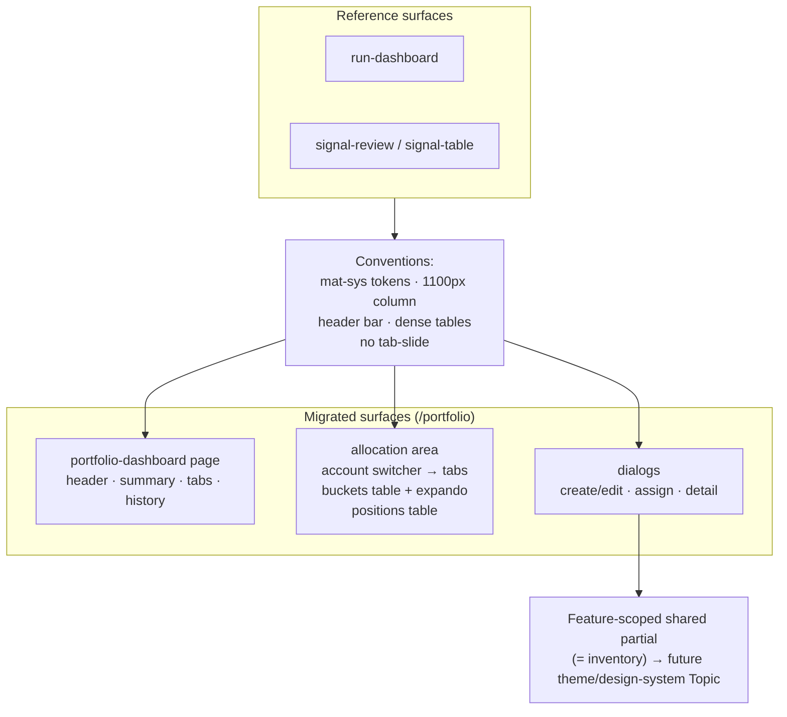

**Topic:** Portfolio Allocation  
**Topic Slug:** `portfolio-allocation`  
**Thread:** Portfolio Visual Consistency  
**Thread Slug:** `visual-consistency`  
**Issue:** #752  
**Thread Parent:** #751  
**Topic Parent:** #576  
**Domain:** PORTFOLIO  
**Type:** PRD  
**Status:** Approved  
**Created:** 2026-10-03  
**Last Updated:** 2026-10-03  

---

## Problem Statement

The Portfolio Dashboard and Allocation Manager pages were built with ad-hoc styling: full-bleed layouts, hand-rolled spacing and colors, nested tab groups, and animated tab transitions. Compared to the run-dashboard and signal-review surfaces — the app's emerging visual standard — the portfolio area feels glaring: too much whitespace between data, jarring horizontal tab-slide animations, and an overall heavier chrome.

Beyond aesthetics, the portfolio components use hard-coded `rgba(0,0,0,…)` greys and a hard-coded red error banner that assume a light theme. Everywhere the app uses `mat-sys` design tokens, these surfaces will render incorrectly under a dark theme. This is a latent theming bug, not just a style preference.

## Solution

Migrate the `/portfolio` surfaces to the run-dashboard / signal-review visual language: `mat-sys` color tokens throughout, a compact header bar, hairline `outline-variant` borders, dense table styling (signal-table conventions), a centered `max-width: 1100px` content column, and no horizontal tab-slide animation. Navigation collapses from three levels to two — account selection moves into the header bar, leaving a single Buckets|Positions tab row.

This is a **visual migration, not a redesign**: information architecture, component behavior, store logic, and data flows stay intact. The exception is the account-switcher relocation, which changes navigation structure but not content.

**Mechanism — feature-scoped shared partial.** Patterns common to the migrated components (header bar, dense table, page shell, loading/empty/error states) live in a shared SCSS partial inside `features/portfolio-dashboard/` (e.g., `styles/_pd-visual-language.scss`), consumed via `@use` by each migrated component; genuinely component-specific styles stay per-component. This is deliberately **not** a global stylesheet or design-system — the partial never escapes the feature folder, and it *is* the inventory: whatever lands in it is the list of patterns the future theme/design-system Topic should extract app-wide.

## In Scope

- `/portfolio` page: header, summary bar, page-level tabs, history section.
- Allocation area: account switching, Buckets|Positions tabs, buckets table (incl. expanded mini-table + totals row), positions table, retired-bucket section.
- Associated UI elements: bucket create/edit dialog, position-assign dialog, retained bucket-detail dialog.
- Dark-mode correctness via `mat-sys` tokenization.
- A feature-scoped shared SCSS partial holding the patterns common to the migrated components — its contents double as the duplication inventory for the future design-system Topic.

## Out of Scope

- Shared/extracted stylesheets, theme mixins, or a design-system package — deferred to the future app-wide theme Topic.
- Other app surfaces (order ticket, gallery, dev pages).
- Layout/IA changes beyond the account-switcher relocation.
- Behavioral or store changes — the same data renders differently.

## Reference Conventions (the standard to copy)

From `run-dashboard` (`dashboard.component.scss`) and `signal-review` / `signal-table`:

- **Page shell:** `display:flex; flex-direction:column; height:100%; overflow:hidden; background: var(--mat-sys-surface)`.
- **Centered content column:** `max-width: 1100px; margin: 0 auto; flex: 1; overflow: hidden`.
- **Header bar:** `padding: 8px 16px; background: var(--mat-sys-surface-container-high); border-bottom: 1px solid var(--mat-sys-outline-variant)`; 20px primary-tinted icon; 16px/600 title; 32px-height compact buttons.
- **Tables:** `border-collapse: collapse; font-size: 12px`; sticky `thead` on `surface-container`; headers `11px / 600 / uppercase / 0.5px letter-spacing / on-surface-variant`; hairline `outline-variant` row borders; `td` padding `5px 10px`; `tabular-nums` on numeric columns; row hover `surface-container-low`.
- **Motion:** a 0.2s ease only where a panel resizes; no tab-content slide animation; expando row motion retained.
- **States:** loading spinner centered at 48px padding; error/empty states `on-surface-variant` with 36px dimmed icon.

## User Stories

1. As the trader, I want the `/portfolio` page header to match the run-dashboard header bar — compact, `surface-container-high`, hairline bottom border, small controls — so portfolio feels like part of the same app.
   - *Verify:* portfolio page header renders the bar pattern (icon + 16px title + compact 32px controls); no `1.5rem` title remains.
2. As the trader, I want all portfolio content centered in a `1100px` column so the page reads like the reference surfaces instead of stretching edge-to-edge.
   - *Verify:* at viewport >1100px the content column is centered with gutters; tables stay readable at that width.
3. As the trader, I want account selection in the header bar and a single Buckets|Positions tab row — two navigation levels instead of three — so the nested tab-on-tab glare is gone.
   - *Verify:* account switcher lives in the header bar; exactly one tab row remains; the same accounts/buckets/positions are all reachable.
4. As the trader, I want the horizontal tab-slide animation removed so switching views doesn't sweep content sideways.
   - *Verify:* switching tabs/subtabs swaps content instantly; the expando row still animates open/closed.
5. As the trader, I want portfolio and allocation tables styled to the signal-table density — 12px body, sticky compact uppercase header, hairline borders, `tabular-nums` numerics, subtle hover — so tabular data reads consistently across the app.
   - *Verify:* buckets table, expanded mini-table (incl. totals row), positions table, and history table match the reference table spec; numeric values remain right-aligned.
6. As the developer, I want every hard-coded color in the migrated components replaced with `mat-sys` tokens so the surfaces render correctly under any Material theme (light or dark).
   - *Verify:* no `rgba(0,0,0,…)`, `#hex`, or `color: white/black` literals remain in the migrated SCSS; error/summary surfaces use token colors.
7. As the trader, I want the summary bar, loading/empty/error states, and dialogs (bucket create/edit, assign, bucket-detail) restyled to the same token/density language so no surface is left glaring.
   - *Verify:* each listed element uses token colors and the compact conventions; dialogs match the reference chrome density.
8. As the developer, I want the shared patterns consolidated into a feature-scoped SCSS partial inside `features/portfolio-dashboard/` — and nowhere else — so its contents serve as the inventory the future design-system Topic extracts app-wide.
   - *Verify:* the partial exists, is `@use`d by the migrated components, and is not imported by anything outside the feature folder; its block list is enumerated in the IMPL doc.

## Technical Context

- **Mechanism:** a feature-scoped shared partial in `features/portfolio-dashboard/` holds the common blocks (header bar, table, states); component SCSS holds the rest. The partial is feature-internal — the future design-system Topic generalizes it.
- **Theme tokens:** the app uses Angular Material system variables (`--mat-sys-*`); migrated components must use them exclusively. Status colors that have no token equivalent (e.g., P&L red/green) should reuse whatever convention the reference surfaces use — audited at implementation.
- **Behavioral regression risk:** all changes are presentation-level; existing specs should pass with at most selector updates. Table-structure changes (e.g., header-bar account switcher markup) will need spec adjustments.
- **Uncommitted work:** #693's expando/totals changes are uncommitted on `prod` — this Thread's edits will touch the same files; implementation should account for that overlap.

## Diagram

