**Topic:** Swing Analysis Page  
**Topic Slug:** `swing-analysis-page`  
**Thread:** Misc fixes — swing analysis  
**Thread Slug:** `misc-fixes`  
**Issue:** #600  
**Thread Parent:** #599  
**Topic Parent:** #594  
**Domain:** SWING-ANALYSIS  
**Type:** PRD  
**Status:** Approved  
**Created:** 2026-09-26  
**Last Updated:** 2026-09-26  

# PRD — Swing analysis config management + misc UI fixes

## Problem

The swing-analysis page scatters configuration management across two surfaces. A collapsed "Saved Sets" panel on the page browses `st-swing-sets` docs (per-symbol snapshots) and loads them into config slots; the settings gear dialog holds the actual config controls. Two problems fall out of that split:

1. **Saved sets eat page real estate** for a secondary workflow. Browsing and loading configs belongs inside the settings dialog, not inline on the page.
2. **"Dual mode" is a misleading frame.** The store already models `configs: ZigZagConfig[]` as an arbitrary-length list — `dualMode` is just `configs().length > 1`. The toggle constrains the UI to exactly two slots for a data model that already supports N.
3. **Persisted docs are overweight.** Each `st-swing-sets/{symbol}_{paramsId}` doc stores the full computed snapshot (`pivots`, `projection`, `swings`, `stats`) — dead weight: nothing reads those fields back, the calculation is deterministic (same bars + same config → same output), and the symbol binding is meaningless since a loaded config always recomputes against whatever symbol is loaded.
4. **Filter controls are invisible.** The swing table's filter row (Direction, date range, duration, magnitude) renders labels in all-caps that visually read as duplicate headers, while the controls themselves are unstyled until clicked into.
5. **Controls are oversized.** The dialog's param controls are much larger than the content warrants.

## Goal

A single **config-management dialog**: the settings dialog becomes the one place to build, load, save, clone, and delete swing configs, backed by a slim symbol-agnostic config library — while the page sheds the saved-sets panel and gains visibly-usable filter controls.

## Solution

**Unified dialog.** The settings dialog hosts a two-list manager: an *available* list (canned presets + every saved config from the library) and an *active* list (the store's `configs[]`). Move controls (`+`/`−` or equivalent) move a config between lists; the active list also offers clone (duplicate a config for tweaking) and delete. (Amended 2026-09-27, #609: the active list renders **narrow rows with fully-inline param fields** — one dense row per config — not collapsible sections.)

**N-config, always.** The dual-mode toggle and terminology are retired. `configs[]` is the model — the default session still opens with the two standard configs (dev10 + dev3 presets). No cap on active count: the chart and stats panel render whatever the user loads. (Amended: Large/Small names are gone from all UI; rows are identified by param summary only.)

**Presets (added 2026-09-27).** The preset group is the 4-config sweep set (dev/L/R `10·10·10`, `5·5·5`, `3·3·3`, `2·2·2`) ordered highest→lowest devThreshold, with `+` activate buttons. Presets carry no display names — the param summary is the row label.

**Presets vs. sets (amended 2026-09-27b).** The library splits: **presets** are single-config docs (canned + user-saved singles live together under Presets); **saved sets** are `configs[]` docs — `Save set` on the Active header writes the whole active list as one doc keyed by joined member paramsIds, and applying a set (`+`) **replaces** the active list wholesale. Header ops also include `Clone all` and `Clear`. Each active row carries a runtime-only **on/off checkbox** (`configEnabled[]`, never persisted) so a config can be muted without leaving the list.

**Batch sweep retired (added 2026-09-27).** The batch-sweep section leaves the dialog; `BatchSweepComponent`, `swing-batch.ts`, and the store's `runBatch`/`cancelBatch` are deleted. The flow was built around the old per-symbol snapshot model and is superseded by the config library.

**Config library.** `st-swing-sets` docs slim to `{name?, config, savedAt}` keyed by `{paramsId}` — one doc per distinct config, no symbol binding, no persisted pivots/swings/stats. The whole-collection read is now cheap, so the dialog loads the full library on open. Optional user name on save ("CSP wheel — tight"); fallback label is a param summary (`dev 5% · L10 · R10`). Old heavyweight docs deserialize fine — the extra fields are ignored.

**Table filters stay, restyled.** The filter row remains but its controls get real visual treatment (outlined/dense inputs) so they're discoverable without clicking first. The all-caps label styling stays or is replaced — the point is the controls must look like controls.

**Compact controls.** Dialog param controls shrink to a dense presentation consistent with the rest of the app.

## Non-goals

- **No cap on active configs.** User loads as many as the chart can take; performance judgment is the user's.
- **No persisted snapshots.** Computed swings/pivots/stats are never stored — every load recomputes.
- **No auto-save changes here.** Retiring the auto-run/save write path is a separate task under Thread #416 (its origin thread); docs updated there.
- **No reordering affordance** unless it falls out of the active-list controls for free.
- **No backend work.** Firestore via the existing frontend service; no Cloud Functions.
- **No source-code file moves.** This is UI/persistence work on the existing `swing-analysis/` files.

## User Stories

1. As an analyst, I want saved configs and presets browsable inside the settings dialog, so the page isn't cluttered with a second management surface.
2. As an analyst, I want to move a config from the library into the active list, so its swings compute and render for the current symbol immediately.
3. As an analyst, I want to remove a config from the active list, so I can declutter the chart without deleting anything from the library.
4. As an analyst, I want to clone an active config, so I can tweak a copy without losing the original.
5. As an analyst, I want to save the current active config to the library with an optional name, so I can recall it later — on any symbol.
6. As an analyst, I want to delete a config from the library, so dead variants don't accumulate.
7. As an analyst, I want N configs active at once — not "dual mode" — so three or more parameter sets can overlay simultaneously.
8. As an analyst, I want the table's filter controls to look like controls, so I can discover filtering without clicking into an invisible field.
9. As an analyst, I want compact dialog controls, so the dialog fits more content without scrolling.

## Acceptance Criteria

### US1–US2 — Dialog merge and load
- The settings dialog contains an available-configs list populated by canned presets plus all saved library configs.
- The page-level Saved Sets `
` panel is removed; no page real estate is consumed by config browsing.
- Activating a library config appends it to `configs[]` and recomputes its swings from the currently loaded bars.

### US3–US5 — Active-list management
- The active list shows every entry of `configs[]` as a narrow inline row with remove, clone, and save actions.
- Clone appends a deep copy to the active list; the copy is independently editable via the row's inline param inputs.
- Param edits apply on commit (`change`, not `input`) — typing intermediate values doesn't thrash the recompute.
- Save writes `{name?, config, savedAt}` to `st-swing-sets/{paramsId}`; saving the same params twice is idempotent (doc id = paramsId dedupe).

### US6 — Library delete
- Deleting removes the doc from `st-swing-sets`; the row disappears from the available list; an already-active instance of that config is unaffected (active state is a copy, not a reference).

### US7 — N-config
- The dual-mode toggle is gone from the dialog; `configs[]` accepts any length; first-open default remains the two standard configs.
- The word "dual" disappears from user-facing strings and the `dualMode` store signal is retired or re-derived.

### US8–US9 — Styling
- Filter-row inputs/selects are visibly interactive on render (outline/border/density consistent with app conventions) without requiring a click.
- Dialog param controls render at compact density.

### Data model
- New `st-swing-sets` writes contain `{name?, config, savedAt}` only — no `pivots`, `swings`, `stats`, `projection`, `symbol`.
- Docs written under the old `{symbol}_{paramsId}` shape still load (extra fields ignored); no data migration required.

## Technical Context

- **Recompute is the contract.** A config doc carries parameters only; every load recomputes pivots/swings/stats from the page's loaded bars. The engine is deterministic — same bars + same config → same output.
- **Library read cost.** Slim docs (~100 bytes) make whole-collection enumeration cheap; the lazy per-symbol fetch pattern (`loadSavedAnalyses`) is retired for library browsing.
- **`dualMode` is derived.** `store.dualMode` is computed as `configs().length > 1`; callers on the page (`swings()[1]`, `stats()[1]` index guards) already handle arbitrary length — mostly via `length === 2` checks that generalize to index access.
- **paramsId is the dedupe key.** `deriveParamsId(config)` hashes params; identical configs across symbols collapse to one doc.
- **Absorbs #541.** This thread absorbs the N-config overlay scope (arbitrary-length `configs[]` UI); #541 closed as absorbed.
- **Supersedes most of #443's PRD.** Thread #443 planned a `st-swing-configs` collection for global configs — this design delivers that capability through the slimmed `st-swing-sets` library instead; #443's remaining scope reconciles at blueprint.

## System Context

```mermaid
flowchart LR
    User([Analyst])
    Dlg[Settings dialog<br/>config manager]
    Store[SwingAnalysisStore<br/>configs: ZigZagConfig &#91;&#93;]
    Lib[(Firestore st-swing-sets<br/>paramsId → name?, config, savedAt)]
    Eng[ST ZigZag engine]
    Chart[Chart overlay + stats panel]

    User --> Dlg
    Dlg -->|activate / remove / clone| Store
    Dlg -->|save / delete| Lib
    Store -->|recompute per config| Eng
    Eng --> Chart
    Lib -->|library on dialog open| Dlg
```

## Testing Decisions

- Store-level specs for active-list ops: add-from-library, remove, clone, save (idempotent doc id), delete; N>2 configs compute and render.
- Dialog component specs: available/active lists render, move controls wire to store, clone duplicates params, name input optional with param-summary fallback.
- Service spec: new doc shape written; old heavyweight docs still deserialize.
- No live Firestore in unit tests — service mocked per existing spec conventions.

## Out of Scope

- Auto-save write-path retirement (→ task under #416) and the bulk seed script (#445's tooling).
- Reordering active configs.
- Per-position or per-symbol config persistence — the library is global.
- Swing-table column/header changes beyond filter-row control styling.
- Any Cloud Functions changes.

## Further Notes

- Related prior work lives in the same directory: the persist-swing-configs PRD (#443/#444), the auto-run/save PRD (#416/#417), and the N-config overlay idea (#541, absorbed here).
