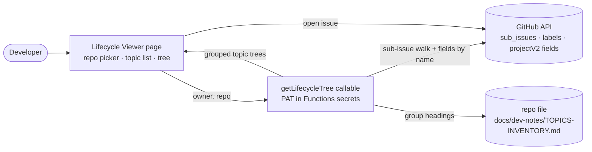

**Topic:** GitHub read-only issue UI  
**Topic Slug:** `gh-issues-ui`  
**Thread:** Lifecycle viewer  
**Thread Slug:** `lifecycle-viewer`  
**Issue:** #622  
**Thread Parent:** #621  
**Topic Parent:** #619  
**Domain:** DEV-TOOLS  
**Type:** PRD  
**Status:** Approved  
**Created:** 2026-09-27  
**Last Updated:** 2026-09-27  

---

## Problem Statement

The proj workflow models every unit of work as a GitHub issue hierarchy — **Topic → Thread → stage issue → task** — with lifecycle position carried by numbered stage labels (`1_IDEA`…`8_LIVE`) and work state by the GitHub Project's Status field. As the number of Topics grows (~20 active now, 20–50 more anticipated), there is no way to see this structure at a glance: the GitHub issues list is flat, the Project board shows fields but not parentage, and reconstructing "where is Topic X and what's blocking it" means clicking through issue pages and mentally reassembling sub-issue trees.

The result: stalled Threads go unnoticed, corrections to the hierarchy (wrong parent, wrong stage label, stale Status) are discovered only during `/proj` refresh runs, and planning future work requires holding the entire structure in memory. `docs/dev-notes/TOPICS-INVENTORY.md` (`/proj list --doc`) is a good snapshot but goes stale between regenerations and lives outside the app.

## Solution

A **read-only Lifecycle Viewer page** in the app — a master-detail view over the live GitHub issue hierarchy for every repo that has adopted the proj workflow.

**Repo picker.** The page supports a manually-maintained list of adopted repos (initially `rel-str` and SA). Switching repos reloads the view; repos are expected to carry the proj structure — no generic issue-browser fallback.

**Topic list (master pane).** Open Topics grouped under the curated **super-group headings** from the repo's `docs/dev-notes/TOPICS-INVENTORY.md` (e.g., "A. Options & Spread Engine" … "F. Platform & Plumbing"), in doc order. Topics absent from the doc — created since the last `--doc` regen, or SA which may not have one — fall into an **Ungrouped** section sorted by most recent descendant activity. Each row shows the Topic's number, title, stage chip, and Status badge. Closed Topics hide behind a "Show closed" toggle (defaulted off).

**Tree (detail pane).** Selecting a Topic renders its full expandable tree — Threads → stage issues → tasks/phases — indent-mirroring the native sub-issue structure. Each node shows: issue number, title, state (open/closed), stage chip, Project Status badge, Category/DOMAIN labels, and a link to github.com. Nodes are expandable/collapsible; the pane exposes expand-all/collapse-all.

**Backend.** A single Firebase callable, `getLifecycleTree({owner, repo})`, walks native sub-issues from every `Topic:`-anchored issue, decodes stage/Category/DOMAIN from labels, resolves the repo's GitHub Project Status/Category fields **by name** (no dependence on a consumer repo's `project-config.json`), fetches `TOPICS-INVENTORY.md` for grouping, and returns the assembled tree. Authentication is a fine-grained PAT stored in Functions secrets, scoped read-only to the supported repos.

**Strictly read-only.** No mutations — no stage advancement, no issue edits, no linking. Anything actionable links out to github.com. Doc viewing (PRD/IMPL/etc. surfaced per node) is a deliberate follow-on Thread.

## Page Layout

- **Header row** — repo picker (dropdown), Refresh button, last-fetched timestamp.
- **Left pane — Topic list** — grouped under super-group headings from TOPICS-INVENTORY.md; each row: `#NNN — title`, stage chip, Status badge. Selected row highlighted. "Show closed" toggle.
- **Right pane — Tree** — the selected Topic as root; expandable rows for Threads, stage issues, and descendant tasks. Each row: type-appropriate indentation/icon, `#NNN`, title (linked to github.com), state styling, stage chip, Status badge, Category + DOMAIN tags. Expand-all / collapse-all controls.
- **Empty state** — "No Topics found in this repo" when the walk returns nothing.
- **Error state** — an error banner naming the failure (auth, repo access, rate limit) with a retry via Refresh.

## User Stories

1. As a developer, I want to pick which adopted repo's lifecycle I'm viewing, so that one tool covers every proj-enabled repository.
2. As a developer, I want the repo list to be a deliberate, manually-maintained set, so that only repos that have adopted proj appear.
3. As a developer, I want to see all open Topics grouped under my curated super-group headings, so that the list mirrors how I already think about the work.
4. As a developer, I want Topics absent from the inventory doc to appear in an Ungrouped section, so that newly created Topics are visible before the doc is regenerated.
5. As a developer, I want each Topic row to show its stage and Status, so that I can scan which stage each Topic is in without drilling.
6. As a developer, I want closed Topics hidden by default with a toggle to reveal them, so that the list stays focused on live work.
7. As a developer, I want to select a Topic and see its entire sub-issue tree — Threads, stage issues, tasks — so that I can see the whole lifecycle at a glance.
8. As a developer, I want each tree node to show its stage label and Project Status, so that I can spot a node whose stage or Status looks wrong.
9. As a developer, I want each tree node to show open vs. closed state, so that I can distinguish finished work from active work.
10. As a developer, I want each node's title to link to its github.com issue page, so that acting on what I see is one click away.
11. As a developer, I want expandable/collapsible nodes plus expand-all/collapse-all, so that large Topics remain navigable.
12. As a developer, I want a Refresh button that re-fetches live data, so that I can see the effect of a change I just made on GitHub.
13. As a developer, I want the page to show when the data was last fetched, so that I know how fresh the tree is.
14. As a developer, I want a clear error when GitHub is unreachable or the token lacks access, so that a blank tree is never mistaken for "no work."
15. As a developer, I want Topic ordering within a group to follow my curated inventory order, so that priority/affinity ordering I set by hand is respected.
16. As a developer, I want the page to load live data on navigation (not a cached snapshot), so that I never read stale lifecycle state.
17. As a developer, I want the viewer to be strictly read-only, so that browsing can never mutate project state — all changes stay in `/proj` or GitHub.

## Acceptance Criteria

### US1–US2 — Repo switching
- A repo picker lists the configured repos (initially `rel-str` and SA). Selecting a repo fetches and renders that repo's Topics and tree.
- The supported repo list is maintained in configuration (functions config or a checked-in constant) — adding a repo requires a config change, not code restructuring.

### US3–US6 — Topic list
- Open Topics render grouped under the `###` super-group headings parsed from the repo's `docs/dev-notes/TOPICS-INVENTORY.md`, in the doc's order.
- Topics not present in the doc (or when the doc doesn't exist in that repo) appear in an Ungrouped section ordered by most recent descendant `updatedAt`.
- Each Topic row shows issue number, title, stage chip (the `N_STAGE` label), and the Project Status badge.
- Closed Topics are excluded by default; a "Show closed" toggle reveals them (styled distinctly, e.g., dimmed/struck).

### US7–US11 — Tree
- Selecting a Topic renders its full descendant tree via native sub-issues: Threads, their stage issues, and each stage's tasks/phases at increasing depth.
- Every node shows number, title, open/closed state, stage chip when a stage label is present, Status badge, and Category/DOMAIN tags.
- Nodes are expandable/collapsible; expand-all and collapse-all controls apply to the whole tree.
- Every node's title links to its github.com issue page (`target="_blank"` or equivalent — never in-app editing).

### US12–US14 — Freshness and errors
- Data loads on page entry and on Refresh; a visible timestamp shows the last successful fetch. No polling.
- Callable failures (bad/expired token, repo not accessible, rate limit, network) surface as an error banner naming the cause; the previous tree remains displayed rather than blanking.

### US17 — Read-only
- The page exposes no mutation affordances — no buttons or flows that write to GitHub. Verified by inspection: the callable is the only GitHub-touching surface and it performs read operations only.

## Technical Context

- **Live data, thin bridge.** The callable re-implements no lifecycle logic — it performs the same queries `/proj` already runs (`sub_issues` edges, label decode, `projectV2` fields) and returns the assembled tree. GitHub remains the source of truth; there is no Firestore mirror and no sync job.
- **Auth.** Fine-grained PAT in Functions secrets, read-only, scoped to the supported repos (`Issues: Read`, `Projects: Read` where Status is wanted). PAT expiry degrades loudly — the error banner reports auth failure; nothing mutates.
- **Config over pinned IDs.** Supported repos are entries `{owner, repo, projectNumber?}`; Project fields are resolved **by name** (`Status`, `Category`) via `projectV2.fields`, so repos that never ran `/proj setup` work without a `project-config.json`. A repo entry with no `projectNumber` yields nodes with `status: null`.
- **Grouping is a second data source.** `TOPICS-INVENTORY.md` is fetched via the repo contents API and parsed for `## Open Topics` → `###` group headers → `#NNN` links. The doc refreshes only when `/proj list --doc` is re-run — Topics created since then land in Ungrouped rather than being mis-ordered. This staleness is visible by design.
- **Detection rule.** A node is in the tree iff it's reachable by walking `sub_issues` from an issue titled `Topic:`/`TOPIC:`. Node type derives from title prefix (`Thread:` → thread; `Idea:`/`Plan:`/`Blueprint:`/`Implement:`/`Review:`/`QA:`/`Ship:` → stage) else `task`. Stage label = any label in the closed set `1_IDEA`…`8_LIVE` (highest ordinal wins when an issue carries two — stale mid-transition labels exist); Category/DOMAIN = remaining non-stage labels. Non-proj issues in the repo are never reached and never shown.
- **Rate limits.** One tree fetch per page load/refresh; ~hundreds of issues per repo is well within GitHub's rate budget. No caching layer in v1.

## System Context

## Implementation Decisions

- **`getLifecycleTree` callable** — input `{owner, repo}`; validates the pair against the configured supported-repo list (rejects unknown repos — the PAT's scope makes this a whitelist anyway). Output: `{ sections: { name, topics: TreeNode[] }[], fetchedAt: ISO, groupingWarning? }` where `TreeNode = { number, title, state, url, nodeType, stageLabel?, status?, labels: string[], children: TreeNode[], updatedAt }` — non-stage labels (Category, DOMAIN, agents) ride through as `labels` and render as tag chips. The response also carries `truncatedNodes: number` — the callable throws before returning a partial tree, so a successful response always reports 0. Repos without a configured project return `status` unset throughout.
- **Grouping contract** — when the repo has no inventory doc, `sections` is a single `Ungrouped` section sorted by `updatedAt` desc. When present, doc order wins; unconsumed topic numbers that no longer resolve to open Topics are dropped silently. A non-404 doc fetch error sets `groupingWarning` and still returns flat sections.
- **Node payload is slim** — no issue bodies, no comments. Everything rendered is on the node; anything deeper links to GitHub.
- **Feature area** — new `dev-lifecycle` feature folder (page + service + store); nav entry appended to the existing nav list. Naming finalized at blueprint.
- **Seam for testing** — the callable splits into a pure `buildTree(rawIssues, rawFields, inventoryMd)` transform (GraphQL/REST payloads → grouped trees) and a thin fetch shell. All correctness testing targets the transform; the shell is verified end-to-end by a prod verification script.

## Testing Decisions

- **Transform tests** — fixture GitHub payloads → assert tree assembly, node typing, label decode, grouping parse (including missing/malformed inventory doc, topics missing from doc, closed filtering inputs). Pure functions, no mocking of the Octokit client — mock-blindness guard: the fetch shell's query shapes are verified by the prod round-trip script, not by unit-test mocks.
- **FE specs** — store + page specs following the `allocation.store.spec.ts` / `allocation-page.component.spec.ts` pattern: grouped list rendering, selection, tree expand/collapse, closed toggle, error banner, refresh.
- **Verification** — a `scripts/verify/` script calls the deployed callable against `rel-str` and asserts the returned tree contains a known Topic with expected structure (real GitHub, no emulator).

## Out of Scope

- **Doc viewing** — surfacing PRD/IMPL/UAT links per node is a follow-on Thread.
- **Mutations** — no stage advancement, issue creation, or edits from the UI; permanently read-only for this Thread.
- **Non-proj repo support** — no generic issue-browser fallback; the repo list is proj-adopted repos only.
- **Live updates / polling** — refresh is manual.
- **Cross-repo aggregate views** — one repo visible at a time.

## Further Notes

- The curated super-groups exist only in `TOPICS-INVENTORY.md` today. A first-class "group" property on the issue template was discussed and explicitly deferred — when it lands, the grouping source can migrate without changing the UI contract (`sections` stays the shape; the callable just reads a different source).
